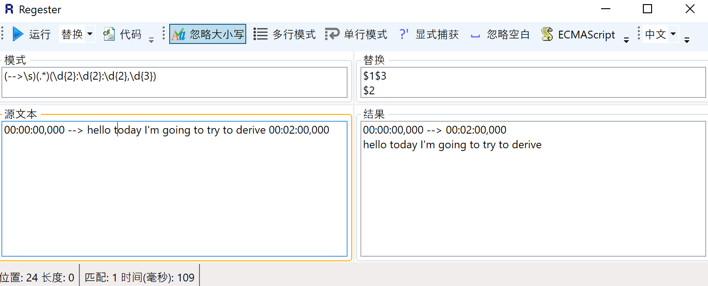

# srt制作


00:00
hello today I'm going to try to derive
02:00
the Einstein field equations this will


查找
```(\d+:\d\d)\s```
替换

```00:$1,000 --> ```

00:02:33,000 --> 
said that that was a principle of 


00:02:35,000 --> 
equivalence you can't tell the 


还需要编号换行
1
00:02:33,000 --> 
said that that was a principle of 

2
00:02:35,000 --> 
equivalence you can't tell the 


需要取余，取模计算
从
60:02 
equal to a DB which is DX R by D Y M 
126:18 
Einstein field equations for beginners 
到
01:00:02,000 --> 
equal to a DB which is DX R by D Y M 
02:06:18,000 --> 
Einstein field equations for beginners 

也就是说60/60 -->01，60%60 -->00

126/60 -->02,126/60 -->06,


**regex需要循环变量和控制符，需要计算能力，需要$0表示被识别regex整体内容，需要把查询sql结合计算能力处理数据库！**


还需要复制后续值，存数据，字符数组。（或者说要迭代器）

01:00:02,000 --> 01:06:18,000
equal to a DB which is DX R by D Y M 
01:06:18,000 --> ......后续时间
Einstein 





# 换思路

脑动找规律
```(\d\d:\d\d:\d\d,000) --> \s```


```
$0整个regex内容
$1第一个括号
$2第二个括号
```

用word
(??:??:??,000)
替换成
\1^p\1


# word换行键
> word替换里如果不使用通配符的话可以用^p代表回车
但是要是使用通配符的话^p就用不了了 只能用^l
那么这种情况下想替换回车怎么办呢？
总不能先把所有的^p先替换成^l吧
我知道啊 但是在使用通配符的情况下 只能查找查找^l而不能 ^p 啊 怎么解决呢？
另外问一下：
在使用字符集的时候 [a-z]表示匹配a到z之间的字符 如果我再想匹配 - 这个字符的话呢？
[a-z,-]不行啊

回车是^p  
Shift+回车是^|
word使用通配符进行查找替换用^13表示回车
如果想再匹配-的话，用如下方式[a-z-]（中间应该不用加,）


用
(??:??:??,000)^13
换成
\1^13^13


# 关键

用regex正则表达式替换或者word通配符实现下面这个替换功能：

从
00:00:00,000 --> hello today I'm going to try to derive 00:02:00,000
变成
 00:00:00,000 --> 00:02:00,000
hello today I'm going to try to derive


命令是：
``` --> (([a-z']+\s)+)(\d\d:\d\d:\d\d,000)```

替换成


``` --> $3$1```

最后在word正则表达式：
**先1**
00:00:00,000 --> 00:02:00,000
hello today I'm going to try to derive
在不用正则的时候
 --> (??:??:??,???)替换成 --> (??:??:??,???)^13
 因为windows做的word不能实现同时用(?)和普通字符兼容，也就是 --> (??:??:??,???)正则下不识别，
** 然后1**
用
^13(??:??:??,???)
替换
\1^13


```
1
 00:00:00,000 --> 00:02:00,000hello today i am going to try to derive 

2
 00:02:00,000 --> 00:00:06,000the Einstein field equations this will 

3
 00:00:06,000 --> 00:00:08,000be a basic introduction it won't be 
4
 00:00:08,000 --> 00:00:11,000rigorous it will cover the essence but 
5
 00:00:11,000 --> 00:00:14,000it will still be quite complex if you 
6
 00:00:14,000 --> 00:00:16,000want more detail then I refer you to 
7
 00:00:16,000 --> 00:00:18,000Professor Leonard Susskind excellent 
8
 00:00:18,000 --> 00:00:20,000lectures that he gave from October to 
9
 00:00:20,000 --> December 2008 at Stanford I've put a 00:00:24,000
10
 00:00:24,000 --> 00:00:26,000link to the YouTube version of these 
11
 00:00:26,000 --> 00:00:29,000lectures in an annotation on this video 
12
 00:00:29,000 --> 00:00:32,000I am going to follow his approach so 
13
 00:00:32,000 --> 00:00:34,000that it will be familiar to you but I 
14
 00:00:34,000 --> 00:00:36,000shall do it in a much more simplified 
15
 00:00:36,000 --> 00:00:39,000version and let's always remember that 
16
 00:00:39,000 --> 00:00:42,000it took Einstein ten years to develop 
17
 00:00:42,000 --> 00:00:45,000these equations and he had access to 
18
 00:00:45,000 --> 00:00:49,000many maths professors on the way as 
19
 00:00:49,000 --> 00:00:51,000usual i am making the assumption that you 
20
 00:00:51,000 --> 00:00:54,000understand calculus and basic geometry 
21
 00:00:54,000 --> 00:00:56,000and that you've also seen or are aware 
22
 00:00:56,000 --> 00:00:58,000of the information in my general 
23
 00:00:58,000 --> 00:01:01,000relativity videos that are already up on 
24
 00:01:01,000 --> 00:01:04,000YouTube and in particular that you are 
25
 00:01:04,000 --> 00:01:07,000aware of two key points the first is 
26
 00:01:07,000 --> 00:01:09,000what is called the principle of 
27
 00:01:09,000 --> 00:01:12,000equivalence and what that says is that 
28
 00:01:12,000 --> 00:01:16,000if you are in a box with no windows then 
29
 00:01:16,000 --> 00:01:18,000you can't tell the difference between 
30
 00:01:18,000 --> 00:01:22,000being in outer space and accelerating 
31
 00:01:22,000 --> 00:01:26,000with an acceleration G or being in the 
32
 00:01:26,000 --> 00:01:29,000same box on the surface of the earth 
33
 00:01:29,000 --> 00:01:32,000stationary but subject to the 
34
 00:01:32,000 --> 00:01:34,000gravitational force which carries an 
35
 00:01:34,000 --> 00:01:37,000acceleration G there is no experiment 
36
 00:01:37,000 --> 00:01:39,000let's put you in the box 
37
 00:01:39,000 --> 00:01:41,000there is no experiment that you can do 
38
 00:01:41,000 --> 00:01:44,000that will distinguish between those two 
39
 00:01:44,000 --> 00:01:47,000situations now that is actually not 
40
 00:01:47,000 --> 00:01:50,000quite true the difference of course is 
41
 00:01:50,000 --> 00:01:52,000that if you are in outer space traveling 
42
 00:01:52,000 --> 00:01:56,000with an acceleration G then all parts of 
43
 00:01:56,000 --> 00:01:59,000this box including you are accelerating 
44
 00:01:59,000 --> 00:02:03,000at the acceleration G if you are on 
45
 00:02:03,000 --> 00:02:08,000earth then because the value of G varies 
46
 00:02:08,000 --> 00:02:10,000according to the height above the earth 
47
 00:02:10,000 --> 00:02:13,000the value of G at this 
48
 00:02:13,000 --> 00:02:16,000point will be ever so slightly greater 
49
 00:02:16,000 --> 00:02:20,000than the value of G at this point and so 
50
 00:02:20,000 --> 00:02:22,000there is a slight difference in the 
51
 00:02:22,000 --> 00:02:25,000value of G in this situation and if you 
52
 00:02:25,000 --> 00:02:27,000can measure that then you can tell the 
53
 00:02:27,000 --> 00:02:29,000difference that difference is called the 
54
 00:02:29,000 --> 00:02:33,000tidal force but apart from that Einstein 
55
 00:02:33,000 --> 00:02:35,000said that that was a principle of 
56
 00:02:35,000 --> 00:02:37,000equivalence you can't tell the 
57
 00:02:37,000 --> 00:02:39,000difference whether you are accelerating 
58
 00:02:39,000 --> 00:02:42,000at GE or subject to a gravitational 
59
 00:02:42,000 --> 00:02:44,000force which is represented by the 
60
 00:02:44,000 --> 00:02:48,000acceleration G the second principle is 
61
 00:02:48,000 --> 00:02:51,000that light bends in a gravitational 
62
 00:02:51,000 --> 00:02:54,000field this was Einstein's reasoning if 
63
 00:02:54,000 --> 00:02:57,000you take the person who is in the box 
64
 00:02:57,000 --> 00:03:00,000that is accelerating through space with 
65
 00:03:00,000 --> 00:03:04,000an acceleration G and here is the box 
66
 00:03:04,000 --> 00:03:08,000and this time we're going to shine a 
67
 00:03:08,000 --> 00:03:11,000light from this side of the box to the 
68
 00:03:11,000 --> 00:03:14,000other side of the box but of course that 
69
 00:03:14,000 --> 00:03:17,000will take a finite time albeit small and 
70
 00:03:17,000 --> 00:03:20,000if this box is accelerating with an 
71
 00:03:20,000 --> 00:03:23,000acceleration G by the time the light 
72
 00:03:23,000 --> 00:03:26,000gets halfway across the box will have 
73
 00:03:26,000 --> 00:03:29,000accelerated a little bit further forward 
74
 00:03:29,000 --> 00:03:32,000so it will now be here which means the 
75
 00:03:32,000 --> 00:03:34,000light will have reached that position 
76
 00:03:34,000 --> 00:03:37,000there by the time the light gets to the 
77
 00:03:37,000 --> 00:03:39,000right hand side the box will of course 
78
 00:03:39,000 --> 00:03:45,000have accelerated still further and now 
79
 00:03:45,000 --> 00:03:47,000the light which of course is just going 
80
 00:03:47,000 --> 00:03:51,000in a straight line will reach here so if 
81
 00:03:51,000 --> 00:03:54,000you look at it it appears within the box 
82
 00:03:54,000 --> 00:03:57,000that the light has gone from here to a 
83
 00:03:57,000 --> 00:03:59,000point lower down to a point even lower 
84
 00:03:59,000 --> 00:04:01,000down in other words the overall 
85
 00:04:01,000 --> 00:04:04,000impression is that the light has gone 
86
 00:04:04,000 --> 00:04:07,000from here to here to here and that's a 
87
 00:04:07,000 --> 00:04:09,000curve at least it should be if I've 
88
 00:04:09,000 --> 00:04:13,000drawn it properly so Einstein says if 
89
 00:04:13,000 --> 00:04:15,000that is what happens when you are 
90
 00:04:15,000 --> 00:04:18,000accelerating through space with 
91
 00:04:18,000 --> 00:04:21,000acceleration G since the principal the 
92
 00:04:21,000 --> 00:04:22,000equivalent says you 
93
 00:04:22,000 --> 00:04:24,000can't tell the difference between that 
94
 00:04:24,000 --> 00:04:28,000and being stationary on earth subject to 
95
 00:04:28,000 --> 00:04:31,000an acceleration G then the same thing 
96
 00:04:31,000 --> 00:04:34,000should happen in this scenario here that 
97
 00:04:34,000 --> 00:04:36,000light will appear to bend in a 
98
 00:04:36,000 --> 00:04:39,000gravitational field now of course he 
99
 00:04:39,000 --> 00:04:42,000could have been wrong but in fact this 
100
 00:04:42,000 --> 00:04:45,000was shown to be true during a solar 
101
 00:04:45,000 --> 00:04:48,000eclipse what happens during a solar 
102
 00:04:48,000 --> 00:04:50,000eclipse is that the moon essentially 
103
 00:04:50,000 --> 00:04:53,000blocks the Sun said that from the earth 
104
 00:04:53,000 --> 00:04:57,000the Sun as it were is blotted out and 
105
 00:04:57,000 --> 00:05:00,000what was noted from the position on 
106
 00:05:00,000 --> 00:05:04,000earth was that they could see a star 
107
 00:05:04,000 --> 00:05:08,000just slightly to the right of the Sun 
108
 00:05:08,000 --> 00:05:11,000but they knew astronomers knew that that 
109
 00:05:11,000 --> 00:05:15,000star actually was located behind the Sun 
110
 00:05:15,000 --> 00:05:17,000and it shouldn't have been possible to 
111
 00:05:17,000 --> 00:05:20,000see it and the explanation was that what 
112
 00:05:20,000 --> 00:05:22,000was actually happening was that light 
113
 00:05:22,000 --> 00:05:25,000from That star was being bent in the 
114
 00:05:25,000 --> 00:05:30,000gravitational field of the Sun and then 
115
 00:05:30,000 --> 00:05:32,000coming to us on earth giving the 
116
 00:05:32,000 --> 00:05:35,000impression that the star was here when 
117
 00:05:35,000 --> 00:05:38,000in fact the star was really here but the 
118
 00:05:38,000 --> 00:05:40,000light was being bent in the Sun's 
119
 00:05:40,000 --> 00:05:43,000gravitational field now here was the 
120
 00:05:43,000 --> 00:05:46,000problem for Einstein Newton's law of 
121
 00:05:46,000 --> 00:05:48,000gravitation which everybody had thought 
122
 00:05:48,000 --> 00:05:50,000had served as well for so long 
123
 00:05:50,000 --> 00:05:53,000says that the gravitational force is 
124
 00:05:53,000 --> 00:05:55,000equal to the gravitational constant 
125
 00:05:55,000 --> 00:05:59,000times the mass of one body multiplied by 
126
 00:05:59,000 --> 00:06:02,000the mass of another body divided by the 
127
 00:06:02,000 --> 00:06:05,000distance between them R squared or 
128
 00:06:05,000 --> 00:06:08,000divided by the distance squared and 
129
 00:06:08,000 --> 00:06:10,000that's fine 
130
 00:06:10,000 --> 00:06:13,000except that in this situation here light 
131
 00:06:13,000 --> 00:06:16,000is bending in a gravitational field but 
132
 00:06:16,000 --> 00:06:20,000photons of light have no mass so these 
133
 00:06:20,000 --> 00:06:23,000two mass terms were at least the Sun has 
134
 00:06:23,000 --> 00:06:27,000an S but the photon doesn't so this form 
135
 00:06:27,000 --> 00:06:30,000of Newton's law doesn't work if it is 
136
 00:06:30,000 --> going to apply to light five photons 光量子00:06:33,000
137
 00:06:33,000 --> 00:06:34,000have 
138
 00:06:34,000 --> 00:06:37,000no maths so Einstein came up with a 
139
 00:06:37,000 --> 00:06:40,000completely different approach to gravity 
140
 00:06:40,000 --> 00:06:42,000instead of there being gravity he said 
141
 00:06:42,000 --> 00:06:45,000actually what is happening is that all 
142
 00:06:45,000 --> 00:06:48,000forms of motion are represented by 
143
 00:06:48,000 --> movement in curved space-time and I can 00:06:53,000
144
 00:06:53,000 --> 00:06:55,000illustrate that in this way let's 
145
 00:06:55,000 --> suppose that we take a trampoline蹦床 this 00:06:58,000
146
 00:06:58,000 --> 00:07:01,000is the surface of the trampoline and 
147
 00:07:01,000 --> that's representing space-time and we 00:07:05,000
148
 00:07:05,000 --> 00:07:07,000put a small nut marble on that 
149
 00:07:07,000 --> 00:07:09,000trampoline the marble will have 
150
 00:07:09,000 --> 00:07:12,000virtually no effect it might make a very 
151
 00:07:12,000 --> 00:07:15,000tiny indentation on the trampoline but 
152
 00:07:15,000 --> 00:07:18,000now let's suppose I get on the 
153
 00:07:18,000 --> 00:07:21,000trampoline if I get on the trampoline 
154
 00:07:21,000 --> 00:07:24,000with my weight the trampoline is going 
155
 00:07:24,000 --> 00:07:29,000to bend quite substantially and that is 
156
 00:07:29,000 --> the equivalent of bent space-time or 00:07:32,000
157
 00:07:32,000 --> curved space-time what's going to happen 00:07:34,000
158
 00:07:34,000 --> to this marble 弹子大理石00:07:35,000
159
 00:07:35,000 --> 00:07:39,000well the marble is now going to fall 
160
 00:07:39,000 --> towards me the analogy类推 is not brilliant 00:07:43,000
161
 00:07:43,000 --> 00:07:47,000but it'll do for our purposes now Newton 
162
 00:07:47,000 --> 00:07:50,000said that that movement towards me was 
163
 00:07:50,000 --> caused by gravitational attraction引力 00:07:53,000
164
 00:07:53,000 --> 00:07:56,000Einstein on the other hand says no what 
165
 00:07:56,000 --> 00:07:59,000is happening is the marble is moving 
166
 00:07:59,000 --> 00:08:02,000along the shortest path in curved 
167
 00:08:02,000 --> space-time so that when the earth goes 00:08:06,000
168
 00:08:06,000 --> 00:08:09,000around the Sun there's the Sun and 
169
 00:08:09,000 --> 00:08:13,000here's the earth in a reasonable 
170
 00:08:13,000 --> 00:08:15,000circular orbit going around the Sun 
171
 00:08:15,000 --> 00:08:19,000Newton says that there's a gravitational 
172
 00:08:19,000 --> 00:08:21,000force between the Sun and the earth 
173
 00:08:21,000 --> 00:08:24,000which provides the centripetal force 
174
 00:08:24,000 --> 00:08:28,000that keeps the earth in orbit Einstein 
175
 00:08:28,000 --> 00:08:30,000says no that's not it at all 
176
 00:08:30,000 --> 00:08:32,000what happens is the Sun being massive 
177
 00:08:32,000 --> curves space-time and the earth is 00:08:35,000
178
 00:08:35,000 --> 00:08:38,000simply going round that curve in a 
179
 00:08:38,000 --> straight line in curved space-time now 00:08:42,000
180
 00:08:42,000 --> 00:08:44,000you might be wondering two things 
181
 00:08:44,000 --> firstly what is space-time 00:08:46,000
182
 00:08:46,000 --> 00:08:48,000secondly why did Einstein think that it 
183
 00:08:48,000 --> 00:08:49,000would be curved 
184
 00:08:49,000 --> well space-time is really just space and 00:08:53,000
185
 00:08:53,000 --> 00:08:56,000time all thought of as one set of 
186
 00:08:56,000 --> 00:08:59,000coordinates we usually think of space as 
187
 00:08:59,000 --> 00:09:01,000having three dimensions which we 
188
 00:09:01,000 --> 00:09:03,000represent by three what are called 
189
 00:09:03,000 --> 00:09:07,000orthogonal axes they are at right angles 
190
 00:09:07,000 --> 00:09:09,000to one another so we normally have the x 
191
 00:09:09,000 --> 00:09:13,000axis the y axis and the z axis or if you 
192
 00:09:13,000 --> 00:09:15,000like we have three dimensions in space 
193
 00:09:15,000 --> 00:09:18,000up and down back and forth and side to 
194
 00:09:18,000 --> 00:09:22,000side if you add a time dimension to that 
195
 00:09:22,000 --> you get four-dimensional space-time 00:09:25,000
196
 00:09:25,000 --> problem with four-dimensional spacetime 00:09:27,000
197
 00:09:27,000 --> 00:09:30,000is it's very difficult to draw because 
198
 00:09:30,000 --> 00:09:34,000we can only conceive three dimensions so 
199
 00:09:34,000 --> 00:09:35,000i am going to cheat and i am going to draw 
200
 00:09:35,000 --> 00:09:39,000one dimension of time and one dimension 
201
 00:09:39,000 --> 00:09:43,000of space which is the x axis I could've 
202
 00:09:43,000 --> 00:09:46,000caused or another dimension this way but 
203
 00:09:46,000 --> 00:09:48,000I'll just leave it as one dimension of 
204
 00:09:48,000 --> 00:09:51,000time and one dimension of space now if 
205
 00:09:51,000 --> 00:09:54,000you draw a constant velocity in 
206
 00:09:54,000 --> space-time you get a straight line 00:09:57,000
207
 00:09:57,000 --> 00:10:00,000because a straight line is distance 
208
 00:10:00,000 --> 00:10:02,000divided by time it's a constant distance 
209
 00:10:02,000 --> 00:10:05,000divided by a constant time and that is a 
210
 00:10:05,000 --> 00:10:09,000constant velocity but if you accelerate 
211
 00:10:09,000 --> in space-time you get a curve the reason 00:10:13,000
212
 00:10:13,000 --> 00:10:15,000of course being that acceleration means 
213
 00:10:15,000 --> 00:10:20,000that the longer the time the further you 
214
 00:10:20,000 --> 00:10:24,000go so there is a curve in the 
215
 00:10:24,000 --> 00:10:27,000acceleration and because gravity causes 
216
 00:10:27,000 --> 00:10:31,000acceleration it causes a graph which is 
217
 00:10:31,000 --> curved in these space-time coordinates 00:10:34,000
218
 00:10:34,000 --> 00:10:38,000and Einstein's view was that therefore 
219
 00:10:38,000 --> in some way space-time must be curved if 00:10:42,000
220
 00:10:42,000 --> 00:10:45,000it is creating an acceleration which has 
221
 00:10:45,000 --> 00:10:48,000the effect of creating a curve in those 
222
 00:10:48,000 --> space-time coordinates well that's the 00:10:52,000
223
 00:10:52,000 --> 00:10:54,000end of the introduction so now it's time 
224
 00:10:54,000 --> 00:10:56,000to introduce you to the einstein field 
225
 00:10:56,000 --> 00:10:57,000equations that 
226
 00:10:57,000 --> 00:11:00,000we're killing to try to derive and there 
227
 00:11:00,000 --> 00:11:04,000they are you may observe that there is 
228
 00:11:04,000 --> 00:11:06,000only one equation but in fact that's not 
229
 00:11:06,000 --> 00:11:09,000true because you will notice that there 
230
 00:11:09,000 --> are some indices下标们 mu and nu which arrive   00:11:12,000
231
 00:11:12,000 --> 00:11:16,000arise in several places in the equations 
232
 00:11:16,000 --> 00:11:19,000now mu and nu represent the dimensions 
233
 00:11:19,000 --> of space-time not one two and three 00:11:23,000
234
 00:11:23,000 --> 00:11:28,000naught is time one is the x axis two is 
235
 00:11:28,000 --> 00:11:32,000the y axis and z is the sorry three is 
236
 00:11:32,000 --> 00:11:35,000the z axis so mu and nu can each take 
237
 00:11:35,000 --> four values between naught and 3 and the 00:11:39,000
238
 00:11:39,000 --> 00:11:41,000combination of mu and nu means that 
239
 00:11:41,000 -->  there are 16 variations of this equation 00:11:46,000
240
 00:11:46,000 --> 00:11:48,000with mu and nu having numbers between 
241
 00:11:48,000 --> naught and 3 you might therefore think 00:11:52,000
242
 00:11:52,000 --> that there are 16 equations in 00:11:55,000
243
 00:11:55,000 --> four-dimensional space-time but in fact 00:11:57,000
244
 00:11:57,000 --> 6 of them are duplicates so in fact it 00:12:00,000
245
 00:12:00,000 --> reduces to 10 so you are looking at 10 00:12:03,000
246
 00:12:03,000 --> 00:12:08,000Einstein field equations now what all 
247
 00:12:08,000 --> 00:12:10,000these hieroglyphics mean will you'll be 
248
 00:12:10,000 --> 00:12:11,000pleased to know that some of them you 
249
 00:12:11,000 --> already know you will know what 1/2 is 00:12:14,000
250
 00:12:14,000 --> you know what 8 is you know what PI is G 00:12:18,000
251
 00:12:18,000 --> 00:12:20,000is the good old fashioned gravitational 
252
 00:12:20,000 --> 00:12:25,000constant and C is the speed of light so 
253
 00:12:25,000 --> 00:12:26,000there are only a few things that we need 
254
 00:12:26,000 --> 00:12:29,000to sort out first we've got this 
255
 00:12:29,000 --> peculiar奇异的 term R mu nu which is called 00:12:33,000
256
 00:12:33,000 --> the  will derive 00:12:36,000
257
 00:12:36,000 --> 00:12:39,000that they need two places we've got this 
258
 00:12:39,000 --> term G mu nu G mu nu is the metric tensor00:12:43,000
259
 00:12:43,000 -->  will derive that then we have R 00:12:47,000
260
 00:12:47,000 --> 00:12:51,000but with no indices that's called the 
261
 00:12:51,000 -->  and we'll show what 00:12:53,000
262
 00:12:53,000 --> 00:12:57,000that is then we've got capital lambda 
263
 00:12:57,000 --> which turns out to be the  00:13:00,000
264
 00:13:00,000 --> 00:13:02,000and we'll explain the reason 
265
 00:13:02,000 --> 00:13:05,000for that and finally we've got T mu nu 
266
 00:13:05,000 --> 00:13:09,000which is the 
267
 00:13:09,000 --> 00:13:10,000stress energy momentum tensor 
268
 00:13:10,000 --> 00:13:13,000and we'll try to explain what that is 
269
 00:13:13,000 --> 00:13:15,000now the whole point about this equation 
270
 00:13:15,000 --> 00:13:18,000is that it balances two things 
271
 00:13:18,000 --> everything on the left-hand side refers 00:13:22,000
272
 00:13:22,000 --> to curvature of space-time everything on 00:13:26,000
273
 00:13:26,000 --> the right-hand side is to do with 00:13:28,000
274
 00:13:28,000 --> 00:13:32,000mass and energy and as some people have some 
275
 00:13:32,000 --> 00:13:34,000sometimes helpfully said that what 
276
 00:13:34,000 --> 00:13:37,000Einstein field equations basically say 
277
 00:13:37,000 --> is that mass tells space-time how to 00:13:41,000
278
 00:13:41,000 --> curve and curved space-time tells más 00:13:45,000
279
 00:13:45,000 --> how to move so here's our agenda议程 for the 00:13:50,000
280
 00:13:50,000 --> 00:13:52,000remainder of this video we've done the 
281
 00:13:52,000 --> 00:13:55,000introduction next we shall do metric 
282
 00:13:55,000 --> 00:13:57,000tensors then we'll move on to 
283
 00:13:57,000 --> 00:14:00,000Christoffel symbols which are capital 
284
 00:14:00,000 --> 00:14:03,000gamma terms you may wonder why I need to 
285
 00:14:03,000 --> 00:14:05,000do that because they don't appear to 
286
 00:14:05,000 --> 00:14:08,000feature in the Einstein field equation 
287
 00:14:08,000 --> 00:14:11,000but they are heavily involved in the 
288
 00:14:11,000 --> 00:14:14,000Ricci curvature tensor so we'll need the 
289
 00:14:14,000 --> 00:14:17,000Christoffel symbol then we'll look at 
290
 00:14:17,000 --> 00:14:20,000curvature itself which will enable us to 
291
 00:14:20,000 --> 00:14:23,000derive the Ricci curvature tensor and 
292
 00:14:23,000 --> 00:14:25,000the curvature scalar then we'll look at 
293
 00:14:25,000 --> 00:14:28,000the stress energy momentum tensor and 
294
 00:14:28,000 --> 00:14:32,000then the cosmological constant and 
295
 00:14:32,000 --> 00:14:35,000finally we'll put it all together you 
296
 00:14:35,000 --> 00:14:37,000may want to take a break through this 
297
 00:14:37,000 --> 00:14:39,000video just to collect your thoughts 
298
 00:14:39,000 --> 00:14:42,000indeed before we move on to the next 
299
 00:14:42,000 --> 00:14:46,000section you might fancy a break now okay 
300
 00:14:46,000 --> 00:14:50,000part two the metric tensor we're going 
301
 00:14:50,000 --> 00:14:52,000to consider a field we could consider 
302
 00:14:52,000 --> 00:14:55,000any field a magnetic field an electric 
303
 00:14:55,000 --> 00:14:57,000field a temperature field i am going to 
304
 00:14:57,000 --> 00:14:59,000consider one of the most basic fields of 
305
 00:14:59,000 --> all a field with grass where the cows graze00:15:02,000
306
 00:15:02,000 -->  here is my field and it's going to 00:15:07,000
307
 00:15:07,000 --> be a very bumpy颠簸 field there are hills 00:15:09,000
308
 00:15:09,000 --> 00:15:14,000all over my field and here my standing 
309
 00:15:14,000 --> 00:15:18,000on one of the hills and the value of the 
310
 00:15:18,000 --> 00:15:21,000field is going to be for the height 
311
 00:15:21,000 --> 00:15:25,000above sea level so we usually give 
312
 00:15:25,000 --> 00:15:28,000the value Phi and everywhere you'll 
313
 00:15:28,000 --> 00:15:32,000agree in my field there will be a height 
314
 00:15:32,000 --> 00:15:34,000above sea level that I can measure and 
315
 00:15:34,000 --> 00:15:36,000that height will constantly change 
316
 00:15:36,000 --> 00:15:40,000because my field is a very bumpy field 
317
 00:15:40,000 --> 00:15:43,000now how do I know where I am 
318
 00:15:43,000 --> 00:15:47,000well I can impose a set of coordinates 
319
 00:15:47,000 --> here's my x co-ordinate here's my 00:15:50,000
320
 00:15:50,000 --> y-coordinate and I am then at that 00:15:53,000
321
 00:15:53,000 --> 00:15:56,000position that position on the x 
322
 00:15:56,000 --> 00:15:58,000coordinate and that position on the y 
323
 00:15:58,000 --> 00:16:00,000coordinate it's a bit like a map 
324
 00:16:00,000 --> 00:16:04,000reference so I uniquely define my 
325
 00:16:04,000 --> 00:16:07,000position and for every position I take I 
326
 00:16:07,000 --> 00:16:10,000can find a value of Phi which is 
327
 00:16:10,000 --> 00:16:11,000essentially the height above sea level 
328
 00:16:11,000 --> 00:16:16,000of my position in the field the question 
329
 00:16:16,000 --> 00:16:20,000I now want to ask is how does that 
330
 00:16:20,000 --> 00:16:24,000height change if I move a little bit and 
331
 00:16:24,000 --> 00:16:27,000you should immediately respond that it 
332
 00:16:27,000 --> 00:16:31,000depends on which direction I move the 
333
 00:16:31,000 --> 00:16:33,000reason for that is let's suppose that 
334
 00:16:33,000 --> 00:16:36,000part of the field consists of a reach 
335
 00:16:36,000 --> 00:16:41,000now a ridges something where the slope 
336
 00:16:41,000 --> 00:16:45,000goes down on one side and down on the 
337
 00:16:45,000 --> 00:16:50,000other side but along the top it's flat 
338
 00:16:50,000 --> 00:16:54,000so if i am standing on the top of the 
339
 00:16:54,000 --> 00:16:57,000ridge and I move let's say this is the X 
340
 00:16:57,000 --> 00:17:00,000direction if I move in the X direction I 
341
 00:17:00,000 --> 00:17:02,000go down the ridge quite substantially 
342
 00:17:02,000 --> 00:17:05,000but if I go in the Y direction let's say 
343
 00:17:05,000 --> 00:17:08,000that's the Y direction i am just walking 
344
 00:17:08,000 --> 00:17:10,000along the top of the ridge and that's 
345
 00:17:10,000 --> 00:17:13,000flat so direction of movement is 
346
 00:17:13,000 --> 00:17:16,000important in the X direction I would 
347
 00:17:16,000 --> 00:17:18,000drop considerably in the Y direction I 
348
 00:17:18,000 --> 00:17:23,000stay on level ground now how can I tell 
349
 00:17:23,000 --> 00:17:26,000by how much the height will vary as I 
350
 00:17:26,000 --> 00:17:29,000move along well let's consider a 
351
 00:17:29,000 --> 00:17:33,000gradient here is a gradient which i am 
352
 00:17:33,000 --> going to call a one-in-ten gradient what 00:17:38,000
353
 00:17:38,000 --> 00:17:39,000that means 
354
 00:17:39,000 --> is that for every 10 meters that I walk 00:17:41,000
355
 00:17:41,000 --> along I will drop 1 meter so if I start 00:17:46,000
356
 00:17:46,000 --> here and I walk 10 meters by the time I 00:17:49,000
357
 00:17:49,000 --> get to the end I have not only walked 10 00:17:52,000
358
 00:17:52,000 --> 00:17:53,000meters along 
359
 00:17:53,000 --> I have dropped 1 meter down and the way 00:17:57,000
360
 00:17:57,000 --> 00:17:58,000you would describe that mathematically 
361
 00:17:58,000 --> 00:18:00,000is you would say that the change in 
362
 00:18:00,000 --> 00:18:04,000height as I walk along is equal to the 
363
 00:18:04,000 --> 00:18:07,000gradient which we express as defy by the 
364
 00:18:07,000 --> 00:18:09,000X the rate of change of height with 
365
 00:18:09,000 --> distance that's what 1 in 10 is the rate 00:18:12,000
366
 00:18:12,000 --> 00:18:13,000of change in five the distance 
367
 00:18:13,000 --> 00:18:16,000multiplied by the distance you actually 
368
 00:18:16,000 --> 00:18:20,000walk DX let's just try that for a moment 
369
 00:18:20,000 --> 00:18:23,000the change in height will equal the 
370
 00:18:23,000 --> 00:18:25,000gradient well I told you what the 
371
 00:18:25,000 --> gradient梯度 is it's 1 in 10 and let's say I 00:18:28,000
372
 00:18:28,000 --> walk 5 meters so that the distance DX is 00:18:32,000
373
 00:18:32,000 --> 5 meters that means that D Phi will 00:18:36,000
374
 00:18:36,000 --> equal 5 over 10 which of course is a 00:18:38,000
375
 00:18:38,000 --> 00:18:40,000half a meter so what we've just 
376
 00:18:40,000 --> calculated is that if you walk 5 meters 00:18:43,000
377
 00:18:43,000 --> along a one-in-ten gradient your height 00:18:46,000
378
 00:18:46,000 --> 00:18:50,000changes by half a meter but this is the 
379
 00:18:50,000 --> 00:18:53,000general form you change in height or 
380
 00:18:53,000 --> 00:18:55,000change in the value of field is equal to 
381
 00:18:55,000 --> 00:18:58,000the gradient multiplied by the distance 
382
 00:18:58,000 --> 00:19:02,000you travel now clearly in my field i am 
383
 00:19:02,000 --> 00:19:04,000not going to have clear gradients like 
384
 00:19:04,000 --> 00:19:06,000this because it's a very bumpy and 
385
 00:19:06,000 --> 00:19:09,000irregular field but over a very very 
386
 00:19:09,000 --> 00:19:12,000small distance which is why I've put DX 
387
 00:19:12,000 --> 00:19:13,000and Dfine 
388
 00:19:13,000 --> 00:19:17,000that will be true but as I said 
389
 00:19:17,000 --> 00:19:21,000direction matters so consequently one 
390
 00:19:21,000 --> 00:19:22,000would have to say that the change of 
391
 00:19:22,000 --> 00:19:25,000height if you are traveling in the X 
392
 00:19:25,000 --> 00:19:29,000Direction is equal to the gradient in 
393
 00:19:29,000 --> 00:19:33,000the X Direction multiplied the distance 
394
 00:19:33,000 --> 00:19:35,000multiplied by the distance you walk in 
395
 00:19:35,000 --> 00:19:39,000the X direction or you can also say that 
396
 00:19:39,000 --> 00:19:42,000the change in height in the Y Direction 
397
 00:19:42,000 --> 00:19:45,000is equal to the gradient in the Y 
398
 00:19:45,000 --> 00:19:48,000Direction multiplied by the distance you 
399
 00:19:48,000 --> 00:19:51,000walk in the Y direction which is fine 
400
 00:19:51,000 --> 00:19:52,000and these two gray 
401
 00:19:52,000 --> 00:19:55,000ian's will not of course be the same if 
402
 00:19:55,000 --> 00:19:57,000we were on the ridge this would be a 
403
 00:19:57,000 --> 00:19:59,000very steep gradient in the X direction 
404
 00:19:59,000 --> 00:20:01,000but there would be a level gradient in 
405
 00:20:01,000 --> 00:20:05,000the Y direction of course I may not want 
406
 00:20:05,000 --> 00:20:08,000to walk in just the X or the y direction 
407
 00:20:08,000 --> 00:20:12,000let's suppose that instead of walking in 
408
 00:20:12,000 --> 00:20:16,000X or Y direction I want to simply walk 
409
 00:20:16,000 --> 00:20:19,000in that direction just to be awkward 
410
 00:20:19,000 --> 00:20:24,000well of course that is that is simply a 
411
 00:20:24,000 --> 00:20:27,000combination of walking in the Y 
412
 00:20:27,000 --> 00:20:32,000direction and walking in the X direction 
413
 00:20:32,000 --> 00:20:36,000and in fact we can regard these as 
414
 00:20:36,000 --> 00:20:40,000vectors and in my video on the 
415
 00:20:40,000 --> 00:20:42,000manipulation of vectors I showed that 
416
 00:20:42,000 --> 00:20:45,000when you want to add vectors together 
417
 00:20:45,000 --> you do it by a tip-to-tail process so 00:20:48,000
418
 00:20:48,000 --> 00:20:50,000that in fact you take these two vectors 
419
 00:20:50,000 --> dy and DX and you put them tip-to-tail 00:20:53,000
420
 00:20:53,000 --> 00:20:55,000it doesn't matter which way you do it so 
421
 00:20:55,000 --> 00:20:58,000let's take DX it's like that then dy 
422
 00:20:58,000 --> 00:21:02,000goes the tip of the X vector matches the 
423
 00:21:02,000 --> 00:21:04,000tail of the Y vector so this is the X 
424
 00:21:04,000 --> 00:21:08,000this is dy and then the resultant is the 
425
 00:21:08,000 --> 00:21:11,000tail of the first and the tip of the 
426
 00:21:11,000 --> 00:21:14,000last so that becomes the resultant 
427
 00:21:14,000 --> 00:21:18,000vector which we call d s and we can use 
428
 00:21:18,000 --> 00:21:20,000pythagoras to work out what d s is of 
429
 00:21:20,000 --> 00:21:23,000course the s squared is equal to DX 
430
 00:21:23,000 --> 00:21:27,000squared plus dy squared that of course 
431
 00:21:27,000 --> 00:21:31,000is very simple if you want to add the 
432
 00:21:31,000 --> 00:21:33,000vectors together that gives you this is 
433
 00:21:33,000 --> 00:21:36,000the magnitude but for purposes of adding 
434
 00:21:36,000 --> 00:21:38,000the vectors together we simply say that 
435
 00:21:38,000 --> 00:21:41,000D s and we put a line above it to 
436
 00:21:41,000 --> 00:21:43,000indicate that it's a vector is equal to 
437
 00:21:43,000 --> DX + D Y or if we want to know what the 00:21:49,000
438
 00:21:49,000 --> 00:21:53,000change in height is we can say that the 
439
 00:21:53,000 --> 00:21:56,000change in height as we go along the path 
440
 00:21:56,000 --> 00:21:59,000s is equal to the change in height as we 
441
 00:21:59,000 --> 00:22:03,000go along the path X plus the change in 
442
 00:22:03,000 --> 00:22:05,000height as we go along the path 
443
 00:22:05,000 --> 00:22:11,000why but these two terms here D X D Phi X 
444
 00:22:11,000 --> 00:22:16,000and D Phi Y we calculated up here that's 
445
 00:22:16,000 --> 00:22:18,000what these two terms say so i am going to 
446
 00:22:18,000 --> 00:22:23,000substitute these values into this 
447
 00:22:23,000 --> 00:22:26,000formula here and that will give me that 
448
 00:22:26,000 --> 00:22:30,000D Phi s is equal to now for D Phi X i am 
449
 00:22:30,000 --> 00:22:33,000going to replace that by the gradient 
450
 00:22:33,000 --> 00:22:37,000times the distance and here i am going to 
451
 00:22:37,000 --> 00:22:39,000replace this by the gradient but this 
452
 00:22:39,000 --> 00:22:41,000time in the Y Direction times the 
453
 00:22:41,000 --> 00:22:46,000distance in the Y direction and to be 
454
 00:22:46,000 --> 00:22:49,000absolutely proper about all of this what 
455
 00:22:49,000 --> 00:22:52,000I should actually write here is i am 
456
 00:22:52,000 --> 00:22:55,000going to give these gradient terms curly 
457
 00:22:55,000 --> 00:23:00,000DS and the reason i am going to do that 
458
 00:23:00,000 --> 00:23:02,000is because that's what's called a 
459
 00:23:02,000 --> 00:23:06,000partial derivative it simply indicates 
460
 00:23:06,000 --> 00:23:08,000that although this is the derivative 
461
 00:23:08,000 --> 00:23:11,000with respect to X there are other 
462
 00:23:11,000 --> 00:23:13,000derivatives in this case a derivative in 
463
 00:23:13,000 --> 00:23:16,000respect to Y it's not the only 
464
 00:23:16,000 --> 00:23:17,000derivative so it's called a partial 
465
 00:23:17,000 --> 00:23:20,000derivative and it's indicated as a 
466
 00:23:20,000 --> 00:23:22,000partial derivative derivative by virtue 
467
 00:23:22,000 --> 00:23:26,000of having a curly D now I want to pause 
468
 00:23:26,000 --> 00:23:28,000for a while while I do a in the 
469
 00:23:28,000 --> 00:23:31,000miniature change and I promise you it 
470
 00:23:31,000 --> 00:23:34,000won't hurt up to now I have been using 
471
 00:23:34,000 --> 00:23:39,000the coordinates x and y I am now going 
472
 00:23:39,000 --> 00:23:42,000to change them wherever I have used X 
473
 00:23:42,000 --> before i am going to call that x1 and 00:23:46,000
474
 00:23:46,000 --> 00:23:49,000wherever I have used Y before i am going 
475
 00:23:49,000 --> to call that X 2 why do I do that well 00:23:54,000
476
 00:23:54,000 --> 00:23:57,000for three dimensions in space we 
477
 00:23:57,000 --> 00:24:01,000typically use XY and Z as our 
478
 00:24:01,000 --> 00:24:04,000coordinates suppose I needed another 
479
 00:24:04,000 --> 00:24:07,000coordinate what letter am I going to use 
480
 00:24:07,000 --> 00:24:09,000there isn't one after Zed I could of 
481
 00:24:09,000 --> 00:24:11,000course find another spare letter but 
482
 00:24:11,000 --> 00:24:13,000letters of the alphabet alphabet tend to 
483
 00:24:13,000 --> 00:24:15,000be used for different purposes in 
484
 00:24:15,000 --> 00:24:17,000physics and it you become very confusing 
485
 00:24:17,000 --> 00:24:19,000whereas if I relay 
486
 00:24:19,000 --> bullies x1 x2 and x3 if I need another 00:24:26,000
487
 00:24:26,000 --> 00:24:28,000coordinate it's a piece of cake 
488
 00:24:28,000 --> it's x4 indeed I can even have an X 00:24:32,000
489
 00:24:32,000 --> 00:24:36,000naught which I will actually use for a 
490
 00:24:36,000 --> 00:24:39,000time coordinate but find these further 
491
 00:24:39,000 --> dimensions of space I can have X 4 X 5 X 00:24:42,000
492
 00:24:42,000 --> 6 and so on there's no limit so firstly 00:24:46,000
493
 00:24:46,000 --> 00:24:49,000changing the coordinates into this 
494
 00:24:49,000 --> 00:24:50,000system means I've got an unlimited 
495
 00:24:50,000 --> 00:24:54,000number of coordinates if I need them or 
496
 00:24:54,000 --> 00:24:58,000dimensions of space and secondly it 
497
 00:24:58,000 --> 00:25:01,000releases the Y system which i am going to 
498
 00:25:01,000 --> 00:25:03,000use for a different purpose a bit later 
499
 00:25:03,000 --> 00:25:06,000on so now i am going to rewrite this 
500
 00:25:06,000 --> 00:25:10,000equation here in my new coordinates 
501
 00:25:10,000 --> simply replacing X by X 1 and Y by X 2 00:25:15,000
502
 00:25:15,000 --> 00:25:17,000they're exactly the same I've just 
503
 00:25:17,000 --> 00:25:20,000called them by different names so if I 
504
 00:25:20,000 --> 00:25:24,000do that I will get that D Phi which is 
505
 00:25:24,000 --> 00:25:26,000the overall change in height as far as 
506
 00:25:26,000 --> 00:25:29,000my field is concerned it's going to be 
507
 00:25:29,000 --> 00:25:32,000equal to the gradient which is defined 
508
 00:25:32,000 --> by the X and now that's the x1 times the 00:25:35,000
509
 00:25:35,000 --> distance I move DX 1 plus the gradient 00:25:39,000
510
 00:25:39,000 --> in the Y direction which is now the DX 2 00:25:42,000
511
 00:25:42,000 --> 00:25:46,000Direction times the distance I move in 
512
 00:25:46,000 --> the X 2 direction and of course I could 00:25:49,000
513
 00:25:49,000 --> add further terms X 3 X 4 X 5 as many as 00:25:53,000
514
 00:25:53,000 --> 00:25:54,000I need i am only going to work in two 
515
 00:25:54,000 --> 00:25:58,000dimensions to keep it simple and I think 
516
 00:25:58,000 --> 00:26:01,000you'll see that this equation here can 
517
 00:26:01,000 --> 00:26:03,000be simplified by saying that D Phi is 
518
 00:26:03,000 --> 00:26:10,000equal to the sum over N of the gradient 
519
 00:26:10,000 --> 00:26:13,000divided by the n sorry divided by the X 
520
 00:26:13,000 --> n multiplied by the X n when n is 1 you 00:26:21,000
521
 00:26:21,000 --> get that term there when n is 2 you get 00:26:25,000
522
 00:26:25,000 --> 00:26:28,000this term here and the sum term means 
523
 00:26:28,000 --> 00:26:30,000you just add them together so this is a 
524
 00:26:30,000 --> 00:26:32,000very handy way of 
525
 00:26:32,000 --> 00:26:35,000summarizing the change in the value of 
526
 00:26:35,000 --> 00:26:38,000field according to all of these values 
527
 00:26:38,000 --> 00:26:39,000and you'll notice that n is the 
528
 00:26:39,000 --> 00:26:42,000summation term you have to do this for 
529
 00:26:42,000 --> 00:26:46,000all values of n here i am only having two 
530
 00:26:46,000 --> 00:26:48,000dimensions but however many dimensions 
531
 00:26:48,000 --> 00:26:50,000you have you need that number of terms 
532
 00:26:50,000 --> 00:26:53,000and i am going to call that equation 
533
 00:26:53,000 --> 00:26:56,000number I hope you can see that let's 
534
 00:26:56,000 --> 00:26:58,000just write that again equation number 
535
 00:26:58,000 --> 00:27:02,000one and I'll put a box around it so that 
536
 00:27:02,000 --> 00:27:04,000when we refer to it later you'll be able 
537
 00:27:04,000 --> 00:27:08,000to spot it now here comes the general 
538
 00:27:08,000 --> 00:27:11,000problem with relativity being special 
539
 00:27:11,000 --> 00:27:14,000relativity or general relativity any 
540
 00:27:14,000 --> 00:27:16,000rules that you come up with must be 
541
 00:27:16,000 --> 00:27:19,000independent of the frame of reference 
542
 00:27:19,000 --> 00:27:21,000that you're using to make the 
543
 00:27:21,000 --> 00:27:23,000observation in my videos on special 
544
 00:27:23,000 --> 00:27:26,000relativity which I will refer to during 
545
 00:27:26,000 --> 00:27:29,000the course of this presentation we show 
546
 00:27:29,000 --> 00:27:31,000that different observers measure 
547
 00:27:31,000 --> 00:27:34,000different distances and different times 
548
 00:27:34,000 --> 00:27:37,000depending on their relative velocity 
549
 00:27:37,000 --> 00:27:40,000that was called length contraction and 
550
 00:27:40,000 --> 00:27:43,000time dilation so if you want to have 
551
 00:27:43,000 --> 00:27:44,000something that is going to be 
552
 00:27:44,000 --> 00:27:47,000universally true you have to make sure 
553
 00:27:47,000 --> 00:27:50,000that it is true in all reference frames 
554
 00:27:50,000 --> 00:27:55,000so when I took my field where I was 
555
 00:27:55,000 --> 00:27:57,000standing on the hills and I put myself 
556
 00:27:57,000 --> 00:28:01,000at position P I set a coordinate system 
557
 00:28:01,000 --> 00:28:05,000which I call the XY coordinate system 
558
 00:28:05,000 --> but subsequently renamed x1 x2 and I 00:28:10,000
559
 00:28:10,000 --> said that was my map reference x1 and x2 00:28:16,000
560
 00:28:16,000 --> 00:28:19,000define my position but somebody else 
561
 00:28:19,000 --> 00:28:22,000could come along and create another set 
562
 00:28:22,000 --> of coordinates which we will call y1 and 00:28:25,000
563
 00:28:25,000 --> y2 and now P of course I haven't changed 00:28:30,000
564
 00:28:30,000 --> 00:28:32,000my position i am still standing on the 
565
 00:28:32,000 --> 00:28:35,000hill at position P but as far as the y 
566
 00:28:35,000 --> 00:28:38,000frame of reference is concerned the 
567
 00:28:38,000 --> coordinates are quite different y1 and 00:28:42,000
568
 00:28:42,000 --> y2 are quite different from 00:28:45,000
569
 00:28:45,000 --> x1 and x2 even though i am at the same 00:28:48,000
570
 00:28:48,000 --> 00:28:52,000place and you'll notice that if I want 
571
 00:28:52,000 --> to express y1 in terms of x-coordinates 00:28:59,000
572
 00:28:59,000 --> 00:29:02,000I have to express it both in terms of an 
573
 00:29:02,000 --> X 1 coordinate and next to co-ordinate 00:29:06,000
574
 00:29:06,000 --> in other words the y1 position for my 00:29:11,000
575
 00:29:11,000 --> point P is actually made up of an X 1 00:29:15,000
576
 00:29:15,000 --> and then X 2 so the question then that 00:29:19,000
577
 00:29:19,000 --> 00:29:22,000we have to come up with is if we know if 
578
 00:29:22,000 --> 00:29:27,000I know all the gradients which remember 
579
 00:29:27,000 --> 00:29:32,000we describe this V Phi by DX in in the X 
580
 00:29:32,000 --> 00:29:37,000frame of reference how can we find all 
581
 00:29:37,000 --> 00:29:40,000the gradients in the y frame of 
582
 00:29:40,000 --> 00:29:42,000reference and more to the point how can 
583
 00:29:42,000 --> 00:29:46,000we relate the two and for this we use 
584
 00:29:46,000 --> 00:29:49,000what's called the chain rule we say that 
585
 00:29:49,000 --> / dy and i am going to pick the y1 00:29:53,000
586
 00:29:53,000 --> coordinate you could pick y2 but i am 00:29:55,000
587
 00:29:55,000 --> just going to pick Y 1 that is equal now 00:29:58,000
588
 00:29:58,000 --> 00:30:00,000according to the chain rule that's equal 
589
 00:30:00,000 --> to defy by the X 1 times DX 1 by dy 1 00:30:06,000
590
 00:30:06,000 --> plus D Phi by DX 2 times the X 2 by dy 1 00:30:15,000
591
 00:30:15,000 --> 00:30:17,000so you'll notice we're only ever 
592
 00:30:17,000 --> sticking to the Y 1 coordinate but we 00:30:21,000
593
 00:30:21,000 --> sum over the X 2 coordinates because 00:30:24,000
594
 00:30:24,000 --> 00:30:26,000remember I said that in order to 
595
 00:30:26,000 --> identify the Y 1 coordinate you need to 00:30:30,000
596
 00:30:30,000 --> know all of the other x-coordinates this 00:30:34,000
597
 00:30:34,000 --> 00:30:39,000can be summarized as D Phi by D Y and 
598
 00:30:39,000 --> 00:30:41,000now i am going to call this D Y n because 
599
 00:30:41,000 --> it could be any could be 1 or 2 in my 00:30:44,000
600
 00:30:44,000 --> 00:30:47,000two dimensional system and that's going 
601
 00:30:47,000 --> 00:30:56,000to be the sum over m of D Phi by DX M 
602
 00:30:56,000 --> 00:30:58,000times DX 
603
 00:30:58,000 --> 00:31:04,000M by dy n now let's just look at this 
604
 00:31:04,000 --> 00:31:07,000and compare it to this what I've done is 
605
 00:31:07,000 --> 00:31:10,000I've put the general value of n in for Y 
606
 00:31:10,000 --> here I just had y1 but it could have 00:31:13,000
607
 00:31:13,000 --> 00:31:15,000been Y to you have to pick which one you 
608
 00:31:15,000 --> 00:31:19,000want it's either one or it's two but M 
609
 00:31:19,000 --> 00:31:23,000is a summation term you sum over n when 
610
 00:31:23,000 --> N is 1 you get that term when M is 2 you 00:31:29,000
611
 00:31:29,000 --> 00:31:31,000get that term this is going to be 
612
 00:31:31,000 --> equation number 2 and I'll put a box 00:31:35,000
613
 00:31:35,000 --> 00:31:41,000around that as well but let me just 
614
 00:31:41,000 --> 00:31:45,000repeat and emphasize n is the value you 
615
 00:31:45,000 --> 00:31:45,000choose 
616
 00:31:45,000 --> it's either y1 or it's y2 you make the 00:31:49,000
617
 00:31:49,000 --> 00:31:52,000choice but M is a summation term you 
618
 00:31:52,000 --> 00:31:55,000have to sum over all the values of X 
619
 00:31:55,000 --> 00:31:58,000just to get one of the values with 
620
 00:31:58,000 --> 00:32:01,000respect to Y now I want to introduce you 
621
 00:32:01,000 --> 00:32:04,000to the concept of tensors we mentioned 
622
 00:32:04,000 --> 00:32:07,000that when we looked at the Einstein 
623
 00:32:07,000 --> 00:32:09,000field equations there were several 
624
 00:32:09,000 --> 00:32:12,000tensors what is a tensor well let me 
625
 00:32:12,000 --> 00:32:15,000start off by talking about a scalar a 
626
 00:32:15,000 --> 00:32:17,000scalar is something that has magnitude 
627
 00:32:17,000 --> 00:32:20,000but no direction temperature would be a 
628
 00:32:20,000 --> 00:32:22,000good example of a scalar it just has a 
629
 00:32:22,000 --> value 32 degrees centigrade a scalar is 00:32:28,000
630
 00:32:28,000 --> what's called a tensor of Rank 0 now 00:32:34,000
631
 00:32:34,000 --> 00:32:37,000consider a vector a vector of course has 
632
 00:32:37,000 --> 00:32:41,000magnitude and direction so it has a 
633
 00:32:41,000 --> 00:32:44,000length and it has a direction which is 
634
 00:32:44,000 --> 00:32:46,000often described as the angle to one of 
635
 00:32:46,000 --> the axes in this case to the x-axis and 00:32:50,000
636
 00:32:50,000 --> 00:32:55,000a vector is described as a tensor of 
637
 00:32:55,000 --> Rank 1 and how does a vector transform 00:33:00,000
638
 00:33:00,000 --> well we can use equation 1 that we 00:33:03,000
639
 00:33:03,000 --> 00:33:05,000derived earlier and which is showing on 
640
 00:33:05,000 --> 00:33:07,000the screen so you recognize it and we 
641
 00:33:07,000 --> 00:33:09,000just make a slight adjustment to 
642
 00:33:09,000 --> 00:33:13,000so that instead of D Phi and D X we 
643
 00:33:13,000 --> 00:33:16,000replace it by the vectors themselves so 
644
 00:33:16,000 --> 00:33:18,000we would simply say that the vector in 
645
 00:33:18,000 --> 00:33:22,000the Y frame of reference and with the Co 
646
 00:33:22,000 --> 00:33:27,000ordinate n which we choose is equal to 
647
 00:33:27,000 --> 00:33:30,000the sum over m where m is now the 
648
 00:33:30,000 --> 00:33:35,000summation term of the as it were 
649
 00:33:35,000 --> 00:33:39,000gradient which is dy n over the X M 
650
 00:33:39,000 --> 00:33:43,000where m is the summation term times the 
651
 00:33:43,000 --> 00:33:48,000vector in the x frame of reference M so 
652
 00:33:48,000 --> 00:33:51,000that is the way in which we and I shall 
653
 00:33:51,000 --> call that equation number 3 that's the 00:33:59,000
654
 00:33:59,000 --> 00:34:01,000way vectors transform we're using 
655
 00:34:01,000 --> equation 1 that we derived and modifying 00:34:04,000
656
 00:34:04,000 --> 00:34:06,000it slightly that the vector in the wall 
657
 00:34:06,000 --> 00:34:09,000rather the length coordinate of the 
658
 00:34:09,000 --> 00:34:12,000vector in the Y frame of reference is 
659
 00:34:12,000 --> 00:34:15,000equal to the sum of the of this gradient 
660
 00:34:15,000 --> 00:34:19,000term times the M where m is summed of 
661
 00:34:19,000 --> 00:34:22,000course coordinate in the X frame of 
662
 00:34:22,000 --> 00:34:25,000reference and you have to sum over these 
663
 00:34:25,000 --> 00:34:28,000terms in order to get the enth 
664
 00:34:28,000 --> 00:34:32,000coordinate in the y frame of reference 
665
 00:34:32,000 --> 00:34:35,000the tensors that we will be interested 
666
 00:34:35,000 --> 00:34:39,000in are tensors of rank two and what a 
667
 00:34:39,000 --> 00:34:42,000tense of rank two is is a combination of 
668
 00:34:42,000 --> 00:34:45,000vectors where there is a fixed 
669
 00:34:45,000 --> 00:34:50,000relationship between the two so let's 
670
 00:34:50,000 --> 00:34:53,000just think of some system which has a 
671
 00:34:53,000 --> 00:34:56,000combination of vectors let's take a very 
672
 00:34:56,000 --> 00:34:59,000simple one let's put a block on the 
673
 00:34:59,000 --> 00:35:02,000floor and we're going to apply a force 
674
 00:35:02,000 --> 00:35:06,000to it in order to move the block a 
675
 00:35:06,000 --> 00:35:11,000certain distance X in this direction and 
676
 00:35:11,000 --> 00:35:16,000the work done will be the force times 
677
 00:35:16,000 --> 00:35:20,000the distance but of course we can't just 
678
 00:35:20,000 --> 00:35:22,000take the force we have to take the 
679
 00:35:22,000 --> 00:35:23,000component 
680
 00:35:23,000 --> 00:35:27,000of the force that is moving in the 
681
 00:35:27,000 --> 00:35:30,000direction we want to go so if that angle 
682
 00:35:30,000 --> 00:35:34,000is alpha then the component of the force 
683
 00:35:34,000 --> 00:35:37,000acting in the direction of movement is F 
684
 00:35:37,000 --> 00:35:43,000cosine alpha so the work done will be 
685
 00:35:43,000 --> 00:35:45,000the component of the force that's in the 
686
 00:35:45,000 --> 00:35:48,000direction we want to move times the 
687
 00:35:48,000 --> 00:35:50,000distance we travel and you can think of 
688
 00:35:50,000 --> 00:35:55,000F and X as being vectors X has a 
689
 00:35:55,000 --> 00:35:57,000magnitude and the direction the 
690
 00:35:57,000 --> 00:36:00,000direction is in the X Direction F has a 
691
 00:36:00,000 --> 00:36:03,000component that has a magnitude and a 
692
 00:36:03,000 --> 00:36:05,000direction the component at least of 
693
 00:36:05,000 --> 00:36:08,000force in the X direction it has 
694
 00:36:08,000 --> 00:36:10,000magnitude and direction so we've got 
695
 00:36:10,000 --> 00:36:13,000essentially something which combines two 
696
 00:36:13,000 --> 00:36:18,000vectors now the question is suppose the 
697
 00:36:18,000 --> 00:36:22,000force is in that direction 
698
 00:36:22,000 --> then the angle alpha will be 90 degrees 00:36:26,000
699
 00:36:26,000 --> 00:36:31,000and the cosine of alpha is zero and 
700
 00:36:31,000 --> 00:36:35,000therefore the work done will be zero 
701
 00:36:35,000 --> 00:36:37,000because of course the block won't move 
702
 00:36:37,000 --> 00:36:39,000if you're pushing down on the block 
703
 00:36:39,000 --> 00:36:41,000you're not going to get it to move in 
704
 00:36:41,000 --> 00:36:46,000the X direction and here's the thing but 
705
 00:36:46,000 --> 00:36:47,000it doesn't matter what frame of 
706
 00:36:47,000 --> 00:36:51,000reference you apply to this system 
707
 00:36:51,000 --> 00:36:53,000whatever frame of reference you apply 
708
 00:36:53,000 --> 00:36:58,000that block will not move the value of 
709
 00:36:58,000 --> 00:37:01,000the work done will be zero in all frames 
710
 00:37:01,000 --> 00:37:04,000of reference and that's the value of a 
711
 00:37:04,000 --> 00:37:07,000tensor a tensor is the relationship 
712
 00:37:07,000 --> 00:37:09,000between two vectors and if the 
713
 00:37:09,000 --> 00:37:12,000relationship if the tensor has a value 
714
 00:37:12,000 --> 00:37:14,000of zero in one frame of reference 
715
 00:37:14,000 --> 00:37:19,000it must have a value of zero in all 
716
 00:37:19,000 --> 00:37:21,000frames of reference if that block 
717
 00:37:21,000 --> 00:37:24,000doesn't move it doesn't move it doesn't 
718
 00:37:24,000 --> 00:37:26,000matter what frame of reference you apply 
719
 00:37:26,000 --> 00:37:29,000to observe it it doesn't move tensors 
720
 00:37:29,000 --> 00:37:31,000therefore our relationships between 
721
 00:37:31,000 --> 00:37:33,000fixed relationships between two vectors 
722
 00:37:33,000 --> 00:37:36,000in such a way that if that 
723
 00:37:36,000 --> 00:37:37,000lationship equals zero in one frame of 
724
 00:37:37,000 --> 00:37:40,000reference it equals zero in all frames 
725
 00:37:40,000 --> 00:37:42,000of reference and that is why tensors are 
726
 00:37:42,000 --> 00:37:46,000so important in einstein field equations 
727
 00:37:46,000 --> 00:37:49,000so let's consider a combination of 
728
 00:37:49,000 --> 00:37:51,000vectors doesn't matter what it is for 
729
 00:37:51,000 --> 00:37:52,000these purposes we're going to take 
730
 00:37:52,000 --> 00:37:55,000vector a and we're going to take the 
731
 00:37:55,000 --> 00:37:59,000length coordinate of that vector 
732
 00:37:59,000 --> 00:38:02,000remember there are dimensions in space I 
733
 00:38:02,000 --> 00:38:04,000am actually using only two dimensions 
734
 00:38:04,000 --> 00:38:06,000for this simplistic analysis so M is 
735
 00:38:06,000 --> 00:38:09,000either one or two you choose which one 
736
 00:38:09,000 --> 00:38:11,000you want it to be and we take another 
737
 00:38:11,000 --> 00:38:14,000vector B and we'll take the nth 
738
 00:38:14,000 --> co-ordinate that can be one or two you 00:38:17,000
739
 00:38:17,000 --> 00:38:20,000choose and we say that the combination 
740
 00:38:20,000 --> of the two becomes a tensor of Rank 2 00:38:25,000
741
 00:38:25,000 --> 00:38:28,000which we indicate by saying that it has 
742
 00:38:28,000 --> 00:38:32,000those two coordinates M or two indices m 
743
 00:38:32,000 --> 00:38:37,000and N equals the vector a with the 
744
 00:38:37,000 --> 00:38:41,000coordinate or the dimension M and chord 
745
 00:38:41,000 --> 00:38:46,000and vector B with the nth dimension so 
746
 00:38:46,000 --> 00:38:49,000obviously if there are if i am talking 
747
 00:38:49,000 --> 00:38:51,000about two dimensional space where M can 
748
 00:38:51,000 --> be either 1 or 2 and n can be 1 or 2 00:38:54,000
749
 00:38:54,000 --> then T MN there can be 4 versions of 00:38:58,000
750
 00:38:58,000 --> 00:39:01,000that tensor where m and M each have 
751
 00:39:01,000 --> values 1 and 2 if you've got three 00:39:04,000
752
 00:39:04,000 --> 00:39:08,000dimensions of space m and n can each 
753
 00:39:08,000 --> have values 1 2 3 and so t MN has nine 00:39:12,000
754
 00:39:12,000 --> 00:39:15,000different versions if there are four 
755
 00:39:15,000 --> 00:39:18,000dimensions of space time one time three 
756
 00:39:18,000 --> dimensions t MN will have 16 different 00:39:22,000
757
 00:39:22,000 --> 00:39:26,000values well now i am going to use 
758
 00:39:26,000 --> 00:39:28,000equation three that we derived earlier 
759
 00:39:28,000 --> 00:39:30,000and which should be showing on the 
760
 00:39:30,000 --> 00:39:35,000screen to take the vectors a and B so 
761
 00:39:35,000 --> we're going to take a
m
 in the y frame 00:39:38,000
762
 00:39:38,000 --> 00:39:41,000of reference and B M in the y frame of 
763
 00:39:41,000 --> 00:39:44,000reference and we're going to try and see 
764
 00:39:44,000 --> 00:39:46,000what they are in the x frame of 
765
 00:39:46,000 --> 00:39:49,000reference using equation three 
766
 00:39:49,000 --> 00:39:51,000well you can see that we've just got to 
767
 00:39:51,000 --> 00:39:54,000replace V in equation three by a and 
768
 00:39:54,000 --> 00:39:59,000then B so let's do a first of all we 
769
 00:39:59,000 --> 00:40:02,000need a some term I can't use em anymore 
770
 00:40:02,000 --> 00:40:03,000because that's already been used here so 
771
 00:40:03,000 --> 00:40:06,000I'll just introduce a value R remember 
772
 00:40:06,000 --> 00:40:08,000this is a summation term it's called a 
773
 00:40:08,000 --> 00:40:09,000dummy variable it doesn't matter what 
774
 00:40:09,000 --> 00:40:14,000you put and that's going to be dy m by 
775
 00:40:14,000 --> 00:40:20,000DX ah times a in the X frame of 
776
 00:40:20,000 --> 00:40:24,000reference ah that does the vector a and 
777
 00:40:24,000 --> 00:40:27,000now we need to do the vector B in the X 
778
 00:40:27,000 --> 00:40:29,000frame of reference which again from 
779
 00:40:29,000 --> 00:40:30,000Equation three comes 
780
 00:40:30,000 --> 00:40:33,000I now need another summation term it's 
781
 00:40:33,000 --> 00:40:37,000called it s and that's going to be dy n 
782
 00:40:37,000 --> 00:40:43,000by the X s times B in the X frame of 
783
 00:40:43,000 --> 00:40:47,000reference s so you sum over the are 
784
 00:40:47,000 --> 00:40:51,000terms and you sum over the S terms but m 
785
 00:40:51,000 --> 00:40:54,000and n are chosen they're the values you 
786
 00:40:54,000 --> 00:40:56,000happen to choose for this particular 
787
 00:40:56,000 --> 00:40:59,000equation well let's look and see what 
788
 00:40:59,000 --> 00:41:03,000this reduces to firstly am BN well 
789
 00:41:03,000 --> 00:41:08,000that's just the tensor t MN in the y 
790
 00:41:08,000 --> 00:41:10,000frame of reference because that's what 
791
 00:41:10,000 --> 00:41:12,000we selected here and that is going to be 
792
 00:41:12,000 --> 00:41:17,000equal to the sum over R and s and that's 
793
 00:41:17,000 --> 00:41:18,000not quite the right way to do it but 
794
 00:41:18,000 --> 00:41:20,000essentially you've got to some terms 
795
 00:41:20,000 --> 00:41:22,000here which i am just going to simplify 
796
 00:41:22,000 --> 00:41:29,000here x dy M by the X R and then you've 
797
 00:41:29,000 --> 00:41:40,000got a dy in DX s times a X R B X s 
798
 00:41:40,000 --> 00:41:44,000that's that term and that term but what 
799
 00:41:44,000 --> 00:41:47,000is this well if you look at this term up 
800
 00:41:47,000 --> 00:41:49,000here you'll see that it's just another 
801
 00:41:49,000 --> 00:41:52,000tensor in this case it's the tensor in 
802
 00:41:52,000 --> 00:41:57,000the X frame of reference but its indices 
803
 00:41:57,000 --> 00:42:02,000are R and s and that i am going to call 
804
 00:42:02,000 --> 00:42:06,000equation four and I'll put a block 
805
 00:42:06,000 --> 00:42:09,000around that because we may need that in 
806
 00:42:09,000 --> 00:42:14,000the future and that is called it gets a 
807
 00:42:14,000 --> 00:42:16,000technical term it's called the 
808
 00:42:16,000 --> 00:42:20,000contravariant transformation it's the 
809
 00:42:20,000 --> 00:42:23,000transformation from the y frame of 
810
 00:42:23,000 --> 00:42:25,000reference to the x frame of reference 
811
 00:42:25,000 --> 00:42:30,000for tensors there is an equivalent form 
812
 00:42:30,000 --> 00:42:32,000of tensor transformation that is called 
813
 00:42:32,000 --> 00:42:36,000the covariant transformation where the 
814
 00:42:36,000 --> 00:42:39,000indices which instead of being upstairs 
815
 00:42:39,000 --> 00:42:41,000go downstairs 
816
 00:42:41,000 --> 00:42:46,000but then the dy by the X terms are 
817
 00:42:46,000 --> 00:42:50,000changed into DX by dy terms so let me 
818
 00:42:50,000 --> 00:42:53,000just write that out you get the T and 
819
 00:42:53,000 --> 00:42:56,000now it's in the Y frame of reference but 
820
 00:42:56,000 --> the M&N; go downstairs so I'll put the 00:42:59,000
821
 00:42:59,000 --> M&N; down here and to make it clear I'll 00:43:02,000
822
 00:43:02,000 --> 00:43:05,000put Y in brackets so TMM in the y frame 
823
 00:43:05,000 --> 00:43:08,000of reference are equal to again you've 
824
 00:43:08,000 --> 00:43:12,000got this summation term over R and s and 
825
 00:43:12,000 --> 00:43:16,000now these two terms just go upside down 
826
 00:43:16,000 --> 00:43:24,000DX R by dy M DX s by dy n just inverting 
827
 00:43:24,000 --> 00:43:27,000these terms here and then the tensor 
828
 00:43:27,000 --> 00:43:30,000terms again goes downstairs but it's in 
829
 00:43:30,000 --> 00:43:34,000the X frame of reference and that is 
830
 00:43:34,000 --> 00:43:39,000called the covariant transformation and 
831
 00:43:39,000 --> 00:43:41,000to call that equation number five so 
832
 00:43:41,000 --> 00:43:45,000this is called the contravariant this is 
833
 00:43:45,000 --> 00:43:48,000called the covariant contravariant had 
834
 00:43:48,000 --> 00:43:52,000the indices upstairs covariant have the 
835
 00:43:52,000 --> 00:43:56,000indices downstairs contravariant have dy 
836
 00:43:56,000 --> 00:44:00,000by the X terms covariant had DX by dy 
837
 00:44:00,000 --> 00:44:03,000terms and it is actually the covariant 
838
 00:44:03,000 --> 00:44:06,000form of transformation that is going to 
839
 00:44:06,000 --> 00:44:09,000be of interest to us now I want to do a 
840
 00:44:09,000 --> 00:44:11,000little bit of manipulation with 
841
 00:44:11,000 --> 00:44:13,000something as basic as pythagoras 
842
 00:44:13,000 --> 00:44:16,000pythagoras applies to a 
843
 00:44:16,000 --> right angled triangle and if this is dx1 00:44:20,000
844
 00:44:20,000 --> 00:44:24,000using our frame of reference in the X 
845
 00:44:24,000 --> frame of reference and this is x2 this 00:44:28,000
846
 00:44:28,000 --> 00:44:32,000is the s the hypotenuse then of course 
847
 00:44:32,000 --> 00:44:35,000you can easily say that according to 
848
 00:44:35,000 --> Pythagoras D s squared is equal to DX 1 00:44:39,000
849
 00:44:39,000 --> squared plus DX 2 squared and if there 00:44:44,000
850
 00:44:44,000 --> 00:44:46,000were further dimensions you would have 
851
 00:44:46,000 --> it plus DX 3 squared and so on 00:44:49,000
852
 00:44:49,000 --> 00:44:53,000and your agree with you not that that is 
853
 00:44:53,000 --> 00:44:58,000simply the summation over m of DX m 
854
 00:44:58,000 --> times DX m in other words when m is 1 00:45:03,000
855
 00:45:03,000 --> you get DX 1 squared that's that term 00:45:07,000
856
 00:45:07,000 --> when M is 2 you get DX M you get DX M is 00:45:12,000
857
 00:45:12,000 --> 2 DX 2 all squared that's to that term 00:45:16,000
858
 00:45:16,000 --> if M were 3 you would get the further 00:45:18,000
859
 00:45:18,000 --> term DX 3 squared now i am going to make 00:45:24,000
860
 00:45:24,000 --> 00:45:26,000it a little bit more complicated but 
861
 00:45:26,000 --> 00:45:28,000you'll see why of course in a minute 
862
 00:45:28,000 --> 00:45:33,000that means that D s squared is equal to 
863
 00:45:33,000 --> 00:45:40,000the sum over m and n what am i doing of 
864
 00:45:40,000 --> 00:45:47,000DX m times DX n now you will say no that 
865
 00:45:47,000 --> 00:45:51,000cannot be right because there is no 
866
 00:45:51,000 --> combination of DX 1 DX 2 in Pythagoras 00:45:54,000
867
 00:45:54,000 --> there is only DX 1 squared and DX 2 00:45:57,000
868
 00:45:57,000 --> 00:46:00,000squared if you do this you're going to 
869
 00:46:00,000 --> get a DX 1 DX 2 term and we don't need 00:46:03,000
870
 00:46:03,000 --> 00:46:04,000it 
871
 00:46:04,000 --> 00:46:07,000perfectly true so we add a further term 
872
 00:46:07,000 --> 00:46:12,000which is called Delta M N and that term 
873
 00:46:12,000 --> 00:46:15,000is called the Kronecker Delta and the 
874
 00:46:15,000 --> 00:46:17,000thing about the Kronecker Delta is it 
875
 00:46:17,000 --> has the value of 1 if M equals in and it 00:46:22,000
876
 00:46:22,000 --> has the value of 0 if M does not equal n 00:46:26,000
877
 00:46:26,000 --> 00:46:28,000so when M 
878
 00:46:28,000 --> 00:46:31,000n then you simply get the squared terms 
879
 00:46:31,000 --> 00:46:35,000that you want when M does not equal M 
880
 00:46:35,000 --> then this whole term becomes 0 because 00:46:39,000
881
 00:46:39,000 --> Delta MN is 0 so if M does not equal n 00:46:43,000
882
 00:46:43,000 --> 00:46:47,000all the cross terms come out and we'll 
883
 00:46:47,000 --> 00:46:49,000need that approach it's a very 
884
 00:46:49,000 --> 00:46:52,000complicated way of describing Pythagoras 
885
 00:46:52,000 --> 00:46:55,000Delta MN remembers the clinica Delta it 
886
 00:46:55,000 --> equals 1 if M equals n it equals 0 if M 00:46:59,000
887
 00:46:59,000 --> 00:47:02,000does not equal N and therefore avoids 
888
 00:47:02,000 --> any of the dx1 dx2 terms that you don't 00:47:06,000
889
 00:47:06,000 --> 00:47:09,000need in Pythagoras so I've rewritten 
890
 00:47:09,000 --> 00:47:11,000that formula that we just derived I've 
891
 00:47:11,000 --> 00:47:13,000simply put the chronica Delta at the 
892
 00:47:13,000 --> 00:47:14,000beginning rather than at the end it 
893
 00:47:14,000 --> 00:47:17,000doesn't matter where it goes and now I 
894
 00:47:17,000 --> 00:47:20,000want to remind you of equation one that 
895
 00:47:20,000 --> 00:47:22,000we derived and which should be on the 
896
 00:47:22,000 --> 00:47:24,000screen and i am going to rewrite that in 
897
 00:47:24,000 --> 00:47:26,000a slightly different form i am going to 
898
 00:47:26,000 --> 00:47:33,000say that DX m is equal to DX m by dy R 
899
 00:47:33,000 --> 00:47:38,000times dy bar and you'll notice that the 
900
 00:47:38,000 --> 00:47:40,000difference is that instead of Phi in 
901
 00:47:40,000 --> 00:47:45,000equation one I've used X M instead of 
902
 00:47:45,000 --> 00:47:49,000using M as the dummy summation term I've 
903
 00:47:49,000 --> 00:47:55,000used ah and I've changed round the x and 
904
 00:47:55,000 --> y-coordinates there's no reason why I 00:47:58,000
905
 00:47:58,000 --> 00:48:00,000shouldn't do that so now i am going to 
906
 00:48:00,000 --> 00:48:03,000take the value of DX m which is this 
907
 00:48:03,000 --> according to equation 1 and substitute 00:48:06,000
908
 00:48:06,000 --> 00:48:09,000it in this equation here and then I'll 
909
 00:48:09,000 --> 00:48:13,000do the same for DX n so what i am going 
910
 00:48:13,000 --> 00:48:16,000to get is that D s squared is equal to 
911
 00:48:16,000 --> 00:48:19,000Delta MN which is this term here plus 
912
 00:48:19,000 --> 00:48:22,000the summation term which we don't need 
913
 00:48:22,000 --> 00:48:24,000to worry too much about Einstein 
914
 00:48:24,000 --> 00:48:25,000actually dropped it he said it was 
915
 00:48:25,000 --> 00:48:27,000implicit he didn't even bother to put it 
916
 00:48:27,000 --> 00:48:29,000in but I'll just keep it there to show 
917
 00:48:29,000 --> 00:48:31,000that there is a summation going on and 
918
 00:48:31,000 --> 00:48:34,000then instead of DX M i am going to put 
919
 00:48:34,000 --> 00:48:39,000this term here which is d X M by dy R 
920
 00:48:39,000 --> 00:48:41,000times dy R 
921
 00:48:41,000 --> 00:48:44,000and then we're going to multiply by dxn 
922
 00:48:44,000 --> 00:48:45,000which i am going to put the equivalent 
923
 00:48:45,000 --> 00:48:47,000version here which is going to be DX and 
924
 00:48:47,000 --> 00:48:51,000by dy I now need another summation term 
925
 00:48:51,000 --> 00:48:56,000call it s times dy s so this term is 
926
 00:48:56,000 --> 00:49:00,000simply this term equals this this term 
927
 00:49:00,000 --> 00:49:04,000is this term modified equals this and 
928
 00:49:04,000 --> 00:49:08,000now I can rearrange that so that I can 
929
 00:49:08,000 --> 00:49:11,000say that D s squared is equal to Delta M 
930
 00:49:11,000 --> 00:49:14,000n we need a summation term let's just 
931
 00:49:14,000 --> 00:49:18,000bring the two gradients together DX M by 
932
 00:49:18,000 --> 00:49:24,000dy r DX n by dy s and that leaves us 
933
 00:49:24,000 --> 00:49:30,000these two terms here dy r dy s and 
934
 00:49:30,000 --> 00:49:34,000that's as it were a form of Pythagoras 
935
 00:49:34,000 --> 00:49:43,000but this term here is called the metric 
936
 00:49:43,000 --> 00:49:48,000tensor it's G M N and if you look you'll 
937
 00:49:48,000 --> 00:49:50,000see that there's an equivalence with 
938
 00:49:50,000 --> 00:49:52,000what we derived up here as pythagoras 
939
 00:49:52,000 --> 00:49:55,000pythagoras was simply the summation term 
940
 00:49:55,000 --> 00:49:57,000with a chronicle delta which made sure 
941
 00:49:57,000 --> 00:50:00,000you didn't get any cross terms here 
942
 00:50:00,000 --> 00:50:02,000we've got exactly the same thing we've 
943
 00:50:02,000 --> 00:50:05,000got d r squared is equal to combination 
944
 00:50:05,000 --> 00:50:08,000of these two elements here but instead 
945
 00:50:08,000 --> 00:50:10,000of having just a simple chronica delta 
946
 00:50:10,000 --> 00:50:13,000we've now got a more complicated metric 
947
 00:50:13,000 --> 00:50:17,000tensor so we can now write that d s 
948
 00:50:17,000 --> 00:50:21,000squared is equal to the metric tensor g 
949
 00:50:21,000 --> 00:50:29,000MN times dy r dy s and of course there's 
950
 00:50:29,000 --> 00:50:32,000a sum a sh gM contains a summation term 
951
 00:50:32,000 --> 00:50:36,000for flat space it's pretty obvious that 
952
 00:50:36,000 --> 00:50:39,000g MN is simply gonna reduce to the 
953
 00:50:39,000 --> 00:50:42,000Kronecker Delta term that should be d m 
954
 00:50:42,000 --> n Delta MN so it will be 1 when R equals 00:50:49,000
955
 00:50:49,000 --> s and it will be 0 when R doesn't equal 00:50:54,000
956
 00:50:54,000 --> 00:50:59,000so for flatspace the metric tensor will 
957
 00:50:59,000 --> either be 1 or 0 depending on where the 00:51:03,000
958
 00:51:03,000 --> 00:51:07,000R equals s or not but here's the rub 
959
 00:51:07,000 --> 00:51:10,000suppose you aren't in flat space in flat 
960
 00:51:10,000 --> 00:51:16,000space it is perfectly true that if 
961
 00:51:16,000 --> that's DX 1 and DX 2 and that's d s it 00:51:20,000
962
 00:51:20,000 --> 00:51:23,000is true in flat space that D s squared 
963
 00:51:23,000 --> equals DX 1 squared plus DX 2 squared 00:51:28,000
964
 00:51:28,000 --> 00:51:32,000that's Pythagoras in flat space but that 
965
 00:51:32,000 --> 00:51:38,000is not true if you take a sphere and you 
966
 00:51:38,000 --> 00:51:41,000try to draw a triangle on the surface of 
967
 00:51:41,000 --> 00:51:46,000a sphere on the surface then this 
968
 00:51:46,000 --> 00:51:49,000formula which we derived which is just 
969
 00:51:49,000 --> 00:51:53,000lame Pythagoras that is not true on the 
970
 00:51:53,000 --> 00:51:56,000surface of a sphere and how do you make 
971
 00:51:56,000 --> 00:51:59,000the correction for that surface you make 
972
 00:51:59,000 --> 00:52:01,000the correction by introducing this 
973
 00:52:01,000 --> 00:52:04,000metric tensor so if you like you can 
974
 00:52:04,000 --> 00:52:07,000think of the metric tensor as the device 
975
 00:52:07,000 --> 00:52:11,000which makes corrections to pythagoras 
976
 00:52:11,000 --> 00:52:14,000when you have got the right angle 
977
 00:52:14,000 --> 00:52:19,000triangle on a curved space instead of a 
978
 00:52:19,000 --> 00:52:23,000flat space so you can begin to see the 
979
 00:52:23,000 --> 00:52:25,000value of the metric tensor if we're 
980
 00:52:25,000 --> going to talk about curved space-time so 00:52:28,000
981
 00:52:28,000 --> 00:52:31,000here is the einstein field equations or 
982
 00:52:31,000 --> 00:52:33,000here are the einstein field equations 
983
 00:52:33,000 --> 00:52:37,000and the g mu nu terms are the metric 
984
 00:52:37,000 --> 00:52:40,000tensors we just derived why have they 
985
 00:52:40,000 --> 00:52:43,000got mu nu instead of em n the answer is 
986
 00:52:43,000 --> 00:52:46,000that you use mu nu when you also include 
987
 00:52:46,000 --> space-time what I just derived was 00:52:49,000
988
 00:52:49,000 --> 00:52:52,000solely associated with space m and n if 
989
 00:52:52,000 --> 00:52:56,000you want to introduce time as well then 
990
 00:52:56,000 --> 00:52:59,000you say mu nu where mu can now be either 
991
 00:52:59,000 --> 0 which means that's the time component 00:53:01,000
992
 00:53:01,000 --> or 1 2 3 which are the three space 00:53:05,000
993
 00:53:05,000 --> 00:53:06,000components 
994
 00:53:06,000 --> 00:53:09,000so that is the metric tensor and you may 
995
 00:53:09,000 --> 00:53:13,000now like to take another break okay we 
996
 00:53:13,000 --> 00:53:16,000now proceed to part three the 
997
 00:53:16,000 --> 00:53:19,000Christoffel symbols now you'll remember 
998
 00:53:19,000 --> 00:53:21,000that I said that the important thing 
999
 00:53:21,000 --> 00:53:23,000about tensors was that they represent a 
1000
 00:53:23,000 --> 00:53:26,000fixed relationship between two vectors 
1001
 00:53:26,000 --> 00:53:29,000and they are independent of the 
1002
 00:53:29,000 --> 00:53:33,000coordinate system in particular if one 
1003
 00:53:33,000 --> 00:53:36,000tensor is zero in one coordinate system 
1004
 00:53:36,000 --> 00:53:39,000it will be zero in all coordinate 
1005
 00:53:39,000 --> 00:53:43,000systems so let's suppose that we have a 
1006
 00:53:43,000 --> 00:53:46,000tensor it's called it W and we'll take 
1007
 00:53:46,000 --> 00:53:51,000the N and M coordinates in the X frame 
1008
 00:53:51,000 --> 00:53:53,000of reference and we'll say that that is 
1009
 00:53:53,000 --> 00:53:57,000equal to another tensor also with N and 
1010
 00:53:57,000 --> 00:54:00,000M coordinates in the X frame of 
1011
 00:54:00,000 --> 00:54:03,000reference if that is true in the X frame 
1012
 00:54:03,000 --> 00:54:06,000of reference it must be true in all 
1013
 00:54:06,000 --> 00:54:10,000frames of reference to take my example 
1014
 00:54:10,000 --> 00:54:12,000of the field right at the beginning if 
1015
 00:54:12,000 --> the height of the field is 2 meters it 00:54:15,000
1016
 00:54:15,000 --> 00:54:17,000matters not what frame of reference 
1017
 00:54:17,000 --> you're talking about it will always be 2 00:54:20,000
1018
 00:54:20,000 --> 00:54:24,000meters but here's the problem the 
1019
 00:54:24,000 --> 00:54:26,000problem is that the derivatives of 
1020
 00:54:26,000 --> 00:54:30,000tensors do not necessarily transform 
1021
 00:54:30,000 --> 00:54:33,000between frames of reference and we're 
1022
 00:54:33,000 --> 00:54:36,000going to need derivatives of tensors so 
1023
 00:54:36,000 --> 00:54:40,000we need to know what goes wrong so let's 
1024
 00:54:40,000 --> 00:54:42,000take a tensor in the X frame of 
1025
 00:54:42,000 --> 00:54:46,000reference which we'll call t m in in the 
1026
 00:54:46,000 --> 00:54:48,000x frame of reference and let's say that 
1027
 00:54:48,000 --> 00:54:55,000that equals the derivative of a vector V 
1028
 00:54:55,000 --> 00:54:59,000with respect to N in the X frame of 
1029
 00:54:59,000 --> 00:55:03,000reference now the question is does that 
1030
 00:55:03,000 --> 00:55:07,000same tensor in the y frame of reference 
1031
 00:55:07,000 --> 00:55:14,000equal the derivative of the vector M 
1032
 00:55:14,000 --> 00:55:18,000with respect to Y in the Y frame of 
1033
 00:55:18,000 --> 00:55:19,000reference is 
1034
 00:55:19,000 --> 00:55:23,000that true so the answer is no sadly and 
1035
 00:55:23,000 --> 00:55:26,000we'll find out why i am going back to 
1036
 00:55:26,000 --> 00:55:29,000equation five which should appear on the 
1037
 00:55:29,000 --> 00:55:30,000screen but i am just going to rewrite it 
1038
 00:55:30,000 --> 00:55:36,000exactly as it was that the tensor T my a 
1039
 00:55:36,000 --> 00:55:38,000TM n in the y frame of reference is 
1040
 00:55:38,000 --> 00:55:48,000equal to the XR by dy m times DX s by dy 
1041
 00:55:48,000 --> 00:55:55,000n times t RS in the x frame of reference 
1042
 00:55:55,000 --> 00:55:57,000that was just equation five 
1043
 00:55:57,000 --> 00:55:59,000I dropped you'll notice the summation 
1044
 00:55:59,000 --> 00:56:03,000term just as Einstein did and the s and 
1045
 00:56:03,000 --> 00:56:07,000our terms are dummy variables you need 
1046
 00:56:07,000 --> 00:56:09,000to sum over them but let's drop the the 
1047
 00:56:09,000 --> 00:56:14,000the summation term well let's just 
1048
 00:56:14,000 --> 00:56:16,000rewrite that that is going to be i am 
1049
 00:56:16,000 --> 00:56:18,000just going to rewrite this these terms 
1050
 00:56:18,000 --> 00:56:24,000here DX r by dy m times DX s times dy n 
1051
 00:56:24,000 --> 00:56:28,000but instead of TR s in the X frame of 
1052
 00:56:28,000 --> 00:56:32,000reference i am going to write use this 
1053
 00:56:32,000 --> 00:56:34,000term here but of course in shape i am 
1054
 00:56:34,000 --> 00:56:38,000going to change em and end to R and s so 
1055
 00:56:38,000 --> 00:56:41,000this now becomes from the equation above 
1056
 00:56:41,000 --> 00:56:49,000D V R X divided by or is it work with 
1057
 00:56:49,000 --> 00:56:55,000respect to DX s I've simply written t RS 
1058
 00:56:55,000 --> 00:57:02,000in this form here a DV by DX term now if 
1059
 00:57:02,000 --> 00:57:06,000you look at that combination of tones 
1060
 00:57:06,000 --> 00:57:08,000there you've got what is essentially the 
1061
 00:57:08,000 --> 00:57:12,000inverse of the chain rule this is a DX s 
1062
 00:57:12,000 --> 00:57:16,000term V is this is a DX s term you can in 
1063
 00:57:16,000 --> 00:57:19,000a sense contract this so it simply 
1064
 00:57:19,000 --> 00:57:25,000becomes DV R by D Y N and so you get the 
1065
 00:57:25,000 --> 00:57:28,000T M and Y which is what we're trying to 
1066
 00:57:28,000 --> 00:57:33,000calculate so T MN in the y frame of 
1067
 00:57:33,000 --> 00:57:37,000reference is equal to this term here DX 
1068
 00:57:37,000 --> 00:57:43,000R by dy M times this contracted which is 
1069
 00:57:43,000 --> 00:57:48,000just DB R by D Y so this DV are in the x 
1070
 00:57:48,000 --> frame of reference / devo dy n and the 00:57:55,000
1071
 00:57:55,000 --> 00:58:00,000question we want to ask is does that 
1072
 00:58:00,000 --> 00:58:03,000equal 
1073
 00:58:03,000 --> 00:58:08,000DVM by dy n in the y frame of reference 
1074
 00:58:08,000 --> 00:58:12,000so does it equal equal question mark 
1075
 00:58:12,000 --> 00:58:14,000does it equal because we don't know 
1076
 00:58:14,000 --> 00:58:18,000whether it does DVM in the y frame of 
1077
 00:58:18,000 --> 00:58:25,000reference by dy n well what is this term 
1078
 00:58:25,000 --> 00:58:31,000DVM by D Y n let's just write that out 
1079
 00:58:31,000 --> 00:58:38,000the V M by dy n i am going to use 
1080
 00:58:38,000 --> equation 5 which is actually a tensor 00:58:41,000
1081
 00:58:41,000 --> 00:58:42,000term but remember tensors you can reduce 
1082
 00:58:42,000 --> 00:58:44,000two vectors just by dropping one of the 
1083
 00:58:44,000 --> 00:58:47,000indices and if you just do it for a 
1084
 00:58:47,000 --> 00:58:53,000single index and you can see that dy DV 
1085
 00:58:53,000 --> 00:58:58,000M by dy n is actually equal to the 
1086
 00:58:58,000 --> 00:59:06,000derivative of with respect to Y n of DX 
1087
 00:59:06,000 --> 00:59:15,000r by dy m times V R in the X frame of 
1088
 00:59:15,000 --> 00:59:20,000reference that is what DV m by dy n is 
1089
 00:59:20,000 --> 00:59:24,000if you take it from Equation number five 
1090
 00:59:24,000 --> 00:59:28,000but looking at it only with one index 
1091
 00:59:28,000 --> 00:59:31,000but this is a differentiation of a 
1092
 00:59:31,000 --> 00:59:34,000product and you should know that if you 
1093
 00:59:34,000 --> 00:59:35,000differentiate a product let's 
1094
 00:59:35,000 --> 00:59:39,000differentiate a times B then the 
1095
 00:59:39,000 --> 00:59:40,000differential of a product will be a 
1096
 00:59:40,000 --> 00:59:45,000times D B plus B times D 
1097
 00:59:45,000 --> 00:59:50,000a so if this is a and this is B then the 
1098
 00:59:50,000 --> 00:59:53,000differential of that differential of a B 
1099
 00:59:53,000 --> 00:59:59,000will equal so we've now got that DVM y 
1100
 00:59:59,000 --> 01:00:02,000by the Y n which is this term here is 
1101
 01:00:02,000 --> 01:00:10,000equal to a DB which is DX R by D Y M 
1102
 01:00:10,000 --> 01:00:17,000times DB which is D V R in the X frame 
1103
 01:00:17,000 --> 01:00:27,000by dy n that's d B plus B which is V R X 
1104
 01:00:27,000 --> 01:00:34,000which will stick out here times da which 
1105
 01:00:34,000 --> 01:00:36,000is the combination of these two 
1106
 01:00:36,000 --> 01:00:42,000differentials so we've got D by dy n 
1107
 01:00:42,000 --> 01:00:49,000times DX R by dy m D that's that 
1108
 01:00:49,000 --> 01:00:54,000combination there now observe that this 
1109
 01:00:54,000 --> 01:01:04,000term here is equal to this term here TM 
1110
 01:01:04,000 --> 01:01:08,000n y equals that term there and we were 
1111
 01:01:08,000 --> 01:01:12,000asking does that term there equal this 
1112
 01:01:12,000 --> 01:01:17,000term and this term equals yes we've got 
1113
 01:01:17,000 --> 01:01:19,000exactly the same answer that we wanted 
1114
 01:01:19,000 --> 01:01:23,000those two are exactly the same except 
1115
 01:01:23,000 --> 01:01:27,000there's an additional term here so 
1116
 01:01:27,000 --> 01:01:29,000actually they are not equal we've got 
1117
 01:01:29,000 --> 01:01:32,000this additional thing here and that 
1118
 01:01:32,000 --> 01:01:37,000combination of differentials just that 
1119
 01:01:37,000 --> 01:01:42,000little combination there is called gamma 
1120
 01:01:42,000 --> 01:01:45,000capital gamma it's actually given the 
1121
 01:01:45,000 --> 01:01:49,000title the Christoffel symbol and we 
1122
 01:01:49,000 --> 01:01:51,000represent the indices that appear here 
1123
 01:01:51,000 --> 01:01:54,000by putting since there's an R upstairs 
1124
 01:01:54,000 --> 01:01:56,000we'll put an R upstairs and since 
1125
 01:01:56,000 --> 01:01:58,000there's an N and an end 
1126
 01:01:58,000 --> 01:02:00,000downstairs we'll put an N and the name 
1127
 01:02:00,000 --> 01:02:02,000downstairs so that symbol that 
1128
 01:02:02,000 --> 01:02:05,000Christoffel symbol that capital gamma is 
1129
 01:02:05,000 --> 01:02:08,000simply a shorthand way of writing this 
1130
 01:02:08,000 --> 01:02:12,000double differential pair it's the extra 
1131
 01:02:12,000 --> 01:02:15,000term that says that those two things are 
1132
 01:02:15,000 --> 01:02:18,000not equal in other words let's just make 
1133
 01:02:18,000 --> 01:02:23,000it clear what we asked was does TM n in 
1134
 01:02:23,000 --> 01:02:30,000the y frame of reference equal DVM by D 
1135
 01:02:30,000 --> 01:02:36,000Y N and the answer was no it doesn't 
1136
 01:02:36,000 --> 01:02:40,000because there's that extra term and the 
1137
 01:02:40,000 --> 01:02:43,000way we get round that extra term is we 
1138
 01:02:43,000 --> 01:02:50,000say that t MN y does equal a new concept 
1139
 01:02:50,000 --> 01:02:52,000which we will call the covariant 
1140
 01:02:52,000 --> 01:02:55,000derivative that's what that symbol means 
1141
 01:02:55,000 --> 01:03:01,000of the M so it's not the ordinary 
1142
 01:03:01,000 --> 01:03:03,000derivative we shown it was not we're 
1143
 01:03:03,000 --> 01:03:05,000gonna call it the covariant derivative 
1144
 01:03:05,000 --> 01:03:07,000and what is the covariant derivative 
1145
 01:03:07,000 --> 01:03:10,000well the covariant derivative is going 
1146
 01:03:10,000 --> 01:03:14,000to be the ordinary derivative the VM by 
1147
 01:03:14,000 --> 01:03:18,000dy n which is what we thought it was but 
1148
 01:03:18,000 --> 01:03:22,000it wasn't plus the Christoffel symbol 
1149
 01:03:22,000 --> 01:03:28,000plus the correction term multiplied by 
1150
 01:03:28,000 --> 01:03:37,000the arc ex and so we've now got a 
1151
 01:03:37,000 --> 01:03:38,000transformation where you've got 
1152
 01:03:38,000 --> 01:03:42,000derivatives which has to include this 
1153
 01:03:42,000 --> 01:03:45,000Christoffel symbol it's the extra term 
1154
 01:03:45,000 --> and i am gonna call that equation 7 so 01:03:52,000
1155
 01:03:52,000 --> 01:03:59,000let's put a box around it 
1156
 01:03:59,000 --> 01:04:02,000and now we can ask ourselves the 
1157
 01:04:02,000 --> 01:04:05,000question so what is this Christoffel 
1158
 01:04:05,000 --> 01:04:09,000symbol and it's the compensation for the 
1159
 01:04:09,000 --> 01:04:11,000fact that the ordinary derivative of a 
1160
 01:04:11,000 --> 01:04:14,000tensor in one frame of reference does 
1161
 01:04:14,000 --> 01:04:19,000not transform you need the covariant 
1162
 01:04:19,000 --> 01:04:21,000derivative in order that you can get a 
1163
 01:04:21,000 --> 01:04:24,000transformation of a derivative of a 
1164
 01:04:24,000 --> 01:04:27,000vector which is a part of a tensor and 
1165
 01:04:27,000 --> 01:04:30,000that's important because a lot of the 
1166
 01:04:30,000 --> 01:04:32,000Einstein field equations required 
1167
 01:04:32,000 --> 01:04:36,000derivatives of tensors well we just did 
1168
 01:04:36,000 --> 01:04:38,000that using vectors we're going to need 
1169
 01:04:38,000 --> 01:04:40,000to expand that for the purposes of 
1170
 01:04:40,000 --> 01:04:44,000tensors so let's take the covariant 
1171
 01:04:44,000 --> 01:04:47,000derivative i am going to have to use P 
1172
 01:04:47,000 --> 01:04:48,000because i am going to use M and in in a 
1173
 01:04:48,000 --> 01:04:50,000moment because i am going to do the 
1174
 01:04:50,000 --> 01:04:54,000covariant derivative of the tensor T M 
1175
 01:04:54,000 --> 01:04:58,000in and that is going to be if you look 
1176
 01:04:58,000 --> 01:05:00,000at the equation that we just derived 
1177
 01:05:00,000 --> which is equation number 7 showing 01:05:04,000
1178
 01:05:04,000 --> 01:05:07,000essentially if I double that up for two 
1179
 01:05:07,000 --> 01:05:10,000indices i am gonna get the ordinary 
1180
 01:05:10,000 --> 01:05:16,000derivative t MN by T y PE you will see 
1181
 01:05:16,000 --> 01:05:20,000how that derives from equation seven but 
1182
 01:05:20,000 --> 01:05:22,000now i am going to need to Christoffel 
1183
 01:05:22,000 --> 01:05:27,000symbols so i am going to need one for the 
1184
 01:05:27,000 --> 01:05:31,000M element and one for the N element so 
1185
 01:05:31,000 --> 01:05:37,000this is going to be plus another 
1186
 01:05:37,000 --> 01:05:47,000Christoffel symbol for the M element and 
1187
 01:05:47,000 --> 01:05:51,000that's the transformation of a tensor 
1188
 01:05:51,000 --> 01:05:54,000from one frame of reference to another 
1189
 01:05:54,000 --> 01:05:58,000and we'll call that equation number 
1190
 01:05:58,000 --> 01:06:04,000eight 
1191
 01:06:04,000 --> 01:06:07,000now what about the covariant derivative 
1192
 01:06:07,000 --> 01:06:09,000of the metric tensor that we derived 
1193
 01:06:09,000 --> 01:06:13,000earlier let's just remind ourselves what 
1194
 01:06:13,000 --> 01:06:15,000the metric tensor was we started off 
1195
 01:06:15,000 --> 01:06:17,000with good old Pythagoras 
1196
 01:06:17,000 --> where this was the X 1 this is the X 2 01:06:21,000
1197
 01:06:21,000 --> 01:06:24,000this is DS and we say that the S squared 
1198
 01:06:24,000 --> equals DX 1 squared plus DX 2 all 01:06:30,000
1199
 01:06:30,000 --> 01:06:33,000squared and we said that you could 
1200
 01:06:33,000 --> 01:06:40,000rewrite that as the sum of DX n times DX 
1201
 01:06:40,000 --> 01:06:45,000and or if you like you could write that 
1202
 01:06:45,000 --> 01:06:50,000as the sum of DX m DX n times the 
1203
 01:06:50,000 --> 01:06:53,000Kronecker Delta M n where remember the 
1204
 01:06:53,000 --> Kronecker Delta was 1 when M equals n 01:06:58,000
1205
 01:06:58,000 --> and it was 0 when M does not equal n and 01:07:01,000
1206
 01:07:01,000 --> 01:07:06,000we said that on flat space that is 
1207
 01:07:06,000 --> 01:07:11,000essentially G MN for flat space it's not 
1208
 01:07:11,000 --> 01:07:13,000true for curved space indeed that's the 
1209
 01:07:13,000 --> 01:07:16,000reason you have the metric tensor G MN 
1210
 01:07:16,000 --> 01:07:19,000it corrects Pythagoras for curved space 
1211
 01:07:19,000 --> 01:07:24,000now what is the derivative we'll call it 
1212
 01:07:24,000 --> 01:07:28,000the covariant derivative of G MN let's 
1213
 01:07:28,000 --> 01:07:33,000say with respect to R in the X frame of 
1214
 01:07:33,000 --> 01:07:36,000reference if we are talking about flat 
1215
 01:07:36,000 --> 01:07:42,000space well in flat space the metric 
1216
 01:07:42,000 --> tensor is either 1 or it is 0 it is a 01:07:46,000
1217
 01:07:46,000 --> 01:07:49,000constant so the covariant derivative of 
1218
 01:07:49,000 --> a constant in flat space is 0 but what 01:07:54,000
1219
 01:07:54,000 --> 01:07:56,000did I tell you about derivatives of 
1220
 01:07:56,000 --> tensors if you've got a value of 0 in 01:08:01,000
1221
 01:08:01,000 --> 01:08:04,000one frame of reference then you've got a 
1222
 01:08:04,000 --> value of 0 in all frames of reference so 01:08:07,000
1223
 01:08:07,000 --> 01:08:10,000consequently the derivative of the 
1224
 01:08:10,000 --> 01:08:12,000metric tensor 
1225
 01:08:12,000 --> 01:08:14,000well the covariant derivative of the 
1226
 01:08:14,000 --> 01:08:15,000metric tensor will 
1227
 01:08:15,000 --> 01:08:20,000zero in all frames of reference which 
1228
 01:08:20,000 --> 01:08:23,000means if we take this formula up here 
1229
 01:08:23,000 --> 01:08:27,000equation number eight and replace just 
1230
 01:08:27,000 --> 01:08:31,000write it down again but put T sorry put 
1231
 01:08:31,000 --> 01:08:34,000G in in place of all the t's we will 
1232
 01:08:34,000 --> 01:08:39,000have a transformation and or a value of 
1233
 01:08:39,000 --> 01:08:42,000the covariant derivative of G in terms 
1234
 01:08:42,000 --> 01:08:45,000of all these terms but the covariant of 
1235
 01:08:45,000 --> 01:08:49,000G of course always equals zero so if we 
1236
 01:08:49,000 --> 01:08:53,000replace T's by G's then this all becomes 
1237
 01:08:53,000 --> 01:08:55,000zero so let's just do it i am going to 
1238
 01:08:55,000 --> 01:08:57,000take equation number eight and i am 
1239
 01:08:57,000 --> 01:08:59,000simply going to write it out again 
1240
 01:08:59,000 --> 01:09:02,000exactly as it was but this time i am 
1241
 01:09:02,000 --> 01:09:06,000going to substitute G for all the t's so 
1242
 01:09:06,000 --> 01:09:13,000i am going to get DG m n by d YP plus the 
1243
 01:09:13,000 --> Christoffel symbol p
m
 and R of G are n 01:09:19,000
1244
 01:09:19,000 --> 01:09:26,000plus the Christoffel symbol P n R of G M 
1245
 01:09:26,000 --> 01:09:30,000R and well I can now tell you is that 
1246
 01:09:30,000 --> 01:09:33,000that the covariant derivative equals 
1247
 01:09:33,000 --> 01:09:37,000zero so I can put that as zero and now 
1248
 01:09:37,000 --> 01:09:41,000I've got an equation which has got the 
1249
 01:09:41,000 --> 01:09:45,000metric tensor in it and a derivative of 
1250
 01:09:45,000 --> 01:09:48,000the metric tensor and the Christoffel 
1251
 01:09:48,000 --> 01:09:50,000symbol so I ought to be able to 
1252
 01:09:50,000 --> 01:09:53,000rearrange that equation so that I can 
1253
 01:09:53,000 --> 01:09:56,000express the Christoffel symbol in terms 
1254
 01:09:56,000 --> 01:09:59,000of the metric tensor now for that you 
1255
 01:09:59,000 --> 01:10:01,000need a mathematician so you go along to 
1256
 01:10:01,000 --> 01:10:03,000your friendly mathematical professor and 
1257
 01:10:03,000 --> 01:10:06,000I daresay Einstein did the same and he 
1258
 01:10:06,000 --> 01:10:09,000will tell you that if you've got a 
1259
 01:10:09,000 --> 01:10:13,000Christoffel symbol with just a B and C 
1260
 01:10:13,000 --> 01:10:17,000then that is going to be equal to take a 
1261
 01:10:17,000 --> deep breath 1/2 G a de where D is an 01:10:24,000
1262
 01:10:24,000 --> 01:10:25,000additional term it becomes an additional 
1263
 01:10:25,000 --> 01:10:28,000summation term 
1264
 01:10:28,000 --> to the derivative of G DC / DX B or by 01:10:36,000
1265
 01:10:36,000 --> DX B + remember the mathematicians come 01:10:39,000
1266
 01:10:39,000 --> 01:10:42,000up with this so we naturally take their 
1267
 01:10:42,000 --> word for it - I hope this is going to 01:10:47,000
1268
 01:10:47,000 --> 01:10:47,000fit in 
1269
 01:10:47,000 --> 01:10:58,000d G BC by DX D and I'll call that 
1270
 01:10:58,000 --> equation 9 and what you've got courtesy 01:11:04,000
1271
 01:11:04,000 --> 01:11:06,000of the mathematicians is you've taken 
1272
 01:11:06,000 --> 01:11:11,000this term which we ourselves managed to 
1273
 01:11:11,000 --> 01:11:14,000derive you've jiggled in about so that 
1274
 01:11:14,000 --> 01:11:16,000you've got because it equals zero 
1275
 01:11:16,000 --> 01:11:18,000you've got the gamma terms the 
1276
 01:11:18,000 --> 01:11:21,000Christoffel terms expressed in terms of 
1277
 01:11:21,000 --> 01:11:24,000the metric tensor and first derivatives 
1278
 01:11:24,000 --> 01:11:29,000of the metric tensor so what can you say 
1279
 01:11:29,000 --> 01:11:32,000about this Christoffel symbol firstly 
1280
 01:11:32,000 --> 01:11:35,000it's not itself a tensor it's in the 
1281
 01:11:35,000 --> 01:11:38,000sense it's a correction term Christoffel 
1282
 01:11:38,000 --> 01:11:41,000symbol will be equal to zero in flat 
1283
 01:11:41,000 --> 01:11:46,000space but it won't be equal to zero in 
1284
 01:11:46,000 --> 01:11:50,000curvilinear time space or space time and 
1285
 01:11:50,000 --> 01:11:52,000you'll also notice that it can be 
1286
 01:11:52,000 --> 01:11:55,000expressed wholly in terms of the metric 
1287
 01:11:55,000 --> 01:11:58,000tensor and the first derivatives of big 
1288
 01:11:58,000 --> 01:12:01,000metric tensor and you might ask yourself 
1289
 01:12:01,000 --> 01:12:05,000why have we spent all this time trying 
1290
 01:12:05,000 --> 01:12:07,000to find a thing called a Christoffel 
1291
 01:12:07,000 --> 01:12:11,000symbol when it doesn't even feature in 
1292
 01:12:11,000 --> 01:12:13,000the einstein field equations you will 
1293
 01:12:13,000 --> 01:12:15,000not see a Christoffel symbol in that 
1294
 01:12:15,000 --> 01:12:19,000equation in those equations the answer's 
1295
 01:12:19,000 --> 01:12:21,000no you won't but that's because the 
1296
 01:12:21,000 --> 01:12:23,000Christoffel symbol is buried in the 
1297
 01:12:23,000 --> 01:12:26,000Ricci curvature tensor and that's what 
1298
 01:12:26,000 --> 01:12:29,000we're going on to next but first I think 
1299
 01:12:29,000 --> 01:12:34,000it's possibly time for another break ok 
1300
 01:12:34,000 --> 01:12:37,000so now we come on to curvature if we're 
1301
 01:12:37,000 --> 01:12:39,000going to talk about curved space time 
1302
 01:12:39,000 --> 01:12:40,000we've ever 
1303
 01:12:40,000 --> 01:12:43,000understand what curvature means let us 
1304
 01:12:43,000 --> 01:12:47,000take a path in flat space flat space 
1305
 01:12:47,000 --> fell flat space-time my paper is flat 01:12:51,000
1306
 01:12:51,000 --> 01:12:54,000what you do is you take a vector a 
1307
 01:12:54,000 --> 01:12:58,000vector of course will have magnitude and 
1308
 01:12:58,000 --> 01:13:01,000direction and what you do is you what's 
1309
 01:13:01,000 --> 01:13:04,000called parallel transport it around the 
1310
 01:13:04,000 --> 01:13:08,000path that means you keep the same length 
1311
 01:13:08,000 --> 01:13:11,000of vector and you keep it oriented in 
1312
 01:13:11,000 --> 01:13:13,000the same way so it travels parallel to 
1313
 01:13:13,000 --> 01:13:16,000itself so all of those lines are 
1314
 01:13:16,000 --> 01:13:19,000intended to be my drawing may not make 
1315
 01:13:19,000 --> 01:13:21,000it quite so obvious but they are 
1316
 01:13:21,000 --> 01:13:24,000intended to be the same length and all 
1317
 01:13:24,000 --> 01:13:28,000of the vectors are parallel so they just 
1318
 01:13:28,000 --> 01:13:31,000keep parallel for themselves until you 
1319
 01:13:31,000 --> 01:13:33,000get back to where you started and of 
1320
 01:13:33,000 --> 01:13:35,000course when you get back to where you 
1321
 01:13:35,000 --> 01:13:37,000started your vector will be of the same 
1322
 01:13:37,000 --> 01:13:39,000length and it will be in the same 
1323
 01:13:39,000 --> 01:13:43,000direction because it's always moved 
1324
 01:13:43,000 --> 01:13:45,000parallel to itself so it will come back 
1325
 01:13:45,000 --> 01:13:49,000to where it started okay all very well 
1326
 01:13:49,000 --> 01:13:57,000and good but now let's take a code here 
1327
 01:13:57,000 --> 01:13:59,000is a cone which I have made for 
1328
 01:13:59,000 --> 01:14:03,000illustration purposes as you can see 
1329
 01:14:03,000 --> 01:14:07,000it's curved cone but I can do is I can 
1330
 01:14:07,000 --> 01:14:11,000cut down the side of the cone and open 
1331
 01:14:11,000 --> 01:14:14,000it up so if I make a cut along one line 
1332
 01:14:14,000 --> 01:14:17,000I can then open the cone up and if he 
1333
 01:14:17,000 --> 01:14:21,000comes flat and it has that kind of shape 
1334
 01:14:21,000 --> 01:14:24,000so let me recreate the cone I just bring 
1335
 01:14:24,000 --> 01:14:27,000those two lines together when it's a 
1336
 01:14:27,000 --> 01:14:32,000cone that edge is joined up so in a 
1337
 01:14:32,000 --> 01:14:35,000sense this edge here and this edge here 
1338
 01:14:35,000 --> 01:14:39,000are the same line the same point on the 
1339
 01:14:39,000 --> 01:14:44,000cone so let's just draw what the code 
1340
 01:14:44,000 --> 01:14:47,000looks like when you open it up you cut 
1341
 01:14:47,000 --> 01:14:53,000down this point here and you open it up 
1342
 01:14:53,000 --> 01:14:57,000and you get a shape that looks like it's 
1343
 01:14:57,000 --> 01:15:01,000a circle but with a slice taken out of 
1344
 01:15:01,000 --> 01:15:03,000it that's the cone just a quick reminder 
1345
 01:15:03,000 --> 01:15:07,000there is the cone and remember that the 
1346
 01:15:07,000 --> 01:15:12,000line o ay and the line OB when they are 
1347
 01:15:12,000 --> 01:15:15,000in a cone are the same line it's that 
1348
 01:15:15,000 --> 01:15:19,000dotted line now i am going to do a bit of 
1349
 01:15:19,000 --> 01:15:22,000parallel transporting and to remember 
1350
 01:15:22,000 --> 01:15:24,000where the vector was let me just take 
1351
 01:15:24,000 --> 01:15:26,000that V out of the way and put it there 
1352
 01:15:26,000 --> 01:15:31,000a B i am going to have a vector which 
1353
 01:15:31,000 --> 01:15:35,000continues the line OB so just a straight 
1354
 01:15:35,000 --> 01:15:38,000continuation and now i am going to 
1355
 01:15:38,000 --> 01:15:41,000parallel transport that vector around 
1356
 01:15:41,000 --> 01:15:47,000the cone remember it stays the same 
1357
 01:15:47,000 --> 01:15:49,000length though mine may not it always 
1358
 01:15:49,000 --> 01:15:52,000stays parallel and we keep going until 
1359
 01:15:52,000 --> 01:16:00,000we get to a and we stop because a is 
1360
 01:16:00,000 --> 01:16:03,000point B remember they are the same 
1361
 01:16:03,000 --> 01:16:06,000points on the cone but what has happened 
1362
 01:16:06,000 --> 01:16:09,000well the length of the vector is the 
1363
 01:16:09,000 --> 01:16:13,000same but the direction of the vector has 
1364
 01:16:13,000 --> 01:16:14,000changed 
1365
 01:16:14,000 --> 01:16:16,000you can tell it's changed direction 
1366
 01:16:16,000 --> 01:16:18,000because I started it as being an 
1367
 01:16:18,000 --> 01:16:22,000extension of the line OB and OB is the 
1368
 01:16:22,000 --> 01:16:24,000same as the line o a remember it's this 
1369
 01:16:24,000 --> 01:16:28,000dotted line here so if the vector were 
1370
 01:16:28,000 --> 01:16:31,000to be in the same direction it should 
1371
 01:16:31,000 --> 01:16:35,000end up like that but it didn't he ended 
1372
 01:16:35,000 --> 01:16:38,000up like this it's gone through an angle 
1373
 01:16:38,000 --> 01:16:41,000so although the length has remained the 
1374
 01:16:41,000 --> 01:16:44,000same the direction of the vector has 
1375
 01:16:44,000 --> 01:16:47,000changed and that is a measure of 
1376
 01:16:47,000 --> 01:16:50,000curvature if you parallel transport a 
1377
 01:16:50,000 --> 01:16:54,000vector around a surface and you don't 
1378
 01:16:54,000 --> 01:16:56,000get back and you get back to the same 
1379
 01:16:56,000 --> 01:16:59,000position remember position a is position 
1380
 01:16:59,000 --> 01:17:02,000B you get back to the same point but the 
1381
 01:17:02,000 --> 01:17:05,000vector has changed direction then you've 
1382
 01:17:05,000 --> 01:17:06,000gone round occur 
1383
 01:17:06,000 --> 01:17:08,000so that's how we're going to define 
1384
 01:17:08,000 --> 01:17:11,000curvature an angle change in the vector 
1385
 01:17:11,000 --> 01:17:14,000when you parallel transport it 
1386
 01:17:14,000 --> 01:17:17,000transported around a surface if it's a 
1387
 01:17:17,000 --> 01:17:20,000flat surface as we showed no change in 
1388
 01:17:20,000 --> 01:17:23,000direction if there's a curved surface it 
1389
 01:17:23,000 --> 01:17:25,000changes direction now i am just going to 
1390
 01:17:25,000 --> 01:17:28,000take a slight diversion and a pause to 
1391
 01:17:28,000 --> 01:17:32,000deal with two definitions the first is 
1392
 01:17:32,000 --> 01:17:36,000what's called a commutator commutator 
1393
 01:17:36,000 --> 01:17:38,000czar written like this square brackets a 
1394
 01:17:38,000 --> 01:17:44,000and B and all that means is a B minus B 
1395
 01:17:44,000 --> 01:17:48,000a a times B minus B times a now of 
1396
 01:17:48,000 --> 01:17:50,000course if we are simply talking about 
1397
 01:17:50,000 --> pure numbers then that will equal 0 3 01:17:54,000
1398
 01:17:54,000 --> times 2 minus 2 times 3 is 0 the point 01:17:59,000
1399
 01:17:59,000 --> 01:18:01,000about commutator is they don't always 
1400
 01:18:01,000 --> equal 0 and i am particularly going to 01:18:05,000
1401
 01:18:05,000 --> 01:18:09,000look at one which is the commutator of D 
1402
 01:18:09,000 --> 01:18:14,000by DX and some function of X that's my 
1403
 01:18:14,000 --> 01:18:18,000commutator and i am going to show that 
1404
 01:18:18,000 --> 01:18:23,000that actually equals D FX divided by DX 
1405
 01:18:23,000 --> it doesn't equal 0 so let's just do a 01:18:27,000
1406
 01:18:27,000 --> 01:18:30,000quick proof remember that the commutator 
1407
 01:18:30,000 --> 01:18:34,000is a B minus B a so it's going to be 
1408
 01:18:34,000 --> 01:18:39,000that times that minus that times that so 
1409
 01:18:39,000 --> 01:18:41,000let's just write that out that's going 
1410
 01:18:41,000 --> 01:18:52,000to be d by DX of F X minus FX times D by 
1411
 01:18:52,000 --> 01:18:56,000DX now you've got to apply a D by DX to 
1412
 01:18:56,000 --> 01:19:03,000something so let's just call it V but 
1413
 01:19:03,000 --> 01:19:06,000here we've got the differentiation of a 
1414
 01:19:06,000 --> 01:19:08,000product and just as we did before we can 
1415
 01:19:08,000 --> 01:19:15,000say that D a B is equal to BD a plus a 
1416
 01:19:15,000 --> 01:19:18,000DB doesn't matter which way around you 
1417
 01:19:18,000 --> 01:19:19,000do it 
1418
 01:19:19,000 --> 01:19:23,000differential of a product BD a plus a DB 
1419
 01:19:23,000 --> 01:19:26,000where this is a and this is B so 
1420
 01:19:26,000 --> 01:19:30,000consequently this term here using this 
1421
 01:19:30,000 --> 01:19:33,000formula here will equal B which is V 
1422
 01:19:33,000 --> 01:19:44,000times da which is D FX by the X plus a 
1423
 01:19:44,000 --> 01:19:54,000which is FX times DB DV v DX that is 
1424
 01:19:54,000 --> 01:19:56,000that term and we must remember that term 
1425
 01:19:56,000 --> 01:20:01,000there which is minus FX DV by DX and 
1426
 01:20:01,000 --> 01:20:04,000you'll see that that term and that term 
1427
 01:20:04,000 --> 01:20:08,000are equal so one minus the other is zero 
1428
 01:20:08,000 --> 01:20:11,000and you're left with V times DF x times 
1429
 01:20:11,000 --> 01:20:13,000DX well V is something we simply 
1430
 01:20:13,000 --> 01:20:16,000inserted so we can now take that out and 
1431
 01:20:16,000 --> 01:20:20,000now you've got that the commutator is 
1432
 01:20:20,000 --> 01:20:23,000equal to DF X by DX which is what we 
1433
 01:20:23,000 --> 01:20:25,000wanted to show in the first place so 
1434
 01:20:25,000 --> 01:20:30,000let's now take two coordinates which do 
1435
 01:20:30,000 --> 01:20:32,000not necessarily have to be right angles 
1436
 01:20:32,000 --> 01:20:36,000this is the X mu of coordinate this is 
1437
 01:20:36,000 --> 01:20:40,000the X new coordinate and i am going to 
1438
 01:20:40,000 --> 01:20:42,000have a distance which i am going to call 
1439
 01:20:42,000 --> 01:20:46,000DX mu and i am gonna have a distance this 
1440
 01:20:46,000 --> 01:20:50,000way which is DX new so a distance DX mu 
1441
 01:20:50,000 --> 01:20:53,000in the X view coordinate system and a 
1442
 01:20:53,000 --> 01:20:57,000distance DX new in the X new Co ordinate 
1443
 01:20:57,000 --> 01:20:59,000what i am going to do is construct a 
1444
 01:20:59,000 --> 01:21:02,000parallelogram from that so essentially 
1445
 01:21:02,000 --> 01:21:06,000it's going to be a parallelogram where 
1446
 01:21:06,000 --> 01:21:10,000the length of these two are going to be 
1447
 01:21:10,000 --> 01:21:16,000DX mu and that's the same there and the 
1448
 01:21:16,000 --> 01:21:23,000length of these two sides D X new so far 
1449
 01:21:23,000 --> 01:21:26,000so good and now i am going to do a 
1450
 01:21:26,000 --> 01:21:30,000parallel transport around this path 
1451
 01:21:30,000 --> 01:21:33,000we're going to go from a 
1452
 01:21:33,000 --> 01:21:37,000to B to C to D and back to a again but 
1453
 01:21:37,000 --> 01:21:39,000i am going to call the return point 
1454
 01:21:39,000 --> a-prime because i am not sure that we're 01:21:43,000
1455
 01:21:43,000 --> 01:21:44,000going to get back the victor will be 
1456
 01:21:44,000 --> 01:21:46,000exactly the same when it gets to a prime 
1457
 01:21:46,000 --> 01:21:49,000so the vector at a prime may not be the 
1458
 01:21:49,000 --> 01:21:52,000same as the vector at a if we have gone 
1459
 01:21:52,000 --> 01:21:56,000round a curved surface now let's just 
1460
 01:21:56,000 --> 01:21:59,000take two paths consider two parts the 
1461
 01:21:59,000 --> 01:22:05,000first is VC minus VD that's the 
1462
 01:22:05,000 --> 01:22:06,000essentially what we're talking about 
1463
 01:22:06,000 --> 01:22:08,000there is the difference between the 
1464
 01:22:08,000 --> 01:22:11,000vector at Point C and the vector at 
1465
 01:22:11,000 --> 01:22:16,000Point D and compare that with the vector 
1466
 01:22:16,000 --> 01:22:24,000at point B and the vector at Point a now 
1467
 01:22:24,000 --> 01:22:28,000if we are going around a flat surface 
1468
 01:22:28,000 --> 01:22:34,000then the C minus PD will equal VB minus 
1469
 01:22:34,000 --> 01:22:38,000VA and that whole term will equal zero 
1470
 01:22:38,000 --> 01:22:40,000but what this is actually representing 
1471
 01:22:40,000 --> 01:22:45,000is the differences in the D mu direction 
1472
 01:22:45,000 --> 01:22:48,000because it's that's the or the DX mu 
1473
 01:22:48,000 --> 01:22:52,000direction because that's the directions 
1474
 01:22:52,000 --> 01:22:57,000that we're moving here similarly if you 
1475
 01:22:57,000 --> 01:23:03,000take the C minus V B which is this path 
1476
 01:23:03,000 --> 01:23:11,000here minus VD minus VA prime you get the 
1477
 01:23:11,000 --> 01:23:18,000difference in the DX new direction 
1478
 01:23:18,000 --> 01:23:20,000because that's that path there and that 
1479
 01:23:20,000 --> 01:23:23,000path there they're parallel in flat 
1480
 01:23:23,000 --> 01:23:25,000space there would be no difference but 
1481
 01:23:25,000 --> 01:23:27,000in curved space there might be and 
1482
 01:23:27,000 --> 01:23:29,000you're now looking at the difference in 
1483
 01:23:29,000 --> 01:23:32,000the D new direction now let's have a 
1484
 01:23:32,000 --> 01:23:34,000look at the difference of the 
1485
 01:23:34,000 --> 01:23:37,000differences if we take this term here 
1486
 01:23:37,000 --> 01:23:44,000and we subtract from it this term here 
1487
 01:23:44,000 --> 01:23:46,000what do we get 
1488
 01:23:46,000 --> 01:23:49,000well let's have a look at the VB term 
1489
 01:23:49,000 --> 01:23:53,000we've got a minus VB and the minus minus 
1490
 01:23:53,000 --> 01:23:56,000VB that becomes plus so we get a minus 
1491
 01:23:56,000 --> 01:24:00,000plus zero we get no resultant VB term 
1492
 01:24:00,000 --> 01:24:04,000then took an pc we've got a plus VC 
1493
 01:24:04,000 --> 01:24:09,000minus VC the VC term goes BD we've got a 
1494
 01:24:09,000 --> 01:24:13,000minus VD minus a minus VD so it's plus 
1495
 01:24:13,000 --> 01:24:18,000minus plus the VD term goes as well what 
1496
 01:24:18,000 --> 01:24:22,000about VA we've got a minus minus so that 
1497
 01:24:22,000 --> 01:24:26,000becomes a plus so we've got VA and then 
1498
 01:24:26,000 --> 01:24:29,000we've got for VA prime we've got a minus 
1499
 01:24:29,000 --> 01:24:32,000minus minus so three minuses make a 
1500
 01:24:32,000 --> 01:24:35,000minor so that becomes minus V a prime 
1501
 01:24:35,000 --> 01:24:39,000and that's the difference of differences 
1502
 01:24:39,000 --> 01:24:41,000that's going to be the change in the 
1503
 01:24:41,000 --> 01:24:44,000vector as it is parallel transported 
1504
 01:24:44,000 --> 01:24:48,000around that parallelogram as I say in 
1505
 01:24:48,000 --> 01:24:51,000flat space no problem DV will be zero 
1506
 01:24:51,000 --> 01:24:52,000because there won't be any change it 
1507
 01:24:52,000 --> 01:24:55,000will just parallel transport round it 
1508
 01:24:55,000 --> 01:24:57,000will come back to the same magnitude and 
1509
 01:24:57,000 --> 01:24:59,000the same direction but it is in curved 
1510
 01:24:59,000 --> 01:25:03,000space there will be a difference not in 
1511
 01:25:03,000 --> 01:25:07,000length but in angle of the vector now 
1512
 01:25:07,000 --> 01:25:09,000let's take this first term here VC minus 
1513
 01:25:09,000 --> 01:25:12,000VD what actually is that well that is 
1514
 01:25:12,000 --> 01:25:16,000the change as the vector goes from C to 
1515
 01:25:16,000 --> 01:25:24,000D along a distance DX mu so VC minus VD 
1516
 01:25:24,000 --> 01:25:31,000is simply the change in the vector along 
1517
 01:25:31,000 --> 01:25:38,000the distance X mu multi multiplied by 
1518
 01:25:38,000 --> 01:25:40,000the distance you travel which of course 
1519
 01:25:40,000 --> 01:25:42,000is DX mu multiplied of course by the 
1520
 01:25:42,000 --> 01:25:45,000vector itself so what we're saying is 
1521
 01:25:45,000 --> 01:25:48,000that the change in the vector between C 
1522
 01:25:48,000 --> 01:25:53,000and D is the gradient remember we did 
1523
 01:25:53,000 --> 01:25:54,000this right at the beginning with our 
1524
 01:25:54,000 --> 01:25:58,000field the gradient multiplied by the 
1525
 01:25:58,000 --> 01:26:00,000distance times of course the 
1526
 01:26:00,000 --> 01:26:03,000value of the vector but we've just 
1527
 01:26:03,000 --> 01:26:04,000learned that we need to be very careful 
1528
 01:26:04,000 --> 01:26:07,000about ordinary derivatives when you're 
1529
 01:26:07,000 --> 01:26:10,000talking about curves you need to use the 
1530
 01:26:10,000 --> 01:26:13,000covariant derivative so actually to be 
1531
 01:26:13,000 --> 01:26:15,000more accurate we better call this the 
1532
 01:26:15,000 --> 01:26:17,000covariant derivative so instead of using 
1533
 01:26:17,000 --> 01:26:20,000this gradient we're going to use the 
1534
 01:26:20,000 --> 01:26:23,000covariant derivative times DX mu that's 
1535
 01:26:23,000 --> 01:26:25,000this term here times the value of the 
1536
 01:26:25,000 --> 01:26:28,000vector that's a much healthier way of 
1537
 01:26:28,000 --> 01:26:30,000doing it because we've just learned that 
1538
 01:26:30,000 --> 01:26:31,000you have to be very careful about 
1539
 01:26:31,000 --> 01:26:33,000ordinary derivatives when you're 
1540
 01:26:33,000 --> 01:26:35,000transforming between different reference 
1541
 01:26:35,000 --> 01:26:38,000systems now what is this term 
1542
 01:26:38,000 --> BC - VD minus VB minus VA that is the 01:26:43,000
1543
 01:26:43,000 --> 01:26:49,000difference in the differences on on a 
1544
 01:26:49,000 --> 01:26:52,000line which is separated by the distance 
1545
 01:26:52,000 --> 01:26:56,000DX nu so essentially what you're doing 
1546
 01:26:56,000 --> 01:26:57,000is you're looking at the difference of 
1547
 01:26:57,000 --> 01:27:01,000vectors with a separation of DX nu which 
1548
 01:27:01,000 --> 01:27:04,000means you have to apply a new gradient 
1549
 01:27:04,000 --> 01:27:11,000to it so VC minus VD minus VB minus VA 
1550
 01:27:11,000 --> 01:27:15,000which is this term here which is as I 
1551
 01:27:15,000 --> 01:27:18,000said the difference in the vectors in 
1552
 01:27:18,000 --> 01:27:21,000those two lines separated by different 
1553
 01:27:21,000 --> 01:27:26,000distance DX nu well we said that VC 
1554
 01:27:26,000 --> 01:27:32,000minus VD is the covariant derivative 
1555
 01:27:32,000 --> 01:27:34,000times the distance times all that sorry 
1556
 01:27:34,000 --> 01:27:36,000not knew that V times the value of the 
1557
 01:27:36,000 --> 01:27:40,000vector but the difference is essentially 
1558
 01:27:40,000 --> 01:27:42,000another differential and it's the 
1559
 01:27:42,000 --> 01:27:45,000differential in the new direction so 
1560
 01:27:45,000 --> 01:27:49,000we've now got to add covariant 
1561
 01:27:49,000 --> 01:27:51,000derivative in the new direction times 
1562
 01:27:51,000 --> 01:27:55,000the distance away so that is effectively 
1563
 01:27:55,000 --> 01:28:00,000what that difference that difference 
1564
 01:28:00,000 --> 01:28:04,000equals what about this one here 
1565
 01:28:04,000 --> 01:28:08,000well this one will just be the opposite 
1566
 01:28:08,000 --> 01:28:14,000in other words VC minus VB minus V 
1567
 01:28:14,000 --> - VA prime is just gonna be well VC 01:28:19,000
1568
 01:28:19,000 --> 01:28:23,000minus VB will be the covariant 
1569
 01:28:23,000 --> 01:28:24,000derivative but this time in the new 
1570
 01:28:24,000 --> 01:28:28,000direction so now we need covariant 
1571
 01:28:28,000 --> 01:28:30,000direction in the new direction times DX 
1572
 01:28:30,000 --> 01:28:34,000nu times the value of the vector but 
1573
 01:28:34,000 --> 01:28:36,000this subtraction means that you're 
1574
 01:28:36,000 --> 01:28:39,000looking at the difference between this 
1575
 01:28:39,000 --> 01:28:43,000line and this line separated by DX mu so 
1576
 01:28:43,000 --> 01:28:45,000you're essentially applying another 
1577
 01:28:45,000 --> 01:28:47,000differential but this time in that mu 
1578
 01:28:47,000 --> 01:28:52,000direction so we've now got that that 
1579
 01:28:52,000 --> 01:28:56,000term is essentially that term and this 
1580
 01:28:56,000 --> 01:28:59,000term is essentially this term and what 
1581
 01:28:59,000 --> 01:29:03,000we said was that if you subtract that or 
1582
 01:29:03,000 --> 01:29:05,000if you subtract that term from that term 
1583
 01:29:05,000 --> 01:29:08,000you get VA minus V prime a prime which 
1584
 01:29:08,000 --> 01:29:12,000is the difference in the vector the 
1585
 01:29:12,000 --> 01:29:13,000difference between the vector at the 
1586
 01:29:13,000 --> 01:29:15,000starting point and the vector at the end 
1587
 01:29:15,000 --> 01:29:20,000point so if you subtract this term from 
1588
 01:29:20,000 --> 01:29:24,000this term you're going to get DV the 
1589
 01:29:24,000 --> 01:29:27,000difference in the vectors so let's write 
1590
 01:29:27,000 --> 01:29:32,000it out DV is going to be equal to that 
1591
 01:29:32,000 --> 01:29:38,000term minus that term which is gamma nu 
1592
 01:29:38,000 --> 01:29:41,000sorry a very derivative new covariant 
1593
 01:29:41,000 --> 01:29:44,000derivative mu doesn't matter which order 
1594
 01:29:44,000 --> 01:29:51,000we put these in DX nu DX mu V minus this 
1595
 01:29:51,000 --> 01:29:55,000term covariant derivative mu covariant 
1596
 01:29:55,000 --> 01:30:02,000derivative nu DX mu DX nu V and we can 
1597
 01:30:02,000 --> 01:30:05,000pull out the DX nu DX mu and V because 
1598
 01:30:05,000 --> 01:30:08,000author again doesn't matter here so that 
1599
 01:30:08,000 --> 01:30:16,000becomes DX mu DX nu V into what's left 
1600
 01:30:16,000 --> 01:30:21,000which is covariant new covariant mu 
1601
 01:30:21,000 --> 01:30:25,000minus covariant mu covariant nu 
1602
 01:30:25,000 --> 01:30:28,000and that you'll recognize of course is 
1603
 01:30:28,000 --> 01:30:35,000simply the definition of commutator 
1604
 01:30:35,000 --> 01:30:38,000which is of course simply Delta Nu comma 
1605
 01:30:38,000 --> 01:30:43,000Delta mu not Delta's covariant 
1606
 01:30:43,000 --> 01:30:46,000derivatives off but you'll remember that 
1607
 01:30:46,000 --> 01:30:51,000from Equation seven the covariant 
1608
 01:30:51,000 --> 01:30:55,000derivative is equal to the ordinary 
1609
 01:30:55,000 --> 01:30:57,000derivative incidentally when I write D 
1610
 01:30:57,000 --> 01:31:00,000nu like that what I really mean is D by 
1611
 01:31:00,000 --> 01:31:04,000the X nu it's just a shorthand plus a 
1612
 01:31:04,000 --> 01:31:06,000gamma term I won't write out the full 
1613
 01:31:06,000 --> 01:31:08,000details of it but there was a gamma term 
1614
 01:31:08,000 --> 01:31:11,000remember that was the correcting term 
1615
 01:31:11,000 --> 01:31:15,000the Christoffel symbol term so wherever 
1616
 01:31:15,000 --> 01:31:18,000we have this covariant form 
1617
 01:31:18,000 --> we'll remember from Equation 7 that the 01:31:21,000
1618
 01:31:21,000 --> 01:31:23,000covariant form is the ordinary 
1619
 01:31:23,000 --> 01:31:25,000derivative plus this correcting term 
1620
 01:31:25,000 --> 01:31:29,000which involves the Christoffel symbol so 
1621
 01:31:29,000 --> 01:31:35,000on that basis the commutator of which we 
1622
 01:31:35,000 --> 01:31:39,000identified before is going to be equal 
1623
 01:31:39,000 --> 01:31:43,000that times that minus that times that 
1624
 01:31:43,000 --> 01:31:46,000that's what a commutator is but remember 
1625
 01:31:46,000 --> 01:31:49,000that the covariant derivative is the 
1626
 01:31:49,000 --> 01:31:51,000ordinary derivative times the assorting 
1627
 01:31:51,000 --> 01:31:55,000plus the Christoffel term so we now get 
1628
 01:31:55,000 --> 01:32:01,000that that is equivalent to this term is 
1629
 01:32:01,000 --> 01:32:04,000d nu plus a Christoffel symbol 
1630
 01:32:04,000 --> 01:32:08,000associated with nu times this term which 
1631
 01:32:08,000 --> 01:32:11,000is the d mu plus the Christoffel symbol 
1632
 01:32:11,000 --> 01:32:20,000associated with mu minus this term times 
1633
 01:32:20,000 --> 01:32:25,000this term 
1634
 01:32:25,000 --> 01:32:34,000I hope you can see that and let's just 
1635
 01:32:34,000 --> 01:32:37,000multiply that all out so we've got a D 
1636
 01:32:37,000 --> 01:32:44,000nu times D mu term then we've got a 
1637
 01:32:44,000 --> 01:32:53,000gamma nu times D mu then we've got a 
1638
 01:32:53,000 --> 01:33:00,000Dinu times gamma mu and finally we've 
1639
 01:33:00,000 --> 01:33:07,000got a gamma nu gamma mu and that's that 
1640
 01:33:07,000 --> 01:33:11,000all multiplied out from that we have to 
1641
 01:33:11,000 --> 01:33:16,000subtract this term 
1642
 01:33:16,000 --> 01:33:17,000well let's multiply that out we've got a 
1643
 01:33:17,000 --> 01:33:23,000d mu times d nu those should be curly DS 
1644
 01:33:23,000 --> 01:33:25,000by the way all of these should be curly 
1645
 01:33:25,000 --> 01:33:37,000DS plus we've got a D mu gamma nu term 
1646
 01:33:37,000 --> 01:33:42,000then we've got a gamma mu D nu term 
1647
 01:33:42,000 --> 01:33:47,000and finally we've got a gamma mu gamma 
1648
 01:33:47,000 --> 01:33:52,000nu term right let's do the subtractions 
1649
 01:33:52,000 --> D nu D mu minus D mu D nu is equal to 0 01:33:58,000
1650
 01:33:58,000 --> 01:34:01,000because for ordinary derivatives the 
1651
 01:34:01,000 --> 01:34:06,000order doesn't matter gamma nu D mu minus 
1652
 01:34:06,000 --> 01:34:10,000D mu gamma nu will let a commutator in 
1653
 01:34:10,000 --> 01:34:12,000fact that is equal to the minus the 
1654
 01:34:12,000 --> 01:34:18,000commutator of D mu gamma nu gamma nu D 
1655
 01:34:18,000 --> 01:34:21,000nu is equal to minus the commutator of D 
1656
 01:34:21,000 --> 01:34:26,000nu gamma nu we've got another commutator 
1657
 01:34:26,000 --> 01:34:30,000here D nu gamma mu minus gamma nu D nu 
1658
 01:34:30,000 --> 01:34:34,000well that's just the commutator of D nu 
1659
 01:34:34,000 --> 01:34:37,000gamma mu 
1660
 01:34:37,000 --> 01:34:42,000then we've got gamma nu gamma mu minus 
1661
 01:34:42,000 --> 01:34:46,000gamma mu gamma nu and that again is 
1662
 01:34:46,000 --> 01:34:49,000going to be the commutator of whoops the 
1663
 01:34:49,000 --> 01:34:56,000commutator of gamma nu gamma mu so just 
1664
 01:34:56,000 --> 01:34:59,000remind you that was the commutator of 
1665
 01:34:59,000 --> 01:35:02,000the two covariant vectors here or two 
1666
 01:35:02,000 --> 01:35:06,000covariant terms here becomes this term 
1667
 01:35:06,000 --> 01:35:10,000here but you may remember when I took 
1668
 01:35:10,000 --> 01:35:13,000that diversion to talk about commutator 
1669
 01:35:13,000 --> 01:35:15,000z' I said that if you have a function 
1670
 01:35:15,000 --> 01:35:20,000like that that equals the derivative of 
1671
 01:35:20,000 --> 01:35:27,000the gamma term with respect to X mu and 
1672
 01:35:27,000 --> 01:35:30,000this becomes the derivative of the gamma 
1673
 01:35:30,000 --> 01:35:37,000term with respect to X nu and this 
1674
 01:35:37,000 --> 01:35:46,000entire term is called the Riemann tensor 
1675
 01:35:46,000 --> 01:35:51,000and you'll notice that it is made up of 
1676
 01:35:51,000 --> 01:35:55,000Christoffel symbols and derivatives of 
1677
 01:35:55,000 --> 01:35:58,000Christoffel symbols it's called the 
1678
 01:35:58,000 --> 01:36:02,000Riemann tensor I can tell you that for 
1679
 01:36:02,000 --> 01:36:06,000our purposes it is also and can be 
1680
 01:36:06,000 --> 01:36:10,000regarded as the Ricci tensor which we 
1681
 01:36:10,000 --> 01:36:12,000need and that's why we needed to derive 
1682
 01:36:12,000 --> 01:36:14,000the Christoffel symbols because as you 
1683
 01:36:14,000 --> 01:36:17,000can see the Ricci tensor contains 
1684
 01:36:17,000 --> 01:36:20,000Christoffel symbols and derivatives of 
1685
 01:36:20,000 --> 01:36:23,000Christoffel symbols and the Ricci tensor 
1686
 01:36:23,000 --> 01:36:26,000remember was the first term in the 
1687
 01:36:26,000 --> 01:36:28,000Einstein field equations which i am 
1688
 01:36:28,000 --> 01:36:32,000showing you now just to remind you so 
1689
 01:36:32,000 --> 01:36:34,000what we've just shown is that the change 
1690
 01:36:34,000 --> 01:36:36,000in the vector remember the angle of 
1691
 01:36:36,000 --> 01:36:38,000vector rather than the length is equal 
1692
 01:36:38,000 --> 01:36:44,000to DX mu DX nu times V times the 
1693
 01:36:44,000 --> 01:36:49,000commutator covariant nu 
1694
 01:36:49,000 --> 01:36:55,000covariant Moo and that term we said was 
1695
 01:36:55,000 --> 01:36:58,000the Riemann tensor but for our purposes 
1696
 01:36:58,000 --> 01:37:04,000it's also the Ricci tensor so let's just 
1697
 01:37:04,000 --> 01:37:06,000take stock of where we've got to we've 
1698
 01:37:06,000 --> 01:37:09,000just shown that the Ricci tensor is made 
1699
 01:37:09,000 --> 01:37:12,000up of Christoffel symbols and the 
1700
 01:37:12,000 --> 01:37:16,000derivatives of Christoffel symbols but 
1701
 01:37:16,000 --> 01:37:19,000what our Christoffel symbols will go 
1702
 01:37:19,000 --> back to equation 9 and you see that 01:37:22,000
1703
 01:37:22,000 --> 01:37:24,000Christoffel symbols are made up of 
1704
 01:37:24,000 --> 01:37:28,000metric tensors and the derivatives of 
1705
 01:37:28,000 --> 01:37:32,000metric tensors and what are metric 
1706
 01:37:32,000 --> 01:37:35,000tensors they can be thought of as the 
1707
 01:37:35,000 --> 01:37:39,000device that you need to correct for 
1708
 01:37:39,000 --> 01:37:43,000Pythagoras on a curved surface now what 
1709
 01:37:43,000 --> 01:37:45,000I can also tell you is that from the 
1710
 01:37:45,000 --> 01:37:49,000Ricci tensor arm you knew you can derive 
1711
 01:37:49,000 --> 01:37:53,000what is called a curvature scalar it is 
1712
 01:37:53,000 --> 01:37:55,000simply a scalar it is not a tensor not a 
1713
 01:37:55,000 --> 01:37:58,000vector at just a scalar just as for 
1714
 01:37:58,000 --> 01:38:00,000example if you take the dot product of 
1715
 01:38:00,000 --> 01:38:03,000two vectors you get the scalar you can 
1716
 01:38:03,000 --> 01:38:07,000take the Ricci tensor and from it you 
1717
 01:38:07,000 --> 01:38:09,000can create a curvature scalar the point 
1718
 01:38:09,000 --> 01:38:12,000about that is if the curvature scalar is 
1719
 01:38:12,000 --> 01:38:17,000not zero then the surface is not flat 
1720
 01:38:17,000 --> 01:38:19,000okay let's just review where we've got 
1721
 01:38:19,000 --> 01:38:22,000to we've covered the metric tensor G mu 
1722
 01:38:22,000 --> 01:38:25,000nu we've covered the Ricci tensor R mu 
1723
 01:38:25,000 --> 01:38:27,000nu which includes a lot of Christoffel 
1724
 01:38:27,000 --> 01:38:30,000symbols we've covered the curvature 
1725
 01:38:30,000 --> 01:38:36,000scalar R and so we've covered most of 
1726
 01:38:36,000 --> 01:38:37,000mine Stein's 
1727
 01:38:37,000 --> 01:38:40,000field equations there are just two more 
1728
 01:38:40,000 --> 01:38:43,000terms to go the stress energy momentum 
1729
 01:38:43,000 --> 01:38:46,000tensor T mu nu and the cosmological 
1730
 01:38:46,000 --> 01:38:51,000constant capital lambda but first time 
1731
 01:38:51,000 --> 01:38:54,000for another break okay we're now ready 
1732
 01:38:54,000 --> 01:38:56,000to do the stress energy momentum tensor 
1733
 01:38:56,000 --> 01:39:00,000T mu nu what is the shortest distance 
1734
 01:39:00,000 --> 01:39:03,000between two 
1735
 01:39:03,000 --> 01:39:07,000answer a straight line what is the 
1736
 01:39:07,000 --> 01:39:10,000shortest distance between two points say 
1737
 01:39:10,000 --> 01:39:14,000on the surface of a sphere not two 
1738
 01:39:14,000 --> 01:39:16,000points on a circle but two points on the 
1739
 01:39:16,000 --> 01:39:19,000surface of a sphere the answer is the 
1740
 01:39:19,000 --> 01:39:21,000shortest distance is what is called a 
1741
 01:39:21,000 --> 01:39:26,000geodesic and on a sphere on the earth 
1742
 01:39:26,000 --> 01:39:28,000for example the equator is a geodesic 
1743
 01:39:28,000 --> 01:39:33,000any line of longitude is a geodesic the 
1744
 01:39:33,000 --> 01:39:35,000shortest distance between two points 
1745
 01:39:35,000 --> 01:39:38,000where you have to go round the curve you 
1746
 01:39:38,000 --> 01:39:40,000can't go in a straight line is called a 
1747
 01:39:40,000 --> 01:39:43,000geodesic and we can define what's called 
1748
 01:39:43,000 --> 01:39:51,000a tangent vector DX mu by D tau as a 
1749
 01:39:51,000 --> 01:39:55,000rate of change of the distance that we 
1750
 01:39:55,000 --> 01:39:57,000travel with respect to time i am using 
1751
 01:39:57,000 --> 01:40:00,000tau because tau is what's called proper 
1752
 01:40:00,000 --> 01:40:02,000time you can find out what proper time 
1753
 01:40:02,000 --> 01:40:05,000is from my videos on special relativity 
1754
 01:40:05,000 --> 01:40:08,000the important point about proper time is 
1755
 01:40:08,000 --> 01:40:11,000it is the time which all observers no 
1756
 01:40:11,000 --> 01:40:12,000matter what frame of reference therein 
1757
 01:40:12,000 --> 01:40:14,000can agree on 
1758
 01:40:14,000 --> 01:40:17,000so if we use tau we know that there can 
1759
 01:40:17,000 --> 01:40:19,000be no arguments about what we mean so 
1760
 01:40:19,000 --> 01:40:21,000we're looking about the rate of change 
1761
 01:40:21,000 --> 01:40:25,000of distance with time and that's called 
1762
 01:40:25,000 --> 01:40:27,000a tangent vector and what we want to say 
1763
 01:40:27,000 --> 01:40:30,000is that the derivative of that tangent 
1764
 01:40:30,000 --> 01:40:34,000vector must equal zero in order to find 
1765
 01:40:34,000 --> 01:40:38,000the minimum distance so generally 
1766
 01:40:38,000 --> 01:40:40,000speaking if you want to find the minimum 
1767
 01:40:40,000 --> 01:40:42,000in a curve you take the derivative you 
1768
 01:40:42,000 --> 01:40:44,000take thee and you set that derivative 
1769
 01:40:44,000 --> 01:40:46,000equal to zero and that will give you the 
1770
 01:40:46,000 --> 01:40:48,000minimum it also gives you incidentally 
1771
 01:40:48,000 --> 01:40:50,000the maximum but in this case we're 
1772
 01:40:50,000 --> 01:40:54,000talking about the minimum so if you take 
1773
 01:40:54,000 --> 01:40:56,000the derivative of the tangent vector and 
1774
 01:40:56,000 --> 01:40:59,000set it to zero you will get as it were 
1775
 01:40:59,000 --> 01:41:03,000the path for the geodesic the shortest 
1776
 01:41:03,000 --> 01:41:06,000distance now when I say take the 
1777
 01:41:06,000 --> 01:41:08,000derivative remember we must always be 
1778
 01:41:08,000 --> 01:41:10,000cautious about derivatives in in general 
1779
 01:41:10,000 --> 01:41:13,000relativity we've already learned that 
1780
 01:41:13,000 --> 01:41:14,000can come a cropper if we take ordinary 
1781
 01:41:14,000 --> 01:41:16,000derivatives we need to go for the 
1782
 01:41:16,000 --> 01:41:20,000covariant derivative so let's take the 
1783
 01:41:20,000 --> 01:41:22,000covariant derivative of this tangent 
1784
 01:41:22,000 --> 01:41:28,000vector DX mu by D tau and from Equation 
1785
 01:41:28,000 --> 7 which should be on the screen you can 01:41:31,000
1786
 01:41:31,000 --> 01:41:33,000see that that will essentially be the 
1787
 01:41:33,000 --> 01:41:41,000ordinary derivative plus a gamma term 
1788
 01:41:41,000 --> 01:41:44,000which I won't fill out but there is a 
1789
 01:41:44,000 --> 01:41:46,000gamma term remember that's the 
1790
 01:41:46,000 --> 01:41:49,000correcting term and what we can say is 
1791
 01:41:49,000 --> 01:41:52,000for the geodesic this term must equal 
1792
 01:41:52,000 --> 01:41:59,000zero so you've got this term Plus this 
1793
 01:41:59,000 --> 01:42:03,000term equals zero let's look at this term 
1794
 01:42:03,000 --> 01:42:06,000here this is essentially a double 
1795
 01:42:06,000 --> 01:42:09,000differential with respect to time it is 
1796
 01:42:09,000 --> 01:42:19,000if you like D to X mu D tau squared what 
1797
 01:42:19,000 --> 01:42:20,000does that look like 
1798
 01:42:20,000 --> 01:42:24,000isn't that acceleration the rate of 
1799
 01:42:24,000 --> 01:42:27,000change of the rate of change of distance 
1800
 01:42:27,000 --> 01:42:30,000with time D to X by DT squared is 
1801
 01:42:30,000 --> 01:42:34,000acceleration and that equals well if 
1802
 01:42:34,000 --> 01:42:37,000that Plus that equals naught this equals 
1803
 01:42:37,000 --> 01:42:42,000minus the gamma term well what does that 
1804
 01:42:42,000 --> 01:42:46,000look like let's remember that general 
1805
 01:42:46,000 --> 01:42:49,000relativity and Newton's law of 
1806
 01:42:49,000 --> 01:42:53,000gravitation need to be the same when 
1807
 01:42:53,000 --> 01:42:55,000you're just talking about ordinary 
1808
 01:42:55,000 --> 01:42:59,000masses ordinary speeds low speeds 
1809
 01:42:59,000 --> 01:43:01,000you're not talking a black about black 
1810
 01:43:01,000 --> 01:43:03,000holes because Newton's law of 
1811
 01:43:03,000 --> 01:43:07,000gravitation very nicely describes what 
1812
 01:43:07,000 --> 01:43:10,000appears to be gravity and so in the 
1813
 01:43:10,000 --> 01:43:13,000simple case general relativity and 
1814
 01:43:13,000 --> 01:43:17,000Newton's law must conform to the same 
1815
 01:43:17,000 --> 01:43:20,000thing Newton's law says that force is 
1816
 01:43:20,000 --> 01:43:24,000mass times acceleration or if you like 
1817
 01:43:24,000 --> 01:43:26,000that acceleration 
1818
 01:43:26,000 --> 01:43:31,000is a force term divided by mass and here 
1819
 01:43:31,000 --> 01:43:34,000we've got an acceleration is equal to 
1820
 01:43:34,000 --> 01:43:38,000minus a gamma term so what we can say is 
1821
 01:43:38,000 --> 01:43:42,000that that gamma term is the equivalent 
1822
 01:43:42,000 --> 01:43:48,000of force in Newton's laws and there'll 
1823
 01:43:48,000 --> 01:43:50,000be a mass term in it as well but mass is 
1824
 01:43:50,000 --> 01:43:52,000constant so let's forget about that this 
1825
 01:43:52,000 --> 01:43:55,000gamma term this Christoffel symbol has a 
1826
 01:43:55,000 --> 01:43:58,000kind of broad equivalence to force now 
1827
 01:43:58,000 --> 01:44:02,000to save time I just rewritten equation 
1828
 01:44:02,000 --> 01:44:04,000nine that we derived for the Christoffel 
1829
 01:44:04,000 --> 01:44:07,000symbol remember we said that it consists 
1830
 01:44:07,000 --> 01:44:11,000of metric tensor plus derivatives of the 
1831
 01:44:11,000 --> 01:44:14,000metric tensor now let's consider a 
1832
 01:44:14,000 --> 01:44:17,000situation where we're talking about low 
1833
 01:44:17,000 --> 01:44:19,000gravity low speed we're not in black 
1834
 01:44:19,000 --> 01:44:21,000holes we're not anything like that is 
1835
 01:44:21,000 --> 01:44:24,000just ordinary space slow movement 
1836
 01:44:24,000 --> 01:44:28,000general relativity must reduce to no to 
1837
 01:44:28,000 --> 01:44:33,000Newtonian gravity when that happens G 
1838
 01:44:33,000 --> becomes 1 and the derivative terms are 01:44:39,000
1839
 01:44:39,000 --> 01:44:43,000very very small with one exception and 
1840
 01:44:43,000 --> 01:44:48,000that is the time term and time remember 
1841
 01:44:48,000 --> has mu and nu equal to 0 so the DG 0 0 0 01:44:55,000
1842
 01:44:55,000 --> 01:45:00,000by DX time component is the only term in 
1843
 01:45:00,000 --> 01:45:02,000the derivatives that has any 
1844
 01:45:02,000 --> 01:45:05,000significance all the rest when you're 
1845
 01:45:05,000 --> 01:45:08,000talking about slow speed small masses no 
1846
 01:45:08,000 --> 01:45:10,000black holes all these other terms are 
1847
 01:45:10,000 --> 01:45:13,000very very small the only one that has 
1848
 01:45:13,000 --> 01:45:15,000any significance is the time term and 
1849
 01:45:15,000 --> this term G becomes 1 and so that gamma 01:45:20,000
1850
 01:45:20,000 --> term reduces to 1/2 that G becomes 1 so 01:45:25,000
1851
 01:45:25,000 --> 01:45:28,000we can ignore that multiplied by all of 
1852
 01:45:28,000 --> this lot which is simply DG 0 0 0 by DX 01:45:34,000
1853
 01:45:34,000 --> 01:45:38,000and that we said was 
1854
 01:45:38,000 --> 01:45:41,000equivalent to a force term so the force 
1855
 01:45:41,000 --> 01:45:44,000is kind of equivalent to this term here 
1856
 01:45:44,000 --> 01:45:48,000but in Newtonian mechanics force is 
1857
 01:45:48,000 --> 01:45:54,000minus the derivative of the potential 
1858
 01:45:54,000 --> 01:45:58,000for example if the potential energy near 
1859
 01:45:58,000 --> 01:46:02,000the earth is equal to mg X where X is 
1860
 01:46:02,000 --> 01:46:05,000the height above the earth then the 
1861
 01:46:05,000 --> 01:46:08,000force it will usually be given as minus 
1862
 01:46:08,000 --> 01:46:11,000mg X of course then the force will be 
1863
 01:46:11,000 --> 01:46:16,000minus D Phi by the X which equals minus 
1864
 01:46:16,000 --> 01:46:21,000mg the minus term simply indicates that 
1865
 01:46:21,000 --> 01:46:23,000the force is acting in one direction 
1866
 01:46:23,000 --> 01:46:25,000that X is measured in the other 
1867
 01:46:25,000 --> 01:46:25,000direction 
1868
 01:46:25,000 --> 01:46:28,000so all i am showing here is that in 
1869
 01:46:28,000 --> 01:46:32,000Newtonian mechanics force is minus the 
1870
 01:46:32,000 --> 01:46:36,000derivative of the potential now we just 
1871
 01:46:36,000 --> 01:46:39,000show that the Christoffel symbol capital 
1872
 01:46:39,000 --> 01:46:43,000gamma is the equivalent of a force term 
1873
 01:46:43,000 --> 01:46:47,000and in ordinary space where we're not 
1874
 01:46:47,000 --> 01:46:50,000anywhere near black holes that it 
1875
 01:46:50,000 --> 01:46:52,000equalled the derivative of the time 
1876
 01:46:52,000 --> 01:46:54,000component of the metric tensor with 
1877
 01:46:54,000 --> 01:46:57,000respect to X and we've also just shown 
1878
 01:46:57,000 --> 01:47:04,000that force is minus the potential or the 
1879
 01:47:04,000 --> 01:47:06,000derivative of the potential with respect 
1880
 01:47:06,000 --> 01:47:10,000to X and so we can see that if gamma is 
1881
 01:47:10,000 --> 01:47:14,000a force term that these two terms are 
1882
 01:47:14,000 --> 01:47:18,000broadly equivalent and thus you get that 
1883
 01:47:18,000 --> G naught naught is equal to 2 Phi plus a 01:47:24,000
1884
 01:47:24,000 --> 01:47:27,000constant from the integration that you 
1885
 01:47:27,000 --> 01:47:28,000need to do but you can forget all about 
1886
 01:47:28,000 --> 01:47:30,000the constant because as soon as we 
1887
 01:47:30,000 --> 01:47:32,000differentiate again that constant will 
1888
 01:47:32,000 --> 01:47:35,000go there is probably a minus sign in 
1889
 01:47:35,000 --> 01:47:37,000there somewhere but we don't need to 
1890
 01:47:37,000 --> 01:47:38,000worry too much about that either we're 
1891
 01:47:38,000 --> 01:47:40,000looking at the principle here what we're 
1892
 01:47:40,000 --> 01:47:42,000saying is that because the Christoffel 
1893
 01:47:42,000 --> 01:47:45,000symbol equals that and Christoffel 
1894
 01:47:45,000 --> 01:47:47,000symbol has a kind of force equivalence 
1895
 01:47:47,000 --> 01:47:50,000and in Newtonian mechanics force is 
1896
 01:47:50,000 --> 01:47:52,000equal to minus that if 
1897
 01:47:52,000 --> 01:47:55,000Rachele of the potential energy that you 
1898
 01:47:55,000 --> 01:47:57,000can therefore equate these two terms and 
1899
 01:47:57,000 --> 01:47:59,000if you equate those two terms 
1900
 01:47:59,000 --> 01:48:02,000essentially the metric tensor or the 
1901
 01:48:02,000 --> 01:48:06,000time value of the metric tensor is equal 
1902
 01:48:06,000 --> 01:48:09,000to two times the potential energy plus a 
1903
 01:48:09,000 --> 01:48:14,000constant now we said that force is minus 
1904
 01:48:14,000 --> 01:48:17,000D Phi sorry is minus D Phi by DX but of 
1905
 01:48:17,000 --> 01:48:19,000course we really need to do that in 
1906
 01:48:19,000 --> 01:48:22,000three dimensions and so that normally 
1907
 01:48:22,000 --> 01:48:25,000reduces to what is called the divergence 
1908
 01:48:25,000 --> 01:48:29,000of Phi where the divergence term is 
1909
 01:48:29,000 --> 01:48:35,000simply a D by DX plus a D by dy plus a D 
1910
 01:48:35,000 --> 01:48:41,000by DZ D term and that of course should 
1911
 01:48:41,000 --> 01:48:45,000be minus there but we also know from 
1912
 01:48:45,000 --> 01:48:47,000Newton's law of gravitation that the 
1913
 01:48:47,000 --> 01:48:50,000force is equal to minus G the 
1914
 01:48:50,000 --> 01:48:53,000gravitational constant times the mass of 
1915
 01:48:53,000 --> 01:48:55,000one object times the mass of the object 
1916
 01:48:55,000 --> 01:48:57,000other object divided by the square of 
1917
 01:48:57,000 --> 01:49:02,000the distance between them so let's 
1918
 01:49:02,000 --> 01:49:07,000consider an object of mass M and let's 
1919
 01:49:07,000 --> 01:49:13,000consider a distance R from mass M and we 
1920
 01:49:13,000 --> 01:49:15,000ask ourselves the question what is the 
1921
 01:49:15,000 --> 01:49:19,000force acting on a unit mass place a 
1922
 01:49:19,000 --> 01:49:23,000distance R from M well if the unit mass 
1923
 01:49:23,000 --> that means the unit mass is 1 the force 01:49:26,000
1924
 01:49:26,000 --> 01:49:32,000will be minus G M over R squared because 
1925
 01:49:32,000 --> M is 1 what is therefore the force 01:49:35,000
1926
 01:49:35,000 --> 01:49:39,000capability across the whole of that 
1927
 01:49:39,000 --> 01:49:44,000surface of that sphere well that's going 
1928
 01:49:44,000 --> 01:49:48,000to be the integral of F da where da is 
1929
 01:49:48,000 --> 01:49:52,000the area of the surface of the sphere 
1930
 01:49:52,000 --> 01:49:56,000and that's going to be the integral of 
1931
 01:49:56,000 --> 01:50:00,000the force which is minus GM over R 
1932
 01:50:00,000 --> 01:50:04,000squared times da 
1933
 01:50:04,000 --> 01:50:07,000well if you integrate out that of course 
1934
 01:50:07,000 --> 01:50:09,000is simply going to be equal to minus GM 
1935
 01:50:09,000 --> 01:50:14,000over R squared times times the entire 
1936
 01:50:14,000 --> 01:50:17,000area of the surface of that sphere of 
1937
 01:50:17,000 --> radius R which is 4 PI R squared the R 01:50:22,000
1938
 01:50:22,000 --> 01:50:25,000Squared's cancel and so you find that 
1939
 01:50:25,000 --> that reduces to minus GM times 4 pi now 01:50:31,000
1940
 01:50:31,000 --> 01:50:33,000there is a theorem called the divergence 
1941
 01:50:33,000 --> 01:50:36,000theorem which I won't derive but you can 
1942
 01:50:36,000 --> 01:50:38,000look it up I'll write it out first 
1943
 01:50:38,000 --> 01:50:41,000it says that the integral of F Da over 
1944
 01:50:41,000 --> 01:50:45,000an area is equal to the integral over 
1945
 01:50:45,000 --> 01:50:51,000the volume of Dell F DV and what that 
1946
 01:50:51,000 --> 01:50:54,000means in layman's terms is that the 
1947
 01:50:54,000 --> 01:50:57,000outward flux through the area of a 
1948
 01:50:57,000 --> 01:51:00,000sphere is equal to the volume integral 
1949
 01:51:00,000 --> 01:51:04,000of the divergence of the force that's 
1950
 01:51:04,000 --> 01:51:06,000just a divergence theorem that can be 
1951
 01:51:06,000 --> 01:51:09,000derived and you can look it up I also 
1952
 01:51:09,000 --> 01:51:11,000just want to remind you that density is 
1953
 01:51:11,000 --> 01:51:15,000mass divided by volume and that 
1954
 01:51:15,000 --> 01:51:17,000therefore you can say that the mass of 
1955
 01:51:17,000 --> 01:51:19,000an object will be the integral of the 
1956
 01:51:19,000 --> 01:51:24,000density with respect to volume so now 
1957
 01:51:24,000 --> 01:51:28,000i am going to take F da which we 
1958
 01:51:28,000 --> 01:51:30,000calculated to be this term and set it 
1959
 01:51:30,000 --> 01:51:33,000equal to this term so you've now got 
1960
 01:51:33,000 --> 01:51:38,000that F dot Da is four pi G times M or 
1961
 01:51:38,000 --> 01:51:44,000more accurately minus four PI G times M 
1962
 01:51:44,000 --> 01:51:47,000but for M i am going to use the integral 
1963
 01:51:47,000 --> 01:51:52,000of Rho DV density times volume 
1964
 01:51:52,000 --> 01:51:58,000that's F da or more accurately this the 
1965
 01:51:58,000 --> 01:52:00,000integral of F dot Da 
1966
 01:52:00,000 --> 01:52:02,000and that's going to be the integral of 
1967
 01:52:02,000 --> 01:52:09,000the volume of DF DV or del F DV the 
1968
 01:52:09,000 --> 01:52:14,000divergence of F well although it's not 
1969
 01:52:14,000 --> 01:52:16,000really proper to do it you can cancel 
1970
 01:52:16,000 --> 01:52:17,000out the D V's 
1971
 01:52:17,000 --> 01:52:19,000essentially what you're left with is 
1972
 01:52:19,000 --> 01:52:25,000that del F the divergence of F is equal 
1973
 01:52:25,000 --> 01:52:31,000to four PI G Rev actually minus four PI 
1974
 01:52:31,000 --> 01:52:33,000G unfortunately I had a camera failure 
1975
 01:52:33,000 --> 01:52:35,000for the next section so i am just 
1976
 01:52:35,000 --> 01:52:38,000repeating the flow of the argument we've 
1977
 01:52:38,000 --> 01:52:40,000shown that the force is minus the 
1978
 01:52:40,000 --> 01:52:43,000derivative of the potential in Newtonian 
1979
 01:52:43,000 --> 01:52:47,000mechanics we've also just shown that the 
1980
 01:52:47,000 --> 01:52:50,000derivative of the force is equal to 
1981
 01:52:50,000 --> 01:52:55,000minus four PI G low consequently if the 
1982
 01:52:55,000 --> 01:53:00,000force is minus the derivative of Phi the 
1983
 01:53:00,000 --> 01:53:03,000derivative of force is the derivative of 
1984
 01:53:03,000 --> 01:53:06,000minus the derivative of Phi and that 
1985
 01:53:06,000 --> 01:53:10,000equals minus four PI G Rho in other 
1986
 01:53:10,000 --> 01:53:14,000words minus the derivative squared of 
1987
 01:53:14,000 --> 01:53:19,000Phi B potential equals four PI G Rho the 
1988
 01:53:19,000 --> 01:53:25,000minuses on both sides cancel earlier we 
1989
 01:53:25,000 --> 01:53:29,000showed that the time component of the 
1990
 01:53:29,000 --> 01:53:33,000metric tensor G zero zero equals twice 
1991
 01:53:33,000 --> 01:53:37,000the potential plus a constant which 
1992
 01:53:37,000 --> means that the potential is 1/2 the 01:53:41,000
1993
 01:53:41,000 --> 01:53:44,000metric tensor I've dropped the constant 
1994
 01:53:44,000 --> 01:53:45,000that you'll see there's no problem 
1995
 01:53:45,000 --> 01:53:47,000without doing so because as soon as you 
1996
 01:53:47,000 --> 01:53:52,000do do a derivative of Phi derivative 
1997
 01:53:52,000 --> 01:53:58,000squared of Phi which is this term here 
1998
 01:53:58,000 --> replacing Phi by 1/2 G zero zero the 01:54:02,000
1999
 01:54:02,000 --> 01:54:05,000constants will all go of course so now 
2000
 01:54:05,000 --> 01:54:07,000you've got that the derivative squared 
2001
 01:54:07,000 --> 01:54:10,000of Phi is four PI G Rho so the 
2002
 01:54:10,000 --> 01:54:13,000derivative squared of half the time 
2003
 01:54:13,000 --> 01:54:16,000component the metric tensor equals four 
2004
 01:54:16,000 --> 01:54:20,000PI G Rho and if you multiply both sides 
2005
 01:54:20,000 --> 01:54:26,000of the equation by two you get that the 
2006
 01:54:26,000 --> 01:54:29,000derivative squared of the metric tensor 
2007
 01:54:29,000 --> 01:54:31,000equals eight pi 
2008
 01:54:31,000 --> 01:54:35,000gee ro the problem with that is it's not 
2009
 01:54:35,000 --> 01:54:39,000a tensor equation and for general 
2010
 01:54:39,000 --> 01:54:42,000relativity we need tensor equations so 
2011
 01:54:42,000 --> 01:54:45,000what we're looking for is something that 
2012
 01:54:45,000 --> 01:54:48,000looks similar to it but we're on the 
2013
 01:54:48,000 --> 01:54:49,000left hand side of the equation you've 
2014
 01:54:49,000 --> got a tensor and on the right-hand side 01:54:53,000
2015
 01:54:53,000 --> 01:54:55,000of the equation you've got tensor so we 
2016
 01:54:55,000 --> 01:54:58,000want something that has the form of G mu 
2017
 01:54:58,000 --> 01:55:00,000nu which is actually called Einsteins 
2018
 01:55:00,000 --> tensor is equal to 8 pi G but instead of 01:55:05,000
2019
 01:55:05,000 --> 01:55:09,000having the mass density term Rho we want 
2020
 01:55:09,000 --> 01:55:13,000a tensor for energy something that 
2021
 01:55:13,000 --> 01:55:16,000contains all the mass energy stress 
2022
 01:55:16,000 --> 01:55:19,000pressure terms that you can have so 
2023
 01:55:19,000 --> 01:55:21,000we've essentially got to find something 
2024
 01:55:21,000 --> 01:55:23,000for this and something for that let's 
2025
 01:55:23,000 --> 01:55:27,000look at the T mu nu side of it first if 
2026
 01:55:27,000 --> 01:55:30,000you go back to my video on special 
2027
 01:55:30,000 --> relativity e equals mc-squared 01:55:32,000
2028
 01:55:32,000 --> part 5 and go to the point in the video 01:55:35,000
2029
 01:55:35,000 --> which is 2 minutes and 10 seconds in 01:55:38,000
2030
 01:55:38,000 --> 01:55:40,000you'll find that we derive what is 
2031
 01:55:40,000 --> called a momentum four-vector the four 01:55:44,000
2032
 01:55:44,000 --> 01:55:47,000vectors of course one dimension of time 
2033
 01:55:47,000 --> 01:55:50,000three dimensions of space and you'll 
2034
 01:55:50,000 --> 01:55:52,000find that we defined that momentum 
2035
 01:55:52,000 --> four-vector as being mass multiplied by 01:55:55,000
2036
 01:55:55,000 --> X naught over tau X 1 over tau X 2 over 01:56:02,000
2037
 01:56:02,000 --> tau and X 3 over tau and this is simply 01:56:07,000
2038
 01:56:07,000 --> 01:56:09,000obviously that's the time component the 
2039
 01:56:09,000 --> 01:56:12,000X component the Y component and the Z 
2040
 01:56:12,000 --> 01:56:15,000component in the four dimensions of 
2041
 01:56:15,000 --> space-time divided by tau the proper 01:56:18,000
2042
 01:56:18,000 --> 01:56:21,000time the time that everybody agrees and 
2043
 01:56:21,000 --> 01:56:24,000what we showed was that if you reduce 
2044
 01:56:24,000 --> 01:56:27,000this term you get essentially an MC 
2045
 01:56:27,000 --> 01:56:31,000squared which is energy e equals MC 
2046
 01:56:31,000 --> 01:56:35,000squared and these terms all effectively 
2047
 01:56:35,000 --> 01:56:40,000become the momentum in the different 
2048
 01:56:40,000 --> 01:56:42,000coordinates 
2049
 01:56:42,000 --> so it's MV in the x-direction MV in the 01:56:45,000
2050
 01:56:45,000 --> y-direction and MV in the same direction 01:56:48,000
2051
 01:56:48,000 --> 01:56:52,000so this for momentum reduces out to 
2052
 01:56:52,000 --> 01:56:56,000basic rest mass energy plus momenta in 
2053
 01:56:56,000 --> 01:57:00,000the three coordinates of space well 
2054
 01:57:00,000 --> 01:57:02,000that's fine but that is just of course 
2055
 01:57:02,000 --> 01:57:07,000essentially a vector we need a tensor we 
2056
 01:57:07,000 --> 01:57:12,000need not P that T mu nu and that means 
2057
 01:57:12,000 --> 01:57:16,000we need a four by four matrix and to 
2058
 01:57:16,000 --> 01:57:19,000save time I've drawn one and there it is 
2059
 01:57:19,000 --> 01:57:22,000you will see that T has all the values 
2060
 01:57:22,000 --> of mu and nu from naught to 3 and what 01:57:27,000
2061
 01:57:27,000 --> 01:57:30,000do all these values mean well the top 
2062
 01:57:30,000 --> 01:57:32,000one T naught naught that is going to be 
2063
 01:57:32,000 --> 01:57:37,000the time component of the of the of the 
2064
 01:57:37,000 --> 01:57:39,000energy stress energy momentum tensor and 
2065
 01:57:39,000 --> 01:57:42,000that has this kind of equivalence it's 
2066
 01:57:42,000 --> 01:57:48,000the energy part of the tensor the three 
2067
 01:57:48,000 --> 01:57:50,000components along the top here I want to 
2068
 01:57:50,000 --> 01:57:53,000call the energy flow parts of the tensor 
2069
 01:57:53,000 --> 01:57:57,000the three components here I want to call 
2070
 01:57:57,000 --> 01:58:00,000the momentum density of the tensor and 
2071
 01:58:00,000 --> 01:58:03,000the nine components which are left are 
2072
 01:58:03,000 --> 01:58:07,000essentially the momentum flux stress 
2073
 01:58:07,000 --> 01:58:09,000pressure parts of the tensor now those 
2074
 01:58:09,000 --> 01:58:13,000we are embodying every part of energy 
2075
 01:58:13,000 --> 01:58:15,000that we can think of whether it be pure 
2076
 01:58:15,000 --> 01:58:18,000energy rest mass energy momentum stress 
2077
 01:58:18,000 --> 01:58:22,000all of it somehow finds a place in this 
2078
 01:58:22,000 --> 01:58:27,000stress energy momentum tensor it is if 
2079
 01:58:27,000 --> 01:58:30,000you like a measure of energy per unit 
2080
 01:58:30,000 --> 01:58:35,000volume now energy has the same units as 
2081
 01:58:35,000 --> 01:58:37,000work so we can think of this as work per 
2082
 01:58:37,000 --> 01:58:41,000unit volume work is Force Times distance 
2083
 01:58:41,000 --> 01:58:45,000distance is a length volume is a length 
2084
 01:58:45,000 --> 01:58:48,000cubed so that's equivalent force divided 
2085
 01:58:48,000 --> 01:58:51,000by a length squared which is force over 
2086
 01:58:51,000 --> 01:58:54,000area which is of course the units of 
2087
 01:58:54,000 --> 01:58:55,000pressure 
2088
 01:58:55,000 --> 01:58:58,000so that's how energy per unit volume can 
2089
 01:58:58,000 --> 01:59:03,000also embrace pressure or stress so 
2090
 01:59:03,000 --> 01:59:06,000that's given us we can't derive it but 
2091
 01:59:06,000 --> 01:59:08,000i am trying to illustrate how we get here 
2092
 01:59:08,000 --> 01:59:11,000that's given us a stress energy momentum 
2093
 01:59:11,000 --> tensor with 16 different terms some of 01:59:16,000
2094
 01:59:16,000 --> 01:59:18,000which it turns out are duplicates it 
2095
 01:59:18,000 --> 01:59:21,000comes in the form of a matrix it 
2096
 01:59:21,000 --> 01:59:25,000embodies all forms of energy and it's 
2097
 01:59:25,000 --> 01:59:27,000the stress energy momentum tensor that 
2098
 01:59:27,000 --> we use on the right-hand side of the 01:59:29,000
2099
 01:59:29,000 --> 01:59:33,000Einstein field equation so now we've got 
2100
 01:59:33,000 --> on the right-hand side we've got the 8 01:59:36,000
2101
 01:59:36,000 --> 01:59:39,000pi G that we derived but we're going to 
2102
 01:59:39,000 --> 01:59:42,000replace the density term that we came up 
2103
 01:59:42,000 --> 01:59:45,000with with this new stress energy 
2104
 01:59:45,000 --> 01:59:49,000momentum tensor and we're going to have 
2105
 01:59:49,000 --> something on the left-hand side now what 01:59:51,000
2106
 01:59:51,000 --> 01:59:54,000could it be this is as it were the mass 
2107
 01:59:54,000 --> 01:59:57,000term on this side we need something that 
2108
 01:59:57,000 --> is the space-time curvature term so02:00:00,000
2109
 02:00:00,000 --> 02:00:02,000Einstein thought that the obvious 
2110
 02:00:02,000 --> 02:00:04,000candidate for it would be the Ricci 
2111
 02:00:04,000 --> 02:00:09,000curvature tensor ah mutant ooh but 
2112
 02:00:09,000 --> 02:00:13,000there's a problem the problem is that we 
2113
 02:00:13,000 --> 02:00:15,000have a thing called energy conservation 
2114
 02:00:15,000 --> 02:00:17,000energy can be neither created nor 
2115
 02:00:17,000 --> 02:00:20,000destroyed so if you take the derivative 
2116
 02:00:20,000 --> 02:00:25,000of the energy tensor it should be zero 
2117
 02:00:25,000 --> 02:00:31,000there is no change in energy the problem 
2118
 02:00:31,000 --> 02:00:34,000is if you take the derivative of the 
2119
 02:00:34,000 --> 02:00:39,000Ricci tensor it does not equal zero so 
2120
 02:00:39,000 --> 02:00:42,000that equation can't be true because the 
2121
 02:00:42,000 --> 02:00:45,000derivative one side would be zero the 
2122
 02:00:45,000 --> 02:00:47,000derivative of the other side would not a 
2123
 02:00:47,000 --> 02:00:51,000bear in mind that we must always when 
2124
 02:00:51,000 --> 02:00:53,000we're talking about general relativity 
2125
 02:00:53,000 --> 02:00:56,000and field equations never do ordinary 
2126
 02:00:56,000 --> 02:00:59,000derivatives you will come unstuck we 
2127
 02:00:59,000 --> 02:01:01,000must always use the covariant derivative 
2128
 02:01:01,000 --> 02:01:03,000so if we've got that the covariant 
2129
 02:01:03,000 --> 02:01:08,000derivative of the energy side is zero 
2130
 02:01:08,000 --> we need something on the left-hand side 02:01:10,000
2131
 02:01:10,000 --> 02:01:14,000whose derivative will equal zero 
2132
 02:01:14,000 --> 02:01:16,000now what Einstein actually found was 
2133
 02:01:16,000 --> 02:01:20,000that the covariant derivative of the 
2134
 02:01:20,000 --> 02:01:24,000Ricci tensor was not zero but it 
2135
 02:01:24,000 --> 02:01:26,000actually was one half times the 
2136
 02:01:26,000 --> 02:01:30,000covariant derivative of the metric 
2137
 02:01:30,000 --> 02:01:34,000tensor times the curvature scalar which 
2138
 02:01:34,000 --> 02:01:38,000we spoke about earlier have you got an 
2139
 02:01:38,000 --> 02:01:40,000equation like that you can bring 
2140
 02:01:40,000 --> 02:01:43,000everything to one side and essentially 
2141
 02:01:43,000 --> 02:01:46,000you get that the covariant derivative of 
2142
 02:01:46,000 --> 02:01:51,000the Ricci tensor minus half times the 
2143
 02:01:51,000 --> 02:01:54,000metric tensor times the curvature scalar 
2144
 02:01:54,000 --> 02:01:58,000equals zero and now we've got a 
2145
 02:01:58,000 --> 02:02:01,000covariant derivative of the term which 
2146
 02:02:01,000 --> 02:02:05,000equals zero we've got the covariant 
2147
 02:02:05,000 --> 02:02:09,000derivative of t MV equals zero and the 
2148
 02:02:09,000 --> 02:02:11,000covariant derivative of this term equals 
2149
 02:02:11,000 --> 02:02:14,000zero therefore that term and that term 
2150
 02:02:14,000 --> 02:02:18,000must be equivalent and so we've now got 
2151
 02:02:18,000 --> a left-hand side of the equation R mu nu 02:02:23,000
2152
 02:02:23,000 --> minus 1/2 G mu nu times R equals the 02:02:29,000
2153
 02:02:29,000 --> right-hand side of the equation when 02:02:30,000
2154
 02:02:30,000 --> 02:02:32,000it's not just team you knew of course 
2155
 02:02:32,000 --> it's 8 pi G T mu nu and we're almost 02:02:42,000
2156
 02:02:42,000 --> 02:02:42,000there 
2157
 02:02:42,000 --> 02:02:44,000it turns out four dimensional purposes 
2158
 02:02:44,000 --> 02:02:47,000you need to have a C to the fourth term 
2159
 02:02:47,000 --> 02:02:50,000here but that's essentially just a 
2160
 02:02:50,000 --> 02:02:53,000constant for dimensional purposes but 
2161
 02:02:53,000 --> 02:02:55,000Einstein realized he'd forgotten 
2162
 02:02:55,000 --> 02:02:56,000something 
2163
 02:02:56,000 --> 02:02:57,000you remember that earlier we showed that 
2164
 02:02:57,000 --> 02:03:01,000the covariant derivative of the metric 
2165
 02:03:01,000 --> 02:03:05,000tensor equals zero because it did it in 
2166
 02:03:05,000 --> 02:03:07,000one frame and therefore it must do it in 
2167
 02:03:07,000 --> 02:03:10,000all frames and therefore we could have 
2168
 02:03:10,000 --> 02:03:14,000included the we could have included the 
2169
 02:03:14,000 --> 02:03:17,000metric tensor in this equation here not 
2170
 02:03:17,000 --> 02:03:20,000just as a multiplier of R but in its own 
2171
 02:03:20,000 --> 02:03:21,000right 
2172
 02:03:21,000 --> 02:03:23,000and of course we could have included it 
2173
 02:03:23,000 --> 02:03:26,000with any constant in front of it so 
2174
 02:03:26,000 --> 02:03:30,000Einstein therefore decided that you 
2175
 02:03:30,000 --> 02:03:33,000needed to include this term in this 
2176
 02:03:33,000 --> 02:03:37,000equation again so now you need armed you 
2177
 02:03:37,000 --> knew minus 1/2 G mu nu R which is this 02:03:43,000
2178
 02:03:43,000 --> 02:03:46,000just system here and now you need to 
2179
 02:03:46,000 --> 02:03:48,000include the fact that you could have had 
2180
 02:03:48,000 --> 02:03:51,000a metric tensor term in here so we'll 
2181
 02:03:51,000 --> 02:03:55,000add it and we will have a constant which 
2182
 02:03:55,000 --> 02:04:01,000we'll call capital lambda multiplied by 
2183
 02:04:01,000 --> the metric tensor and that equals 8 pi G 02:04:06,000
2184
 02:04:06,000 --> 02:04:12,000T mu nu divided by C to the fourth this 
2185
 02:04:12,000 --> 02:04:15,000part you'll remember was the Einstein 
2186
 02:04:15,000 --> 02:04:20,000tensor G mu nu what is this capital 
2187
 02:04:20,000 --> 02:04:22,000lambda term where it's called the 
2188
 02:04:22,000 --> 02:04:25,000cosmological constant and curiously it 
2189
 02:04:25,000 --> 02:04:28,000is the constant which Einstein first 
2190
 02:04:28,000 --> 02:04:31,000thought of way back when he was trying 
2191
 02:04:31,000 --> 02:04:35,000to identify how you could describe space 
2192
 02:04:35,000 --> 02:04:37,000in mathematical terms now he was being 
2193
 02:04:37,000 --> 02:04:40,000told at the time that space was fixed 
2194
 02:04:40,000 --> 02:04:43,000and unchanging but nothing moved in 
2195
 02:04:43,000 --> 02:04:45,000space if he looked at it over a huge 
2196
 02:04:45,000 --> 02:04:48,000cosmological time and space frame 
2197
 02:04:48,000 --> 02:04:50,000obviously the earth goes around the Sun 
2198
 02:04:50,000 --> 02:04:53,000but generally speaking everything stays 
2199
 02:04:53,000 --> 02:04:55,000as it is that's what people thought an 
2200
 02:04:55,000 --> 02:04:57,000Einstein said well that can't be right 
2201
 02:04:57,000 --> 02:04:59,000because gravity would tend to make all 
2202
 02:04:59,000 --> 02:05:02,000the galaxies pull together and if i am 
2203
 02:05:02,000 --> 02:05:04,000being told that they are not pulling 
2204
 02:05:04,000 --> 02:05:05,000together 
2205
 02:05:05,000 --> 02:05:07,000there must be something which is 
2206
 02:05:07,000 --> 02:05:10,000balancing gravity and pushing the 
2207
 02:05:10,000 --> 02:05:12,000galaxies apart so that gravitational 
2208
 02:05:12,000 --> 02:05:16,000attraction is being balanced by the 
2209
 02:05:16,000 --> 02:05:18,000thing that's pushing them apart and he 
2210
 02:05:18,000 --> 02:05:20,000found that you could reintroduce that 
2211
 02:05:20,000 --> 02:05:23,000into his Einstein field equations as the 
2212
 02:05:23,000 --> 02:05:25,000constant that you multiplied by the 
2213
 02:05:25,000 --> 02:05:29,000metric tensor this term is a very very 
2214
 02:05:29,000 --> 02:05:31,000small term and you will often find it 
2215
 02:05:31,000 --> 02:05:33,000will be left out of the Einstein field 
2216
 02:05:33,000 --> 02:05:36,000patience it only becomes relevant when 
2217
 02:05:36,000 --> 02:05:39,000you're talking about major cosmological 
2218
 02:05:39,000 --> 02:05:42,000scales and that's it 
2219
 02:05:42,000 --> 02:05:46,000we have derived in sorts the Einstein 
2220
 02:05:46,000 --> 02:05:49,000field equations just to remind you mu 
2221
 02:05:49,000 --> 02:05:52,000and nu are of course the time and space 
2222
 02:05:52,000 --> 02:05:54,000dimensions naught one two and three and 
2223
 02:05:54,000 --> 02:05:56,000therefore there are sixteen equations 
2224
 02:05:56,000 --> 02:06:00,000there but six of them are identical to 
2225
 02:06:00,000 --> 02:06:02,000another six so it reduces to just ten if 
2226
 02:06:02,000 --> 02:06:04,000you want more information I remind you 
2227
 02:06:04,000 --> 02:06:07,000that Leonard Susskind professor Leonard 
2228
 02:06:07,000 --> 02:06:09,000Susskind of Stanford University gave an 
2229
 02:06:09,000 --> excellent series in 2008 and I gave you 02:06:12,000
2230
 02:06:12,000 --> 02:06:14,000the link to that at the beginning of 
2231
 02:06:14,000 --> 02:06:18,000this video that's it we're done the 
2232 02:06:18,000 --> Einstein field equations for beginners

```


