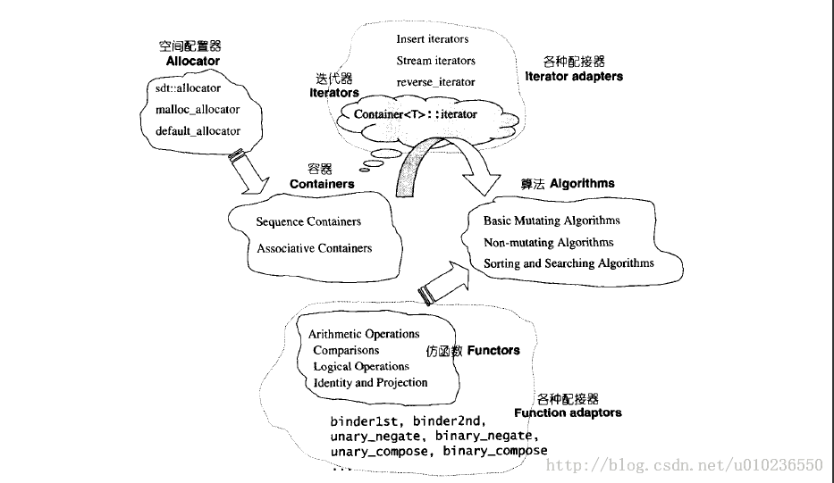

# C#与C++相比较之STL篇六大组件

Program into Your Language, Not in It——《代码大全》。如何深入一门语言去编程？我认为有三步：熟悉它；知道它的局限性；扩展它。

https://www.cnblogs.com/cdh49/p/3491903.html

STL包含六大组件：**容器(Containers)、迭代器（Iterators）、算法（Algorithms）、仿函数（functors）、配接器（Adapters）、配置器（Allocators）**。

容器通过[配置器](https://blog.csdn.net/xy913741894/article/details/66974004) [Allocators实现](http://startheap.com/2018/10/29/stl-most-basic-allocator/ ) 取得数据存储空间，

算法通过迭代器来存取容器的内容，

仿函数协助算法完成不同的操作策略，

C++中的仿函数是通过在类中重载()运算符实现，使你可以像使用函数一样来创建类的对象。

仿函数（functors）是早期的命名，C++ 标准定案后使用函数对象（function objects）的叫法。就实现意义而言， “函数对象”：一种具有函数性质的对象（本质为对象）。https://blog.csdn.net/lanchunhui/article/details/50695479
仿函数的应用场景主要在：作为算法组件中的相关函数接口的参数。更具体地说，STL 所提供的各种算法，往往有两个版本，其中一个版本表现出最常用（或最直观）的某种运算，第二个版本则表现出最泛化的演算流程，允许用户“以 template 参数来指定所要采行的策略”。就拿accumulate()（<numeric>头文件）来说，其一般行为（第一个版本）是将指定范围内的所有元素相加，第二个版本则允许你指定某种“操作”（甚至是相乘），取代第一个版本中的“相加”行为。

配接器用来修饰或套接仿函数。适配器（adaptor/adapter）在STL组件的灵活运用功能上，扮演着轴承、转换器的角色，将一种容器或迭代器装换或封装成另一种容器或迭代器，例如基于deque容器的stack和queue。 http://ibillxia.github.io/blog/2014/11/23/insight-into-stl-7-adaptor/ https://www.cnblogs.com/yyxt/p/4986983.html

这一整套配合，可以使我们完全掌控数据在存储器上的增删查改。

《STL源码剖析》提炼总结：空间配置器(allocator) - 默然的文章 - 知乎
https://zhuanlan.zhihu.com/p/34725232

STL提供的各种配接器中：

改变仿函数接口者：称为function adapter
改变容器接口者：称为container adapter
改变迭代器接口者：称为iterator adapter

STL中，最常用的**容器**要算vector、list、map、set这四种了。

C#中，对应的容器分别是:List、LinkedList、Dictionary、HashSet。

STL中的迭代器有五种：

输入迭代器（Input Iterator）、输出迭代器（Output Iterator）、前向迭代器（Forward Iterator）、双向迭代器（Bidirectional Iterator）、随机存取迭代器（Random Access Iterator）。

C#中，没有相对应的迭代器概念。毕竟迭代器就是一个智能指针，而C#却不支持指针（unsafe另算哈）。

