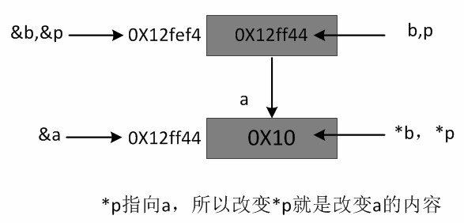

# 指针※和&引用


https://blog.csdn.net/u013130743/article/details/80806179


指针：变量，独立，可变，可空，替身，无类型检查；

引用：别名，依赖，不变，非空，本体，有类型检查；


指针是一个实体（替身）；引用只是一个别名（本体的另一个名字）

　　引用只能在定义时被初始化一次，之后不可改变，即“从一而终”；指针可以修改，即“见异思迁”；

　　引用不能为空（有本体，才有别名）；指针可以为空；

　　sizeof 引用，得到的是所指向变量的大小；sizeof 指针，得到的是指针的大小；

　　指针 ++，是指指针的地址自增；引用++是指所指变量自增；

　　引用是类型安全的，引用过程会进行类型检查；指针不会进行安全检查；


4. 指针的引用传递

```
 1 void f( int*&p){
 2     printf("\n%x",&p);
 3     printf("\n%x",p);
 4     printf("\n%x\n",*p);
 5     *p=0xff;
 6 }
 7 void main()
 8 {
 9     int a=0x10;
10     printf("\n%x",&a);
11     printf("\n%x\n",a);
12     int *b=&a;
13     printf("\n%x",&b);
14     printf("\n%x",b);
15     printf("\n%x\n",*b);
16     f(b);
17     printf("\n%x\n",a);
18 }
```




