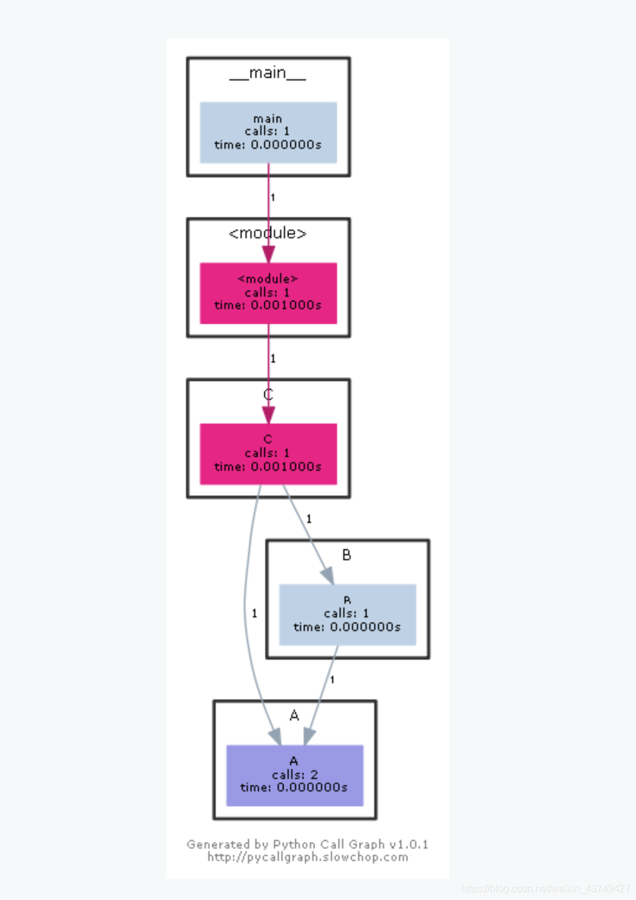
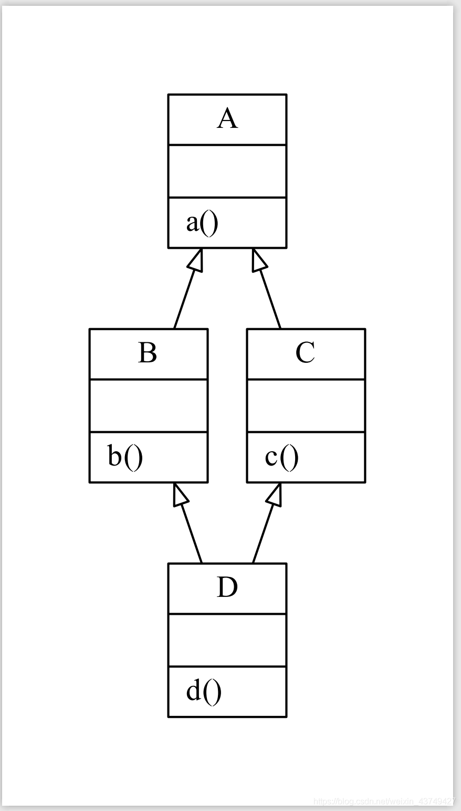

[TOC]


```
pip install pylint
```

pycharm上
java call graph插件的作者还做了这个软件，专门用来画代码图
https://codemap.app/


# 1. python类文件依赖UML


使用Pycharm生成类继承关系的树状图,IDE右键diagram就行，但是只有一个文件

java call graph插件 https://plugins.jetbrains.com/plugin/12304-call-graph
https://www.youtube.com/watch?v=cd8IYPVRkhI


Python生成代码导图和UML类图  https://blog.csdn.net/weixin_43749427/article/details/112977556

```
pip install pycallgraph
```

生成流程图
方式一：
在python代码中执行：

```
from pycallgraph import PyCallGraph
from pycallgraph.output import GraphvizOutput
with PyCallGraph(output=GraphvizOutput):
	# 添加执行的代码、函数
    pass

```

在执行结束之后会生成流程图

方式二：
安装环境
windows上安装graphviz可执行文件
安装包：https://pythondict.com/go/?url=https://graphviz.gitlab.io/_pages/Download/windows/graphviz-2.38.msi
安装完成后，为方便使用，将安装路径添加到环境变量中

这种方式需要使用bash来执行，我这里使用的是git bash
安装地址： https://gitforwindows.org/


```
# 文件名： graphs.py
def A():
    pass

def B():
    A()

def C():
    A()
    B()

if __name__ == '__main__':
    C()

```

打开git bash:

```
 pycallgraph graphviz graphs.py
```


在本地会生成一个png图片：




生成UML类图
安装pylint：

```
pip install pylint
```

打开git bash, 命令格式
  pyreverse -o 生成的文件类型 文件或工程目录
如：

```
#文件名： graphs.py

class A(object):
    def a(self):
        pass

class B(A):
    def b(self):
        pass

class C(A):
    def c(self):
        pass

class D(B, C):
    def d(self):

```

then

```
# 建议文件类型选用pdf, 这样生成的图比较清晰
pyreverse -o pdf graphs.py

```





```
// --help查看更多选项
$ pyreverse --help
Usage:
  pyreverse [options] <packages>

  create UML diagrams for classes and modules in <packages>


Options:
  -h, --help            show this help message and exit
  -f <mode>, --filter-mode=<mode>
                        filter attributes and functions according to
                        <mode>. Correct modes are :
                        'PUB_ONLY' filter all non public attributes
                        [DEFAULT], equivalent to PRIVATE+SPECIAL_A
                        'ALL' no filter                             'SPECIAL'
                        filter Python special functions
                        except constructor                             'OTHER'
                        filter protected and private
                        attributes [current: PUB_ONLY]
  -c <class>, --class=<class>
                        create a class diagram with all classes related to
                        <class>; this uses by default the options -ASmy
                        [current: none]
  -a <ancestor>, --show-ancestors=<ancestor>
                        show <ancestor> generations of ancestor classes not in
                        <projects>
  -A, --all-ancestors   show all ancestors off all classes in <projects>
  -s <ass_level>, --show-associated=<ass_level>
                        show <ass_level> levels of associated classes not in
                        <projects>
  -S, --all-associated  show recursively all associated off all associated
                        classes
  -b, --show-builtin    include builtin objects in representation of classes
  -m [yn], --module-names=[yn]
                        include module name in representation of classes
  -k, --only-classnames
                        don't show attributes and methods in the class boxes;
                        this disables -f values
  -o <format>, --output=<format>
                        create a *.<format> output file if format available.
                        [current: dot]
  --ignore=<file[,file...]>
                        Add files or directories to the blacklist. They should
                        be base names, not paths. [current: CVS]
  -p <project name>, --project=<project name>
                        set the project name. [current: none]


```


https://blog.csdn.net/kaever/article/details/105276764 python:利用Graphviz和pyreverse 分析类文件自动生成UML图


pyreverse能方便的生成uml类图，pylint里自带了pyreverse这个工具。使用pip安装pylint
```
pip install pylint
```


## 1.1. pyreverse分析python工程
1、包图图解：

package包图中，实线箭线表示python模块之间的引用关系。

A用实线箭线指向B时，表示A模块中**import**（导入）了B模块。

python模块可以是一个文件（*.py），也可以是一个包（含有__init__.py的Python包）。

注意：基础模块（os、sys等）不会再包图中显示。

2、类图图解：

class类图中，实线空心三角表示继承基类（父类）。

A用实线空心三角指向B时，表示A类继承了B类。（如果改为虚线，则表示继承接口，java中常见）

类图中，实线实菱形表示组合关系，如人体的各个部位，不可分割。（如果改为空菱形，则表示聚合关系，如团队由人员组成，可以分割）

A用实线实菱形指向B时，表示A是属于B的、不可分割的组成部分。此时应在实线上标注出B的什么属性来接收A这个单位，作为B的组成部分。


一般使用为：pyreverse -ASmy -o png path

-ASmy：为pyreverse选项参数，可以通过pyreverse --help 查看所有参数。-ASmy产生的结果最详细，甚至包括了类属性的结果解析。如果只需要类与类的uml图，建议不加-ASmy。

-o 指定输出文件格式，支持png, svg, dot等
path 为要解析的文件或文件夹

-ASmy相关联的都显示出来，较为全面，包括第三方的库，比如tensorflow等，可能会冗余，较乱。

-c选项只追踪一个特定的类，默认会带-ASmy选项，如果不想让联系显示进来，只显示类的继承关系时，可以另外使用-s0选项指定（但有时候不会起作用），注意这里的类名要给相对路径（这个字是linux下搜狗输入法的问题）下的全名。

-o输出的格式，最好选用pdf格式，图片格式默认不是矢量图，会看不清。

**只寻求此工程目录下的类关系结构的话，可以只使用-my参数**


eample


操作流程：

想对test.py进行类分析
在该脚本文件夹下打开cmd或powershell窗口，执行以下命令后，会在当前文件夹下生成classes.png。
```
pyreverse -ASmy -o png test.py
```

也可指定输出文件名:pyreverse -ASmy -o png -p test test.py，运行后会生成classes_test.png。

分成两步也可。

```
pyreverse -ASmy -o dot test.py
```
在命令行(python)下执行该命令，作用：pyreverse 会分析test.py中的类关系，然后生成classes.dot文件。
可指定输出文件名:pyreverse -ASmy -o dot -p test test.py，运行后会生成classes_test.dot文件。
也可指定分析某个文件夹：pyreverse -ASmy -o dot folder/
注：看其他博客可直接一步生成图片：pyreverse -ASmy -o png test.py。但我会报错，看提示信息是：只支持输出dot文件。那就再转一下吧。
```
dot -Tpng classes.dot -o test.png
```
在命令行下执行该命令，作用：graphviz将.dot文件解析为图片。


example：

```cmd
pyreverse -my -o pdf <project dir name>
```

生成结果会保存在当前命令执行的路径下。

以flask/代码为例


[flask](file:///D:/ProgramData/Anaconda3/Lib/site-packages/flask)

```
pyreverse D:/ProgramData/Anaconda3/Lib/site-packages/z3/
```
pyreverse会分析flask文件的代码并在当前目录下生成classes.dot和packages.dot两个dot格式的文件


也可以套娃用pylint分析pylint自身工程结构


```
  -f <mode>, --filter-mode=<mode>
                        filter attributes and functions according to
                        <mode>. Correct modes are :
                        'PUB_ONLY' filter all non public attributes
                        [DEFAULT], equivalent to PRIVATE+SPECIAL_A
                        'ALL' no filter                             'SPECIAL'
                        filter Python special functions
                        except constructor                             'OTHER'
                        filter protected and private
                        attributes [current: PUB_ONLY]
  -c <class>, --class=<class>
                        create a class diagram with all classes related to
                        <class>; this uses by default the options -ASmy
                        [current: none]
  -a <ancestor>, --show-ancestors=<ancestor>
                        show <ancestor> generations of ancestor classes not in
                        <projects>
  -A, --all-ancestors   show all ancestors off all classes in <projects>
  -s <ass_level>, --show-associated=<ass_level>
                        show <ass_level> levels of associated classes not in
                        <projects>
  -S, --all-associated  show recursively all associated off all associated
                        classes
  -b, --show-builtin    include builtin objects in representation of classes
  -m [yn], --module-names=[yn]
                        include module name in representation of classes
  -k, --only-classnames
                        don't show attributes and methods in the class boxes;
                        this disables -f values
  -o <format>, --output=<format>
                        create a *.<format> output file if format available.
                        [current: dot]
  --ignore=<file[,file...]>
                        Add files or directories to the blacklist. They should
                        be base names, not paths. [current: CVS]
  -p <project name>, --project=<project name>
                        set the project name. [current: none]

```


Graphviz 

是贝尔实验室开源的图形绘制工具包
graphviz是一个开源做图软件，能画结构化的抽象和网络图形，在网络，生物信息学，软件工程， 数据库和web设计， 机器学习， 可视化接口等众多其他技术领域都有应用。


## 1.2. dot
使用Graphviz将dot文件转换为图形格式

转换为png格式
```
dot -Tpng -o classes.png classes.dot 
dot -Tpng -o packages.png packages.dot
```
也可以转换为jpg和pdf格式


```
dot -Tjpg -o classes.jpg classes.dot 
dot -Tpdf -o packages.jpg packages.dot
```
```
dot -Tjpg -o classes.pdf classes.dot 
dot -Tpdf -o packages.pdf packages.dot
```


通常会因为图像太大无法显示，可以用
Cairo's maximum bitmap size is 32767x32767 pixels, and dot will scale your graph to fit inside that area. As an alternative, you can tell pyreverse to generate PDF files, and use some other tool to convert to PNG, if you really need bitmaps.

```
dot -Tsvg -o classes.svg classes.dot
```

```
dot -T svg -o packages.svg packages.dot
```

```
-o svg
```


```
>dot --help
Error: dot: option -- unrecognized

Usage: dot [-Vv?] [-(GNE)name=val] [-(KTlso)<val>] <dot files>
(additional options for neato)    [-x] [-n<v>]
(additional options for fdp)      [-L(gO)] [-L(nUCT)<val>]
(additional options for memtest)  [-m<v>]
(additional options for config)  [-cv]

 -V          - Print version and exit
 -v          - Enable verbose mode
 -Gname=val  - Set graph attribute 'name' to 'val'
 -Nname=val  - Set node attribute 'name' to 'val'
 -Ename=val  - Set edge attribute 'name' to 'val'
 -Tv         - Set output format to 'v'
 -Kv         - Set layout engine to 'v' (overrides default based on command name)
 -lv         - Use external library 'v'
 -ofile      - Write output to 'file'
 -O          - Automatically generate an output filename based on the input filename with a .'format' appended. (Causes all -ofile options to be ignored.)
 -P          - Internally generate a graph of the current plugins.
 -q[l]       - Set level of message suppression (=1)
 -s[v]       - Scale input by 'v' (=72)
 -y          - Invert y coordinate in output

 -n[v]       - No layout mode 'v' (=1)
 -x          - Reduce graph

 -Lg         - Don't use grid
 -LO         - Use old attractive force
 -Ln<i>      - Set number of iterations to i
 -LU<i>      - Set unscaled factor to i
 -LC<v>      - Set overlap expansion factor to v
 -LT[*]<v>   - Set temperature (temperature factor) to v

 -m          - Memory test (Observe no growth with top. Kill when done.)
 -m[v]       - Memory test - v iterations.

 -c          - Configure plugins (Writes $prefix/lib/graphviz/config
               with available plugin information.  Needs write privilege.)
 -?          - Print usage and exit
```


