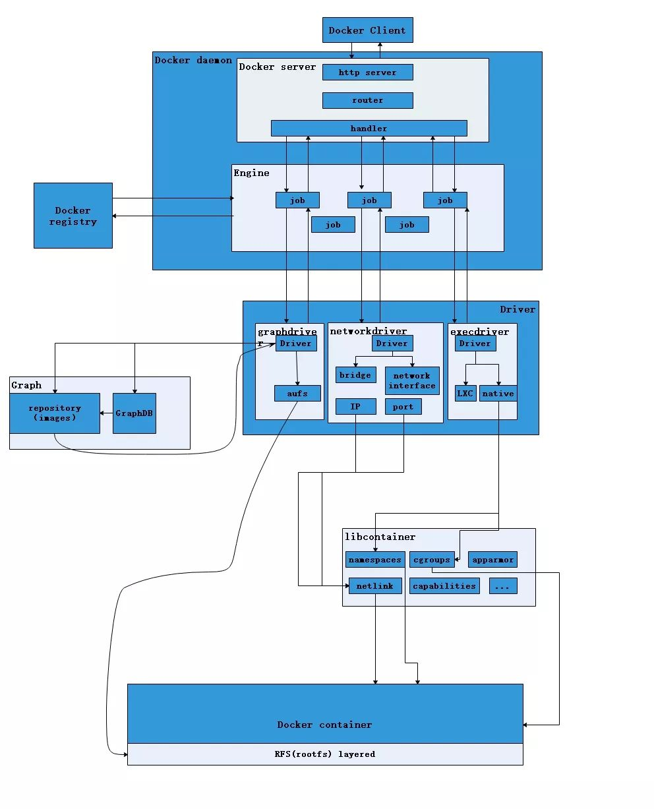

终于有人把 Docker 讲清楚了，万字详解！ - 动力节点的文章 - 知乎
https://zhuanlan.zhihu.com/p/89587030

通过镜像启动一个容器，一个镜像是一个可执行的包，其中包括运行应用程序所需要的所有内容包含代码，运行时间，库、环境变量、和配置文件。容器是镜像的运行实例，当被运行时有镜像状态和用户进程，可以使用docker ps 查看。

file:///E:/Docker/docker_practice.pdf

file:///E:/Docker/Docker Documentation - Docker Documentation.url
file:///E:/Docker/Docker Store.url
file:///E:/Docker/Docker 教程 - 菜鸟教程.url
file:///E:/Docker/(3 封私信 - 80 条消息)Docker 的应用场景在哪里？ - 知乎.url
file:///E:/Docker/Docker - Window环境下安装，使用入门hello-world示例 - 大泡泡的专栏 - CSDN博客.url
file:///E:/Docker/Docker Cloud.url
file:///E:/Docker/README.txt
file:///E:/Docker/第一次安装Docker并运行hello-world - 哪有什么天生王者，不过是一步一个脚印 - CSDN博客.url
file:///E:/Docker/获取镜像 · Docker -- 从入门到实践.url
file:///E:/Docker/检查运行中的镜像 - Docker入门教程 - docker中文社区.url
file:///E:/Docker/你所不了解的的Docker.url
file:///E:/Docker/下载 · yeasy-docker_practice Wiki.url
file:///E:/Docker/怎样用Docker创建我们自己的镜像 - shiqiangdexin的博客 - CSDN博客.url
file:///E:/Docker/只要一小时，零基础入门Docker.url
file:///E:/Docker/Docker_snipet.md
file:///E:/Docker/Docker从入门到部署-初识Docker.url
file:///E:/Docker/Get started with Docker for Windows - Docker Documentation.url
file:///E:/Docker/NNotebook.md

