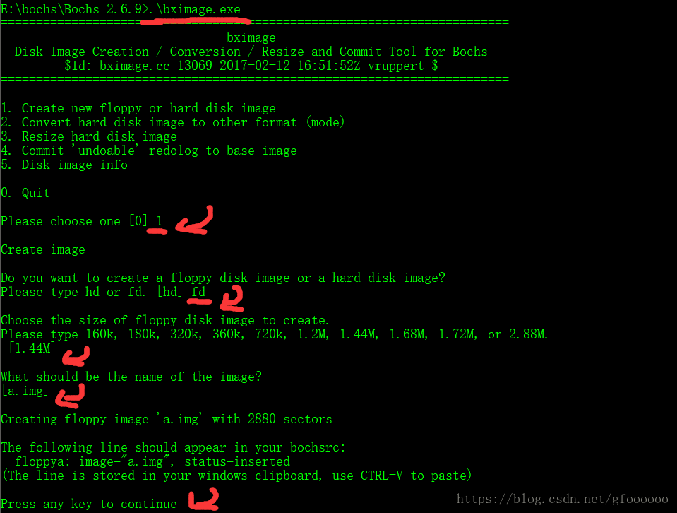

《一个操作系统的实现》

cd ..   返回当前目录上一级

cd \[\]   进入某一文件夹，例如 cd windows,可进入当前目录的windows文件夹中

dir 显示当前文件夹所有文件

.\\xxx 执行xxx文件

e: 可以进入e盘

```


org 07c00h ;告诉编译器加载到7c00处，如果把这个改成0100h就可以编译成一个.com文件在dos下运行啦
 
mov ax,cs
mov ds,ax
mov es,ax ;这三行让ds,es两个段寄存器指向与cs相同的段
 
call Display ;告诉程序调用display函数
jmp $ ; $指的是当前行被汇编后的地址，这行的作用可以理解为让其无限循环
 
Display:
mov ax,Message
mov bp,ax ;字符串的地址
mov cx,20 ;保存的是字符串长度，例如本例为20字节
mov ax,01301h ;ah=13,al=01h(ax寄存器的高位和地位）
mov bx,000ch ;页号位0，使用黑色为背景色，红色为字体颜色
mov dl,0
int 10h ;10h中断，用来显示字符
ret
 
Message: db "a easy boot sector !"
times 510-($-$$) db 0;填充510字节的0，$$表示编译后的起始地址
dw 0xaa55 ;表示结束，加上前面的510字节正好512字节满足条件
```
用记事本编辑要保存成ASNI编码


```
nasm boot.asm -o boot.bin 

```


可得到一个名为boot.bin的文件

之后安装bochs-2.6.9，在命令指示符中进入bochs-2.6.9文件，输入.\bximage.exe，并按下图操作


```
   dd if=boot.bin of=a.img bs=512 count=1 conv=notrunc

```


再新建并编辑一个bosh.src的文件保存在该目录下，其中保存的内容为：


```
 

megs:32
 
romimage:file=$BXSHARE/BIOS-bochs-latest
 
vgaromimage:file=$BXSHARE/VGABIOS-lgpl-latest
 
floppya:1_44=a.img,status=inserted
 
boot:floppy
 
log:bochsout.txt
 
mouse:enabled=0
 
keyboard: keymap=$BXSHARE/keymaps/x11-pc-de.map


```
最后在命令指示符中键入 .\bochs.exe -f bosh.src ，我们的字符就显示出来啦


https://blog.csdn.net/gfoooooo/article/details/83063871


