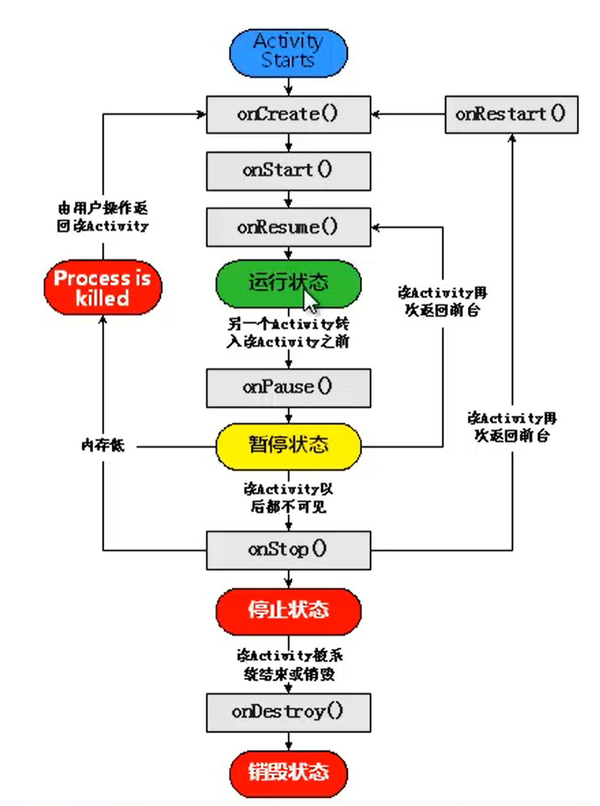
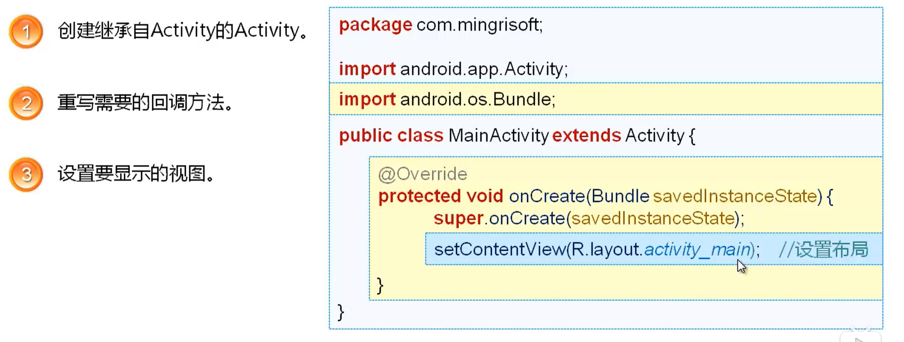
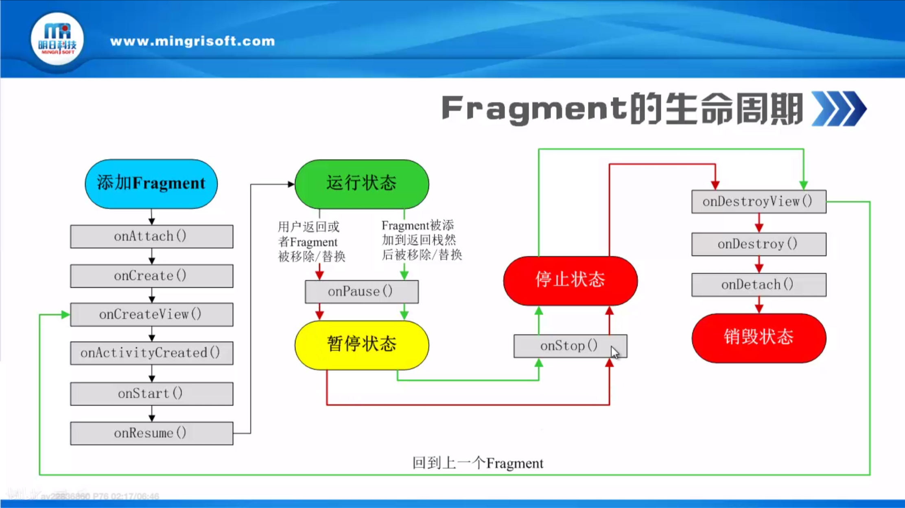

[TOC]


# 1. 开发笔记
AndroidPacKage META-INF\ （Jar文件中常可以看到） res\ (存放资源文件的目录)  AndroidManifest.xml (程序全局配置文件)  classes.dex （Dalvik字节码） resources.arsc (编译后的二进制资源文件)





## 1.1. layout布局XML等基础页面结合Java动态开发实现一个Activity

线性布局

注册登陆界面

```

    <LinearLayout
        android:layout_width="match_parent"
        android:layout_height="match_parent"
        android:orientation="vertical"
        android:gravity="center">

        <LinearLayout
            android:layout_width="match_parent"
            android:layout_height="wrap_content"
            android:orientation="horizontal"
            android:gravity="center">

            <TextView
                android:id="@+id/textView"
                android:layout_width="wrap_content"
                android:layout_height="wrap_content"
                android:layout_marginRight="20px"
                android:text="用户"
                android:textSize="50px"/>

            <EditText
                android:id="@+id/editText2"
                android:layout_width="wrap_content"
                android:layout_height="wrap_content"
                android:ems="10"
                android:inputType="textPersonName"
                android:text="请输入" />

        </LinearLayout>

        <LinearLayout
            android:layout_width="match_parent"
            android:layout_height="wrap_content"
            android:orientation="horizontal"
            android:gravity="center">

            <TextView
                android:id="@+id/textView2"
                android:layout_width="wrap_content"
                android:layout_height="wrap_content"
                android:layout_marginRight="20px"
                android:text="密码"
                android:textSize="50px"/>

            <EditText
                android:id="@+id/editText3"
                android:layout_width="wrap_content"
                android:layout_height="wrap_content"
                android:ems="10"
                android:inputType="textPersonName"
                android:text="请输入" />
        </LinearLayout>

        <LinearLayout
            android:layout_width="match_parent"
            android:layout_height="wrap_content"
            android:orientation="horizontal">

            <Button
                android:id="@+id/button"
                android:layout_width="wrap_content"
                android:layout_height="wrap_content"
                android:layout_marginRight="20px"
                android:layout_weight="1"
                android:text="register" />

            <Button
                android:id="@+id/button2"
                android:layout_width="wrap_content"
                android:layout_height="wrap_content"
                android:layout_marginRight="20px"
                android:layout_weight="1"
                android:text="Login" />
        </LinearLayout>
    </LinearLayout>
    
```


Table layout:

friend list:


```


```


## 1.2. 页面Activities的生命周期，页面跳转



看图更明显

onCreate()


onstart()

onResume()
运行状态

onPause()暂停状态

onstop()
暂停状态调用onRestart()回到onCreate（）

onDestory()
销毁状态

### 1.2.1. 创建Acticity
import androidx.appcompat.app.AppCompatActivity;

import android.app.Activity; //创建继承extends的Acitivity

>Activity <- FragmentActivity <- AppCompatActivity <- ActionBarActivity
'<-' means inheritance here. The reference said ActionBarActivity is deprecated, use AppCompatActivity instead.
So basically, using AppCompatActivity is always the right choise. The differences between them:
Activity is the basic one.
Based on Activity, FragmentActivity provides the ability to use Fragment.
Based on FragmentActivity, AppCompatActivity provides features to ActionBar


import android.os.Bundle;//重写回调方法


```java
public class MainActivity extends AppCompatActivity {

    @Override
    protected void onCreate(Bundle savedInstanceState) {
        super.onCreate(savedInstanceState);
        setContentView(R.layout.activity_main);//设置Activity使用的布局
    }

    @Override
    protected void onStart() {
        super.onStart();
    }

    @Override
    protected void onResume() {
        super.onResume();
    }
}

```


## 1.3. 启动运行Activity

### 1.3.1. manifests，就像小程序开发的总配置js文件，新增页面要写在这儿。向导创建最简单，New一个自动添加
配置文件  
\TriAxialAccelerometers\app\src\main\AndroidManifest.xml配置入口Acitivity也就是说软件首页，进而用Activity调用其他Activity,和小程序的设计思路一摸一样。
配置入口首页Activity代码：

```xml
            <intent-filter>
                <action android:name="android.intent.action.MAIN" />

                <category android:name="android.intent.category.LAUNCHER" />
            </intent-filter>
```


### 1.3.2. startActivity

转换按钮添加一个事件监听器，然后
```
Intent intent=new Intent(MainActivity.this上下文匿名内部类对象,另一个Activity.class);//创建intent对象
startActivity(intent);//启动Activity
```


刷新当前activity
```
onCreate(Null);
```


### 1.3.3. 使用Bundle在activity之间交换数据

`intent`传递意图，intent键值对的组合保存到Bundle内传递给另一个Activity。


public void startActivityForResult(Intent intent,int requestCode)启动另一个Activity返回结果result数据并且返回原来的Activity

Intent intent = newIntent(MainActivity.this ,传来数据底 Activity是*_Activity.class);
startActivityForResult(0x007);


## 1.4. Fragment类似Activity,可在多个Activity中重用碎片化的页面，也可以用多个Fragment在一个Activity中创建页面，比如微信主界面下方切换不通的Fragment。





### 1.4.1. 方法1直接在布局文件添加Fragment


### 1.4.2. 方法2 在Activity运行时使用


## 1.5. intent,一组被捆绑的信息：Component name,Flags,Action,Extras,Data,Category 


1. 页面跳转
2. 启动Service
3. 发送广播接收广播


Component name,


Flags,


Action,


Extras,


Data


Category 


## 1.6. 加速度传感器摇一摇红包

```
package com.example.tri_axial_accelerometers;

import androidx.appcompat.app.AppCompatActivity;

import android.app.AlertDialog;
import android.app.Service;
import android.content.Context;
import android.hardware.Sensor;
import android.hardware.SensorEvent;
import android.hardware.SensorEventListener;
import android.hardware.SensorManager;
import android.os.Bundle;
import android.os.Vibrator;
import android.widget.Toast;

public class MainActivity extends AppCompatActivity implements SensorEventListener {
    private SensorManager sensorManager;//定义传感器管理器
    private Vibrator vibrator;//振动器
    @Override
    protected void onCreate(Bundle savedInstanceState) {
        super.onCreate(savedInstanceState);
        setContentView(R.layout.activity_main);
        sensorManager = (SensorManager) getSystemService(Context.SENSOR_SERVICE);//获取传感器管理器
        vibrator= (Vibrator) getSystemService(Service.VIBRATOR_SERVICE);//括号强制类型转换，获取振动器
    }

    @Override
    protected void onStart() {
        super.onStart();
    }

    @Override
    protected void onResume() {
        super.onResume();//重写onResume方法
        sensorManager.registerListener(this,sensorManager.getDefaultSensor(Sensor.TYPE_ACCELEROMETER),sensorManager.SENSOR_DELAY_GAME);// 微传感器加速度注册监听器

    }

    @Override
    public void onSensorChanged(SensorEvent event) {//传感器值改变时触发的方法
        int sensorType = event.sensor.getType();//获取传感器的类型保存到int
        if(sensorType==Sensor.TYPE_ACCELEROMETER){
            float[] values=event.values;//获取传感器的值
            if(values[0]>15 || values[1]>15 || values[2]>20){//如果x,y大于15，z大于20是判断摇动了，弹出红包
                Toast.makeText(MainActivity.this, "摇一摇", Toast.LENGTH_SHORT).show();
                AlertDialog.Builder alertDialog = new AlertDialog.Builder(this);//创建一个对话框构建器
                alertDialog.setView(R.layout.packet);//设置布局文件，指定对话框
                alertDialog.show();//显示对话框
                vibrator.vibrate(500);//设置振动器的频率,要先Manifest.xml设置使用权限<uses-permission android:name="android.permission.VIBRATE"></uses-permission>，否则报错不能用
                sensorManager.unregisterListener(this);//取消注册的监听器
            }
        }//判断是否是加速度传感器的类型是否对应加速度传感器的常量
    }

    @Override
    public void onAccuracyChanged(Sensor sensor, int accuracy) {//传感器精度改变时触发的方法

    }
}


```


xml

```
<?xml version="1.0" encoding="utf-8"?>
<androidx.constraintlayout.widget.ConstraintLayout xmlns:android="http://schemas.android.com/apk/res/android"
    xmlns:app="http://schemas.android.com/apk/res-auto"
    xmlns:tools="http://schemas.android.com/tools"
    android:layout_width="match_parent"
    android:layout_height="match_parent"
    android:background="#00F0220F"
    tools:context=".MainActivity">

    <LinearLayout
        android:layout_width="match_parent"
        android:layout_height="match_parent"
        android:orientation="vertical">

        <TextView
            android:id="@+id/textView2"
            android:layout_width="match_parent"
            android:layout_height="wrap_content"
            android:gravity="center"
            android:text="摇一摇领红包" />

        <Button
            android:id="@+id/button"
            android:layout_width="wrap_content"
            android:layout_height="wrap_content"
            android:layout_gravity="center"
            android:text="点击切换" />

    </LinearLayout>

</androidx.constraintlayout.widget.ConstraintLayout>
```


下面是Android支持的几种传感器：

加速传感器    　　 Sensor.TYPE_ACCELEROMETER

陀螺仪传感器  　   Sensor.TYPE_GYROSCOPE

环境光仪传感器     Sensor.TYPE_LIGHT

电磁场传感器    　 Sensor.TYPE\_MAGNETIC\_FIELD

方向传感器    　　 Sensor.TYPE_ORIENTATION:

压力传感器    　　 Sensor.TYPE_PRESSURE:

距离传感器   　　  Sensor.TYPE_PROXIMITY:

温度传感器   　　  Sensor.TYPE_TEMPERATURE:


## 1.7. 加速度传感器


xml


```
<?xml version="1.0" encoding="utf-8"?>
<LinearLayout xmlns:android="http://schemas.android.com/apk/res/android"
    xmlns:app="http://schemas.android.com/apk/res-auto"
    xmlns:tools="http://schemas.android.com/tools"
    android:orientation="vertical"
    android:layout_width="fill_parent"
    android:layout_height="fill_parent"
    tools:context="com.example.asus.gary_01.MainActivity">

    <TextView
        android:layout_width="fill_parent"
        android:layout_height="wrap_content"
        android:text="传感器操作！"
        android:textSize="10pt" />

    <Button
        android:id="@+id/button"
        android:layout_width="match_parent"
        android:layout_height="wrap_content"
        android:text="三轴加速度传感器"/>

    <Button
        android:id="@+id/button"
        android:layout_width="match_parent"
        android:layout_height="wrap_content"
        android:text="获取手机传感器信息"/>

    <TextView
        android:id="@+id/textView"
        android:scrollbars="vertical"
        android:layout_width="fill_parent"
        android:layout_height="fill_parent"
        android:textSize="8pt"/>
</LinearLayout>
```


java


```
package com.example.tri_axial_accelerometers;

import android.content.Context;
import android.hardware.Sensor;
import android.hardware.SensorManager;
import androidx.appcompat.app.AppCompatActivity;
import android.os.Bundle;
import android.text.method.ScrollingMovementMethod;
import android.view.View;
import android.widget.Button;
import android.widget.TextView;

import java.util.List;

public class MainActivity extends AppCompatActivity {

    private TextView tx1;

    @Override
    protected void onCreate(Bundle savedInstanceState) {
        super.onCreate(savedInstanceState);
        setContentView(R.layout.activity_main);
        Button bt1 = (Button)findViewById(R.id.button);
        tx1=(TextView)findViewById(R.id.textView);//Text view添加滚动条设置
        //从系统获得传感器管理器
        final SensorManager sm = (SensorManager)getSystemService(Context.SENSOR_SERVICE);
        bt1.setOnClickListener(new View.OnClickListener() {
            @Override
            public void onClick(View v) {
                String str;
                //从传感器管理器中获得全部的传感器列表
                List<Sensor> allSensors = sm.getSensorList(Sensor.TYPE_ALL);
                int i;
                //给ViewText添加滚动条
                tx1.setMovementMethod(ScrollingMovementMethod.getInstance());
                //显示有多少个传感器
                tx1.setText("经检测该手机有"+allSensors.size()+"个传感器，它们分别是:");
                Sensor s;
                //显示每个传感器的具体信息
                for(i=0;i<allSensors.size();i++)
                {
                    s=allSensors.get(i);
                    str="设备名称："+s.getName();
                    switch(s.getType())
                    {
                        //加速传感器     Sensor.TYPE_ACCELEROMETER
                        case Sensor.TYPE_ACCELEROMETER:
                            tx1.setText(tx1.getText()+"\n"+i+"加速传感器accelerometer:\n"+str);
                            break;
                        //陀螺仪传感器    Sensor.TYPE_GYROSCOPE
                        case Sensor.TYPE_GYROSCOPE:
                            tx1.setText(tx1.getText()+"\n"+i+"陀螺仪传感器gyroscope:\n"+str);
                            break;
                        //环境光仪传感器   Sensor.TYPE_LIGHT
                        case Sensor.TYPE_LIGHT:
                            tx1.setText(tx1.getText()+"\n"+i+"环境光仪传感器light:\n"+str);
                            break;
                        //电磁场传感器    Sensor.TYPE_MAGNETIC_FIELD
                        case Sensor.TYPE_MAGNETIC_FIELD:
                            tx1.setText(tx1.getText()+"\n"+i+"电磁场传感器magnetic:\n"+str);
                            break;
                        //方向传感器    Sensor.TYPE_ORIENTATION:
                        case Sensor.TYPE_ORIENTATION:
                            tx1.setText(tx1.getText()+"\n"+i+"方向传感器orientation:\n"+str);
                            break;
                        //压力传感器     Sensor.TYPE_PRESSURE:
                        case Sensor.TYPE_PRESSURE:
                            tx1.setText(tx1.getText()+"\n"+i+"压力传感器pressure:\n"+str);
                            break;
                        //距离传感器     Sensor.TYPE_PROXIMITY:
                        case Sensor.TYPE_PROXIMITY:
                            tx1.setText(tx1.getText()+"\n"+i+"距离传感器proximity:\n"+str);
                            break;
                        //温度传感器     Sensor.TYPE_TEMPERATURE:
                        case Sensor.TYPE_TEMPERATURE:
                            tx1.setText(tx1.getText()+"\n"+i+"温度传感器temperature:\n"+str);
                            break;

                        default:
                            tx1.setText(tx1.getText()+"\n"+i+"未知传感器:\n"+str);
                            break;
                    }
                }
            }
        });
    }
}

```


## 1.8. 天哥EditText牛逼


```
//etmPhone.getText().toString();  
//final int a = Integer.parseInt(et.getText().toString().trim());//https://www.cnblogs.com/liumeng-blog/p/5202096.html此处要使用getEditableText()，直接使用getText()会报错。Integer.parseInt(XX.getText().toString);  
//一用就报错 local variable test is accessed from within inner class; needs to be declared final：java内部类访问局部变量时局部变量必须声明为final.https://blog.csdn.net/wallezhe/article/details/49233015
```


