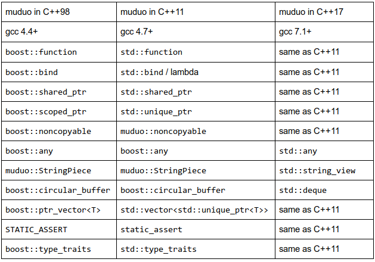

https://www.boost.org/doc/libs/1_55_0/doc/html/boost_asio.html
# cpp-boost


https://www.boost.org/doc/libs/1_74_0/


boost : 包含 .hpp 头文件
lib : 包含 .lib 文件(编译的实现细节)
libs :这些实现细节的来源


优先使用STL，项目允许使用boost可以用boost作STL补充。

在C++项目中，什么时候该用Boost，什么时候该用STL呢？ - 陈硕的回答 - 知乎
https://www.zhihu.com/question/66760616/answer/247646426

boost是试验版，冒险版，激进版的stl；
stl是稳定版，保守版，工业版的boost




# 1. boost


```
 bjam命令参数分析

b2  stage  --toolset=msvc-12.0  --with-date_time    --stagedir="D:\boost_1_56_0\"    link=static       runtime-link=static     threading=multi    debug    release
```


大部分boost库功能的使用只需包括相应头文件即可，少数（如正则表达式库，文件系统库等）需要链接库。

Boost
在送审的C++标准库TR1中，有十个Boost库成为标准库的候选方案。在更新的TR2中，有更多的Boost库被加入到其中。从某种意义上来讲，Boost库成为具有实践意义的准标准库。

按照实现的功能，Boost可为大致归入以下20个分类，在下面的分类中，有些库同时归入几种类别。

字符串和文本处理库、容器库、迭代器库、算法库、函数对象和高阶编程库、泛型编程库、模板元编程、预处理元编程库、并发编程库、数学和数字库、排错和测试库、数据结构库、图像处理库、输入输出库、跨语言混合编程库、内存管理库、解析库、编程接口库、综合类库、编译器问题的变通方案库等。


https://www.boost.org/users/


https://zh.wikipedia.org/wiki/Boost_C%2B%2B_Libraries


Boost中比较有名气的有这么几个库：
Regex    正则表达式库
Spirit    解析文本
LL parser framework，用C++代码直接表达EBNF
Graph    图组件和算法
Lambda    在调用的地方定义短小匿名的函数对象，很实用的functional功能
concept check    检查泛型编程中的concept
Mpl    用模板实现的元编程框架
Thread    可移植的C++多线程库
Python    把C++类和函数映射到Python之中
Pool    内存池管理
smart_ptr    智能指针


主要：

boost的在线document：http://boost.org/libs/libraries.htm

唯一的关于boost的book：Beyond the C++ Standard Library: An Introduction to Boost

其他：

http://www.boost.org/

heroboy2000:   http://blog.csdn.net/heroboy2000/
dozb:          http://dozb.bokee.com/catalog_2005.html

boost china:   http://www.stlchina.org/twiki/bin/view.pl/Main/BoostChina


http://zh.highscore.de/cpp/boost/introduction.html 详细介绍 https://www.cnblogs.com/wangkangluo1/archive/2012/05/28/2521493.html


Boost C++ 库 是一组基于C++标准的现代库。 其源码按 Boost Software License 来发布，允许任何人自由地使用、修改和分发。 这些库是平台独立的，且支持大多数知名和不那么知名的编译器。

Boost 社区负责开发和发布 Boost C++ 库。 社区由一个很大的C++开发人员群组组成，这些开发人员来自于全球，他们通过网站 www.boost.org 以及几个邮件列表相互协调。 社区的使命是开发和收集高质量的库，作为C++标准的补充。 那些被证实有价值且对于C++应用开发非常重要的库，将会有很大机会在某天被纳入C++标准中。

Boost 社区在1998年左右出现，当时刚刚发布了C++标准的第一个版本。 从那时起，社区就不断地扩大，现在已成为C++标准化工作中的一个重要角色。 虽然 Boost 社区与标准化委员会之间没有直接的关系，但有部分开发者同时活跃于两方。 下一个版本的C++标准很大可能在2011年通过，其中将扩展一批库，这些库均起源于 Boost 社区。

要增强C++项目的生产力，除了C++标准以外，Boost C++ 库是一个不错的选择。 由于当前版本的C++标准在2003年修订之后，C++又有了新的发展，所以 Boost C++ 库提供了许多新的特性。 由于有了 Boost C++ 库，我们无需等待下一个版本的C++标准，就可以立即享用C++演化中取得的最新进展。

Boost C++ 库具有良好的声誉，这基于它们的使用已被证实是非常有价值的。 在面试中询问关于 Boost C++ 库的知识是不常见的，因为知道这些库的开发人员通常也清楚C++的最新创新，并且能够编写和理解现代的C++代码。
Boost C++ 库均带有源代码。其中大多数库只包含头文件，可以直接使用，但也有一些库需要编译。 为了尽可能容易安装，可以使用 Boost Jam 进行自动安装。 无需逐个库进行检查和编译，Boost Jam 自动安装整个库集。 它支持许多操作系统和编译器，并且知道如何基于适当的配置文件来编译单个库。

为了在 Boost Jam 的帮助下自动安装，要使用一个名为 bjam 的应用程序，它也带有源代码。 对于某些操作系统，包括 Windows 和 Linux，也有预编译好的 bjam 二进制文件。

为了编译 bjam 本身，要执行一个名为 build 的简单脚本，它也为不同的操作系统提供了源代码。 对于 Windows，它是批处理文件 build.bat。 对于 Linux，文件名为 build.sh。

如果执行 build 时不带任何命令行选项，则该脚本尝试找到一个合适的编译器来生成 bjam。 通过使用命令行开关，称为 toolset，可以选择特定的编译器。 对于 Windows，build 支持 toolsets vc7, vc8 和 vc9，可以选择不同版本的 Microsoft C++ 编译器。 要从 Visual Studio 2008 的C++编译器编译 bjam，需要指定命令 build vc9。对于 Linux，支持 toolsets gcc 和 intel-linux，分别选定 GCC 和 Intel 的C++编译器。

应用程序 bjam 必须复制到本地的 Boost 目录 - 不论它是编译出来的还是下载的预编译二进制文件。 然后就可以不带任何命令行选项地执行 bjam，编译并安装 Boost C++ 库。 由于缺省选项 - 在这种情况下所使用的 - 并不一定是最好的选择，所以以下列出最重要的几个选项供参考：

声明 stage 或 install 可以指定 Boost C++ 库是安装在一个名为 stage 的子目录下，还是在系统范围内安装。 "系统范围"的意义取决于操作系统。 在 Windows 中，目标目录是 C:\Boost；而在 Linux 中则是 /usr/local。 目标目录也可以用 --prefix 选项明确指出。

如果不带任何命令行选项执行 bjam，则它会自己搜索一个合适的C++编译器。 可以通过 --toolset 选项来指定一个特定的编译器。 要在 Windows 中指定 Visual Studio 2008 的 Microsoft C++ 编译器，bjam 执行时要带上 --toolset=msvc-9.0 选项。 要在 Linux 中指定 GCC 编译器，则要给出 --toolset=gcc 选项。

命令行选项 --build-type 决定了创建何种方式的库。 缺省情况下，该选项设为 minimal，即只创建发布版。 对于那些想用 Visual Studio 或 GCC 构建他们项目的调试版的开发者来说，可能是一个问题。 因为这些编译器会自动尝试链接调试版的 Boost C++ 库，这样就会给出一个错误信息。 在这种情况下，应将 --build-type 选项设为 complete，以同时生成 Boost C++ 库的调试版和发布版，当然，所需时间也会更长一些。

要用 Visual Studio 2008 的C++编译器同时生成 Boost C++ 库的调试版和发布版，并将它们安装在目录 D:\Boost 中，应执行的命令是 bjam --toolset=msvc-9.0 --build-type=complete --prefix=D:\Boost install. 要在 Linux 中使用缺省目录创建它们，则要执行的命令是 bjam --toolset=gcc --build-type=complete install.

其它多个命令行选项可用于指定如何编译 Boost C++ 库的一些细节设定。 我通常在 Windows 下使用以下命令：bjam --toolset=msvc-9.0 debug release link=static runtime-link=shared install. debug 和 release 使得调试版和发布版均被生成。 link=static 则只创建静态库。 runtime-link=shared 则是指定 C++ 运行时库是动态链接的，这是在 Visual Studio 2008 中对C++项目的缺省设置。


三 boost库索引（来自boost china）（本系列文章使用boost 1.34版本）


2.0 字符串和文本处理( String and text processing)

conversion/lexical_cast - lexical_cast 类模板，作者 Kevlin Henney.

format - 类型安全的 '类似printf' 格式的操作, 作者 Samuel Krempp.

regex - 正则表达式库, 作者 John Maddock .

spirit - LL分析的框架，在嵌入式C++中根据EBNF规则对文件进行分析, 作者 Joel de Guzman and team.

tokenizer - 把字符串或其他字符序列分解成一系列标记(tokens), 作者 John Bandela.

string_algo - 字符串算法库, 作者 Pavol Droba .

2.1 容器(Containers)

array - STL风格封装下的定长数组, 作者 Nicolai Josuttis.

dynamic_bitset - std::bitset的动态长度版本, 作者 Jeremy Siek 和 Chuck Allison.

graph - 泛型图的组件和算法, 作者 Jeremy Siek 和 a University of Notre Dame team.

multi_array - 多维数组的容器和配接器, 作者 Ron Garcia.

multi_index - 提供对可重复键值STL兼容容器的存取接口, 作者 Joaquín M López Muñoz.

property map - Concepts defining interfaces which map key objects to value objects, 作者 Jeremy Siek.

variant - 安全, 泛型, 基于栈的，不同于联合容器, 作者 Eric Friedman and Itay Maman.

2.2 迭代器(Iterators)

graph - 泛型图的组件和算法, 作者 Jeremy Siek 和 a University of Notre Dame team. 

iterators - Iterator 构造框架, 配接器, 概念, 和其他, 作者 Dave Abrahams, Jeremy Siek, 和 Thomas Witt.

operators - 使算法类和迭代器容易的模板, 作者 Dave Abrahams 和 Jeremy Siek.

tokenizer - 把字符串或其他字符序列分解成一系列标记(tokens), 作者 John Bandela.

2.3 算法( Algorithms )

graph - 泛型图的组件和算法, 作者 Jeremy Siek 和 a University of Notre Dame team. 

minmax - 标准库扩展，用于同时进行 min/max 和 min/max 元素计算, 作者 Hervé Brönnimann.

string_algo - 字符串算法库, 作者 Pavol Droba .

utility - 类 next(),  prior() 函数模板, 作者 Dave Abrahams and others.

range - new 根基，其为建于new iterator概念之上的泛型计算, 作者 Thorsten Ottosen.

2.4 函数对象和高阶编程(Function objects and higher-order programming)

bind 和 mem_fn - 为函数/对象/指针和成员函数而被泛化的组合者, 作者 Peter Dimov.

function - 为延期调用和回调的函数对象的包裹, 作者 Doug Gregor.

functional - 增强的函数对象配接器, 作者 Mark Rodgers.

lambda - 在实际调用地点定义小的无名函数对象, 作者 Jaakko Järvi 和 Gary Powell.

ref - 一个工具库，用于传递引用到泛型函数, 作者 Jaako Järvi, Peter Dimov, Doug Gregor, 和 Dave Abrahams.

signals - 被管理的信号和邮槽回调的实现, 作者 Doug Gregor.

result_of - 确定函数调用表达式的类型.

2.5 泛型编程(Generic Programming)

call_traits - 实现自动判断传入参数的方式, 作者 John Maddock, Howard Hinnant, et al.

concept check - 泛型编程的工具, 作者 Jeremy Siek.

enable_if - 函数模板重载时的选择性包含, 作者 Jaakko Järvi, Jeremiah Willcock, 和 Andrew Lumsdaine.

in_place_factory, typed_in_place_factory- Generic in-place construction of contained objects with a variadic argument-list, 作者 Fernando Cacciola.

operators - 使算法类和迭代器容易的模板, 作者 Dave Abrahams 和 Jeremy Siek.

property map - Concepts defining interfaces which map key objects to value objects, 作者 Jeremy Siek.

static_assert - 静态断言 (编译时断言), 作者 John Maddock.

type_traits - 类型的基本属性的模板, 作者 John Maddock, Steve Cleary, et al.

2.6 模板元编程(Template Metaprogramming )

mpl - 模板元编程框架，用于编译时计算，序列化和元函数类, 作者 Aleksey Gurtovoy.

static_assert - 静态断言 (编译时断言), 作者 John Maddock.

type_traits - 类型的基本属性的模板, 作者 John Maddock, Steve Cleary, et al.

2.7 预处理元编程(Preprocessor Metaprogramming)

preprocessor - 预处理元编程工具，包含重复和递归, 作者 Vesa Karvonen 和 Paul Mensonides.

2.8 并发编程(Concurrent Programming)

thread - 轻便的C++多线程库, 作者 William Kempf.

2.9 数学和数值计算(Math and numerics)

math - 在数学领域的几个贡献, 作者 various authors.

conversion/numeric_cast - numeric_cast 类模板, 作者 Kevlin Henney.

numeric/conversion - 优化的基于策略的数值变换, 作者 Fernando Cacciola.

integer - 能够帮助简化对整数类型的处理。

interval - Extends the usual arithmetic functions to mathematical intervals, 作者 Guillaume Melquiond, Hervé Brönnimann and Sylvain Pion.

math/common_factor - 最大公约数和最小公倍数, 作者 Daryle Walker.

math/octonion - Octonions, 作者 Hubert Holin.

math/quaternion - Quaternions, 作者 Hubert Holin.

math/special_functions - 数学方面的函数比如 atanh, sinc, 和 sinhc, 作者 Hubert Holin.

multi_array - 多维数组的容器和配接器, 作者 Ron Garcia.

operators - 使算法类和迭代器容易的模板, 作者 Dave Abrahams 和 Jeremy Siek.

random - 随机数生成的完整系统, 作者 Jens Maurer.

rational - 有理数类, 作者 Paul Moore.

uBLAS - 基本线性代数，用于矩阵操作, 作者 Joerg Walter and Mathias Koch.

2.10 纠错和测试( Correctness and testing)

concept check - 泛型编程的工具, 作者 Jeremy Siek.

static_assert - 静态断言 (编译时断言), 作者 John Maddock.

test - 支持简单程序测试, 完整单元测试, 和程序执行监控, 作者 Gennadiy Rozental.

2.11数据结构( Data structures)

any - 安全，泛型的容器，包含不同类型的值, 作者 Kevlin Henney.

compressed_pair - 针对pair当中空成员做了一些优化, 作者 John Maddock, Howard Hinnant, et al.

multi_index - 提供对可重复键值STL兼容容器的存取接口, 作者 Joaquín M López Muñoz.

tuple - 容易地定义可返回多个值的函数, 作者 Jaakko Järvi.

variant - 安全, 泛型, 基于栈的，不同于联合容器, 作者 Eric Friedman and Itay Maman.

2.12 输入/输出(Input/Output)

format - 类型安全的 '类似printf' 格式的操作, 作者 Samuel Krempp.

io state savers - 保存 I/O 状态来防止混乱的数据, 作者 Daryle Walker.

program_options - 通过命令行，配置文件和其他来源来存取配置参数, 作者 Vladimir Prus.

serialization - Serialization of arbitrary data for persistence and marshalling, 作者 Robert Ramey

assign - 用常数或更容易方式生成的数据填充容器, 作者 Thorsten Ottosen.

2.13 跨语言支持(Inter-language support)

python - 映射 C++ 类和函数给 Python 使用， 作者 Dave Abrahams.

2.14 内存(Memory)

pool - 内存池管理, 作者 Steve Cleary.

smart_ptr - 五个智能指针类模板, 作者 Greg Colvin, Beman Dawes, Peter Dimov, 和 Darin Adler.

utility - 类 noncopyable 加 checked_delete(), checked_array_delete(), next(),  prior() 函数模板, 加base-from-member idiom, 作者 Dave Abrahams 等.

2.15解析( Parsing )

spirit - LL分析的框架，在嵌入式C++中根据EBNF规则对文件进行分析, 作者 Joel de Guzman and team.

2.16杂项( Miscellaneous )

base-from-member - Idiom to initialize a base class with a member, 作者 Daryle Walker.

compressed_pair - 针对pair当中空成员做了一些优化, 作者 John Maddock, Howard Hinnant, et al.

conversion - 各种类型间的转化，Numeric, polymorphic, 和 lexical casts, 作者 Dave Abrahams and Kevlin Henney.

numeric/conversion - 优化的基于策略的数值变换, 作者 Fernando Cacciola.

crc - 循环沉余码, 作者 Daryle Walker.

date_time - Date-Time 库， 作者 Jeff Garland.

filesystem - 方便地操作文件路径, 通过iteration访问目录, 和其他有用的文件系统操作, 作者 Beman Dawes.

optional - 对可选项值的可识别联合包裹, 作者 Fernando Cacciola.

program_options - 通过命令行，配置文件和其他来源来存取配置参数, 作者 Vladimir Prus.

timer - 事件定时器, 进度定时器, 和进度显示类, 作者 Beman Dawes.

tribool - 3种状态的 boolean 类型库, 作者 Doug Gregor.

utility - 类 noncopyable 加 checked_delete(), checked_array_delete(), next(),  prior() 函数模板, 加base-from-member idiom, 作者 Dave Abrahams 等.

value_initialized - 为统一的语法的值初始化的包裹, 作者 Fernando Cacciola, 基于 David Abrahams 的思想.

2.17 Broken compiler workarounds

compatibility - 对不一致的标准库提供帮助, 作者 Ralf Grosse-Kunstleve and Jens Maurer.

config - 帮助 boost 库的开发者配置编译器特性；不打算提供给库用户使用.


C++ Boost库分类总结（个人收藏） - luckyum的文章 - 知乎
https://zhuanlan.zhihu.com/p/66486828


