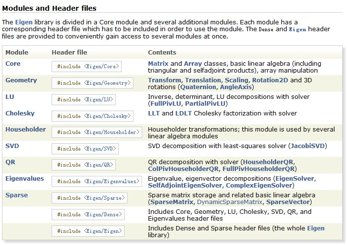
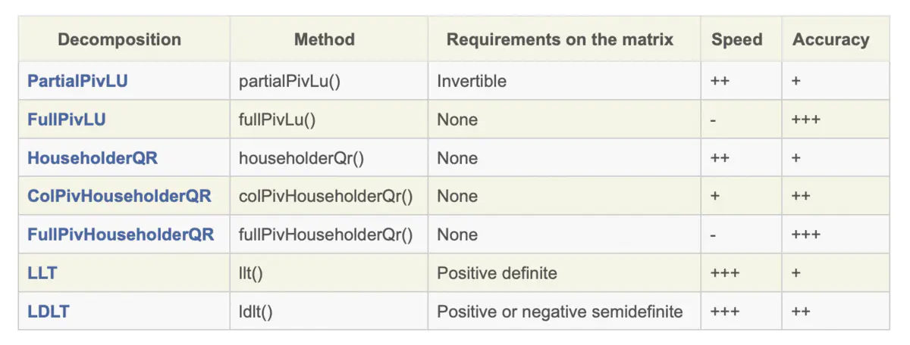

[TOC]

# 1. 夹硬来
百度知道说：如果要这么干的话，就只能通过间接创建动态数组的方式来做了，比如说你定义一个叫做“矩阵”的结构，在这个结构里声明一个指针成员。然后声明一个这个结构的指针，并初始化为一个动态数组；再循环访问每个元素，利用成员运算将每个元素的指针成员初始化为一个动态数组。


```
#include<iostream>
#include<sstream>
using namespace std;
 
struct my_matrix
{
    int *arr;
    ~my_matrix() { delete[] arr; }
    // 为是通用数组运算直接访问到数组里的每个元素，可以重载该运算符函数
    // 这不是必须的
    int&operator[](int i)
    {
        return arr[i];
    }
};
int main()
{
    int cols = 0, rows = 0;
    int a;
    bool semicolon = false;
    char ch[100];
    cin.getline(ch, 99);
    istringstream sin(ch);
    char c;
    while (sin)
    {
        if (sin >> a)
        {
            if(rows < 1)
                ++cols;
        }
        else
        {
            sin.clear();
            c = sin.get();
            //cin.get();
            ++rows;
        }
    }
    my_matrix *mtx = new my_matrix[rows];
    int i;
    for (i = 0; i < rows; ++i)
        mtx[i].arr = new int[cols];
 
    sin = istringstream(ch);
    i = 0;
    int j = 0;
    while (sin)
    {
        if (sin >> a)
        {
            // 如果你没有重载数组运算符，则这里需要这样访问：
            // mtx[i].arr[j] = a;
            // 下同
            mtx[i][j] = a;
            ++j;
        }
        else
        {
            sin.clear();
            sin.get();
            ++i;
            j = 0;
        }
    }
    for (i = 0; i < rows; ++i)
    {
        for (j = 0; j < cols; ++j)
            cout << mtx[i][j] << ' ';
        cout << endl;
    }
    delete[] mtx;
    return 0;
}
```


# 2. Eigen赛高
[http://eigen.tuxfamily.org/index.php?title=Main_Page](http://eigen.tuxfamily.org/index.php?title=Main_Page)


## 2.1. Documentation

-   **[Eigen 3 documentation](http://eigen.tuxfamily.org/dox)**: this includes a [getting started guide](http://eigen.tuxfamily.org/dox/GettingStarted.html), a [long tutorial](http://eigen.tuxfamily.org/dox/group__TutorialMatrixClass.html), a [quick reference](http://eigen.tuxfamily.org/dox/group__QuickRefPage.html), and page about [porting from Eigen 2 to Eigen 3](http://eigen.tuxfamily.org/dox/Eigen2ToEigen3.html).

-   **[Eigen development branch documentation](http://eigen.tuxfamily.org/dox-devel)**

-   **[Eigen 2 documentation](http://eigen.tuxfamily.org/dox-2.0)** (old): this includes the [Eigen 2 Tutorial](http://eigen.tuxfamily.org/dox-2.0/TutorialCore.html).

-   [FAQ (Frequently asked questions)](http://eigen.tuxfamily.org/index.php?title=FAQ "FAQ")

-   [Presentations and talks](http://eigen.tuxfamily.org/index.php?title=Publications "Publications")

Eigen Tutorial 中文文档(c++版) - IQIT的文章 - 知乎 https://zhuanlan.zhihu.com/p/87613088


[很用心的Eigen手册https://blog.csdn.net/wzaltzap/article/details/79501856](https://blog.csdn.net/wzaltzap/article/details/79501856)


. c++矩阵运算库eigen应用在线性回归
[https://www.jianshu.com/p/7a9c31e36df7](https://www.jianshu.com/p/7a9c31e36df7)

还有图形学，光影等等处理矩阵的地方都要用


[QR分解等等Eigen较为详细的介绍博客https://blog.csdn.net/augusdi/article/details/12907341](https://blog.csdn.net/augusdi/article/details/12907341)


-   支持整数、浮点数、复数，使用模板编程，可以为特殊的数据结构提供矩阵操作。比如在用ceres-solver进行做优化问题（比如bundle adjustment）的时候，有时候需要用模板编程写一个目标函数，ceres可以将模板自动替换为内部的一个可以自动求微分的特殊的double类型。而如果要在这个模板函数中进行矩阵计算，使用Eigen就会非常方便。
-   支持逐元素、分块、和整体的矩阵操作。
-   内含大量矩阵分解算法包括LU，LDLt，QR、SVD等等。
-   支持使用Intel MKL加速
-   部分功能支持多线程
-   稀疏矩阵支持良好，到今年新出的Eigen3.3，已经自带了SparseLU、SparseQR、共轭梯度（ConjugateGradient solver）、bi conjugate gradient stabilized solver等解稀疏矩阵的功能。同时提供SPQR、UmfPack等外部稀疏矩阵库的接口。
-   支持常用几何运算，包括旋转矩阵、四元数、矩阵变换、AngleAxis（欧拉角与Rodrigues变换）等等。
-   更新活跃，用户众多（Google、WilliowGarage也在用），使用Eigen的比较著名的开源项目有ROS（机器人操作系统）、PCL（点云处理库）、Google Ceres（优化算法）。OpenCV自带到Eigen的接口。  
    总体来讲，如果经常做一些比较复杂的矩阵计算的话，或者想要跨平台的话，非常值得一用。

  



**Eigen帮助文档的地址**：[404 http://eigen.tuxfamily.org/dox/pages.html](http://eigen.tuxfamily.org/dox/pages.html)，本文中很多例子也是直接摘自这些帮助文档，

**另外关于Eigen的论坛可以访问**[http://forum.kde.org/viewforum.php?f=74](http://forum.kde.org/viewforum.php?f=74)

**Eigen用源码的方式提供给用户使用，在使用时只需要包含Eigen的头文件即可进行使用。**

之所以采用这种方式，是因为Eigen采用模板方式实现，由于模板函数不支持分离编译，所以只能提供源码而不是动态库的方式供用户使用，不过这也也更方面用户使用和研究。关于模板的不支持分离编译的更多内容，请参考：[http://blog.csdn.net/hjx_1000/article/details/8093701](http://blog.csdn.net/hjx_1000/article/details/8093701)

Eigen: C++开源矩阵计算工具——Eigen的简单用法
https://blog.csdn.net/augusdi/article/details/12907341


还是别人打包好的库好用，c++就是太多库却没有大一统的全面的标准库令人生厌，包的范围很广。


## 2.2. 输入长度未知的矩阵
### 2.2.1. 读入未知数目的N*N二维矩阵（C++实现，附代码）

stl的vector
读入未知数目的N*N二维矩阵（C++实现，附代码）
https://blog.csdn.net/weixin_39138071/article/details/79964372

1、选用vector来保存这个二维数组

2、用getline来读入一行

3、getline读入字符串转换为整数


```
//要求N*N数组，事先不知道数组大小N，从键盘读入

#include<iostream>

#include<vector>

#include<string>

using namespace std;


int main(){

    vector<vector<int> >vec;

    string str;

    //一次只能读一行，可以用while读多行，但是如果用while一直读会造成一直要求输入，而不能读入N*N数组

    getline(cin,str);

    //统计有多少个数字，因为输入是按空格隔开的，比如1 2 3

    int N=1;

    for(int i=0;i<str.size();i++){

        if(str[i]==' ')

            N++;

    }

    //打印输出N，用来检查N是否正确

    // cout<<N<<endl;

    //读入一行字符串，然后将字符串里的字符转换为数字并存到vector<int> mid里

    vector<int> mid;

    for(int i=0;i<str.size();i++){

        string str2="";

        //输入的数字之间以空格隔开

        while(str[i]!=' '&&i<str.size()){

            str2+=str[i];

            i++;

        }

        //将字符串转化为整数

        int num=stoi(str2);

        mid.push_back(num);

        //cout<<num<<" ";

    }

    //通过打印输出mid来检查上面的操作是否正确

    /* for(int i=0;i<mid.size();i++)

     cout<<mid[i]<<" ";

     cout<<endl;*/

    vec.push_back(mid);

    

   /*  方法一  读入剩余的几行

    for(int i=1;i<N;i++){

        getline(cin,str);

        vector<int> mid2;

        for(int i=0;i<str.size();i++){

            string str2="";

            while(str[i]!=' '&&i<str.size()){

                str2+=str[i];

                i++;

            }

            int num=stoi(str2);

            mid2.push_back(num);

        }

        vec.push_back(mid2);

    }*/

    // 方法二 读入剩余的几行，想比于方法一种string与int的多次转换，方法二效率更高

     for(int i=1;i<N;i++){

         vector<int> tmp;

         for(int j=0;j<N;j++){

             int val;

             //cin是遇到空白/空格即认为是此次读取结束，getline是读完一行才认为是读取结束，但是getline只能把读入的内容保存为一个字符串

             cin>>val;

             tmp.push_back(val);

         }

         vec.push_back(tmp);

     }


    for(int i=0;i<N;i++){

        for(int j=0;j<N;j++){

            cout<<vec[i][j]<<" ";

        }

        cout<<endl;

    }

    return 0;

}
```

### 2.2.2. C++读取txt中的矩阵数据并存入vector中

https://blog.csdn.net/liu798675179/article/details/77899543

```
#include <iostream>
#include <fstream>
#include <regex>
#include <string>
#include <vector>

using namespace std;

int main() {
	vector<int> temp_line;
	vector<vector<int>> Vec_Dti;
	string line;
	ifstream in("xxx.txt");  //读入文件
	regex pat_regex("[[:digit:]]+");  //匹配原则，这里代表一个或多个数字

	while(getline(in, line)) {  //按行读取
		for (sregex_iterator it(line.begin(), line.end(), pat_regex), end_it; it != end_it; ++it) {  //表达式匹配，匹配一行中所有满足条件的字符
			cout << it->str() << " ";  //输出匹配成功的数据
			temp_line.push_back(stoi(it->str()));  //将数据转化为int型并存入一维vector中
		}
		cout << endl;
		Vec_Dti.push_back(temp_line);  //保存所有数据
		temp_line.clear();
	}
	cout << endl << endl;

	for(auto i : Vec_Dti) {  //输出存入vector后的数据
		for(auto j : i) {
			cout << j << " ";
		}
		cout << endl;
	}
	
	return 0;
}
```
https://blog.csdn.net/tinamisu/article/details/25677559 
C++读取txt文本中的矩阵数据


### 2.2.3. 基于eigen 的 矩阵数据读取

动态数组记得初始化：否则Assertion failed: aLhs.rows() == aRhs.rows() && aLhs.cols()

https://blog.csdn.net/xinshuwei/article/details/94064790 

 Eigen::Matrix与array数据转换 https://blog.csdn.net/afl291529699/article/details/102118721


opencv矩阵与eigen矩阵的转换 https://blog.csdn.net/u013892042/article/details/99689044

```

#include <iostream>
#include <Eigen/Dense>
 
#include<fstream>// Save to local file.
#include <sstream> // stringstream, getline
 
using namespace Eigen;
using namespace std;
 
//a 行  
MatrixXd ReadData(istream & data, int a, int b)
{
	MatrixXd m_matrix(a, b);
	VectorXd hang(a);
	for (int j = 0; j < a; j++)//共a 行
	{
		for (int i = 0; i < b; i++)//共b 列 组成一行
		{
			data >> hang(i);
		}
		m_matrix.row(j) = hang;
	}
	return m_matrix;
}
 
 
 
int main()
{
 
	ifstream in("matrix.txt", ios::in);
	if (!in)
	{
		return 0;
	}
	MatrixXd m_matrix = ReadData(in, 4, 4);
	cout << m_matrix << endl;
	system("pause");
 
 
 
 
 
    return 0;
}
```

 How to write / read an Eigen matrix from a binary file https://www.codesd.com/item/how-to-write-read-an-eigen-matrix-from-a-binary-file.html

C++读入"N,X,Y,Z"格式文本文件到Eigen3 Matrix，以及相同格式输出方法 https://blog.csdn.net/Canvaskan/article/details/105215077 

std::vetcor到Eigen::Tensor再到Tensorflow::Tensor的转换
https://blog.csdn.net/weareu/article/details/86486682


[C++矩阵库 Eigen 快速入门https://www.cnblogs.com/python27/p/EigenQuickRef.html](https://www.cnblogs.com/python27/p/EigenQuickRef.html)

> Matlab 混合编程的方式处理矩阵运算，非常麻烦，直到发现了 Eigen 库，简直相见恨晚
http://eigen.tuxfamily.org/dox/AsciiQuickReference.txt

## 2.3. 这是矩阵定义


```
// A simple quickref for Eigen. Add anything that's missing.
// Main author: Keir Mierle

#include <Eigen/Dense>

Matrix<double, 3, 3> A;               // Fixed rows and cols. Same as Matrix3d.
Matrix<double, 3, Dynamic> B;         // Fixed rows, dynamic cols.
Matrix<double, Dynamic, Dynamic> C;   // Full dynamic. Same as MatrixXd.
Matrix<double, 3, 3, RowMajor> E;     // Row major; default is column-major.
Matrix3f P, Q, R;                     // 3x3 float matrix.
Vector3f x, y, z;                     // 3x1 float matrix.
RowVector3f a, b, c;                  // 1x3 float matrix.
VectorXd v;                           // Dynamic column vector of doubles
double s;                            

```

## 2.4. 这是矩阵的基本使用


```

// Basic usage
// Eigen          // Matlab           // comments
x.size()          // length(x)        // vector size
C.rows()          // size(C,1)        // number of rows
C.cols()          // size(C,2)        // number of columns
x(i)              // x(i+1)           // Matlab is 1-based
C(i,j)            // C(i+1,j+1)       //

A.resize(4, 4);   // Runtime error if assertions are on.
B.resize(4, 9);   // Runtime error if assertions are on.
A.resize(3, 3);   // Ok; size didn't change.
B.resize(3, 9);   // Ok; only dynamic cols changed.
                  
A << 1, 2, 3,     // Initialize A. The elements can also be
     4, 5, 6,     // matrices, which are stacked along cols
     7, 8, 9;     // and then the rows are stacked.
B << A, A, A;     // B is three horizontally stacked A's.
A.fill(10);       // Fill A with all 10's.


```

## 2.5. 这是特殊的矩阵生成


```


// Eigen                                    // Matlab
MatrixXd::Identity(rows,cols)               // eye(rows,cols)
C.setIdentity(rows,cols)                    // C = eye(rows,cols)
MatrixXd::Zero(rows,cols)                   // zeros(rows,cols)
C.setZero(rows,cols)                        // C = zeros(rows,cols)
MatrixXd::Ones(rows,cols)                   // ones(rows,cols)
C.setOnes(rows,cols)                        // C = ones(rows,cols)
MatrixXd::Random(rows,cols)                 // rand(rows,cols)*2-1            // MatrixXd::Random returns uniform random numbers in (-1, 1).
C.setRandom(rows,cols)                      // C = rand(rows,cols)*2-1
VectorXd::LinSpaced(size,low,high)          // linspace(low,high,size)'
v.setLinSpaced(size,low,high)               // v = linspace(low,high,size)'
VectorXi::LinSpaced(((hi-low)/step)+1,      // low:step:hi
                    low,low+step*(size-1))  //


```

## 2.6. 这是矩阵分块


```


// Matrix slicing and blocks. All expressions listed here are read/write.
// Templated size versions are faster. Note that Matlab is 1-based (a size N
// vector is x(1)...x(N)).
// Eigen                           // Matlab
x.head(n)                          // x(1:n)
x.head<n>()                        // x(1:n)
x.tail(n)                          // x(end - n + 1: end)
x.tail<n>()                        // x(end - n + 1: end)
x.segment(i, n)                    // x(i+1 : i+n)
x.segment<n>(i)                    // x(i+1 : i+n)
P.block(i, j, rows, cols)          // P(i+1 : i+rows, j+1 : j+cols)
P.block<rows, cols>(i, j)          // P(i+1 : i+rows, j+1 : j+cols)
P.row(i)                           // P(i+1, :)
P.col(j)                           // P(:, j+1)
P.leftCols<cols>()                 // P(:, 1:cols)
P.leftCols(cols)                   // P(:, 1:cols)
P.middleCols<cols>(j)              // P(:, j+1:j+cols)
P.middleCols(j, cols)              // P(:, j+1:j+cols)
P.rightCols<cols>()                // P(:, end-cols+1:end)
P.rightCols(cols)                  // P(:, end-cols+1:end)
P.topRows<rows>()                  // P(1:rows, :)
P.topRows(rows)                    // P(1:rows, :)
P.middleRows<rows>(i)              // P(i+1:i+rows, :)
P.middleRows(i, rows)              // P(i+1:i+rows, :)
P.bottomRows<rows>()               // P(end-rows+1:end, :)
P.bottomRows(rows)                 // P(end-rows+1:end, :)
P.topLeftCorner(rows, cols)        // P(1:rows, 1:cols)
P.topRightCorner(rows, cols)       // P(1:rows, end-cols+1:end)
P.bottomLeftCorner(rows, cols)     // P(end-rows+1:end, 1:cols)
P.bottomRightCorner(rows, cols)    // P(end-rows+1:end, end-cols+1:end)
P.topLeftCorner<rows,cols>()       // P(1:rows, 1:cols)
P.topRightCorner<rows,cols>()      // P(1:rows, end-cols+1:end)
P.bottomLeftCorner<rows,cols>()    // P(end-rows+1:end, 1:cols)
P.bottomRightCorner<rows,cols>()   // P(end-rows+1:end, end-cols+1:end)

```

## 2.7. 这是矩阵元素交换


```


// Of particular note is Eigen's swap function which is highly optimized.
// Eigen                           // Matlab
R.row(i) = P.col(j);               // R(i, :) = P(:, j)
R.col(j1).swap(mat1.col(j2));      // R(:, [j1 j2]) = R(:, [j2, j1])
```

## 2.8. Eigen矩阵转置


```
// Views, transpose, etc;
// Eigen                           // Matlab
R.adjoint()                        // R'
R.transpose()                      // R.' or conj(R')       // Read-write
R.diagonal()                       // diag(R)               // Read-write
x.asDiagonal()                     // diag(x)
R.transpose().colwise().reverse()  // rot90(R)              // Read-write
R.rowwise().reverse()              // fliplr(R)
R.colwise().reverse()              // flipud(R)
R.replicate(i,j)                   // repmat(P,i,j)

```

## 2.9. 这是矩阵乘积


```
// All the same as Matlab, but matlab doesn't have *= style operators.
// Matrix-vector.  Matrix-matrix.   Matrix-scalar.
y  = M*x;          R  = P*Q;        R  = P*s;
a  = b*M;          R  = P - Q;      R  = s*P;
a *= M;            R  = P + Q;      R  = P/s;
                   R *= Q;          R  = s*P;
                   R += Q;          R *= s;
                   R -= Q;          R /= s;

```

## 2.10. 这是矩阵单个元素操作


```


// Vectorized operations on each element independently
// Eigen                       // Matlab
R = P.cwiseProduct(Q);         // R = P .* Q
R = P.array() * s.array();     // R = P .* s
R = P.cwiseQuotient(Q);        // R = P ./ Q
R = P.array() / Q.array();     // R = P ./ Q
R = P.array() + s.array();     // R = P + s
R = P.array() - s.array();     // R = P - s
R.array() += s;                // R = R + s
R.array() -= s;                // R = R - s
R.array() < Q.array();         // R < Q
R.array() <= Q.array();        // R <= Q
R.cwiseInverse();              // 1 ./ P
R.array().inverse();           // 1 ./ P
R.array().sin()                // sin(P)
R.array().cos()                // cos(P)
R.array().pow(s)               // P .^ s
R.array().square()             // P .^ 2
R.array().cube()               // P .^ 3
R.cwiseSqrt()                  // sqrt(P)
R.array().sqrt()               // sqrt(P)
R.array().exp()                // exp(P)
R.array().log()                // log(P)
R.cwiseMax(P)                  // max(R, P)
R.array().max(P.array())       // max(R, P)
R.cwiseMin(P)                  // min(R, P)
R.array().min(P.array())       // min(R, P)
R.cwiseAbs()                   // abs(P)
R.array().abs()                // abs(P)
R.cwiseAbs2()                  // abs(P.^2)
R.array().abs2()               // abs(P.^2)
(R.array() < s).select(P,Q );  // (R < s ? P : Q)
R = (Q.array()==0).select(P,R) // R(Q==0) = P(Q==0)
R = P.unaryExpr(ptr_fun(func)) // R = arrayfun(func, P)   // with: scalar func(const scalar &x);


```

## 2.11. 这是矩阵化简


```


// Reductions.
int r, c;
// Eigen                  // Matlab
R.minCoeff()              // min(R(:))
R.maxCoeff()              // max(R(:))
s = R.minCoeff(&r, &c)    // [s, i] = min(R(:)); [r, c] = ind2sub(size(R), i);
s = R.maxCoeff(&r, &c)    // [s, i] = max(R(:)); [r, c] = ind2sub(size(R), i);
R.sum()                   // sum(R(:))
R.colwise().sum()         // sum(R)
R.rowwise().sum()         // sum(R, 2) or sum(R')'
R.prod()                  // prod(R(:))
R.colwise().prod()        // prod(R)
R.rowwise().prod()        // prod(R, 2) or prod(R')'
R.trace()                 // trace(R)
R.all()                   // all(R(:))
R.colwise().all()         // all(R)
R.rowwise().all()         // all(R, 2)
R.any()                   // any(R(:))
R.colwise().any()         // any(R)
R.rowwise().any()         // any(R, 2)

```

## 2.12. 这是矩阵点乘


```


// Dot products, norms, etc.
// Eigen                  // Matlab
x.norm()                  // norm(x).    Note that norm(R) doesn't work in Eigen.
x.squaredNorm()           // dot(x, x)   Note the equivalence is not true for complex
x.dot(y)                  // dot(x, y)
x.cross(y)                // cross(x, y) Requires #include <Eigen/Geometry>

```

## 2.13. 这是矩阵类型转换


```


//// Type conversion
// Eigen                  // Matlab
A.cast<double>();         // double(A)
A.cast<float>();          // single(A)
A.cast<int>();            // int32(A)
A.real();                 // real(A)
A.imag();                 // imag(A)
// if the original type equals destination type, no work is done

// Note that for most operations Eigen requires all operands to have the same type:
MatrixXf F = MatrixXf::Zero(3,3);
A += F;                // illegal in Eigen. In Matlab A = A+F is allowed
A += F.cast<double>(); // F converted to double and then added (generally, conversion happens on-the-fly)

// Eigen can map existing memory into Eigen matrices.
float array[3];
Vector3f::Map(array).fill(10);            // create a temporary Map over array and sets entries to 10
int data[4] = {1, 2, 3, 4};
Matrix2i mat2x2(data);                    // copies data into mat2x2
Matrix2i::Map(data) = 2*mat2x2;           // overwrite elements of data with 2*mat2x2
MatrixXi::Map(data, 2, 2) += mat2x2;      // adds mat2x2 to elements of data (alternative syntax if size is not know at compile time)

```

## 2.14. 这是求解线性方程组Ax=B


```


// Solve Ax = b. Result stored in x. Matlab: x = A \ b.
x = A.ldlt().solve(b));  // A sym. p.s.d.    #include <Eigen/Cholesky>
x = A.llt() .solve(b));  // A sym. p.d.      #include <Eigen/Cholesky>
x = A.lu()  .solve(b));  // Stable and fast. #include <Eigen/LU>
x = A.qr()  .solve(b));  // No pivoting.     #include <Eigen/QR>
x = A.svd() .solve(b));  // Stable, slowest. #include <Eigen/SVD>
// .ldlt() -> .matrixL() and .matrixD()
// .llt()  -> .matrixL()
// .lu()   -> .matrixL() and .matrixU()
// .qr()   -> .matrixQ() and .matrixR()
// .svd()  -> .matrixU(), .singularValues(), and .matrixV()

```

这是矩阵特征值


```


// Eigenvalue problems
// Eigen                          // Matlab
A.eigenvalues();                  // eig(A);
EigenSolver<Matrix3d> eig(A);     // [vec val] = eig(A)
eig.eigenvalues();                // diag(val)
eig.eigenvectors();               // vec
// For self-adjoint matrices use SelfAdjointEigenSolver<>


```


