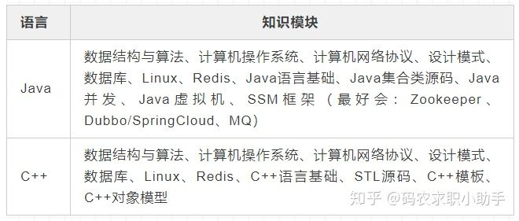

# 如何学习C++

**java**下的 j2ee还是很火的。大中型企业用的很多。出来就是做，web后端的。有点过热了。待遇不错。ibm，intel需求这类人。

**c**，主要是嵌入式和 linux驱动用，需要对系统底层比较了解，需要靠谱的人指导。待遇不错。通常都是结合单片机，arm这类嵌入式设备的，要不就是给这些设备写驱动，你得对底层有兴趣。

**c++**，游戏开发，这个进个好公司得拼算法，待遇优厚，典型就业单位是各类网络游戏公司，待遇肯定比BAT强。你需要搞搞acm。

如果说你学 C++ 的时候，没有学到 C++ 那部分“无论什么语言都会很有帮助”的那部分，那算是白学了：  
1\. 资源所有权（shared\_ptr/unique\_ptr/observer_ptr），RAII（finally/using/defer）  
2\. 泛型（你会发现很多语言所谓的“泛型”都是 C++ 模板的阉割版本）  
3\. 优化往往要求对编译器优化、对象模型、操作系统与组成原理有很多了解  
4\. 内存管理（内存池之类）  
5\. 数据结构 & 算法（STL）（没用过 C++ 刷 OJ？）  
6\. 你想学明白 C++ 必然要用它写过各种不同领域的玩意吧，不写东西怎么算会？包括但不限于服务器、图形、编译器、GUI 程序、基本库等。  
所以说，学明白 C++ 根本就不可能只学到那点破烂语法。我就不相信我说的这些你都熟悉找不到工作。最重要的，学 C++ 还能学到语言设计的反面典型，多好（笑

  
  
作者：刘雨培  
链接：https://www.zhihu.com/question/48753372/answer/112642027  

c/c++的主战场是腾讯，还有比如深信服，绿盟，360(顺序不分排名哈)安全类工具较多。

java的主战场是阿里，还有很多诸如拼多多等。

一直不重要，java找人多，但是工资比c++少2-3万每年。
但是C++太几把难，坐儿望3,急得话java，不急的话,c++深入研究

，c++实际岗位数量要小于java，而一般要求的综合水平要高于同薪资java岗位，c++我觉得你现在学也很难上手，涉及东西太多了。同样时间你拿出来搞java，收益更大。

好就业=java  
工资高=c++  
如果说入门难度满级10  
java=3～4  
c++=9～10  
然后学Java一个月后你会认为自己很厉害，  
c++学一个月很可能越学越糊涂。  
但如果你想要以“精通”级来对比  
那么精通c++的人最多只是精通 Java的人数的  
10分之1～越稀有挣得越高  
但达到精通的时间成本是巨大的

  
  
作者：植田  
链接：https://www.zhihu.com/question/65035778/answer/363386656  

算法和数据结构才是重点！！！

面试语言不是重点，python找不到工作。

大学生想依靠c/c++找工作，还需要什么知识？ - 牛客网的回答 - 知乎 https://www.zhihu.com/question/264964335/answer/307317076

1：你要仔细问问自己：擅长算法吗？如果擅长算法就做C++！

2：再问问自己？自己喜欢做那方面工作？然后决定java还是C++，单纯为了工作不是爱好以后工作会反感的！

3：其实互联网主要还是java；C++一般都是操作系统、大型游戏架构之类的java下层才用的，更偏重算法；其实现在的计算器语音架构一般是：从硬件最底层网上是：汇编=》C语音=》C++=》java（Android系统开发使用的语音架构就是这样的）；你看你喜欢那一层了！

4：其实java和C++语音很类似的！几乎大部分都一样！但是使用过程中java简单多了！不用考虑段错误、内存回收！

5：其实无论java还是C++，如果你单方面为了找个工作的话，哪一个“精通”了都没有问题；就怕你就学点皮毛！关键是语音只是基础，工作中用的更多是语音之外的架构型的知识；

你都研究生还在发愁。。。。。。没有方向。。。。。。现在的大学生啊！

  
  
作者：匿名用户  
链接：https://www.zhihu.com/question/289145781/answer/467677022  
来源：知乎  
著作权归作者所有。商业转载请联系作者获得授权，非商业转载请注明出处。

java侧重于大型企业级应用开发，C++侧重于底层应用开发。至于薪资方面呢，不管是C++还是java，有了多年项目经验后，工资都会比较高。现在网页，移动APP，都是通过http与服务器通讯，在http请求上面，JAVA处理较好，C++没有处理优势。所以，后台服务器都会用到JAVA，而不一定用到C++。因此，为了找工作：选Java。为挑战自我：选C++。

C++ 比较面向底层，速度快，而且windows开发非常友好。以后出来做桌面然见，游戏开发，嵌入式 C C++都使用。目前绝大数的大型的网络游戏都是C++开发的，3D游戏则更不用说了。但C++的学习曲线远远陡于JAVA，想擅长精通C++不是简单的事。

在系统编程和驱动编程中，更多的使用C/C++，与硬件打交道，C/C++充分利用硬件优势发挥其高效的性能，这方面JAVA就不行了，JAVA还有性能上的先天缺陷（不过现在很多好的JAVA解释器的优化策略非常好，不过就牺牲了可移植性）。

如果以后出来想走J2EE，Android App 或者 J2ME等方向，可以学JAVA。JAVA在网络编程中比C++更具有先天的优势，这主要考虑到了JAVA的高可移植性和易开发性。

