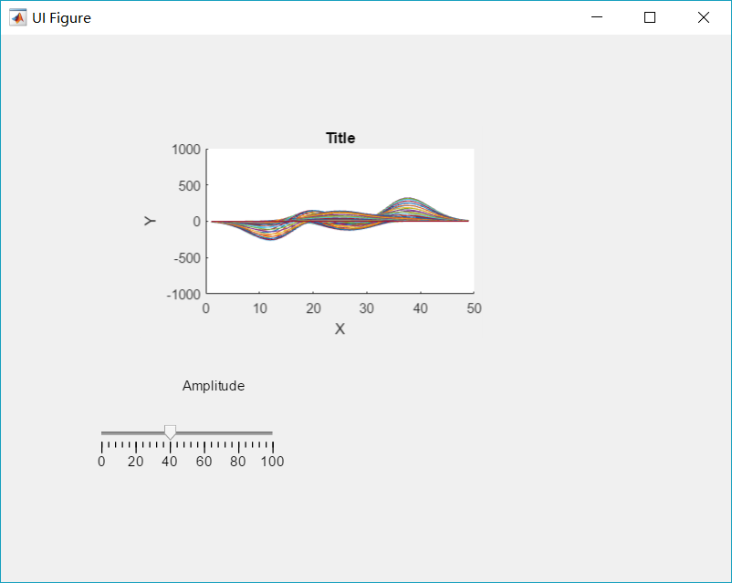
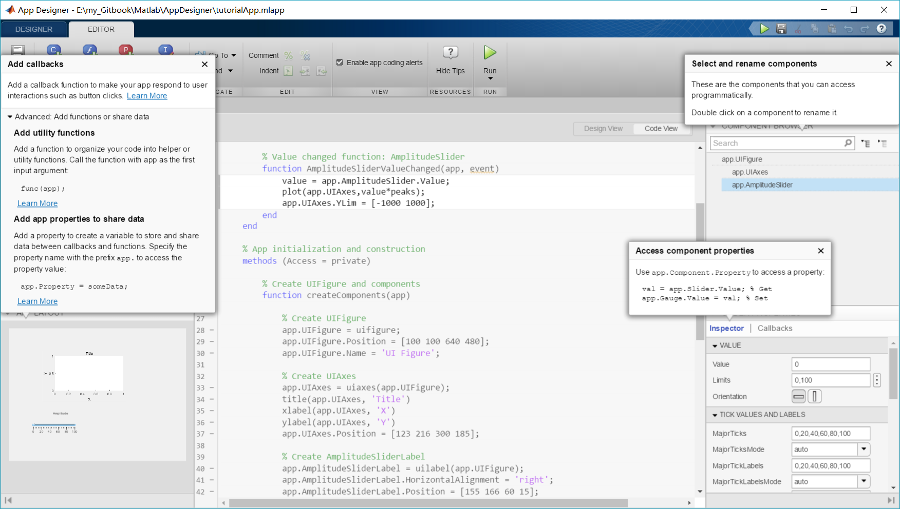
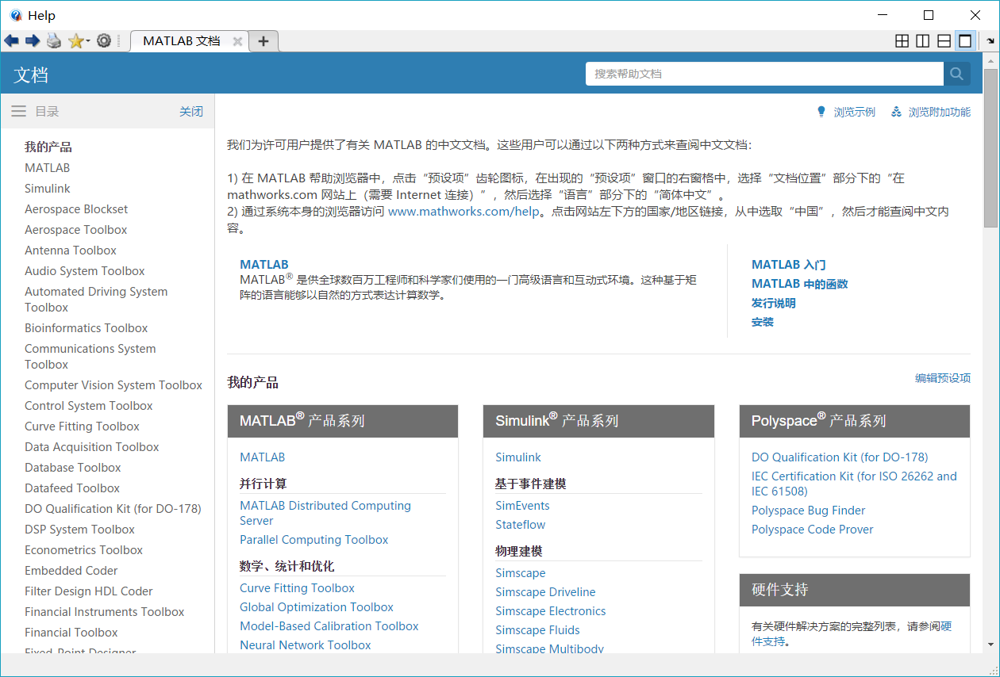

# AppDesigner&GUI
https://download.csdn.net/download/sujuanliu/2135301  MATLAB GUI 设计小程序

https://zhuanlan.zhihu.com/p/41334908    GUIROS技术点滴 —— Matlab&ROS可视化编程
Matlab中的robotics system toolbox提供了ROS的大部分功能，可以通过Matlab启动ROS Master、创建ROS节点、发布ROS消息/服务、查看ROS话题数据、控制ROS机器人等，更重要的是可以结合Matlab强大的功能，实现机器人算法设计，然后接入ROS系统，配合gazebo或者V-REP完成仿真。我们将这个Matlab中的ROS工具包简称为ROS-MATLAB。

这https://blog.csdn.net/cuixing001/article/details/78587785个 simulink 作者的说明文档，作者做这个的本意是想创建一个 Android 的库，用来获取 Android 手机上的数据，进而和 pc 机上 matlab model 交互。https://blogs.mathworks.com/loren/2018/07/25/the-state-of-app-building-in-matlab/

从 GUIDE 到 App Designer 的MATLAB迁移转换工具https://blog.csdn.net/weixin_42825609/article/details/85257265

https://zhuanlan.zhihu.com/p/20821503    MATLAB App Designer教程连载1：如何使用App Designer进行的简单的GUI设计
Mathworks在R2016a中正式推出了GUIDE的替代产品:AppDesigner

www.ilovematlab.cn/forum-219-1.html《MATLAB面向对象编程——从入门到设计模式》（含第二版） 
https://www.zhihu.com/question/30858386MATLAB    面向对象编程是什么样的体验？
appdesigner

一个回调函数，让你的应用程序响应用户的互动，如按钮点击。

添加效用函数
添加一个函数来将代码组织成助手或实用程序函数。以app作为第一个输入参数调用函数:
func(应用);
了解更多
添加应用程序属性来共享数据
添加一个属性来创建一个变量，用于在回调和函数之间存储和共享数据。使用前缀app.指定属性名称以访问属性值:
app.Property = someData;

这些是可以通过编程方式访问的组件。
双击一个组件来重命名它。

使用app.Component。属性访问属性:

