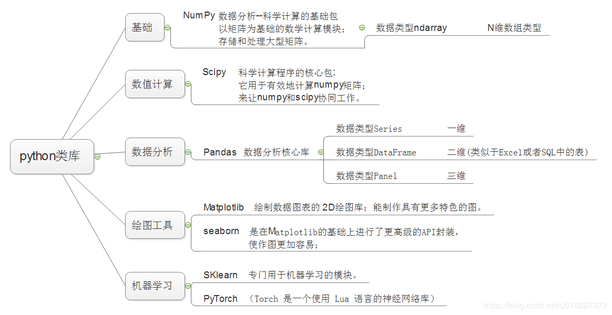

# 查看python类库函数方法继承结构依赖

大家都知道python有很多很好且功能强大的类库，所以学习python的一个关键就是学习所使用的类库的信息。

很多常用的类库在搜索引擎里直接可以搜索到相关的说明文档，比如numpy,scipy等，这些类库在网上的资料很多也很全，而且也是中文的看起来也方便。 
有些网上资料比较少的类库的说明文档在本地也可以查询

我说一下通用的方法，去官网看文档应该是最好的。  
首先，必须有人写了这个这个文档并且把它放在某个可以看到的地方。

  

python中每个modul，每个class，每个def都是留有写doc的地方的，写没写是另一回事，可以用“对象名称.\_\_doc\_\_”查看。这是一个字符串，所以内容只能是字符串允许的内容。如果字符不足以满足说明需求，可能会加上web链接，或者专门的说明函数。

你要查看的应该是  
import scipy  
print scipy.quiver.\_\_doc\_\_

或者  
import scipy  
print help(scipy.quiver)

  
  
作者：Interlock  
链接：https://www.zhihu.com/question/28509228/answer/41082781  

附上内置函数官方文档：https://docs.python.org/3/library/functions.html

我们可以用很简单的方法来做Python函数源代码的查看，Python中有两个Libraries能够使用：

-   **inspect** 一个Python内置的标准库
inspect模块用于收集python对象的信息，可以获取类或函数的参数的信息，源码，解析堆栈，对对象进行类型检查等等

-   **drill** 是一个第三方库

如何查看Python函数的源代码 - 恒仔的文章 - 知乎 https://zhuanlan.zhihu.com/p/37095163

如果一个类是别人编写的，又没有帮助文档，怎么样来查看所有成员函数呢？本文详细给大家介绍了关于python用dir函数查看类中所有成员函数的相关内容，下面话不多说了，来一起看看详细的介绍吧。

首先打开命令行输入：   

**python -m pydoc -p 8080**

给大家解释一下命令含义： 
python -m pydoc表示打开pydoc模块，这个模块就是用来查看python文档的工具

-p 1234表示在端口号8080上打开server，这个端口号可以自行设置

然后就可以在浏览器中打开链接“ http://localhost:8080/ ”

看到如图所示的内容 

https://blog.csdn.net/qq_28418387/article/details/52869559

 Python查看模块（变量、函数、类）方法

查看已导入模块（包）中包含的成员，本节给大家介绍 2 种方法。  

## 查看模块成员：dir()函数

事实上，在前面章节的学习中，曾多次使用 dir() 函数。通过 dir() 函数，我们可以查看某指定模块包含的全部成员（包括变量、函数和类）。注意这里所指的全部成员，不仅包含可供我们调用的模块成员，还包含所有名称以双下划线“__”开头和结尾的成员，而这些“特殊”命名的成员，是为了在本模块中使用的，并不希望被其它文件调用。  
  
这里以导入 string 模块为例，string 模块包含操作字符串相关的大量方法，下面通过 dir() 函数查看该模块中包含哪些成员：

1.  import string
2.  **print**(dir(string))

程序执行结果为：

\['Formatter', 'Template', '\_ChainMap', '\_TemplateMetaclass', '\_\_all\_\_', '\_\_builtins\_\_', '\_\_cached\_\_', '\_\_doc\_\_', '\_\_file\_\_', '\_\_loader\_\_', '\_\_name\_\_', '\_\_package\_\_', '\_\_spec\_\_', '\_re', '\_string', 'ascii\_letters', 'ascii\_lowercase', 'ascii_uppercase', 'capwords', 'digits', 'hexdigits', 'octdigits', 'printable', 'punctuation', 'whitespace'\]

可以看到，通过 dir() 函数获取到的模块成员，不仅包含供外部文件使用的成员，还包含很多“特殊”（名称以 2 个下划线开头和结束）的成员，列出这些成员，对我们并没有实际意义。  
  
因此，这里给读者推荐一种可以忽略显示 dir() 函数输出的特殊成员的方法。仍以 string 模块为例：  

1.  import string
2.  **print**(\[e **for** e **in** dir(string) **if** **not** e.startswith('_')\])

程序执行结果为：

\['Formatter', 'Template', 'ascii\_letters', 'ascii\_lowercase', 'ascii_uppercase', 'capwords', 'digits', 'hexdigits', 'octdigits', 'printable', 'punctuation', 'whitespace'\]

显然通过列表推导式，可在 dir() 函数输出结果的基础上，筛选出对我们有用的成员并显示出来。

c.biancheng.net/view/2404.html

## 查看模块成员：\_\_all\_\_变量

除了使用 dir() 函数之外，还可以使用 \_\_all\_\_ 变量，借助该变量也可以查看模块（包）内包含的所有成员。  
  
仍以 string 模块为例，举个例子：

1.  import string
2.  **print**(string.\_\_all\_\_)

程序执行结果为：

\['ascii\_letters', 'ascii\_lowercase', 'ascii_uppercase', 'capwords', 'digits', 'hexdigits', 'octdigits', 'printable', 'punctuation', 'whitespace', 'Formatter', 'Template'\]

显然，和 dir() 函数相比，\_\_all\_\_ 变量在查看指定模块成员时，它不会显示模块中的特殊成员，同时还会根据成员的名称进行排序显示。  
  
不过需要注意的是，并非所有的模块都支持使用 \_\_all\_\_ 变量，因此对于获取有些模块的成员，就只能使用 dir() 函数。

