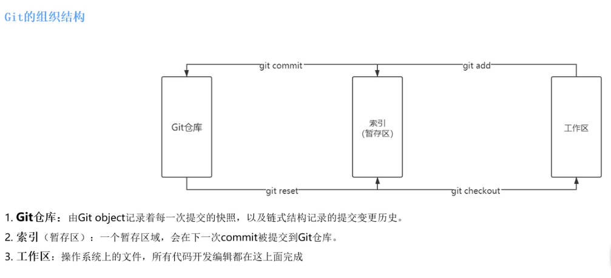

[TOC]


https://www.processon.com/view/link/5c6e2755e4b03334b523ffc3#map


# git原理

https://www.bilibili.com/video/BV1zf4y1L7qH

```cmd
git init
```

```cmd
.
└── .git
    ├── HEAD 当下编辑文件树的指针位置默认是指向这个文件 ref: refs/heads/master
    ├── branches 
    ├── config仓库[core]配置
    ├── description仓库描述文本
    ├── hooks这是一些例子文件脚本，bash文本脚本
    │   ├── applypatch-msg.sample
    │   ├── commit-msg.sample
    │   ├── fsmonitor-watchman.sample
    │   ├── post-update.sample
    │   ├── pre-applypatch.sample
    │   ├── pre-commit.sample
    │   ├── pre-merge-commit.sample
    │   ├── pre-push.sample
    │   ├── pre-rebase.sample
    │   ├── pre-receive.sample
    │   ├── prepare-commit-msg.sample
    │   └── update.sample
    ├── info
    │   └── exclude
    ├── objects
    │   ├── info
    │   └── pack
    └── refs
        ├── heads
        └── tags

```


```bash
$ echo "git init hellowrold" >hello1.txt
$ echo "git init PLCT" >hello2.txt
$ git add *.txt
```


会产生`objects`文件夹，其中分文件夹对应修改文档的哈希码标识



和[index二进制文件](https://mincong.io/2018/04/28/git-index/)，


```bash
git log --graph
$ git ls-files --stage
$ xxd -b -c 4 index # 二进制
$ xxd index # 16进制
```

Git 索引或 Git 缓存具有 3 个重要属性：

索引包含生成单个（唯一确定的）树对象所需的所有信息。
索引可以在它定义的树对象和工作树之间进行快速比较。
它可以有效地表示有关不同树对象之间合并冲突的信息，允许每个路径名与有关所涉及树的足够信息相关联，您可以在它们之间创建三向合并。


专门查看git/index的python命令行工具

https://github.com/sbp/gin.git

```
git cat-file [-t二进制文件打印类型] [-p打印内容]
$ git ls-files --stage
$ git cat-file -t c1a0每次add类型blob对象
$ git cat-file -p c1a0内容进行哈希得到哈希码。

```

```
$ git commit -m "tridu33 git commit"
```
在产生两文件夹，


# git在线学习

原本在英文文档最全，我直接编辑在中文文档位置顺便当作备忘录直接tldr命令可查询就行。

[TLDR本地git文档教程](file:///C:/Users/tridu33/AppData/Local/Packages/CanonicalGroupLimited.Ubuntu20.04onWindows_79rhkp1fndgsc/LocalState/rootfs/home/tridu33/.tldr/tldr/pages.es/common/)

实验楼类似的git实验学习平台


[本地代码存放位置](file:///D:\tridu33\git学习)


**在线学习**
https://learngitbranching.js.org/?locale=zh_CN

```bash
# 90%
git branch
git commit
git branch bugFix
git checkout bugFix
git commit bugFix
git merge bugFi
git checkout bugFix
git merge main
#
git rebase main
git checkout bugFix
git rebase bugFix
#HEAD
git checkout C1
git checkout main
git commit
git checkout C2

cat .git/HEAD
git symbolic-ref HEAD
# 
git log
^ # UP 1 record
~<num> # UP number step records like ^3"
git checkout main^
git checkout C3 
git checkout HEAD^
git checkout HEAD^
git checkout HEAD^
#
git checkout HEAD~4
git branch -f main HEAD~3
#
git reset
git revert

# 10%

git cherry-pick <hashed_number># copy some file into current HEAD
git cherry-pick C2 C4忽略中间调试过程的代码提交，。仅仅保留最终bugFix结果的分支文件到main主分支中。
#
git rebase --interactive/-i
git rebase -i HEAD~4
# 
fast-forward

#
git rebase -i 
git cherry-pick
```


具体任务代码：

```bash
# 
git branch nerwImage
git commit
git checkout newImage
git commit
git checkout -b bugFix
# 
git branch bugFix
git checkout bugFix
git commit
git checkout main # turn back to main
git commit
git merge bugFix

#
git checkout -b bugFix
git commit
git checkout main
git commit
git checkout bugFix 
git rebase main
#
git checkout bugFix^
# 

#
提交的技巧
newImage分支中提交，然后基于它做caption分支，现在又想修改newImage分支:
git rebase -i 调整提交排列顺序，把想要修改的分支提到最前面
git commit --amend进行小小修改
git rebase -i调整回来原本的顺序
最后main移动到最前端过git merge caption/git rebase caption main

#
git checkout main
git cherry-pick C2
git commit --amend
git cherry-pick C3

# 一波更新版本永远指向的某个标记符
git tag v1 C1
#
git describe <ref>缺省值HEAD
<tag距离ref最近的tagh>_<numCommits相差多少个提交记录>_g<hash提交记录哈希的前几位>。当ref本身有一个tag直接输出其本身标签名称。

git bisect一个查找产生bug的提交记录的指令
#
git describe main
git describe side

# 多分枝rebase整理为一条直线的提交目录
git rebase main bugFix
git rebase bugFix side
git rebase side another
git rebase another main

#
git checkout  main^
git checkout main^2
git checkout HEAD~;git checkout HEAD^2;git checkout HEAD~2
GIT CHECKOUT HEAD~^2~2
#

```


https://learngitbranching.js.org/

恢复 

本地分支reset远程分支revert


可以查看具体分支切换进行临时更改，如果想要就保存。

```
$ git checkout a65fe52ee
Note: switching to 'a65fe52ee'.

You are in 'detached HEAD' state. You can look around, make experimental
changes and commit them, and you can discard any commits you make in this
state without impacting any branches by switching back to a branch.

If you want to create a new branch to retain commits you create, you may
do so (now or later) by using -c with the switch command. Example:

  git switch -c <new-branch-name>

Or undo this operation with:

  git switch -

Turn off this advice by setting config variable advice.detachedHead to false
$ cat .git/HEAD
a65fe52ee2e06594e42561b53e82bcc189b03ae7


```
# github帮助文档


[https://help.github.com/en/github/](https://help.github.com/en/github/)


# github中文社区
https://www.githubs.cn


https://iwiki.woa.com/pages/viewpage.action?pageId=17506852
汇总

commit message https://www.ruanyifeng.com/blog/2016/01/commit_message_change_log.html


git flow、github flow或者gitlab flow

git常用问题解决
https://iwiki.woa.com/pages/viewpage.action?pageId=852497541


git工作流翻译系列文章图解 https://github.com/oldratlee/translations/blob/master/git-workflows-and-tutorials/pull-request.md


# git


https://www.bilibili.com/video/BV1FE411P7B3 kuangshenshuo

[狂神说git教程](https://mp.weixin.qq.com/s/Bf7uVhGiu47uOELjmC5uXQ)


# Git Hook  

https://segmentfault.com/a/1190000022970270


```cmd
java -jar lightning.jar --tapd 20428790 --author $author --gitfile $1
```


tapd是一个网站


http://tapd.oa.com/my_dashboard

[TAPD 是 Tencent Agile Product Development 的缩写，即腾讯敏捷产品研发平台，是公司内部唯一的研发协作平台。](https://km.woa.com/group/20683/articles/show/424688?sessionKey=ZiNJM9Ahk3B2VBqhoIZxhbeV0uY2qKUV)

https://km.woa.com/group/20683


# ssh
https://iwiki.woa.com/pages/viewpage.action?pageId=17695157
```cmd
ssh-keygen -t rsa -C "企业微信名@tencent.com"
```
C:\Users\weidukuang\.ssh


