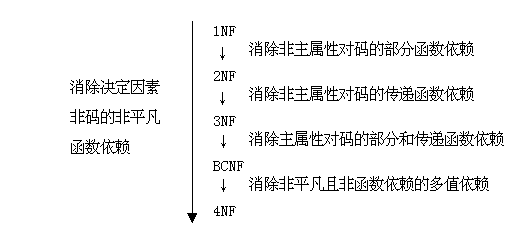

# 1. 自动ISM计算过程+数据库123BCNF范式+关系图表述=一个数据库的最小最精简映射最完整数据链接数据结构储存最精简的保存方式

https://www.zhihu.com/question/24696366

用ISM把1NF-->2NF-->3NF-->BCNF图的结构，从而形成对应的表格结构，最简表格结构

计算机自动化流程---数据库的范式123BCNF的模式分解？

[关系模式](https://www.baidu.com/s?wd=%E5%85%B3%E7%B3%BB%E6%A8%A1%E5%BC%8F&tn=SE_PcZhidaonwhc_ngpagmjz&rsv_dl=gh_pc_zhidao)的分解准则

关系模式的规范化过程是通过对关系模式的分解来实现的。把低一级的关系模式分解为若干个高一级的关系模式。这种分解不是唯一的。

  规范化的方式是进行模式分解，模式分解的原则是与原模式等价，模式分解的标准是：

模式分解具有无损连接性

模式分解能够保持函数依赖

 举例：关系规范化过程

第一范式（1NF）：如果一关系模式，它的每一个分量是不可分的数据项，即其域为简单域，则此关系模式为第一范式。

例：将学生简历及选课等[数据设计](https://www.baidu.com/s?wd=%E6%95%B0%E6%8D%AE%E8%AE%BE%E8%AE%A1&tn=SE_PcZhidaonwhc_ngpagmjz&rsv_dl=gh_pc_zhidao)成一个关系模式STUDENT， 其表示为：

STUDENT（SNO,SNAME,AGE,SEX,CLASS,DEPTNO,DEPTNAME,CNO,

CNAME,SCORE,CREDIT）

设该关系模式满足下列函数依赖：

F＝{SNO-->SNAME, SNO-->AGE, SNO-->SEX, SNO-->CLASS,CLASS-->DEPTNO,          DEPTNO-->DEPTNAME, CNO-->CNAME,SNO.CNO-->SCORE, CNO-->CREDIT}

由于该关系模式的每一属性对应的域为简单域，即其域值不可再分，符合第一范式定义，所以STUDENT关系模式为第一范式。

第二范式（2NF）：若关系模式R?1NF，且每个非主属性[完全函数依赖](https://www.baidu.com/s?wd=%E5%AE%8C%E5%85%A8%E5%87%BD%E6%95%B0%E4%BE%9D%E8%B5%96&tn=SE_PcZhidaonwhc_ngpagmjz&rsv_dl=gh_pc_zhidao)于码，则称R?2NF。

分析一下关系模式STUDENT， 它是不是2NF ？

属性组（SNO，CNO）为关系STUDENT的码。

例如：SNAME非主属性，根据码的特性具有：SNO.CNO??SNAME

根据STUDENT关系模式已知函数依赖集，下列函数依赖成立：SNO??SNAME

所以SNO.CNO??SNAME, SNAME对码是部分函数依赖。同样方法可得到除SCORE属性外，其它非主属性对码也都是部分函数依赖。所以STUDENT关系模式不是2NF。

当关系模式R是1NF而不是2NF的模式时，对应的关系有何问题呢？我们分析STUDENT关系模式，会有下列问题：

存在大量的冗余数据：当一个学生在学习多门课程后，他的人事信息重复出现多次。

根据关系模型完整性规则，主码属性值不能取空值。那么新生刚入学，还未选修课程时，该元组就不能插入该关系中。这种情况称为插入异常。

同样还有删除异常，则会丢失信息

解决上述问题方法是将大的模式分解成多个小的模式，分解后的模式可满足更高级的范式的要求。

[模式分解口诀和现有的算法https://blog.csdn.net/sumaliqinghua/article/details/86246762](https://blog.csdn.net/sumaliqinghua/article/details/86246762)

