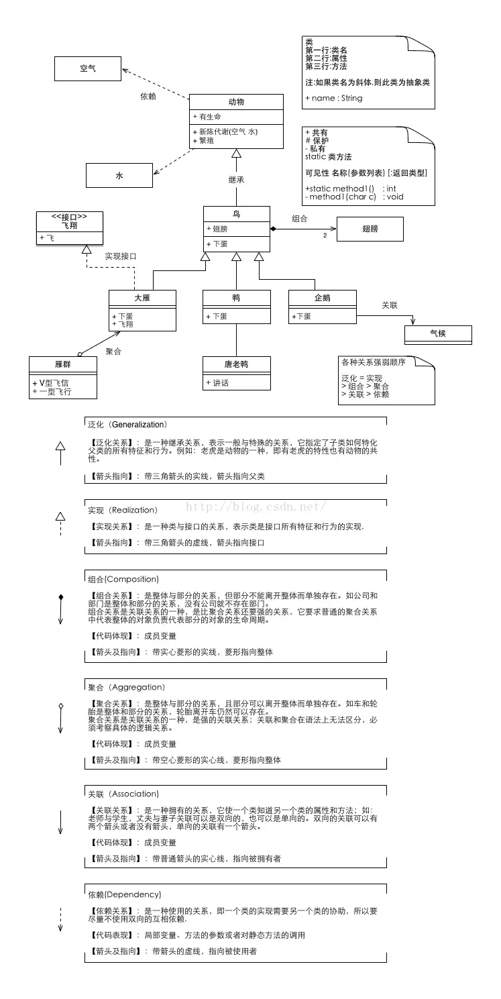

尚学堂——李腾飞老师的UML课程PPT
https://wenku.baidu.com/view/0f56d017cc7931b765ce1530.html

# 1. UML
有用吗
https://www.zhihu.com/question/23569835

是什么
https://www.cnblogs.com/jiangds/p/6596595.html

UML图分为用例视图、设计视图、进程视图、实现视图和拓扑视图，又可以静动分为静态视图和动态视图。静态图分为：用例图，类图，对象图，包图，构件图，部署图。动态图分为：状态图，活动图，协作图，序列图。
https://www.w3cschool.cn/uml_tutorial/uml_tutorial-c1gf28pd.html

虚线箭头指向依赖；

实线箭头指向关联；

虚线三角指向接口；

实线三角指向父类；

空心菱形能分离而独立存在，是聚合；

实心菱形精密关联不可分，是组合；

https://www.processon.com/

https://blog.csdn.net/weixin_33877885/article/details/85856560

1. 类（Class）：使用三层矩形框表示。   第一层显示类的名称，如果是抽象类，则就用斜体显示。   第二层是字段和属性。  第三层是类的方法。   注意前面的符号，‘+’表示public，‘-’表示private，‘#’表示protected。   
2. 接口：使用两层矩形框表示，与类图的区别主要是顶端有<<interface>>显示 。   第一行是接口名称。  第二行是接口方法。     
3. 继承类（extends） ：用空心三角形+实线来表示。     
4. 实现接口（implements） ：用空心三角形+虚线来表示    
5. 关联（Association） ：用实线箭头来表示，例如：燕子与气候   
6. 聚合（Aggregation） ：用空心的菱形+实线箭头来表示   聚合：表示一种弱的‘拥有’关系，体现的是A对象可以包含B对象，但B对象不是A对象的一部分，例如： 公司和员工     
7.组合（Composition）：用实心的菱形+实线箭头来表示  组合：部分和整体的关系，并且生命周期是相同的。例如：人与手     
8. 依赖（Dependency） ：用虚线箭头来表示，例如：动物与氧气     
9. 基数 ：连线两端的数字表明这一端的类可以有几个实例，比如：一个鸟应该有两只翅膀。如果一个类 可能有无数个实例，则就用‘n’来表示。关联、聚合、组合是有基数的。 

类之间的关系     UML把类之间的关系分为以下5种.    

    ● 关联：类A与类B的实例之间存在特定的对应关系    
    ● 依赖：类A访问类B提供的服务     
    ● 聚集：类A为整体类，类B为局部类，类A的对象由类B的对象组合而成    
    ● 泛化：类A继承类B    
    ● 实现：类A实现了B接口   关联（Association）    

