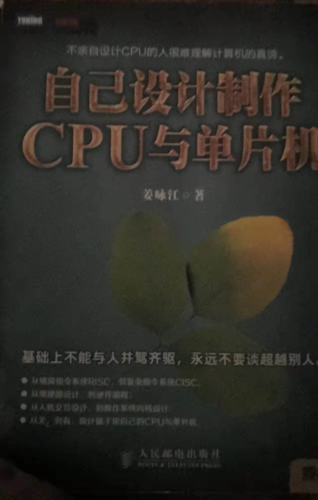
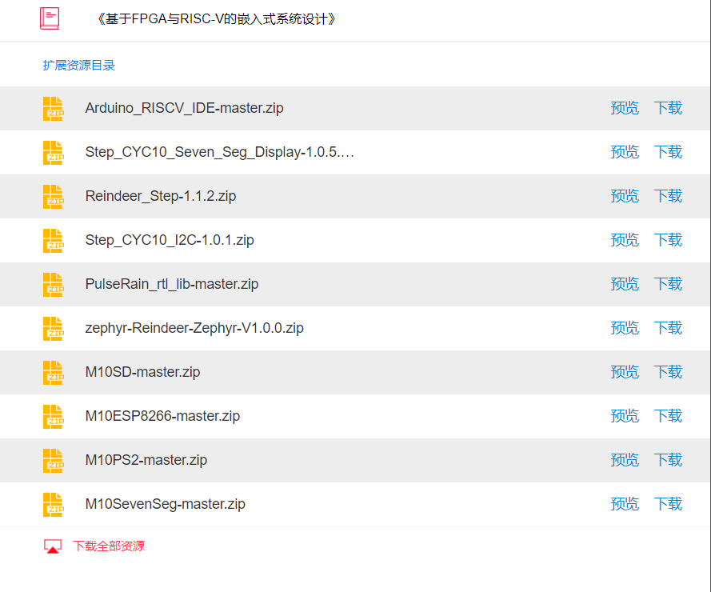

FPGA Risc-v Audiono Make

基于FPGA 写 Risc-v 指令集的CPU，然后开源之上建立Audiono编程,Make管理代码

# 基于FPGA与Risc-v的嵌入式系统设计

https://www.eet-china.com/mp/a13323.html
基于fpga与risc-v的嵌入式系统设计  https://www.eet-china.com/mp/a12316.html
了解更多的关于RISC V在FPGA上的移植和嵌入式应用，可以参考硬禾学堂联合清华大学出版社推出的“基于FPGA与RISC-V的嵌入式系统设计”教程，本书作者为RISCV基金会发起的Soft CPU 2019年度的冠军。

适用step Altera Cyclone10 小脚丫FPGA开发版核心板初学者入门学习板 STEP CYC10

Altera Cyclone10 STEP小脚丫FPGA开发板10CL016核心板移植RISC-V

https://www.stepfpga.com/

 

安装示例博客 https://blog.csdn.net/qq_27158179/article/details/114446246

如果我买随书芯片
STEP-CYC10
 https://www.stepfpga.com/doc/step-cyc10
 
的话，

看到这款一步到位的比较全面的开发版:

https://www.stepfpga.com/doc/step-baseboard
更全面点的第二块开发版，没经过作者测试，没做兼容之类的，怕到时候做实验会有搞不定的bug出现，还是买随书芯片

小脚丫群文件

官网文档：
http://www.stepfpga.com/doc/
网盘资料：网盘中包含：软硬件手册、例程源码、原理图和工具软件等
STEP-MAX10 (Intel MAX10 FPGA)：https://pan.baidu.com/s/1guMNzIYx2Q4sUGhQ1pSUvg
STEP_MXO2 (Lattice MXO2 FPGA)：链接:https://pan.baidu.com/s/11iIyV7EqUJo99JAZj0GKwQ 提取码:yaic
STEP_CYC10 (Intel Cyclone10 FPGA)：
https://pan.baidu.com/s/19B7H6_ElWyLsxiSMaLaSDw
扩展底板：https://pan.baidu.com/s/1FAic4gvn1d9p_THjdnpTAQ 提取码: jevy
工具软件：链接: https://pan.baidu.com/s/1m4C9wIrXYewhHyte5HM5mA 提取码: mvux

 随书芯片
STEP-CYC10
 https://www.stepfpga.com/doc/step-cyc10

 这款一步到位:
https://www.stepfpga.com/doc/step-baseboard
 
https://www.zhihu.com/question/417138952
 
我比较新手，想请问如果想在一个fpga开发版上烧录linux系统，需要什么配置要求吗?
https://www.zhihu.com/answer/132169181
这里教我需要提前在fpga写个软核

https://www.stepfpga.com/doc/step-cyc10
  
---------------------

应该能fpga烧写一个软核risc-v 。NIOS II(FPGA 软核)
Build your own RISC-V architecture on FPGA - ModernHackers.com
modernhackers.com/build-your-own-risc-v-architecture-on-fpga

-------------------

然后基于risc-v的指令集上的linux http://cdimage.ubuntu.com/ubuntu-base/releases/20.04/release/ubuntu-base-20.04.2-base-riscv64.tar.gz

估计就能搭上去

首个9.9刀全开源一体化的 RISC-V Linux 小板子麻雀/MangoPi-MQ1，既小巧又精致！ - 芒果派的文章 - 知乎
https://zhuanlan.zhihu.com/p/425925898

这个相当于Linux Lab里头的一块虚拟开发板（比如riscb64/virt）或者真实开发板（比如ebf-imx6ull），Linux Lab主要是提供开发环境。支持了20款左右的虚拟开发板，也适配了野火的真实开发板，这个群最早是为了适配RISC-V D1的，目前2022.03.21还没适配完。另外，咱们本次活动得到了 PLCT 实验室的大力支持，PLCT 实验室目前正在开展RISC-V 周边技术的推进，其中有一个活动就是对主流 Linux 发行版的 RISC-V 进行开发适配，目前正在如火如荼开展，感兴趣的同学可以关注一下这个活动。

中科院软件所（ISCAS）智能软件研究中心（ISRC）在2021年开始孵化 Tarsier Project。 Tarsier Project 的目标是促进主流 Linux 发行版（包括 Debian/Ubuntu、Fedora、Arch Linux、Gentoo、openEuler 等）对于 RISC-V 平台的支持，达到或超过 AArch64 平台的支持程度。具体分成了以下几个不同的方面：

Tarsier Team

眼镜猴团队（Tarsier Team）成立于2021年末，承担着软件所 Tarsier Project 所需的各项具体工作。2022年的眼镜猴团队将会从开源操作系统的集成和测试切入，组建超过300名全职、兼职、实习生和志愿者组成的测试小队，为 RISC-V 软件生态系统提供更为全面的质量保证和现状摸底。

欢迎所有对 RISC-V 以及开源工作感兴趣的小伙伴加入我们。随时可以发邮件到 "吴伟 wuwei2016@iscas.ac.cn" 询问。

## code

看  PulseRainTechnology 公司的 github
 
https://github.com/orgs/PulseRain/repositories
https://github.com/PulseRain

包括：

https://github.com/PulseRain/Arduino_RISCV_IDE

https://github.com/PulseRain/PulseRain_rtl_lib

https://github.com/PulseRain/Step_CYC10_I2C
https://github.com/PulseRain/Reindeer_Step

https://github.com/PulseRain/zephyr

https://github.com/PulseRain/M10LCD

https://github.com/PulseRain/M10DTMF

https://github.com/PulseRain/M10ESP8266

https://github.com/PulseRain/M10_high_speed_config_software

https://github.com/PulseRain/Reindeer_MachXO3D

https://github.com/PulseRain/M10MISC

https://github.com/PulseRain/M10CODEC

https://github.com/PulseRain/M10I2C

https://github.com/PulseRain/M10JTAG

https://github.com/PulseRain/M10PWM

https://github.com/PulseRain/M10Examples

https://github.com/PulseRain/M10_PCB

https://github.com/PulseRain/M10PS2

https://github.com/PulseRain/PulseRain_FP51_MCU

