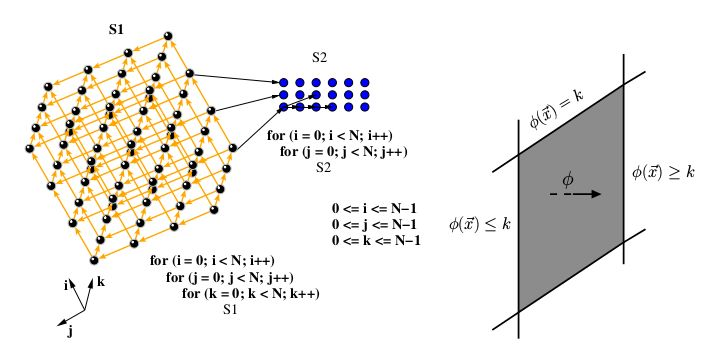

# 编译器领域的多面体模型（Polyhderal Model）

https://blog.csdn.net/free1993/article/details/116994991

同系列文章参考
图层面的技术
神经网络编译器图层面IR
神经网络编译器-常量折叠
神经网络编译器优化-死代码消除

算子层面的技术
Halide-based IR和 Polyhedral-based IR简介
后端优化技术loop transformation
神经网络编译器的Tensor优化：auto tune和auto schedule

神经网络的加速
神经网络的加速技术
神经网络稀疏性调研
神经网络中矩阵稀疏性的编码方式

多面体模型
多面体模型系列一
多面体模型系列二

https://en.wikipedia.org/wiki/Polytope_model

编译器领域的多面体模型（Polyhderal Model） - 立交桥跳水冠军的文章 - 知乎
https://zhuanlan.zhihu.com/p/310142893

 要术甲杰 Jie Zhao，AKG第一作者本人
 总结了三篇很详细的多面体优化的文章
深度学习编译器有哪些有价值的研究方向和参考文献？ - 要术甲杰的回答 - 知乎
https://www.zhihu.com/question/338039895/answer/839949892 

 

----------------------------------

深度学习编译生态围绕着四类抽象展开:

计算图表示(computational graph)：计算图可以把深度学习程序表示成DAG，然后进行类似于算子融合，改写，并行等高级优化。Relay, XLA, Torch-MLIR，ONXX 等基本都在这一级别。

张量程序表示(tensor program): 在这个级别我们需要对子图进行循环优化，对于DSA支持还要包含张量化和内存搬移的优化。

算子库和运行环境(library and runtime): 算子库本身依然是我们快速引入专家输入优化性能的方式。同时运行环境快速支持数据结构运行库。

硬件专用指令 (hardware primitive) ：专用硬件和可编程深度学习加速器也引入了我们专用硬件张量指令的需求。

多面体模型最关注的（可能也是唯一关注的）就是循环的优化。因此对于多面体模型，它只会把一段段程序当成一堆嵌套循环，至于循环里面的内容他是不大关心的。因此在整个框架中，重要的概念只有4个：Domain，instance，dependency和schedule

- Statement与Instance:
接触过编译器的同学知道Instruction或者Statement，代表一行代码。而在循环中的代码，每被执行一次，就会对应到一个instance上图的程序里有两个statement（即S1和S2），每个Stmt的每次执行都是一个Instance，在上面的例子中，有S1和S2两个Stmt，S1被执行了N×N次，S2被执行了N×N次，因此总共有2×N×N个instance​

- Domain:
对于一个N重循环，每个instance对应的循环可以被表示成一个长度为N的vector。而所有可能的vector的集合就是Domain。

比如上面的例子，对于S1来说，它的domain就是{(0,0), (0,1)....(0,N-1)....(N-1, N-1)}

每个Statement都有自己的Domain

- Dependency：
我们都知道程序的语句之间会有数据依赖（读写依赖，写写依赖，写读依赖），我们做优化也要遵守这些约束，不然程序快是快了，结果不对，也没用

和Domain的定义类似，dependency也可以用一个仿射变换的不等式表达

dependency是两个Stmt之间的，不是instance之间

多面体优化

当我们把程序（源代码）转换成多面体模型（就是把Domain，dependency这些信息提取出来）后，我们可以通过数学上的分析将代码做优化。整个多面体优化有各种各样的研究针对于运用这些数据提升代码性能。本文只是一个最基础的概述，自然不能覆盖到所有的。因此这里面只举两个最基础的例子

