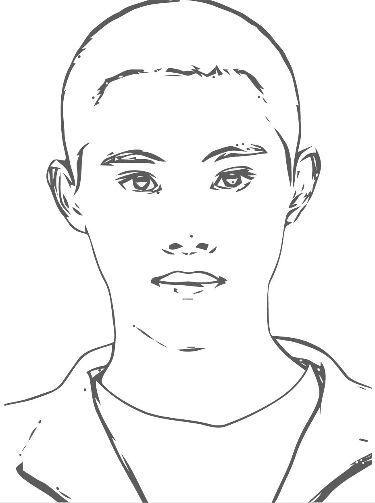

code-examples.net/zh-CN/q/dfefc9

support.typora.io/Resize-Image/

# 插入图片设置带大小和旋转

直接在图片后面加上对应的CSS样式即可


```
{:class="img-responsive"}
{:height="50%" width="50%"}
{:height="100px" width="400px"}
```


不能用


链接：https://www.zhihu.com/question/23378396/answer/234858357


---------------------------


大小

```

```


img标签

```

```

指定缩放比例

```

```


--------------------


居中：

```
<div  align="center">    

</div>
```

<div  align="center">    

</div>

img标签设置宽度和高度


宽度


```

```


高度


不好使：

 


-------------------------


原图：


