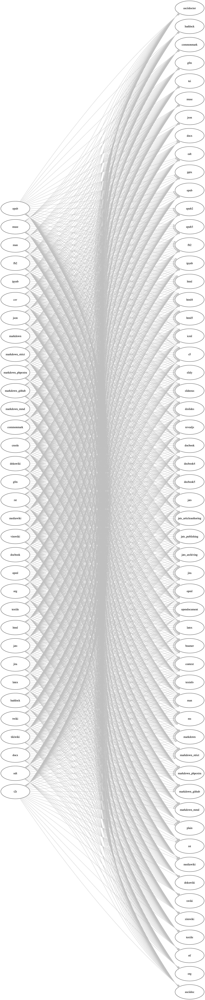

# 1. help


如果需要查看全部支持的转换格式，见[【参考1】](http://www.pandoc.org/diagram.jpg)




```
 pandoc [options] [input-file]...
```


<table border="0" style="border: 1px solid rgb(192, 192, 192); border-collapse: collapse; word-break: break-word; display: block; overflow-x: scroll; width: auto !important; height: auto !important; color: rgb(75, 75, 75); font-family: &quot;PingFang SC&quot;, &quot;Helvetica Neue&quot;, Helvetica, Arial, sans-serif; font-size: 13px; font-style: normal; font-variant-ligatures: normal; font-variant-caps: normal; font-weight: 400; letter-spacing: normal; orphans: 2; text-align: start; text-indent: 0px; text-transform: none; white-space: normal; widows: 2; word-spacing: 0px; -webkit-text-stroke-width: 0px; background-color: rgb(255, 255, 255); text-decoration-style: initial; text-decoration-color: initial;"><tbody valign="top"><tr style="background: rgb(231, 230, 230);"><td style="font-size: 12px; color: rgb(69, 69, 69); font-family: Verdana, Geneva, Arial, Helvetica, sans-serif; border: 0.5pt solid; border-collapse: collapse; padding: 8px 11px; min-width: 50px; white-space: nowrap;"><p style="line-height: 1.5; margin: 10px auto; text-indent: 0px;">选项</p></td><td style="font-size: 12px; color: rgb(69, 69, 69); font-family: Verdana, Geneva, Arial, Helvetica, sans-serif; border-top: 0.5pt solid; border-right: 0.5pt solid; border-bottom: 0.5pt solid; border-left: none; border-image: initial; border-collapse: collapse; padding: 8px 11px; min-width: 50px; white-space: nowrap;"><p style="line-height: 1.5; margin: 10px auto; text-indent: 0px;">含义</p></td></tr><tr><td style="font-size: 12px; color: rgb(69, 69, 69); font-family: Verdana, Geneva, Arial, Helvetica, sans-serif; border-top: none; border-right: 0.5pt solid; border-bottom: 0.5pt solid; border-left: 0.5pt solid; border-image: initial; border-collapse: collapse; padding: 8px 11px; min-width: 50px; white-space: nowrap;"><p style="line-height: 1.5; margin: 10px auto; text-indent: 0px;">-f FORMAT, -r FORMAT,</p><p style="line-height: 1.5; margin: 10px auto; text-indent: 0px;">--from=FORMAT, --read=FORMAT</p></td><td style="font-size: 12px; color: rgb(69, 69, 69); font-family: Verdana, Geneva, Arial, Helvetica, sans-serif; border-top: none; border-right: 0.5pt solid; border-bottom: 0.5pt solid; border-left: none; border-image: initial; border-collapse: collapse; padding: 8px 11px; min-width: 50px; white-space: nowrap;"><p style="line-height: 1.5; margin: 10px auto; text-indent: 0px;">指定输入文件的格式，若不指定，pandoc可以从明显的文件后缀名中推测，若无明显提示，默认的输入文件格式是markdown，默认的输出文件格式是html</p></td></tr><tr><td style="font-size: 12px; color: rgb(69, 69, 69); font-family: Verdana, Geneva, Arial, Helvetica, sans-serif; border-top: none; border-right: 0.5pt solid; border-bottom: 0.5pt solid; border-left: 0.5pt solid; border-image: initial; border-collapse: collapse; padding: 8px 11px; min-width: 50px; white-space: nowrap;"><p style="line-height: 1.5; margin: 10px auto; text-indent: 0px;">-t FORMAT, -w FORMAT,</p><p style="line-height: 1.5; margin: 10px auto; text-indent: 0px;">--to=FORMAT, --write=FORMAT</p></td><td style="font-size: 12px; color: rgb(69, 69, 69); font-family: Verdana, Geneva, Arial, Helvetica, sans-serif; border-top: none; border-right: 0.5pt solid; border-bottom: 0.5pt solid; border-left: none; border-image: initial; border-collapse: collapse; padding: 8px 11px; min-width: 50px; white-space: nowrap;"><p style="line-height: 1.5; margin: 10px auto; text-indent: 0px;">指定输出文件的格式</p></td></tr><tr><td style="font-size: 12px; color: rgb(69, 69, 69); font-family: Verdana, Geneva, Arial, Helvetica, sans-serif; border-top: none; border-right: 0.5pt solid; border-bottom: 0.5pt solid; border-left: 0.5pt solid; border-image: initial; border-collapse: collapse; padding: 8px 11px; min-width: 50px; white-space: nowrap;"><p style="line-height: 1.5; margin: 10px auto; text-indent: 0px;">-o FILE, --output=FILE</p></td><td style="font-size: 12px; color: rgb(69, 69, 69); font-family: Verdana, Geneva, Arial, Helvetica, sans-serif; border-top: none; border-right: 0.5pt solid; border-bottom: 0.5pt solid; border-left: none; border-image: initial; border-collapse: collapse; padding: 8px 11px; min-width: 50px; white-space: nowrap;"><p style="line-height: 1.5; margin: 10px auto; text-indent: 0px;">写输出到FILE文件而不是到标准输出</p></td></tr><tr><td style="font-size: 12px; color: rgb(69, 69, 69); font-family: Verdana, Geneva, Arial, Helvetica, sans-serif; border-top: none; border-right: 0.5pt solid; border-bottom: 0.5pt solid; border-left: 0.5pt solid; border-image: initial; border-collapse: collapse; padding: 8px 11px; min-width: 50px; white-space: nowrap;"><p style="line-height: 1.5; margin: 10px auto; text-indent: 0px;">--list-input-formats</p></td><td style="font-size: 12px; color: rgb(69, 69, 69); font-family: Verdana, Geneva, Arial, Helvetica, sans-serif; border-top: none; border-right: 0.5pt solid; border-bottom: 0.5pt solid; border-left: none; border-image: initial; border-collapse: collapse; padding: 8px 11px; min-width: 50px; white-space: nowrap;"><p style="line-height: 1.5; margin: 10px auto; text-indent: 0px;">列出支持的输入文件格式</p></td></tr><tr><td style="font-size: 12px; color: rgb(69, 69, 69); font-family: Verdana, Geneva, Arial, Helvetica, sans-serif; border-top: none; border-right: 0.5pt solid; border-bottom: 0.5pt solid; border-left: 0.5pt solid; border-image: initial; border-collapse: collapse; padding: 8px 11px; min-width: 50px; white-space: nowrap;"><p style="line-height: 1.5; margin: 10px auto; text-indent: 0px;">--list-output-formats</p></td><td style="font-size: 12px; color: rgb(69, 69, 69); font-family: Verdana, Geneva, Arial, Helvetica, sans-serif; border-top: none; border-right: 0.5pt solid; border-bottom: 0.5pt solid; border-left: none; border-image: initial; border-collapse: collapse; padding: 8px 11px; min-width: 50px; white-space: nowrap;"><p style="line-height: 1.5; margin: 10px auto; text-indent: 0px;">列出支持的输出文件格式</p></td></tr><tr><td style="font-size: 12px; color: rgb(69, 69, 69); font-family: Verdana, Geneva, Arial, Helvetica, sans-serif; border-top: none; border-right: 0.5pt solid; border-bottom: 0.5pt solid; border-left: 0.5pt solid; border-image: initial; border-collapse: collapse; padding: 8px 11px; min-width: 50px; white-space: nowrap;"><p style="line-height: 1.5; margin: 10px auto; text-indent: 0px;">--list-extensions</p></td><td style="font-size: 12px; color: rgb(69, 69, 69); font-family: Verdana, Geneva, Arial, Helvetica, sans-serif; border-top: none; border-right: 0.5pt solid; border-bottom: 0.5pt solid; border-left: none; border-image: initial; border-collapse: collapse; padding: 8px 11px; min-width: 50px; white-space: nowrap;"><p style="line-height: 1.5; margin: 10px auto; text-indent: 0px;">列出支持的markdown扩展，+代表默认支持，-代表默认不支持</p></td></tr><tr><td style="font-size: 12px; color: rgb(69, 69, 69); font-family: Verdana, Geneva, Arial, Helvetica, sans-serif; border-top: none; border-right: 0.5pt solid; border-bottom: 0.5pt solid; border-left: 0.5pt solid; border-image: initial; border-collapse: collapse; padding: 8px 11px; min-width: 50px; white-space: nowrap;"><p style="line-height: 1.5; margin: 10px auto; text-indent: 0px;">-s, --standalone</p></td><td style="font-size: 12px; color: rgb(69, 69, 69); font-family: Verdana, Geneva, Arial, Helvetica, sans-serif; border-top: none; border-right: 0.5pt solid; border-bottom: 0.5pt solid; border-left: none; border-image: initial; border-collapse: collapse; padding: 8px 11px; min-width: 50px; white-space: nowrap;"><p style="line-height: 1.5; margin: 10px auto; text-indent: 0px;">产生输出文件时附带适当的头注和脚注（比如html）</p></td></tr></tbody></table>


读：Markdown，rST子集，HTML和LaTeX。
写：纯文本，Markdown，rST，HTML，LaTeX，ConTeXt，RTF，DocBook XML，OpenDocument XML，ODT，GNU Texinfo，MediaWiki标记，groff man pages，EPUB电子书，和S5以及Slidy格式的HTML幻灯片。附带脚本markdown2pdf可以将Markdown通过转为LaTeX而输出到PDF。[写作工具的取经之路](https://www.bookstack.cn/read/mba811-Writing/Pandoc-03.md#reStructuredText)


see the output created by each of the commands below, click on the name of the output file:

1.  HTML fragment:
    
    pandoc README -o example1.html
    

1.  Standalone HTML file:
    
    pandoc -s README -o example2.html
    

1.  HTML with smart quotes, table of contents, CSS, and custom footer:
    
    pandoc -s -S —toc -c pandoc.css -A footer.html README -o example3.html
    

1.  LaTeX:
    
    pandoc -s README -o example4.tex
    

1.  From LaTeX to markdown:
    
    pandoc -s example4.tex -o example5.text
    

1.  reStructuredText:
    
    pandoc -s -w rst —toc README -o example6.text
    

1.  Rich text format (RTF):
    
    pandoc -s README -o example7.rtf
    

1.  Beamer slide show:
    
    pandoc -t beamer SLIDES -o example8.pdf
    

1.  DocBook XML:
    
    pandoc -s -S -w docbook README -o example9.db
    

Chunked XHTML via DocBook and [xmlto](http://cyberelk.net/tim/xmlto/):

1.  `xmlto xhtml -m config.xsl example9.db -o example9/`

1.  Man page:
    
    pandoc -s -w man pandoc.1.md -o example10.1
    

1.  ConTeXt:
    
    pandoc -s -w context README -o example11.tex
    

PDF via pandoc and ConTeXt’s `texexec`:

1.  `texexec --pdf example11.tex # produces example11.pdf`

1.  Converting a web page to markdown:
    
    pandoc -s -r html [http://www.gnu.org/software/make/](http://www.gnu.org/software/make/) -o example12.text
    

1.  From markdown to PDF:
    
    pandoc README -o example13.pdf
    

1.  PDF with numbered sections and a custom LaTeX header:
    
    pandoc -N —template=mytemplate.tex —variable version=1.9 README —latex-engine=xelatex —toc -o example14.pdf
    

1.  A wiki program using [Happstack](http://happstack.com/) and pandoc: [gitit](http://gitit.net/)
    
2.  HTML slide shows:
    
    pandoc -s —mathml -i -t dzslides SLIDES -o example14a.html
    
    pandoc -s —webtex -i -t slidy SLIDES -o example14b.html
    
    pandoc -s —webtex -i -t s5 SLIDES -o example14c.html
    

1.  TeX math in HTML:
    
    pandoc math.text -s -o mathDefault.html
    
    pandoc math.text -s —mathml -o mathMathML.html
    
    pandoc math.text -s —webtex -o mathWebTeX.html
    
    pandoc math.text -s —mathjax -o mathMathJax.html
    
    pandoc math.text -s —latexmathml -o mathLaTeXMathML.html
    

1.  Syntax highlighting of delimited code blocks:
    
    pandoc code.text -s —highlight-style pygments -o example18a.html
    
    pandoc code.text -s —highlight-style kate -o example18b.html
    
    pandoc code.text -s —highlight-style monochrome -o example18c.html
    
    pandoc code.text -s —highlight-style espresso -o example18d.html
    
    pandoc code.text -s —highlight-style haddock -o example18e.html
    
    pandoc code.text -s —highlight-style tango -o example18f.html
    

1.  GNU Texinfo, converted to info, HTML, and PDF formats:
    
    pandoc README -s -o example19.texi
    
    makeinfo example19.texi -o example19.info
    
    makeinfo example19.texi —html -o example19
    
    texi2pdf example19.texi # produces example19.pdf
    

1.  OpenDocument XML:
    
    pandoc README -s -w opendocument -o example20.xml
    

1.  ODT (OpenDocument Text, readable by OpenOffice):
    
    pandoc README -o example21.odt
    

1.  MediaWiki markup:
    
    pandoc -s -S -w mediawiki —toc README -o example22.wiki
    

1.  EPUB ebook:
    
    pandoc -S README -o README.epub
    

1.  Markdown citations:
    
    pandoc -s -S —biblio biblio.bib —csl chicago-author-date.csl CITATIONS -o example24a.html
    
    pandoc -s -S —biblio biblio.bib —csl mhra.csl CITATIONS -o example24b.html
    
    pandoc -s -S —biblio biblio.bib —csl ieee.csl CITATIONS -t man -o example24c.1
    

1.  Textile writer:
    
    pandoc -s -S README -t textile -o example25.textile
    

1.  Textile reader:
    
    pandoc -s -S example25.textile -f textile -t html -o example26.html
    

1.  Org-mode:
    
    pandoc -s -S README -o example26.org
    

1.  AsciiDoc:
    
    pandoc -s -S README -t asciidoc -o example27.txt
    

1.  Word docx:
    
    pandoc -s -S README -o example28.docx
    

1.  LaTeX math to docx:
    
    pandoc -s math.tex -o example29.docx


[https://pandoc.org/](https://pandoc.org/)


```


(base) PS C:\Users\admin\> pandoc --help
pandoc.exe [OPTIONS] [FILES]
  -f FORMAT, -r FORMAT  --from=FORMAT, --read=FORMAT
  -t FORMAT, -w FORMAT  --to=FORMAT, --write=FORMAT
  -o FILE               --output=FILE
                        --data-dir=DIRECTORY
                        --base-header-level=NUMBER
                        --strip-empty-paragraphs
                        --indented-code-classes=STRING
  -F PROGRAM            --filter=PROGRAM
                        --lua-filter=SCRIPTPATH
  -p                    --preserve-tabs
                        --tab-stop=NUMBER
                        --track-changes=accept|reject|all
                        --file-scope
                        --extract-media=PATH
  -s                    --standalone
                        --template=FILE
  -M KEY[:VALUE]        --metadata=KEY[:VALUE]
  -V KEY[:VALUE]        --variable=KEY[:VALUE]
  -D FORMAT             --print-default-template=FORMAT
                        --print-default-data-file=FILE
                        --print-highlight-style=STYLE|FILE
                        --dpi=NUMBER
                        --eol=crlf|lf|native
                        --wrap=auto|none|preserve
                        --columns=NUMBER
                        --strip-comments
                        --toc, --table-of-contents
                        --toc-depth=NUMBER
                        --no-highlight
                        --highlight-style=STYLE|FILE
                        --syntax-definition=FILE
  -H FILE               --include-in-header=FILE
  -B FILE               --include-before-body=FILE
  -A FILE               --include-after-body=FILE
                        --resource-path=SEARCHPATH
                        --request-header=NAME:VALUE
                        --self-contained
                        --html-q-tags
                        --ascii
                        --reference-links
                        --reference-location=block|section|document
                        --atx-headers
                        --top-level-division=section|chapter|part
  -N                    --number-sections
                        --number-offset=NUMBERS
                        --listings
  -i                    --incremental
                        --slide-level=NUMBER
                        --section-divs
                        --default-image-extension=extension
                        --email-obfuscation=none|javascript|references
                        --id-prefix=STRING
  -T STRING             --title-prefix=STRING
  -c URL                --css=URL
                        --reference-doc=FILE
                        --epub-subdirectory=DIRNAME
                        --epub-cover-image=FILE
                        --epub-metadata=FILE
                        --epub-embed-font=FILE
                        --epub-chapter-level=NUMBER
                        --pdf-engine=PROGRAM
                        --pdf-engine-opt=STRING
                        --bibliography=FILE
                        --csl=FILE
                        --citation-abbreviations=FILE
                        --natbib
                        --biblatex
                        --mathml
                        --webtex[=URL]
                        --mathjax[=URL]
                        --katex[=URL]
                        --gladtex
                        --abbreviations=FILE
                        --trace
                        --dump-args
                        --ignore-args
                        --verbose
                        --quiet
                        --fail-if-warnings
                        --log=FILE
                        --bash-completion
                        --list-input-formats
                        --list-output-formats
                        --list-extensions[=FORMAT]
                        --list-highlight-languages
                        --list-highlight-styles
  -v                    --version
  -h                    --help


```


