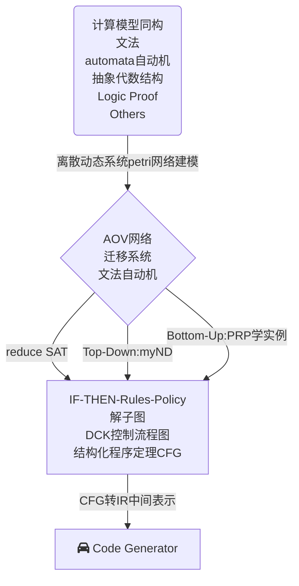

# 1. Font Awesome icons

fa:

https://fontawesome.com/v4.7.0/examples/

```mermaid
graph TD
    A(计算模型同构<br>文法<br>automata自动机<br>抽象代数结构<br>Logic Proof<br>Others ) -->|离散动态系统petri网络建模| B{AOV网络<br>迁移系统<br>文法自动机}
    B -->|reduce SAT| D[IF-THEN-Rules-Policy<br>解子图<br>DCK控制流程图<br>结构化程序定理CFG]
    B -->|Top-Down:myND| D
    B -->|Bottom-Up:PRP学实例| D
    D -->|CFG转IR中间表示| C[fa:fa-car Code Generator]
```

其中fa:fa-car就是符号

