[TOC]

# PlantUML
[本文内容](blog.csdn.net/world_ding/article/details/102717551)完全参照plantuml官方文档，也可移步
[官方中文文档](http://plantuml.com/zh/index)查看。

[语雀文档](https://www.yuque.com/yuque/help/editor-puml)


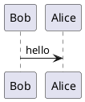

# 一、PlantUML简单介绍


PlantUML是一个开源项目，支持快速绘制：

-   [时序图(Sequence diagram)](http://plantuml.com/zh/sequence-diagram)
-   [用例图(Usecase diagram)](http://plantuml.com/zh/use-case-diagram)
-   [类图(Class diagram)](http://plantuml.com/zh/class-diagram)
-   [流程图(Activity diagram)](http://plantuml.com/zh/activity-diagram-beta) 【[旧版语法](http://plantuml.com/zh/activity-diagram-legacy)在此处】
-   [组件图(Compont diagram)](http://plantuml.com/zh/component-diagram)
-   [状态图(State diagram)](http://plantuml.com/zh/state-diagram)
-   [对象图(Object diagram)](http://plantuml.com/zh/object-diagram)
-   [部署图(Deployment diagram)](http://plantuml.com/zh/deployment-diagram)
-   [定时图(Timing diagram)](http://plantuml.com/zh/timing-diagram)

同时还支持以下非UML图:

-   [线框图形界面](http://plantuml.com/zh/salt)
-   [架构图](http://plantuml.com/zh/archimate-diagram)
-   [规范和描述语言 (SDL)](http://plantuml.com/zh/activity-diagram-beta#sdl)
-   [Ditaa diagram](http://plantuml.com/zh/ditaa)
-   [甘特图](http://plantuml.com/zh/gantt-diagram)
-   [思维导图](http://plantuml.com/zh/mindmap-diagram)
-   [Work Breakdown Structure diagram](http://plantuml.com/zh/wbs-diagram)
-   [以 AsciiMath 或 JLaTeXMath 符号的数学公式](http://plantuml.com/zh/ascii-math)
-   [Entity Relationship diagram](http://plantuml.com/zh/ie-diagram)

通过简单直观的语言来定义这些示意图。  
新用户可以阅读快速开始. 也可以看看常见问题回答. 很多其他工具在使用 PlantUML.  
可以生成PNG, SVG 或 LaTeX 格式的图片. 也可以生成 ASCII艺术图 (只针对时序图).

 在线生成: [http://www.plantuml.com/plantuml/uml/](http://www.plantuml.com/plantuml/uml/)


开源工具---使用简单的文字描述画UML图之PlantUML官网：http://plantuml.com
PlantUML 支持的工具：http://plantuml.com/running
PlantUML语言参考手册中文版.pdf：http://download.csdn.net/download/freeking101/9917766
PlantUML编辑器(PlantUML QEditor )下载地址：http://www.uzzf.com/soft/86177.html
程序员绘图工具-Plantuml  jianshu.com/p/30f6a9c06083


## PlantUML语言参考手册中文版.pdf 
jianshu.com/p/30f6a9c06083 程序员绘图工具-Plantuml

https://www.yuque.com/yuque/help/editor-puml 语雀
 
小书匠语法说明之plantuml http://soft.xiaoshujiang.com/docs/grammar/feature/plantuml/


```cmd
dot  D:\test\\1.gv  -Tpng  -o  image.png

```


你可以用->来绘制参与者之间传递的消息， 而不必显式地声明参与者。
你也可以使用 --> 绘制一个虚线箭头。

另外，你还能用 <- 和 <–，这不影响绘图，但可以提高可读性。 注意：仅适用于时序图，对于其它示意图，规则是不同的。


 声明参与者

声明参与者使用的关键字(*不区分大小写*)

-   participant
-   Actor
-   Boundary
-   DataBase
-   control
-   Entity

*您可以使用关键字 order自定义顺序来打印参与者。这里测试不能和color同时设置,如下所示的代码会报错，As L后面color和order不能同时出现。*


### 使用非字母符号
需要使用双引号，单引号测试不成功。注意这里括号是非字母符号

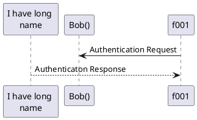


### *箭头的样式：*

-   表示一条丢失的消息，末尾加x
-   箭头只有上半部分或者下半部分：将<和>替换成\\或者 /
-   虚线箭头：用 – 替代 -
-   箭头末尾加圈：->o
-   双向箭头：<->
-   细箭头：将箭头标记写两次 (如 >\> 或 //)

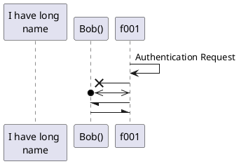

### 修改箭头颜色

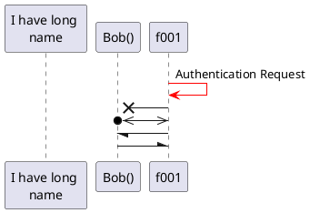

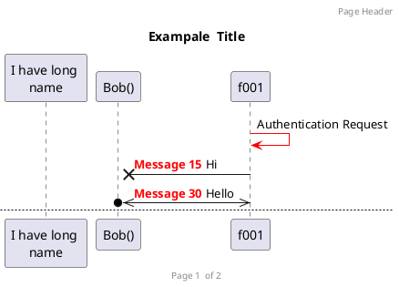


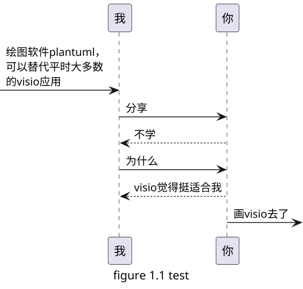


## 基本用法

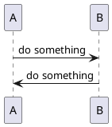

## 设置不同的角色
时序图角色可以分为: actor, boundary, control, entity, database，每种角色呈现的图形也是不一样的。


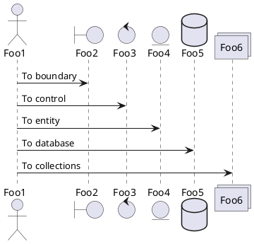
## 不用的箭头样式


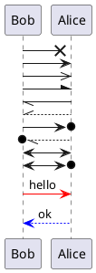

### 分页

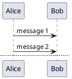
## 分段


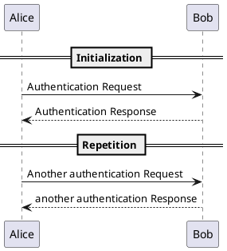


## 生命线


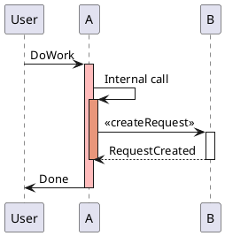


## 图例注脚等


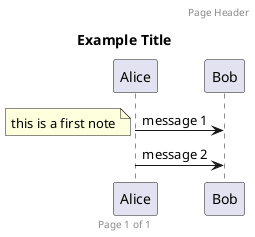


## C4架构图
C4 model是一种软件架构图的设计方法，具体介绍可以参考C4 architecture model。利用C4-PlantUML工具，可以画出很多很不错的架构图。
C4模型分为Context, Container, Component和Code 4个组成部分，我们一般在画图的时候主要用到前三个组成部分。


```puml
@startuml C4_Elements
!includeurl https://raw.githubusercontent.com/RicardoNiepel/C4-PlantUML/master/C4_Context.puml
!includeurl https://raw.githubusercontent.com/RicardoNiepel/C4-PlantUML/master/C4_Container.puml
!includeurl https://raw.githubusercontent.com/RicardoNiepel/C4-PlantUML/master/C4_Component.puml

System(systemAlias, "System", "这可以看作系统上下文(Context)")
Container(containerAlias, "Container", "这是Container")
Person(personAlias, "Person", "这可以看作是组件(Component)")

Rel(personAlias, containerAlias, "Label", "设置关联关系")
@enduml
```


