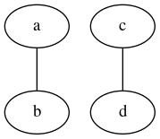
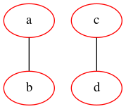
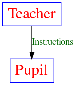

graphviz.org


[文档 https://graphviz.org/documentation/](https://graphviz.org/documentation/)

```
graph {
    a -- b;
    c -- d;
}
```

```dot
dot -Tpng -o dot_demo.png dot_demo.dot
```




graph_name 是可选的，如果没有，就是一个匿名图。其中，a, b, c, d 都是一个节点，可以使用 node 关键字来进行属性设定，例如上面的变成：

```
graph graph_name {
    node [color=Red];

    a -- b;
    c -- d;
}

```




这些关键字包括：

node: 修饰节点
edge: 修饰连线

而常见的可以修饰的属性包括下面这些：

bgcolor: 背景颜色
shape: 形状
size: 大小

详见：https://graphviz.gitlab.io/_pages/doc/info/attrs.html


利用Graphviz 画结构图：http://www.cnblogs.com/sld666666/archive/2010/06/25/1765510.html
Graphviz官网：http://www.graphviz.org
Graphviz 和 pygraphviz 简述、安装、用法 ：http://blog.csdn.net/chirebingxue/article/details/50393755
DOT + graphviz 轻松画图神器 ：http://blog.csdn.net/stormdpzh/article/details/14648827

```
digraph graph_name {
    T [label="Teacher" color=Blue, fontcolor=Red, fontsize=24, shape=box]      // node T
    P [label="Pupil" color=Blue, fontcolor=Red, fontsize=24, shape=box]  // node P

    T->P [label="Instructions", fontcolor=darkgreen] // edge T->P
}
```




开源工具---使用简单的文字描述画UML图之PlantUML官网：http://plantuml.com
PlantUML 支持的工具：http://plantuml.com/running
PlantUML语言参考手册中文版.pdf：http://download.csdn.net/download/freeking101/9917766
PlantUML编辑器(PlantUML QEditor )下载地址：http://www.uzzf.com/soft/86177.html

simple.dot

```
//dot simple.dot -Tpng -o simple1.png  -Gsplines=line  
digraph G {
  //a -> c;
  a -> b;
  b -> c;
  subgraph x{
      rank=same;
      b->d;
  }
  subgraph y{
      //rank = same;
      d->e;
  }
  subgraph z{
    rank=same;
    c->e;
  }

 }

```


```
sdot simple1.dot -Tpng -o simple1.png -Gsplines   
//-Gsplines=line  表示强迫边是直线.

```
