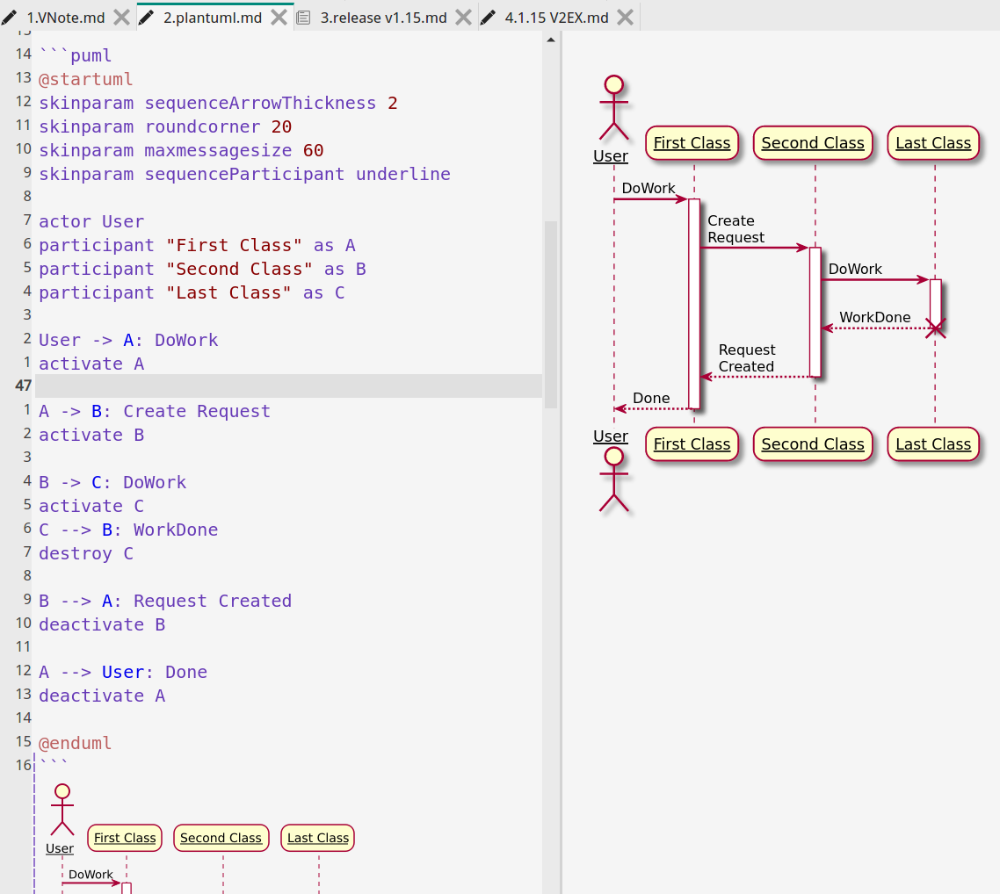

[TOC]


在线编辑mermaid：https://mermaid-js.github.io/mermaid-live-editor/#/edit/eyJjb2RlIjoiZ3JhcGggVERcbiAgICBBW0NocmlzdG1hc10gLS0-fEdldCBtb25leXwgQihHbyBzaG9wcGluZylcbiAgICBCIC0tPiBDe0xldCBtZSB0aGlua31cbiAgICBDIC0tPnxPbmV8IERbTGFwdG9wXVxuICAgIEMgLS0-fFR3b3wgRVtpUGhvbmVdXG4gICAgQyAtLT58VGhyZWV8IEZbZmE6ZmEtY2FyIENhcl0iLCJtZXJtYWlkIjp7InRoZW1lIjoiZGVmYXVsdCJ9LCJ1cGRhdGVFZGl0b3IiOmZhbHNlfQ


[https://github.com/tamlok/vnote/releases/tag/v2.0](https://github.com/tamlok/vnote/releases/tag/v2.0)


# 1. 小书匠语法说明之mermaid

soft.xiaoshujiang.com/docs/grammar/feature/mermaid/
# 2. typora画图mermaid

```mermaid
sequenceDiagram
    participant Alice
    participant Bob
    Alice->>John: Hello John, how are you?
    loop Healthcheck
        John->>John: Fight against hypochondria
    end
    Note right of John: Rational thoughts <br/>prevail...
    John-->>Alice: Great!
    John->>Bob: How about you?
    Bob-->>John: Jolly good!

```

```mermaid
graph LR;
　　X大于0,Y大于0 -->|b动作Y减<sub>sub<sub>| X大于0,Y大于0;
　　X大于0,Y大于0 -->|b动作Y减<sup>sup<sup>| X大于0,Y=0;
　　X大于0,Y=0 -->|a动作X减Y增| X大于0,Y大于0 ;
　　X大于0,Y=0 -->|a动作X减Y增| X=0,Y大于0 ;
```


[https://www.iminho.me/wiki/docs/mindoc/mermaid.md](https://www.iminho.me/wiki/docs/mindoc/mermaid.md)使用教程，安装配置
基础模型图

```mermaid
graph LR;
　　Portal-->|发布/更新配置|Apollo配置中心;
　　Apollo配置中心-->|实时推送|App;
　　App-->|实时查询|Apollo配置中心;
```


结构模型图

```mermaid
graph TB
　　client-->|2 findConfigServices|LoadBalancer;
　　LoadBalancer-->|3 findService|metaServer;
　　metaServer-->Eureka;
　　client-->|4 access via ip:port/client load balance/error retry|ConfigService;
　　ConfigService-->|1 register/cancel|Eureka;
　　ConfigService-->|read/write|ConfigDB;
```
模块依赖图
 
```mermaid
graph LR;
　　client---core;
　　client---common;
　　core---common;
　　common---portal;
　　common---Biz;
　　Biz---ConfigService;
　　Biz---AdminService;
```

graph  TB（top--botom 上下排列）

graph BT  (botom--top)

graph  LR（left--right 左右排列）

graph  RL (right--left)

-->    在流程图中显示——>

---    在流程图中显示——


```mermaid
graph LR;
　　默认节点A-->|A指向B|B[text文本节点];
　　B[text文本节点]---|B与C相连|C(circleangle);
　　C(circleangle)-->|相连|D((circle));
　　D((circle))-->|to|E>ename];
　　E>ename]-->|to|F{fname};
　　
```

```mermaid
graph LR;
  默认节点Z-->A((P_m));
　　A((P_m))-->|To|B((P_{m-1}));
  B((...))-->|To|C((P_1));
  C((P_1))-->|To|D[M_1];
  D[M_1]-->|To|E[M_2];
  E[M_2]-->|To|F[...];
  F[...]-->|To|G[M_n];
　　
```


```mermaid
sequenceDiagram
    participant Alice
    participant Bob
    Alice->>John:hello John
    loop healthcheck
        John-->>John:fight against
    end
    Note right of John:rational
    
    John->>Alice:great!
    John->>Bob:how about you
    Bob->>John:good!

```


```mermaid

  

```


```mermaid
sequenceDiagram
    participant z as 张三
    participant l as 李四
    loop 日复一日
        z->>l: 吃了吗您呐？
        l-->>z: 吃了，您呢？
        activate z
        Note left of z: 想了一下
        alt 还没吃
            z-xl: 还没呢，正准备回去吃
        else 已经吃了
            z-xl: 我也吃过了，哈哈
        end
        opt 大过年的
            l-->z: 祝您新年好啊
        end
    end
  ```


# 2. Mermaid 实用教程


[https://blog.csdn.net/fenghuizhidao/article/details/79440583?depth\_1-utm\_source=distribute.pc\_relevant.none-task&utm\_source=distribute.pc_relevant.none-task](https://blog.csdn.net/fenghuizhidao/article/details/79440583?depth_1-utm_source=distribute.pc_relevant.none-task&utm_source=distribute.pc_relevant.none-task)


# 3. markdown画图
https://www.oschina.net/news/107190/vnote-markdown

```cpp
#include <iostream>
int main()
{
        std::cout << "Hi,Vnote Markdown" << std::endl;

}
```

```puml
Alice -> Bob: Authentication Request
Bob --> Alice: Authentication Response
Alice -> Bob: Another authentication Request
Alice <-- Bob: another authentication Response

```


有

```puml
Vnote ->Markdown :Hi,I am coming.
```


flow

```flow

st=>start:start
e=>end:end
cond=>condition:VNote
st->cond
cond(yes)->e

```


VNote 也采用了两边预览的方式，不过 VNote 是利用这个来预览图表，方便在编辑比较大的图表的时候查看整个图表

```puml

scale 768 width
Browser->>Server: 1. POST /rest/rpc/login with email and password
Server->>Server: 2.Creates a JWT \nwith a secret
Server->>Browser: 3. Returns the JWT(token) to the Browser 
Browser->>Server: 4. Sends the JWT(token) on the Authorization Header
Server->>Server: 5.Check JWT signatura. \nGet user information \nfrom the JWT
Server->>Browser: 6. Sends reponse to the client


```





[https://www.v2ex.com/t/451037](https://www.v2ex.com/t/451037)


# 3. [plantUML和Mermaid](https://www.cnblogs.com/lanrish/p/11933767.html)

[Mermaid  https://blog.csdn.net/Mackyi/article/details/84063302](https://blog.csdn.net/Mackyi/article/details/84063302)

```Mermaid
sequenceDiagram
    participant Alice
    participant Bob
    Alice->>John: Hello John, how are you?
    loop Healthcheck
        John->>John: Fight against hypochondria
    end
    Note right of John: Rational thoughts 
    John-->>Alice: Great!
    John->>Bob: How about you?
    Bob-->>John: Jolly good!
```
————————————————
版权声明：本文为CSDN博主「X-ONE」的原创文章，遵循 CC 4.0 BY-SA 版权协议，转载请附上原文出处链接及本声明。
原文链接：https://blog.csdn.net/Neocst/article/details/83592648


# 4. 这个mermaid牛逼：[markdown - 画图https://blog.csdn.net/lis_12/article/details/80693975](https://blog.csdn.net/lis_12/article/details/80693975)

Mermaid 是一个用于画流程图、状态图、时序图、甘特图的库，使用 JS 进行本地渲染，广泛集成于许多 Markdown 编辑器中。


graph LR;
  A-->B
  B-->C
  C-->D
  D-->A


官网：[https://mermaidjs.github.io/](https://mermaidjs.github.io/)  
Github 项目地址：[https://github.com/knsv/mermaid](https://github.com/knsv/mermaid)


