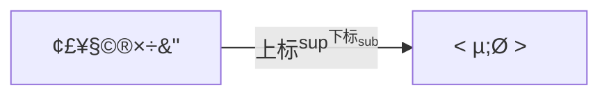
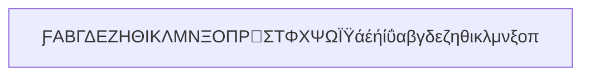

# 1. mermaid_html转义字符对照表


# 2. [html转义字符对照表](https://www.e-learn.cn/tools/html-escape)


上网有html字符对照表




下面断网的时候备用，点击上面链接找起来方便

### 2.1.1. 特殊字符转义表

| 字符 | 十进制 | 转义字符 |
| --- | --- | --- |
| " | " | " |
| & | & | & |
| < | &#60; | &lt; |
| > | &#62; | &gt; |
| 不断开空格(non-breaking space) | &#160; | &nbsp; |

### 2.1.2. 最常用的转义字符列表
```

| 显示 | 说明 | 实体名称 | 十进制编号 |
| --- | --- | --- | --- |
|   
 | 半方大的空白 | &ensp; | &#8194; |
|   
 |   
 |   
 |   
 |
|   
 | 全方大的空白 | &emsp; | &#8195; |
|   
 |   
 |   
 |   
 |
|   
 | 不断行的空白格 | &nbsp; | &#160; |
| < | 小于 | &lt; | &#60; |
| > | 大于 | &gt; | &#62; |
| & | &符号 | &amp; | &#38; |
| " | 双引号 | &quot; | &#34; |
| © | 版权 | &copy; | &#169; |
| ® | 已注册商标 | &reg; | &#174; |
| ™ | 商标（美国） | &trade; | &#8482; |
|   
 |   
 |   
 |   
 |
| × | 乘号 | &times; | &#215; |
| ÷ | 除号 | &divide; | &#247; |
```

### 2.1.3. ISO 8859-1 (Latin-1)字符集

| 显示 | 名称 | 十进制 | 显示 | 名称 | 十进制 | 显示 | 名称 | 十进制 | 显示 | 名称 | 十进制 | 显示 | 名称 | 十进制 |
| --- | --- | --- | --- | --- | --- | --- | --- | --- | --- | --- | --- | --- | --- | --- |
|   | &nbsp; | &#160; | ¡ | &iexcl; | &#161; | ¢ | &cent; | &#162; | £ | &pound; | &#163; | ¤ | &curren; | &#164; |
| ¥ | &yen; | &#165; | ¦ | &brvbar; | &#166; | § | &sect; | &#167; | ¨ | &uml; | &#168; | © | &copy; | &#169; |
| ª | &ordf; | &#170; | « | &laquo; | &#171; | ¬ | &not; | &#172; |   
 | &shy; | &#173; | ® | &reg; | &#174; |
| ¯ | &macr; | &#175; | ° | &deg; | &#176; | ± | &plusmn; | &#177; | ² | &sup2; | &#178; | ³ | &sup3; | &#179; |
| ´ | &acute; | &#180; | µ | &micro; | &#181; | ¶ | &para; | &#182; | · | &middot; | &#183; | ¸ | &cedil; | &#184; |
| ¹ | &sup1; | &#185; | º | &ordm; | &#186; | » | &raquo; | &#187; | ¼ | &frac14; | &#188; | ½ | &frac12; | &#189; |
| ¾ | &frac34; | &#190; | ¿ | &iquest; | &#191; | À | &Agrave; | &#192; | Á | &Aacute; | &#193; | Â | &Acirc; | &#194; |
| Ã | &Atilde; | &#195; | Ä | &Auml; | &#196; | Å | &Aring; | &#197; | Æ | &AElig; | &#198; | Ç | &Ccedil; | &#199; |
| È | &Egrave; | &#200; | É | &Eacute; | &#201; | Ê | &Ecirc; | &#202; | Ë | &Euml; | &#203; | Ì | &Igrave; | &#204; |
| Í | &Iacute; | &#205; | Î | &Icirc; | &#206; | Ï | &Iuml; | &#207; | Ð | &ETH; | &#208; | Ñ | &Ntilde; | &#209; |
| Ò | &Ograve; | &#210; | Ó | &Oacute; | &#211; | Ô | &Ocirc; | &#212; | Õ | &Otilde; | &#213; | Ö | &Ouml; | &#214; |
| × | &times; | &#215; | Ø | &Oslash; | &#216; | Ù | &Ugrave; | &#217; | Ú | &Uacute; | &#218; | Û | &Ucirc; | &#219; |
| Ü | &Uuml; | &#220; | Ý | &Yacute; | &#221; | Þ | &THORN; | &#222; | ß | &szlig; | &#223; | à | &agrave; | &#224; |
| á | &aacute; | &#225; | â | &acirc; | &#226; | ã | &atilde; | &#227; | ä | &auml; | &#228; | å | &aring; | &#229; |
| æ | &aelig; | &#230; | ç | &ccedil; | &#231; | è | &egrave; | &#232; | é | &eacute; | &#233; | ê | &ecirc; | &#234; |
| ë | &euml; | &#235; | ì | &igrave; | &#236; | í | &iacute; | &#237; | î | &icirc; | &#238; | ï | &iuml; | &#239; |
| ð | &eth; | &#240; | ñ | &ntilde; | &#241; | ò | &ograve; | &#242; | ó | &oacute; | &#243; | ô | &ocirc; | &#244; |
| õ | &otilde; | &#245; | ö | &ouml; | &#246; | ÷ | &divide; | &#247; | ø | &oslash; | &#248; | ù | &ugrave; | &#249; |
| ú | &uacute; | &#250; | û | &ucirc; | &#251; | ü | &uuml; | &#252; | ý | &yacute; | &#253; | þ | &thorn; | &#254; |
| ÿ | &yuml; | &#255; |   
 |   
 |   
 |   
 |   
 |   
 |   
 |   
 |   
 |   
 |   
 |   
 |

### 2.1.4. 符号、数学符号和希腊字母  symbols, mathematical symbols, and Greek letters

| 显示 | 名称 | 编号 | 显示 | 名称 | 编号 | 显示 | 名称 | 编号 | 显示 | 名称 | 编号 | 显示 | 名称 | 编号 |
| --- | --- | --- | --- | --- | --- | --- | --- | --- | --- | --- | --- | --- | --- | --- |
| ƒ | &fnof; | &#402; | Α | &Alpha; | &#913; | Β | &Beta; | &#914; | Γ | &Gamma; | &#915; | Δ | &Delta; | &#916; |
| Ε | &Epsilon; | &#917; | Ζ | &Zeta; | &#918; | Η | &Eta; | &#919; | Θ | &Theta; | &#920; | Ι | &Iota; | &#921; |
| Κ | &Kappa; | &#922; | Λ | &Lambda; | &#923; | Μ | &Mu; | &#924; | Ν | &Nu; | &#925; | Ξ | &Xi; | &#926; |
| Ο | &Omicron; | &#927; | Π | &Pi; | &#928; | Ρ | &Rho; | &#929; | Σ | &Sigma; | &#931; | Τ | &Tau; | &#932; |
| Υ | &Upsilon; | &#933; | Φ | &Phi; | &#934; | Χ | &Chi; | &#935; | Ψ | &Psi; | &#936; | Ω | &Omega; | &#937; |
| α | &alpha; | &#945; | β | &beta; | &#946; | γ | &gamma; | &#947; | δ | &delta; | &#948; | ε | &epsilon; | &#949; |
| ζ | &zeta; | &#950; | η | &eta; | &#951; | θ | &theta; | &#952; | ι | &iota; | &#953; | κ | &kappa; | &#954; |
| λ | &lambda; | &#955; | μ | &mu; | &#956; | ν | &nu; | &#957; | ξ | &xi; | &#958; | ο | &omicron; | &#959; |
| π | &pi; | &#960; | ρ | &rho; | &#961; | ς | &sigmaf; | &#962; | σ | &sigma; | &#963; | τ | &tau; | &#964; |
| υ | &upsilon; | &#965; | φ | &phi; | &#966; | χ | &chi; | &#967; | ψ | &psi; | &#968; | ω | &omega; | &#969; |
| ? | &thetasym; | &#977; | ? | &upsih; | &#978; | ? | &piv; | &#982; | • | &bull; | &#8226; | … | &hellip; | &#8230; |
| ′ | &prime; | &#8242; | ″ | &Prime; | &#8243; | ‾ | &oline; | &#8254; | ⁄ | &frasl; | &#8260; | ℘ | &weierp; | &#8472; |
| ℑ | &image; | &#8465; | ℜ | &real; | &#8476; | ™ | &trade; | &#8482; | ℵ | &alefsym; | &#8501; | ← | &larr; | &#8592; |
| ↑ | &uarr; | &#8593; | → | &rarr; | &#8594; | ↓ | &darr; | &#8595; | ↔ | &harr; | &#8596; | ↵ | &crarr; | &#8629; |
| ⇐ | &lArr; | &#8656; | ⇑ | &uArr; | &#8657; | ⇒ | &rArr; | &#8658; | ⇓ | &dArr; | &#8659; | ⇔ | &hArr; | &#8660; |
| ∀ | &forall; | &#8704; | ∂ | &part; | &#8706; | ∃ | &exist; | &#8707; | ∅ | &empty; | &#8709; | ∇ | &nabla; | &#8711; |
| ∈ | &isin; | &#8712; | ∉ | &notin; | &#8713; | ∋ | &ni; | &#8715; | ∏ | &prod; | &#8719; | ∑ | &sum; | &#8721; |
| − | &minus; | &#8722; | ∗ | &lowast; | &#8727; | √ | &radic; | &#8730; | ∝ | &prop; | &#8733; | ∞ | &infin; | &#8734; |
| ∠ | &ang; | &#8736; | ∧ | &and; | &#8743; | ∨ | &or; | &#8744; | ∩ | &cap; | &#8745; | ∪ | &cup; | &#8746; |
| ∫ | &int; | &#8747; | ∴ | &there4; | &#8756; | ∼ | &sim; | &#8764; | ∝ | &cong; | &#8773; | ≈ | &asymp; | &#8776; |
| ≠ | &ne; | &#8800; | ≡ | &equiv; | &#8801; | ≤ | &le; | &#8804; | ≥ | &ge; | &#8805; | ⊂ | &sub; | &#8834; |
| ⊃ | &sup; | &#8835; | ⊄ | &nsub; | &#8836; | ⊆ | &sube; | &#8838; | ⊇ | &supe; | &#8839; | ⊕ | &oplus; | &#8853; |
| ⊗ | &otimes; | &#8855; | ⊥ | &perp; | &#8869; | ⋅ | &sdot; | &#8901; | ? | &lceil; | &#8968; | ? | &rceil; | &#8969; |
| ? | &lfloor; | &#8970; | ? | &rfloor; | &#8971; | ? | &lang; | &#9001; | ? | &rang; | &#9002; | ◊ | &loz; | &#9674; |
| ♠ | &spades; | &#9824; | ♣ | &clubs; | &#9827; | ♥ | &hearts; | &#9829; | ♦ | &diams; | &#9830; |   
 |   
 |   
 |

### 2.1.5. 重要的国际标记 markup-significant and internationalization characters

| 显示 | 名称 | 编号 | 显示 | 名称 | 编号 | 显示 | 名称 | 编号 | 显示 | 名称 | 编号 | 显示 | 名称 | 编号 |
| --- | --- | --- | --- | --- | --- | --- | --- | --- | --- | --- | --- | --- | --- | --- |
| " | &quot; | &#34; | & | &amp; | &#38; | < | &lt; | &#60; | > | &gt; | &#62; | Π| &OElig; | &#338; |
| œ | &oelig; | &#339; | Š | &Scaron; | &#352; | š | &scaron; | &#353; | Ÿ | &Yuml; | &#376; | ˆ | &circ; | &#710; |
| ˜ | &tilde; | &#732; |   | &ensp; | &#8194; |   | &emsp; | &#8195; |   | &thinsp; | &#8201; | ‌ | &zwnj; | &#8204; |
| ‍‍ | &zwj; | &#8205; | ‎‎ | &lrm; | &#8206; | ‏‏ | &rlm; | &#8207; | – | &ndash; | &#8211; | — | &mdash; | &#8212; |
| ‘ | &lsquo; | &#8216; | ’ | &rsquo; | &#8217; | ‚ | &sbquo; | &#8218; | “ | &ldquo; | &#8220; | ” | &rdquo; | &#8221; |
| „ | &bdquo; | &#8222; | † | &dagger; | &#8224; | ‡ | &Dagger; | &#8225; | ‰ | &permil; | &#8240; | ‹ | &lsaquo; | &#8249; |
| › | &rsaquo; | &#8250; | € | &euro; | &#8364; |   
 |   
 |   
 |   
 |   
 |   
 |   
 |   
 |   
 |

