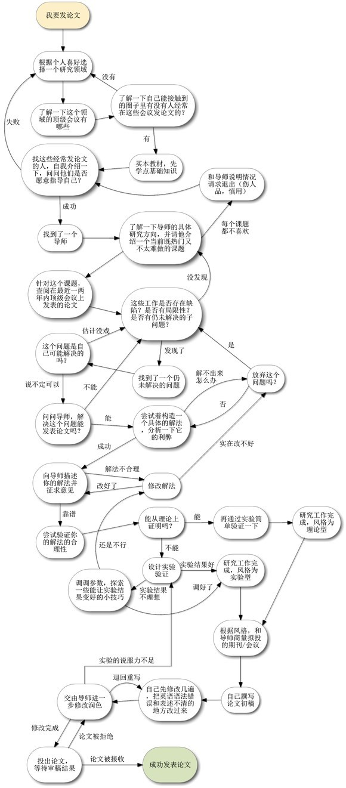
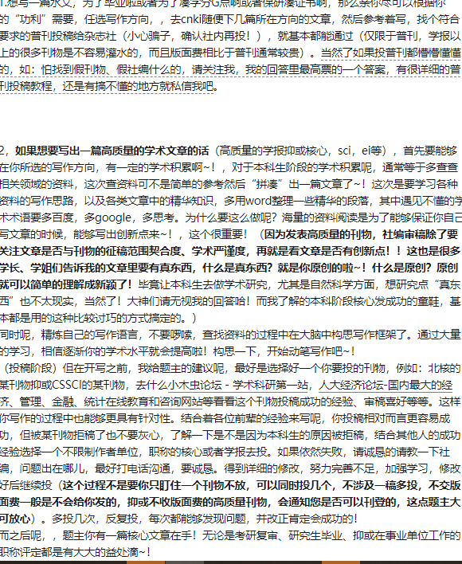

## 这里靠谱，为什么要发论文？
为了回馈知乎小伙伴对我的信任，决定专门再更一篇科普文，就大家比较关心的问题说一说个人见解，哪里表述不当欢迎大家指出。现在需要发文章的群体真是越来越多元化了，就我而言从60后到00后的作者都遇到过，60后的企业老员工，为了适应“新时代的发展要求”被迫和年轻人一起发论文。也遇到过几个2000年的高三小伙伴为了自主招生加分而发文章，当然其中90后是最庞大的群里，但不管怎样，大家必须重视一个问题，擦亮眼睛，在鱼龙混杂的市场中找到正确的方向哈。

好了言归正传，下面部分内容与之前的回复相比可能会有些重复，但这些真的都很重要。

1.发论文之前一定要搞清楚要求。有的单位或学校需要必须发表核心期刊，有的需要发表在指定刊物上，有的必须要求知网可查，还有的则公开发表有双刊号就行，还需要看一下对文章的字数和版面是否有要求等等，总之在发论文之前不是你准备好文章就OK的，一定要了解加分规则，不然就白浪费时间和精力啦。

2.说到核心期刊，有很多作者私信过我如何投稿，下面教一下大家如何在网上查找核心期刊的官网，授人以鱼不如授人以渔，是这个道理不？

首先我给大家的建议是发核心一定不要走中介，一定不要走中介！通过中介发一篇核心至少1w以上，周期很长，中间难免会有一些不可控制因素，可能会遇到拖了几个月主编最后审核没通过，换主编了文章被拿下来了等等情况，被迫撤稿后钱能退回来一半就不错了，会克扣一部分费用，美其名曰疏通关系的，要不回来了。在这过程中带来的不仅是金钱上的损失，还有更多的是耽误了宝贵的时间。

那么核心到底该怎么发呢？建议大家找到官方投稿邮箱，将稿件直接投递给社内，不要经过文化公司的。那么问题又来了，百度一下某某期刊杂志，经常会弹出来很多网站，但这其中大部分网站都是“钓鱼”网站，根本不是社内的，那该如何找社内投稿邮箱呢？给大家推荐两个亲测有效的方法哈！首先可以买一本你所要发表的这个刊物，期刊的副页也就是版权页上会有杂志社的投稿邮箱及杂志社社内的电话。那么，版权页长啥样呢？如下：
https://www.zhihu.com/question/25627210 如何在期刊上发表论文？
https://www.zhihu.com/question/21427261/answer/21102951

在校本科生该怎么发表论文？https://www.zhihu.com/question/20116328/answer/22655296

在校本科生该怎么发表论文？ - 知乎
https://www.zhihu.com/question/20116328/answer/22655296

在校本科生该怎么发表论文？ - 知乎
https://www.zhihu.com/question/20116328/answer/22655296

# 这里有很多说明
大学论文发表在核心期刊要怎么投稿？
https://www.zhihu.com/question/27746654/answer/147256236  

## SCI科研论文写作指导
https://zhuanlan.zhihu.com/p/25613556

https://zhuanlan.zhihu.com/p/23921399

https://zhuanlan.zhihu.com/p/37094118

https://zhuanlan.zhihu.com/p/26477175

https://zhuanlan.zhihu.com/p/52494879 英文论文Introduction写作误区和建议

# 中文核心期刊（北大期刊）南大期刊，基本刊拓展刊，SCI,EI

还在机器学习论文的海洋里忘我沉沦？先花几分钟学些新工具，不亏，论文阅读、评论、社交、管理、搜索、复现、写作全不误。
管理阅读库：Mendeley
阅读和写论文评论：shortscience 和 openreview
将论文和 GitHub 资源库匹配：paperswithcode 和 pwc
论文和作者分析：Semantic scholar
写论文：Overleaf
顺便提一下，谷歌最近发布的 Dataset Search 也是搜索数据集的神器哦。
https://zhuanlan.zhihu.com/p/49856162
# 论文阅读

https://www.zhihu.com/question/304334959/answer/553782865  研究生新生要怎么看论文？
https://www.zhihu.com/lives/881525495878021120

# 我主要关注的是论文阅读和展示的问题（而非写作）：

Reference Manager（也叫论文库）
用社交平台来分享知识
运用自动论文分析算法来获取额外的元数据（关键词、相关数据集、重要引用等）
# 资料搜索论文库
Reference Manager（也叫论文库）
Mendeley：这款产品虽然颜值不咋地，但它有免费的商业模式，支持 web、PC、Mac 和移动手机等多个平台。除了一般的论文笔记，你还可以直接注释和高亮显示 PDF。它的云存储是有限额的，超过几百篇论文之后就得付费。
Paperpile：它需要付费订阅（没有免费版本，可以用谷歌账号免费试用 30 天），但看起来很潮，用起来也感觉不错。你可以非常轻松地把论文库从其它服务平台上导入到这款产品中。你还可以把库同步到自己的谷歌云，这算是它的一个优势。目前它只能在谷歌浏览器上使用。
Zotero：这是一个免费和开源的实现，你只需为超额的云存储付费。类似 Mendeley，不过功能没它多。
Mendeley：https://www.mendeley.com/
Paperpile：https://paperpile.com/
Zotero：https://www.zotero.org/
Overleaf：支持多人协作的在线 LaTeX 编辑器，好比用谷歌文档写论文，很好实现。
Authorea：一种支持多人协作在线撰写论文的方法，旨在减少 LaTeX 的使用，支持现代 WYSIWYG 编辑器。支持内联代码和数据，促进可复现性，支持内联公共评论和其它合理功能。
Code ocean：基于云计算的再现性平台。我的理解是你将自己的研究作为 Jupyter 环境代码上传，然后在线运行，并复现作者曾取得的相同图表/输出。
Overleaf：https://www.overleaf.com/
Authorea：https://www.authorea.com/
Code ocean：https://codeocean.com/
[如果你觉得前文太长，可以选择……不看
arXiv 进化版

arXiv 于 1991 发布，并在近十年内鲜有变化，尽管论文发表数大幅增长（到 2016 年 10 月提交论文数已经达到了每月超过 10000 篇）。当然，我们现在对论文资源库提供的功能已经有很多新的需求。我们想要能执行论文分析的算法，想找到实现论文结果的代码，希望有能共享信息的社交平台，我们还可能对双列格式的 pdf 文档感到厌烦

arXiv-sanity：相比于 arXiv 有很大的改进，包括在浏览中显示摘要、评论和非常基本的社交、库功能。这个整合了很多便捷功能的网站，是 Andrej Karpathy 在空闲时开发的。
arXiv-vanity：可以将来自 arXiv 的论文渲染成响应式网页，从而让人们不用再看 pdf 文档。
arXiv-sanity：http://arxiv-sanity.com/
arXiv-vanity：http://arxiv-vanity/

# 社交平台

Shortscience：这是一个能共享论文概述的平台，目前有超过 1000 篇论文概述，并仍在持续增长；
OpenReview：这是一个能提供公开论文评审过程的平台，所有提交的论文会公开作者姓名等信息，同时接受同行的评价及提问，可以匿名或实名地对论文进行评价。公开评审结束后，论文作者也能够调整和修改论文。Openreview 目前仅对特定学术会议提供评审功能，例如 ICLR，并且由于受到广泛质疑，ICLR 在 Openreview 上的评审也被改成了双盲评审。除了官方评审之外，近期很多论文的评论区也能看到读者和作者之间的积极交流。
Scirate：能看到热度较高的 arXiv 论文，并按学科分门别类，还能浏览相关论文的评论。但其热度排序基于该网站内的点赞数，而这个网站的活跃度并不高。
Shortscience：http://www.shortscience.org/
OpenReview：https://openreview.net/
Scirate：https://scirate.com/

### 找到论文的代码实现 

Papers With Code：自动把论文连接到实现代码的 GitHub 资源库和数据集，并根据 GitHub 的收藏量排序。每篇论文可能有多个合并的条目。
Github pwc：以相当简洁的列表关联论文和代码实现，包含最新的 NIPS 论文。
GitXiv：每个项目可以方便地展示为 arXiv+GitHub+链接+讨论，可惜的是这个项目不再维护了。
Papers With Code：https://paperswithcode.com/
Github pwc：https://github.com/zziz/pwc
GitXiv：http://www.gitxiv.com/

# 作图https://www.zhihu.com/question/21664179/answer/54632841如何在论文中画出漂亮的插图？
Keynote/Visio/http://Draw.io
用来画论文插图的一些应用。

简单的图其实 Keynote/PPT 就真的足够了，认真的。

Visio 符合田厂软件的一贯特点，功能强大而臃肿，使用繁琐。这次 paper 里最复杂的图是用 Visio 画的，效果确实很棒，然而过程实在难用到无法忍受。

draw.io 似乎是另一个可选的解决方案，没有实际用过，看颜值还不错。未来会尝试。https://www.draw.io

把 Excel 表格转换成 LaTeX 代码的工具。可以节省很多时间。有些效果不能完美转换，需要微调。https://ctan.org/tex-archive/support/excel2latex

# 工具网站

# # SCI 必备的3 款英文论文写作神器

Grammarly
推荐指数 五颗星 https://www.grammarly.com

Grammarly 是一款非常强大的语法改错软件，帮助润色英文表达。目前提供了网页版、Mac 版和 Windows 版，网页版提供多款浏览器的扩增插件，而且如果很幸运你的电脑是 Windows 系统，那么 Grammarly 还很良心地为你提供 Word 插件。
Ginger

推荐指数 三颗星http://www.gingersoftware.com

Ginger 号称是世界上最好用的英文写作润色工具，除了提供单词拼写、语法检查功能外，还提供句子改写、翻译、词典和朗读功能。在 Ginger 网页最低端，还提供英语语法和单词学习资料（感兴趣可前往下载）。

Ginger

推荐指数 三颗星http://www.gingersoftware.com

Ginger 号称是世界上最好用的英文写作润色工具，除了提供单词拼写、语法检查功能外，还提供句子改写、翻译、词典和朗读功能。在 Ginger 网页最低端，还提供英语语法和单词学习资料（感兴趣可前往下载）。

