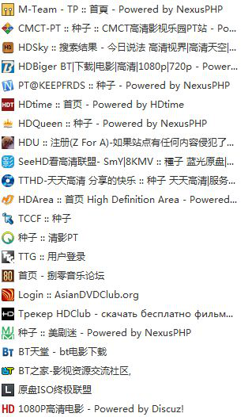

# 1. PT

什么是Tracker服务器以及如何添加Tracker服务器
通过添加Tracker服务器提高BT文件下载速度 - 青声的文章 - 知乎 https://zhuanlan.zhihu.com/p/43568669

## 1.1. 一些能用的BT Tracker服务器地址【不定时更新】
https://www.wdssmq.com/post/20130323295.html

比较好的PT站点有哪些？ - Zcc911的回答 - 知乎 https://www.zhihu.com/question/20777223/answer/57410265

比较好的PT站点有哪些？ - lu lu的回答 - 知乎 https://www.zhihu.com/question/20777223/answer/28883888

**分享率=上传量/下载量**

为什么PT站点都要给钱才能注册？ - 知乎 https://www.zhihu.com/question/310458671/answer/583458197

PT站跟普通的BT站不同，是个小范围资源共享网站，一般不开放注册，往往采用邀请制，现在大部分也加上了捐献。一个站的总人数会控制在几万人，一般2-4万。

如果有人给你发邀请，你也是可以获得注册资格的。没人邀请，自己捐赠一些钱也行。

PT站的资源大部分都是BT资源的源头。很多BT资源都是从PT站流出去的。

想要成为PT站成员，是对你的硬件条件有要求的，比如你的上下行带宽多少，下行带宽代表你的下载速度，上行带宽代表你的上传速度，也就是分享速度，这个会影响你的分享率。

成为会员后一般会有个考核期，很多人都在考核期挂了。不过要通过考核期也很简单，主要看分享率。新手一定要让分享率大于1，例如你下载了一个40G的电影，那么你需要保持电脑不关机，用自己的电脑做种，将下载的资源上传分享给其他用户，当你分享的数据达到40G了，分享率为1。下载的量越大，且分享率越高，你的等级越高。

PT站都有指定的下载客户端。你下载的种子都是带有你的个人信息的，种子不能分享给其他人使用，也不可以使用规定之外的工具去下载，否则会被封号。

如果你只是想用VPS试试，那还是算了吧，PT站没那么容易混的。

玩PT最好的几个条件：

1.  本身对高清内容有需求
2.  家里最好使用固定IP的联通或电信宽带
3.  宽带下载速度至少50M，上传尽可能大（你可以找运营商申请增加上传带宽）。
4.  最好家里有NAS，可以7x24小时不关机，而且硬盘足够大。

可以给你看看某PT站的成员等级要求。

===================================================

**不同的用户等级代表了什么含义？**

**游魂(Peasant)**被降级的用户，他们有7天时间来提升分享率，否则他们会被踢。不能发表趣味盒内容；不能申请友情链接；不能上传字幕。

**临时演员(User)**新用户的默认级别。

**跑龙套(Power User)**可以查看NFO文档；可以请求续种；可以查看其它用户的种子历史(如果用户隐私等级未设置为"强")； 可以删除自己上传的字幕。

**配角(Elite User)配角(Elite User)**及以上用户封存账号后不会被删除。

**主演(Crazy User)**可以直接发布种子；可以在做种/下载/发布的时候选择匿名模式。

**领衔主演(Insane User)**可以查看普通日志。

**明星(Veteran User)**可以查看其它用户的评论、帖子历史。

**明星(Veteran User)**及以上用户会永远保留账号，但不等于不会被封禁。

**国际大腕(Extreme User)**得到一个邀请名额；可以更新过期的外部信息；可以查看Extreme User论坛。

**影帝(Ultimate User)**得到两个邀请名额。此等级以上（含）免除站点定期进行的数据增量考核。

**终身影帝(Nexus Master)**得到三个邀请名额。可以查看排行榜；可以发送邀请，管理员设置的特殊情况除外；

给网站提供援助的用户，做种魔力值的增长速度是其他等级用户的2倍，免除新手考核，免除站点定期进行的数据增量考核。但无法免除分享率考核，需要注意分享率不能低于1。

**贵宾(VIP)**和**终身影帝(Nexus Master)**拥有相同权限并被认为是精英成员。VIP期间免除自动降级。VIP期间可以发送邀请。下载收费种子时不会计算下载量。免除包括分享率在内的所有考核。VIP到期后若分享率低于1，系统将会自动提升分享率到1（但只能触发一次，不能多次提升）。注：永久VIP下载收费种子时会计算下载量，但不会因为分享率过低被降级。**其它**自定义等级。

**养老族(Retiree)**退休后的管理组成员。

**发布员(Uploader)**专注的发布者。免除自动降级；可以查看匿名用户的真实身份。

**总版主(Moderator)**可以查看管理组信箱、举报信箱；管理趣味盒内容、投票内容；可以编辑或删除任何发布的种子；可以管理候选；可以管理论坛帖子、用户评论；可以查看机密日志；可以删除任何字幕；可以管理日志中的代码、史册；可以查看用户的邀请记录；可以管理用户帐号的一般信息。**不能**管理友情链接、最近消息、论坛版块；**不能**将种子设为置顶或促销；**不能**查看用户IP或Email等机密信息；不能删除账号。

**管理员(Administrator)**除了不能改变站点设定、管理捐赠外，可以做任何事。

**维护开发员(Sysop)**网站开发/维护人员，可以改变站点设定，不能管理捐赠。

**主管(Staff Leader)**网站主管，可以做任何事。

**提升和降级又是怎样被执行的呢？**

**游魂(Peasant)**未满足以下条件之一者，将被自动降至本级：

1.如果你已经下载了超过10GB，你应该有大于0.6的分享率。

2.如果你已经下载了超过50GB，你应该有大于0.7的分享率。

3.如果你已经下载了超过100GB，你应该有大于0.8的分享率。

4.如果你已经下载了超过200GB，你应该有大于0.9的分享率。

5.如果你已经下载了超过400GB，你应该有大于1.0的分享率。

**跑龙套(Power User)**必须注册至少5周，并且下载至少120G，分享率大于2.0。

当条件符合时将被自动提升。注意，无论何时，如果你的分享率低于1.9，你将自动降级。

**配角(Elite User)**必须注册至少5周，并且下载至少220G，分享率大于2.5。

当条件符合时将被自动提升。注意，无论何时，如果你的分享率低于2.4，你将自动降级。

**主演(Crazy User)**必须注册至少5周，并且下载至少400G，分享率大于3.0。

当条件符合时将被自动提升。注意，无论何时，如果你的分享率低于2.9，你将自动降级。

**领衔主演(Insane User)**必须注册至少5周，并且下载至少600G，分享率大于3.5。

当条件符合时将被自动提升。注意，无论何时，如果你的分享率低于3.4，你将自动降级。

**明星(Veteran User)**必须注册至少5周，并且下载至少900G，分享率大于4.0。

当条件符合时将被自动提升。注意，无论何时，如果你的分享率低于3.9，你将自动降级。

**国际大腕(Extreme User)**必须注册至少5周，并且下载至少2TB，分享率大于4.5。

当条件符合时将被自动提升。注意，无论何时，如果你的分享率低于4.4，你将自动降级。

**影帝(Ultimate User)**必须注册至少5周，并且下载至少4TB，分享率大于5.0。

当条件符合时将被自动提升。注意，无论何时，如果你的分享率低于4.9，你将自动降级。

**终身影帝(Nexus Master)**必须注册至少5周，并且下载至少8TB，分享率大于5.5。

当条件符合时将被自动提升。注意，无论何时，如果你的分享率低于5.4，你将自动降级。

**贵宾(VIP)**由管理员仔细斟酌后分配给他们认为对于站点某方面有特殊贡献的用户。

（任何索取贵宾等级的要求将被自动无视）**其它**用户使用魔力值兑换，或由管理员仔细斟酌后授权。

**养老族(Retiree)**由管理员授予。

**发布员(Uploader)**由管理员分配(参见'发布'部分以了解详情)。

**总版主(Moderator)**无需多问，我们会找到你的！

PT站有很多，大致分个类：教育网站，入门站，高级站，特色站。以下分别说明取得各类站邀请的方法。  

1.  教育网站如六维、晨光、葡萄、蝴蝶、北邮人等等，适合在校大学生，教育网ipv6的环境上下行速度一般都在百兆，部分学校是千兆。获得此类站点的邀请一般都很简单，在学校的BBS上经常会有人发，各个站点的新浪微博、人人主页有时也会发，经常关注的话邀请很好得到。
2.  入门站如CMCT、HDCity等等，适合新手，此类站点对会员要求一般不高。获得邀请的方式主要在百度PT吧，HD隔壁论坛，邀请比较容易得到。
3.  高级站如国内的三大站：CHD、HDW、TTG，国外的BTN、PTP、SCC、HDB等，邀请较难得到。国内的三大站平时关闭注册，隔一段时间会开放邀请注册，一般在各个站点的外站论坛以及百度PT吧，HD隔壁论坛都会有消息。只要你有PT的基础知识，加上有带宽，有硬盘，基本上都是可以得到邀请的。国外站点有些不同，私密性较强，邀请一般禁止公开发放。另外SCC是禁止中国ip注册，HDB是禁止中国地区ip注册和登陆的。取得这些站的邀请是比较麻烦的，一般在可以先获得PTP、what.cd的邀请，等升级到power user(PU)时可以在论坛中访问到邀请的版块，其中有很多国外高级站的邀请。
4.  特色站就是一些不以高清影视为主打的站点，如OpenCD（音乐），U2（动漫）等。进入这种站点就要秀出存货了，带宽、硬盘什么的都是次要的。比如想要U2的邀请，可以在其外站动漫花园BBS发个帖子，说说对动漫的爱，发一下电脑里动漫的存货，基本就可以得到邀请了。

很久不关注PT了，只是偶尔去CHD下点片看，上面说的基本上是我一年前的经验，可能与现在有些出入。

此问题可按“有什么途径可以进入PT站？”回答。

进入PT站有三种途径，一是他人邀请注册进入；二是在PT站开放注册时，自己注册进入；三是捐赠PT站进入或购买PT站组织的团购产品进入。  

-   第一种途径是大部分PT站的进入的方式，一些知名站点平常是关闭邀请注册的，但每年会在重要日子，如站点成立周年庆，给普通会员发放2-3枚限时邀请，并开放邀请权限，届时注册门槛较低。一些普通站点则不会关闭邀请注册，可通过熟人索要邀请注册，或关注相关邀请发放信息并索要。
-   第二种途径一般是进入刚成立的站点的主要方式。
-   第三种途径，一般PT站都可以通过给PT站捐赠获得会员资格。有时，有的PT会有高清硬件产品（如硬盘、播放机等）团购活动，通过购买团购产品送邀请码。

以上都是进入大部分PT站的正常途径，但并不是适合所有PT站，有的既牛又老的站可以一直是封闭运行，进入很难。至于在某些交易网站购买邀请码，不管是国内站，还是国外站，都是不允许的。被发现的后果是，BAN账号、IP、邮箱。应慎行。

查阅PT站点动态，或邀请发放信息的网站，国内站点一般是高清隔壁[http://hdgebi.com](https://link.zhihu.com/?target=http%3A//hdgebi.com)或贴吧PT吧，国外站点一般是[http://torrent-invites.com](https://link.zhihu.com/?target=http%3A//torrent-invites.com)。

索要PT站邀请时，一般会要求提供其它站点的上传下载数据的截图，特别是一些知名站点。因此，建议新手先从普通站点入手。

有什么获得PT站邀请的好方法？ - anee的回答 - 知乎 https://www.zhihu.com/question/23654657/answer/25294446

1、每个pt站的论坛和灌水区都有人发邀请码，只要你进入一个pt站，你就可以通过这个pt站进入其他pt站。  
2、专业的pt论坛，如HD隔壁论坛，网上还有一个网页专门更新各种pt站开放注册消息，我忘了，你去HD隔壁论坛问问。  
3、百度贴吧，以pt吧为代表，还有六维空间吧等各类pt站同名贴吧。  
4、豆瓣pt邀请码小组，有很多。  
5、在新浪微博搜索相关pt站关键词，有时候会有人发邀请码，还有各类站官方微博，微信公共号。  
6、如果室友同事熟人有pt的就方便了，我的好多室友的六维空间邀请码就是这么得到的::>_<::   
7、不得不提万能的淘宝......呜呜，我说的淘宝是官方的淘宝店，谢谢楼下的提醒。

大二学生如何搭建校园PT站？ - 纳兰斯坦爱因容若的回答 - 知乎 https://www.zhihu.com/question/51473270/answer/126699970

现在许多高校都在做 PT 网站，怎么看这个现象？ - LinkNg的回答 - 知乎 https://www.zhihu.com/question/19680549/answer/12626890

再补充几点吧：  
1.ipv6不单单是运用在pt站，ipv6也有vod点播，电视直播（上交的不错），网站也有ipv6协议的，ftp也是。  
2.搞pt某种意义上是为了规避版权问题，pt服务器只需要保存种子信息，pt属于小圈子开放，高端资源比如720P.1080P甚至蓝光原盘，这些要求带宽很高很适合在教育网互传很快的地点传播。另一点来说，随着硬盘等存储设备，显示器，影视压制技术的发展，资源会越来越大。  
3.pt的共享率要求导致每个下载者要挂种子，上传资源或是做种混上传。这样就是P2P的优势，比单单的一个ftp（2011前一般ftp服务器硬盘最多也就几T，带宽负荷也很高），pt有效降低资源投入。  
4.某些学校有出口带宽优势，有大量独立IP，导致他们在公网PT如鱼得水，必然这些资源肯定要传播到教育网PT去。  
5.pt程序这点，除了六维是基于dz自主开发，很多是基于开源的tbsource成改版而来，如浙大的nexus，晨光BT，投入低廉，界面还算友好，有资源介绍，pt站也要求介绍规范，这肯定比传统的字符界面的ftp好的多了。

如何评价盗版音乐分享站点 What.CD 关站? - 张乐添的回答 - 知乎 https://www.zhihu.com/question/52735929/answer/132368037

