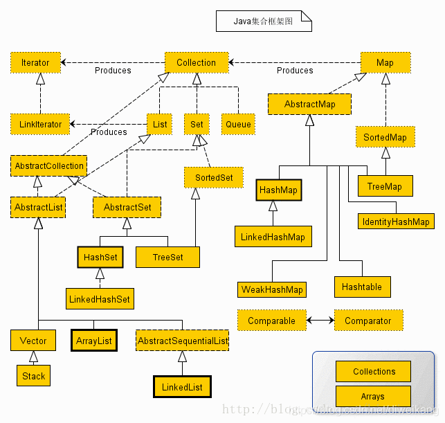
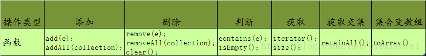

# 1. 容器

[廖雪峰java容器](https://www.liaoxuefeng.com/wiki/1252599548343744/1255943629175808)

[Java集合框架关系图](https://blog.csdn.net/diweikang/article/details/88381601)

所有实现Collection接口的类都必须提供两个标准的构造函数：无参数的构造函数用于创建一个空的Collection；有一个Collection参数的构造函数用于创建一个新的Collection，这个新的Collection与传入的Collection有相同的元素。后一个构造函数允许用户复制一个Collection。

    （1）List：有序，可以存放重复的内容
    （2）Set：无序，不能存放重复的内容，所以的重复内容靠hashCode()和equals()两个方法区分
    （3）Queue：队列接口
    （4）SortedSet：可以对集合中的数据进行排序

Collection定义了集合框架的共性功能。

