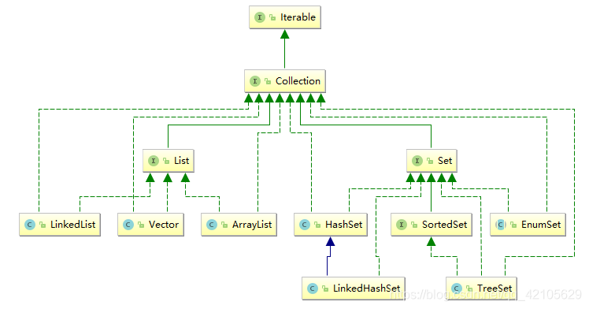
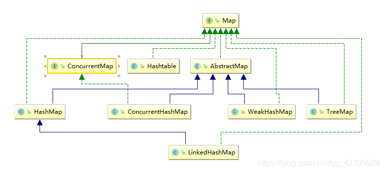

# 1. java基本数据结构总结
https://blog.csdn.net/Earl211/article/details/51594814


```
Collection

├ List
│├ LinkedList
│├ ArrayList
│└ Vector
│　└ Stack
└ Set

Map
├ Hashtable
├ HashMap
└ WeakHashMap

```


[Java中常用集合的关系和数据结构的不同（UML类图详细展示）](https://blog.csdn.net/qq_42105629/article/details/97545510)

**Collection**





区别:

List，有序，可重复，可以迭代也可以直接根据下标获取元素。Set无序，不可重复，,只能用迭代获取元素。不能直接遍历集合获取

ArrayList ，基于数组实现的非线程安全的集合。查询元素快，插入，删除中间元素慢。
初始容量 10 ，扩容机制 L *3/2+1

LinkedList ，基于链表实现的非线程安全的集合。查询元素慢，插入，删除中间元素快。

Vector，提供了随机访问功能,在Vector中，我们即可以通过元素的序号快速获取元素对象,线程安全的。

HashSet，使用HASH算法来存储集合中的元素，因此具有良好的存取和查找性能。当向HashSet集合中存入一个元素时，HashSet会调用该对象的hashCode()方法来得到该对象的hashCode值，然后根据该HashCode值决定该对象在HashSet中的存储位置。值得主要的是，HashSet集合判断两个元素相等的标准是两个对象通过equals()方法比较相等，并且两个对象的hashCode()方法的返回值相等。

SortedSet：此接口主要用于排序操作，即实现此接口的子类都属于排序的子类

TreeSet：TreeSet是SortedSet接口的实现类，TreeSet可以确保集合元素处于排序状态。


**Map**




区别

HashMap使用位桶和链表实现（最近的jdk1.8改用红黑树存储而非链表），它是线程不安全的Map，方法上都没有synchronize关键字修饰,但实现效率较快。

hashTable是线程安全的一个map实现类，它实现线程安全的方法是在各个方法上添加了synchronize关键字。但实现效率较慢。

ConcurrentHashMap，这个map实现类是在jdk1.5中加入的，其在jdk1.6/1.7中的主要实现原理是segment段锁，它不再使用和HashTable一样的synchronize一样的关键字对整个方法进行枷锁，而是转而利用segment段落锁来对其进行加锁，以保证Map的多线程安全。

WeakHashMap,和HashMap一样，也是一个散列表，它存储的内容也是键值对(key-value)映射，而且键和值都可以是null,不过WeakHashMap的键是“弱键”。在 WeakHashMap 中，当某个键不再正常使用时，会被从WeakHashMap中被自动移除。更精确地说，对于一个给定的键，其映射的存在并不阻止垃圾回收器对该键的丢弃，这就使该键成为可终止的，被终止，然后被回收。某个键被终止时，它对应的键值对也就从映射中有效地移除了。

TreeMap,基于红黑树算法实现，与HashMap相比，它是一个能比较元素大小的Map集合，会对传入的key进行了大小排序。其中，可以使用元素的自然顺序，也可以使用集合中自定义的比较器来进行排序；不同于HashMap的哈希映射，TreeMap底层实现了树形结构，至于具体形态，你可以简单的理解为一颗倒过来的树—根在上–叶在下。如果用计算机术语来说的话，TreeMap实现了红黑树的结构，形成了一颗二叉树。


-------------------------------------------------------------

各类数据结构的遍历问题、转换问题。
https://blog.csdn.net/ldllovegyh/article/details/82721934
java中数组、List、Map、Set等几种数据结构的遍历问题。编程实现了在web项目中常用的json数据格式与List、Map、java对象之间的相互转换。


--------------------------------------------------


有一小部分集合类是遗留类，不应该继续使用：

Hashtable：一种线程安全的Map实现；
Vector：一种线程安全的List实现；
Stack：基于Vector实现的LIFO的栈。


还有一小部分接口是遗留接口，也不应该继续使用：

Enumeration<E>：已被Iterator<E>取代。


