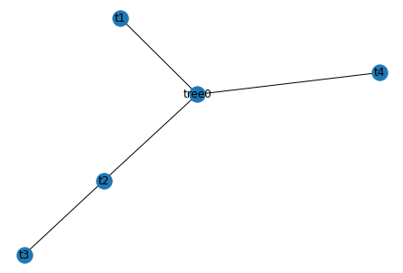

## 1.1. 首先python表示多叉树结构


```python
    from MultiwayTree import *
```


```python
#测试
Test = MultiTree('tree0')
help(Test)
```

    Help on MultiTree in module MultiwayTree object:
    
    class MultiTree(builtins.object)
     |  MultiTree(tree_root_name='root')
     |  
     |  树的操作：
     |  增、删、改、查
     |  
     |  Methods defined here:
     |  
     |  __init__(self, tree_root_name='root')
     |      Initialize self.  See help(type(self)) for accurate signature.
     |  
     |  add(self, node, parent=None)
     |      增加节点
     |  
     |  add_recursion(self, parent, node, tree)
     |      增加节点时使用的递归函数
     |  
     |  delete(self, node)
     |      删除节点
     |  
     |  if_node_exist_recursion(self, tree, node, search, if_del)
     |      tree:需要判断是否存在node节点的树
     |      node:需要判断的节点
     |      search:当检索到该节点时是否返回该节点的父节点和所有子节点
     |      if_del:当检索到该节点时是否删除该节点
     |  
     |  modify(self, node, new_parent=None)
     |      修改节点的父节点
     |  
     |  print_T_value(self)
     |      打印树上的根节点名称和对应值
     |  
     |  print_childnode_name_value(self, child)
     |      递归打印子树节点的名称和对应值
     |  
     |  search(self, node)
     |      检索节点
     |      打印出其父节点的name以及其下一层所有子节点的name
     |  
     |  show_tree(self)
     |      利用networkx转换成图结构，方便结合matplotlib将树画出来
     |  
     |  to_graph_recursion(self, tree, G)
     |      将节点加入到图中
     |  
     |  ----------------------------------------------------------------------
     |  Data descriptors defined here:
     |  
     |  __dict__
     |      dictionary for instance variables (if defined)
     |  
     |  __weakref__
     |      list of weak references to the object (if defined)


​    


```python
t1 = TreeNode('t1')
Test.add(t1)
t2 = TreeNode('t2')
Test.add(t2)
t3 = TreeNode('t3')
t4 = TreeNode('t4')
Test.add(t3,t2)
Test.add(t4)
t3.nodevalue = 2
Test.show_tree()

#dir(t2.children)
for i in Test.tree.children:
    print(i.nodevalue)
    print(i.name)

#max(float("-inf"),5)
print(t3.children == [])
 

```





    -1
    t1
    -1
    t2
    -1
    t4
    True


上面是测试代码

下面是直接得到


```python
 class Answer(object):
    '''
    树的节点
    '''

    def __init__(self):
        self.beta_pruning_list = []
        self.alpha_pruning_list = []
    
    def print_answer(self):
        for node in self.beta_pruning_list:
            print("beta_pruning节点",node.name,"值:",node.nodevalue)
        for node in self.alpha_pruning_list:
            print("alpha_pruning节点",node.name,"值:",node.nodevalue)

answer0 = Answer()

def AlphaBetaPruning(nodestate,alpha,beta,ifMaxplayer):
    """
    alpha Beta Pruning Algorithm
    """
    print("这次递归访问结点",nodestate.name)
    if nodestate.children == []:
        return nodestate.nodevalue
    if ifMaxplayer:
        nodestate.nodevalue = float("-inf")
        for child in nodestate.children:
            nodestate.nodevalue = max(nodestate.nodevalue,AlphaBetaPruning(child,alpha,beta,False))
            alpha = max(alpha,nodestate.nodevalue)
            if beta <= alpha:
                answer0.beta_pruning_list.append(child)
                break #beta pruning
        return nodestate.nodevalue #what if  return alpha?
    else:
        nodestate.nodevalue = float("inf")
        for child in nodestate.children:
            nodestate.nodevalue = min(nodestate.nodevalue,AlphaBetaPruning(child,alpha,beta,True))
            beta = min(beta,nodestate.nodevalue)
            if beta <= alpha:
                answer0.alpha_pruning_list.append(child)
                break #alpha pruning
        return nodestate.nodevalue #what if  return alpha?
```


```python
AlphaBetaPruning(Test.tree,float("-inf"),float("inf"),True)
```

    这次递归访问结点 tree0
    这次递归访问结点 t1
    这次递归访问结点 t2
    这次递归访问结点 t3
    这次递归访问结点 t4


    2


```python
answer0.print_answer()#打印出来的的pruning是指剪枝前访问的那个节点，显示节点的下一个分支剪枝
```


```python
Test.print_T_value()
```

    节点 tree0 值: 2
    节点 t1 值: -1
    节点 t2 值: 2
    节点 t3 值: 2
    节点 t4 值: -1


# 2. Alpha Beta pruning


看绿色的标号


```python
T = MultiTree('n0')
n1 = TreeNode('n1')#初始值-1
n2 = TreeNode('n2')
n3 = TreeNode('n3')
n4 = TreeNode('n4')
n5 = TreeNode('n5')
n6 = TreeNode('n6')
n7 = TreeNode('n7')
n8 = TreeNode('n8')
n9 = TreeNode('n9')
n10 = TreeNode('n10')
n11 = TreeNode('n11')
n12 = TreeNode('n12')
n13 = TreeNode('n13')
n14 = TreeNode('n14')
n15 = TreeNode('n15')
n16 = TreeNode('n16')
n17 = TreeNode('n17')
n18 = TreeNode('n18')
n19 = TreeNode('n19')
n20 = TreeNode('n20')
n21 = TreeNode('n21')
n22 = TreeNode('n22')
n23 = TreeNode('n23')
n24 = TreeNode('n24')
n25 = TreeNode('n25')
n26 = TreeNode('n26')
n27 = TreeNode('n27')
n28 = TreeNode('n28')
n29 = TreeNode('n29')
n29.nodevalue = 4
n30 = TreeNode('n30')
n30.nodevalue = 7
n31 = TreeNode('n31')
n31.nodevalue = 5
n32 = TreeNode('n32')
n32.nodevalue = 1
n33 = TreeNode('n33')
n33.nodevalue = 9
n34 = TreeNode('n34')
n34.nodevalue = 3
n35 = TreeNode('n35')
n35.nodevalue = 6
n36 = TreeNode('n36')
n36.nodevalue = 9
n37 = TreeNode('n37')
n37.nodevalue = 8
n38 = TreeNode('n38')
n38.nodevalue = 7
n39 = TreeNode('n39')
n39.nodevalue = 2
n40 = TreeNode('n40')
n40.nodevalue = 5
n41 = TreeNode('n41')
n41.nodevalue = 6
n42 = TreeNode('n42')
n42.nodevalue = 3
n43 = TreeNode('n43')
n43.nodevalue = 6
n44 = TreeNode('n44')
n44.nodevalue = 5
n45 = TreeNode('n45')
n45.nodevalue = 2
n46 = TreeNode('n46')
n46.nodevalue = 7
n47 = TreeNode('n47')
n47.nodevalue = 2
n48 = TreeNode('n48')
n48.nodevalue = 6
n49 = TreeNode('n49')
n49.nodevalue = 3
n50 = TreeNode('n50')
n50.nodevalue = 8
n51 = TreeNode('n51')
n51.nodevalue = 1
n52 = TreeNode('n52')
n52.nodevalue = 4
n53 = TreeNode('n53')
n53.nodevalue = 0
n54 = TreeNode('n54')
n54.nodevalue = 3
n55 = TreeNode('n55')
n55.nodevalue = 1
n56 = TreeNode('n56')
n56.nodevalue = 8
n57 = TreeNode('n57')
n57.nodevalue = 9
n58 = TreeNode('n58')
n58.nodevalue = 3
n59 = TreeNode('n59')
n59.nodevalue = 7
n60 = TreeNode('n60')
n60.nodevalue = 4
n61 = TreeNode('n61')
n61.nodevalue = 2
n62 = TreeNode('n62')
n62.nodevalue = 8
```


```python
T.add(n1)
T.add(n2)
T.add(n3)
T.add(n4, n1)
T.add(n5, n1)
T.add(n6, n2)
T.add(n7, n2)
T.add(n8, n2)
T.add(n9, n3)
T.add(n10, n3)
T.add(n11, n3)
T.add(n12, n4)
T.add(n13, n4)
T.add(n14, n4)
T.add(n15, n5)
T.add(n16, n5)
T.add(n17, n6)
T.add(n18, n6)
T.add(n19, n6)
T.add(n20, n7)
T.add(n21, n8)
T.add(n22, n8)
T.add(n23, n9)
T.add(n24, n9)
T.add(n25, n10)
T.add(n26, n10)
T.add(n27, n11)
T.add(n28, n11)
T.add(n29, n12)
T.add(n30, n12)
T.add(n31, n13)
T.add(n32, n13)
T.add(n33, n13)
T.add(n34, n14)
T.add(n35, n14)
T.add(n36, n15)
T.add(n37, n15)
T.add(n38, n16)
T.add(n39, n16)
T.add(n40, n16)
T.add(n41, n17)
T.add(n42, n17)
T.add(n43, n18)
T.add(n44, n18)
T.add(n45, n19)
T.add(n46, n19)
T.add(n47, n20)
T.add(n48, n21)
T.add(n49, n21)
T.add(n50, n22)
T.add(n51, n22)
T.add(n52, n23)
T.add(n53, n23)
T.add(n54, n24)
T.add(n55, n24)
T.add(n56, n25)
T.add(n57, n25)
T.add(n58, n26)
T.add(n59, n26)
T.add(n60, n27)
T.add(n61, n28)
T.add(n62, n28)#n28节点后继n62
T.search(n17)
#T.delete(n1)# del n1子树
#T.add(n1)#n1子树子图加回去
#T.add(TreeNode('Insert'), Nxxx)#Error: Parent node Nxxx doesn't exist!
#T.modify(Append, G)#Append及其子树连接在G上
T.show_tree()
```

    n17's parent:
    'n6'
    n17's children:
    ['n41', 'n42']
    ******************************


```python
print(n62.nodevalue)
```

    8


## 2.1. return v


```python
 class Answer(object):
    '''
    树的节点
    '''

    def __init__(self):
        self.beta_pruning_list = []
        self.alpha_pruning_list = []
    
    def print_answer(self):
        for node in self.beta_pruning_list:
            print("beta_pruning节点",node.name,"值:",node.nodevalue)
        for node in self.alpha_pruning_list:
            print("alpha_pruning节点",node.name,"值:",node.nodevalue)

answer1 = Answer()

def AlphaBetaPruning(nodestate,alpha,beta,ifMaxplayer):
    """
    alpha Beta Pruning Algorithm
    """
    print("这次递归访问结点",nodestate.name,"传下来的Alpha值",alpha,"传下来的Beta值",beta)
    if nodestate.children == []:
        return nodestate.nodevalue#叶子节点返回 值
    if ifMaxplayer:
        nodestate.nodevalue = float("-inf")
        for child in nodestate.children:
            nodestate.nodevalue = max(nodestate.nodevalue,AlphaBetaPruning(child,alpha,beta,False))
            alpha = max(alpha,nodestate.nodevalue)
            print("这次递归更新Alpha",alpha,"上级传下来的Beta",beta)
            if beta <= alpha:
                answer1.beta_pruning_list.append(child)
                break #beta pruning
        return nodestate.nodevalue #what if  return alpha?
    else:
        nodestate.nodevalue = float("inf")
        for child in nodestate.children:
            nodestate.nodevalue = min(nodestate.nodevalue,AlphaBetaPruning(child,alpha,beta,True))
            beta = min(beta,nodestate.nodevalue)
            print("这次递归更新Beta",beta,"上级传下来的Alpha",alpha)
            if beta <= alpha:
                answer1.alpha_pruning_list.append(child)
                break #alpha pruning
        print("这次递归返回",nodestate.name,"节点值",nodestate.nodevalue)
        return nodestate.nodevalue #what if  return alpha?
```


```python
AlphaBetaPruning(T.tree,float("-inf"),float("inf"),True)
```

    这次递归访问结点 n0 传下来的Alpha值 -inf 传下来的Beta值 inf
    这次递归访问结点 n1 传下来的Alpha值 -inf 传下来的Beta值 inf
    这次递归访问结点 n4 传下来的Alpha值 -inf 传下来的Beta值 inf
    这次递归访问结点 n12 传下来的Alpha值 -inf 传下来的Beta值 inf
    这次递归访问结点 n29 传下来的Alpha值 -inf 传下来的Beta值 inf
    这次递归更新Beta 4 上级传下来的Alpha -inf
    这次递归访问结点 n30 传下来的Alpha值 -inf 传下来的Beta值 4
    这次递归更新Beta 4 上级传下来的Alpha -inf
    这次递归返回 n12 节点值 4
    这次递归更新Alpha 4 上级传下来的Beta inf
    这次递归访问结点 n13 传下来的Alpha值 4 传下来的Beta值 inf
    这次递归访问结点 n31 传下来的Alpha值 4 传下来的Beta值 inf
    这次递归更新Beta 5 上级传下来的Alpha 4
    这次递归访问结点 n32 传下来的Alpha值 4 传下来的Beta值 5
    这次递归更新Beta 1 上级传下来的Alpha 4
    这次递归返回 n13 节点值 1
    这次递归更新Alpha 4 上级传下来的Beta inf
    这次递归访问结点 n14 传下来的Alpha值 4 传下来的Beta值 inf
    这次递归访问结点 n34 传下来的Alpha值 4 传下来的Beta值 inf
    这次递归更新Beta 3 上级传下来的Alpha 4
    这次递归返回 n14 节点值 3
    这次递归更新Alpha 4 上级传下来的Beta inf
    这次递归更新Beta 4 上级传下来的Alpha -inf
    这次递归访问结点 n5 传下来的Alpha值 -inf 传下来的Beta值 4
    这次递归访问结点 n15 传下来的Alpha值 -inf 传下来的Beta值 4
    这次递归访问结点 n36 传下来的Alpha值 -inf 传下来的Beta值 4
    这次递归更新Beta 4 上级传下来的Alpha -inf
    这次递归访问结点 n37 传下来的Alpha值 -inf 传下来的Beta值 4
    这次递归更新Beta 4 上级传下来的Alpha -inf
    这次递归返回 n15 节点值 8
    这次递归更新Alpha 8 上级传下来的Beta 4
    这次递归更新Beta 4 上级传下来的Alpha -inf
    这次递归返回 n1 节点值 4
    这次递归更新Alpha 4 上级传下来的Beta inf
    这次递归访问结点 n2 传下来的Alpha值 4 传下来的Beta值 inf
    这次递归访问结点 n6 传下来的Alpha值 4 传下来的Beta值 inf
    这次递归访问结点 n17 传下来的Alpha值 4 传下来的Beta值 inf
    这次递归访问结点 n41 传下来的Alpha值 4 传下来的Beta值 inf
    这次递归更新Beta 6 上级传下来的Alpha 4
    这次递归访问结点 n42 传下来的Alpha值 4 传下来的Beta值 6
    这次递归更新Beta 3 上级传下来的Alpha 4
    这次递归返回 n17 节点值 3
    这次递归更新Alpha 4 上级传下来的Beta inf
    这次递归访问结点 n18 传下来的Alpha值 4 传下来的Beta值 inf
    这次递归访问结点 n43 传下来的Alpha值 4 传下来的Beta值 inf
    这次递归更新Beta 6 上级传下来的Alpha 4
    这次递归访问结点 n44 传下来的Alpha值 4 传下来的Beta值 6
    这次递归更新Beta 5 上级传下来的Alpha 4
    这次递归返回 n18 节点值 5
    这次递归更新Alpha 5 上级传下来的Beta inf
    这次递归访问结点 n19 传下来的Alpha值 5 传下来的Beta值 inf
    这次递归访问结点 n45 传下来的Alpha值 5 传下来的Beta值 inf
    这次递归更新Beta 2 上级传下来的Alpha 5
    这次递归返回 n19 节点值 2
    这次递归更新Alpha 5 上级传下来的Beta inf
    这次递归更新Beta 5 上级传下来的Alpha 4
    这次递归访问结点 n7 传下来的Alpha值 4 传下来的Beta值 5
    这次递归访问结点 n20 传下来的Alpha值 4 传下来的Beta值 5
    这次递归访问结点 n47 传下来的Alpha值 4 传下来的Beta值 5
    这次递归更新Beta 2 上级传下来的Alpha 4
    这次递归返回 n20 节点值 2
    这次递归更新Alpha 4 上级传下来的Beta 5
    这次递归更新Beta 2 上级传下来的Alpha 4
    这次递归返回 n2 节点值 2
    这次递归更新Alpha 4 上级传下来的Beta inf
    这次递归访问结点 n3 传下来的Alpha值 4 传下来的Beta值 inf
    这次递归访问结点 n9 传下来的Alpha值 4 传下来的Beta值 inf
    这次递归访问结点 n23 传下来的Alpha值 4 传下来的Beta值 inf
    这次递归访问结点 n52 传下来的Alpha值 4 传下来的Beta值 inf
    这次递归更新Beta 4 上级传下来的Alpha 4
    这次递归返回 n23 节点值 4
    这次递归更新Alpha 4 上级传下来的Beta inf
    这次递归访问结点 n24 传下来的Alpha值 4 传下来的Beta值 inf
    这次递归访问结点 n54 传下来的Alpha值 4 传下来的Beta值 inf
    这次递归更新Beta 3 上级传下来的Alpha 4
    这次递归返回 n24 节点值 3
    这次递归更新Alpha 4 上级传下来的Beta inf
    这次递归更新Beta 4 上级传下来的Alpha 4
    这次递归返回 n3 节点值 4
    这次递归更新Alpha 4 上级传下来的Beta inf


    4


```python
answer1.print_answer()#打印出来的的pruning是指剪枝前访问的那个节点，显示节点的下一个分支剪枝
```

    beta_pruning节点 n15 值: 8
    alpha_pruning节点 n32 值: 1
    alpha_pruning节点 n34 值: 3
    alpha_pruning节点 n42 值: 3
    alpha_pruning节点 n45 值: 2
    alpha_pruning节点 n47 值: 2
    alpha_pruning节点 n7 值: 2
    alpha_pruning节点 n52 值: 4
    alpha_pruning节点 n54 值: 3
    alpha_pruning节点 n9 值: 4


```python
T.print_T_value()#-1是表示没被搜索到的也就是被剪掉的节点
# n5 = 8
```

    节点 n0 值: 4
    节点 n1 值: 4
    节点 n4 值: 4
    节点 n12 值: 4
    节点 n29 值: 4
    节点 n30 值: 7
    节点 n13 值: 1
    节点 n31 值: 5
    节点 n32 值: 1
    节点 n33 值: 9
    节点 n14 值: 3
    节点 n34 值: 3
    节点 n35 值: 6
    节点 n5 值: 8
    节点 n15 值: 8
    节点 n36 值: 9
    节点 n37 值: 8
    节点 n16 值: -1
    节点 n38 值: 7
    节点 n39 值: 2
    节点 n40 值: 5
    节点 n2 值: 2
    节点 n6 值: 5
    节点 n17 值: 3
    节点 n41 值: 6
    节点 n42 值: 3
    节点 n18 值: 5
    节点 n43 值: 6
    节点 n44 值: 5
    节点 n19 值: 2
    节点 n45 值: 2
    节点 n46 值: 7
    节点 n7 值: 2
    节点 n20 值: 2
    节点 n47 值: 2
    节点 n8 值: -1
    节点 n21 值: -1
    节点 n48 值: 6
    节点 n49 值: 3
    节点 n22 值: -1
    节点 n50 值: 8
    节点 n51 值: 1
    节点 n3 值: 4
    节点 n9 值: 4
    节点 n23 值: 4
    节点 n52 值: 4
    节点 n53 值: 0
    节点 n24 值: 3
    节点 n54 值: 3
    节点 n55 值: 1
    节点 n10 值: -1
    节点 n25 值: -1
    节点 n56 值: 8
    节点 n57 值: 9
    节点 n26 值: -1
    节点 n58 值: 3
    节点 n59 值: 7
    节点 n11 值: -1
    节点 n27 值: -1
    节点 n60 值: 4
    节点 n28 值: -1
    节点 n61 值: 2
    节点 n62 值: 8


```python
T.show_tree()
```


## 2.2. 如果return alpha/beta而不是v


```python
 class Answer(object):
    '''
    树的节点
    '''

    def __init__(self):
        self.beta_pruning_list = []
        self.alpha_pruning_list = []
    
    def print_answer(self):
        for node in self.beta_pruning_list:
            print("beta_pruning节点",node.name,"值:",node.nodevalue)
        for node in self.alpha_pruning_list:
            print("alpha_pruning节点",node.name,"值:",node.nodevalue)

answer2 = Answer()

def AlphaBetaPruning2(nodestate,alpha,beta,ifMaxplayer):
    """
    alpha Beta Pruning Algorithm
    """
    print("这次递归访问结点",nodestate.name,"传下来的Alpha值",alpha,"传下来的Beta值",beta)
    if nodestate.children == []:
        return nodestate.nodevalue
    if ifMaxplayer:
        nodestate.nodevalue = float("-inf")
        for child in nodestate.children:
            nodestate.nodevalue = max(nodestate.nodevalue,AlphaBetaPruning2(child,alpha,beta,False))
            alpha = max(alpha,nodestate.nodevalue)
            print("这次递归更新Alpha",alpha,"上级传下来的Beta",beta)
            if beta <= alpha:
                answer2.beta_pruning_list.append(child)
                break #beta pruning
        return alpha#what if  return alpha?
    else:
        nodestate.nodevalue = float("inf")
        for child in nodestate.children:
            nodestate.nodevalue = min(nodestate.nodevalue,AlphaBetaPruning2(child,alpha,beta,True))
            beta = min(beta,nodestate.nodevalue)
            print("这次递归更新Beta",beta,"上级传下来的Alpha",alpha)
            if beta <= alpha:
                answer2.alpha_pruning_list.append(child)
                break #alpha pruning
        print("这次递归返回",nodestate.name,"节点值",nodestate.nodevalue)
        return beta#what if  return beta?
```


```python
AlphaBetaPruning2(T.tree,float("-inf"),float("inf"),True)
```

    这次递归访问结点 n0 传下来的Alpha值 -inf 传下来的Beta值 inf
    这次递归访问结点 n1 传下来的Alpha值 -inf 传下来的Beta值 inf
    这次递归访问结点 n4 传下来的Alpha值 -inf 传下来的Beta值 inf
    这次递归访问结点 n12 传下来的Alpha值 -inf 传下来的Beta值 inf
    这次递归访问结点 n29 传下来的Alpha值 -inf 传下来的Beta值 inf
    这次递归更新Beta 4 上级传下来的Alpha -inf
    这次递归访问结点 n30 传下来的Alpha值 -inf 传下来的Beta值 4
    这次递归更新Beta 4 上级传下来的Alpha -inf
    这次递归返回 n12 节点值 4
    这次递归更新Alpha 4 上级传下来的Beta inf
    这次递归访问结点 n13 传下来的Alpha值 4 传下来的Beta值 inf
    这次递归访问结点 n31 传下来的Alpha值 4 传下来的Beta值 inf
    这次递归更新Beta 5 上级传下来的Alpha 4
    这次递归访问结点 n32 传下来的Alpha值 4 传下来的Beta值 5
    这次递归更新Beta 1 上级传下来的Alpha 4
    这次递归返回 n13 节点值 1
    这次递归更新Alpha 4 上级传下来的Beta inf
    这次递归访问结点 n14 传下来的Alpha值 4 传下来的Beta值 inf
    这次递归访问结点 n34 传下来的Alpha值 4 传下来的Beta值 inf
    这次递归更新Beta 3 上级传下来的Alpha 4
    这次递归返回 n14 节点值 3
    这次递归更新Alpha 4 上级传下来的Beta inf
    这次递归更新Beta 4 上级传下来的Alpha -inf
    这次递归访问结点 n5 传下来的Alpha值 -inf 传下来的Beta值 4
    这次递归访问结点 n15 传下来的Alpha值 -inf 传下来的Beta值 4
    这次递归访问结点 n36 传下来的Alpha值 -inf 传下来的Beta值 4
    这次递归更新Beta 4 上级传下来的Alpha -inf
    这次递归访问结点 n37 传下来的Alpha值 -inf 传下来的Beta值 4
    这次递归更新Beta 4 上级传下来的Alpha -inf
    这次递归返回 n15 节点值 8
    这次递归更新Alpha 4 上级传下来的Beta 4
    这次递归更新Beta 4 上级传下来的Alpha -inf
    这次递归返回 n1 节点值 4
    这次递归更新Alpha 4 上级传下来的Beta inf
    这次递归访问结点 n2 传下来的Alpha值 4 传下来的Beta值 inf
    这次递归访问结点 n6 传下来的Alpha值 4 传下来的Beta值 inf
    这次递归访问结点 n17 传下来的Alpha值 4 传下来的Beta值 inf
    这次递归访问结点 n41 传下来的Alpha值 4 传下来的Beta值 inf
    这次递归更新Beta 6 上级传下来的Alpha 4
    这次递归访问结点 n42 传下来的Alpha值 4 传下来的Beta值 6
    这次递归更新Beta 3 上级传下来的Alpha 4
    这次递归返回 n17 节点值 3
    这次递归更新Alpha 4 上级传下来的Beta inf
    这次递归访问结点 n18 传下来的Alpha值 4 传下来的Beta值 inf
    这次递归访问结点 n43 传下来的Alpha值 4 传下来的Beta值 inf
    这次递归更新Beta 6 上级传下来的Alpha 4
    这次递归访问结点 n44 传下来的Alpha值 4 传下来的Beta值 6
    这次递归更新Beta 5 上级传下来的Alpha 4
    这次递归返回 n18 节点值 5
    这次递归更新Alpha 5 上级传下来的Beta inf
    这次递归访问结点 n19 传下来的Alpha值 5 传下来的Beta值 inf
    这次递归访问结点 n45 传下来的Alpha值 5 传下来的Beta值 inf
    这次递归更新Beta 2 上级传下来的Alpha 5
    这次递归返回 n19 节点值 2
    这次递归更新Alpha 5 上级传下来的Beta inf
    这次递归更新Beta 5 上级传下来的Alpha 4
    这次递归访问结点 n7 传下来的Alpha值 4 传下来的Beta值 5
    这次递归访问结点 n20 传下来的Alpha值 4 传下来的Beta值 5
    这次递归访问结点 n47 传下来的Alpha值 4 传下来的Beta值 5
    这次递归更新Beta 2 上级传下来的Alpha 4
    这次递归返回 n20 节点值 2
    这次递归更新Alpha 4 上级传下来的Beta 5
    这次递归更新Beta 4 上级传下来的Alpha 4
    这次递归返回 n2 节点值 4
    这次递归更新Alpha 4 上级传下来的Beta inf
    这次递归访问结点 n3 传下来的Alpha值 4 传下来的Beta值 inf
    这次递归访问结点 n9 传下来的Alpha值 4 传下来的Beta值 inf
    这次递归访问结点 n23 传下来的Alpha值 4 传下来的Beta值 inf
    这次递归访问结点 n52 传下来的Alpha值 4 传下来的Beta值 inf
    这次递归更新Beta 4 上级传下来的Alpha 4
    这次递归返回 n23 节点值 4
    这次递归更新Alpha 4 上级传下来的Beta inf
    这次递归访问结点 n24 传下来的Alpha值 4 传下来的Beta值 inf
    这次递归访问结点 n54 传下来的Alpha值 4 传下来的Beta值 inf
    这次递归更新Beta 3 上级传下来的Alpha 4
    这次递归返回 n24 节点值 3
    这次递归更新Alpha 4 上级传下来的Beta inf
    这次递归更新Beta 4 上级传下来的Alpha 4
    这次递归返回 n3 节点值 4
    这次递归更新Alpha 4 上级传下来的Beta inf


    4


都能得出结论，不影响结果只影响过程中我们不关心的节点值


```python
answer2.print_answer()
```

    beta_pruning节点 n15 值: 8
    alpha_pruning节点 n32 值: 1
    alpha_pruning节点 n34 值: 3
    alpha_pruning节点 n42 值: 3
    alpha_pruning节点 n45 值: 2
    alpha_pruning节点 n47 值: 2
    alpha_pruning节点 n7 值: 2
    alpha_pruning节点 n52 值: 4
    alpha_pruning节点 n54 值: 3
    alpha_pruning节点 n9 值: 4


```python
T.print_T_value()# n5 =4
```

    节点 n0 值: 4
    节点 n1 值: 4
    节点 n4 值: 4
    节点 n12 值: 4
    节点 n29 值: 4
    节点 n30 值: 7
    节点 n13 值: 1
    节点 n31 值: 5
    节点 n32 值: 1
    节点 n33 值: 9
    节点 n14 值: 3
    节点 n34 值: 3
    节点 n35 值: 6
    节点 n5 值: 4
    节点 n15 值: 8
    节点 n36 值: 9
    节点 n37 值: 8
    节点 n16 值: -1
    节点 n38 值: 7
    节点 n39 值: 2
    节点 n40 值: 5
    节点 n2 值: 4
    节点 n6 值: 5
    节点 n17 值: 3
    节点 n41 值: 6
    节点 n42 值: 3
    节点 n18 值: 5
    节点 n43 值: 6
    节点 n44 值: 5
    节点 n19 值: 2
    节点 n45 值: 2
    节点 n46 值: 7
    节点 n7 值: 2
    节点 n20 值: 2
    节点 n47 值: 2
    节点 n8 值: -1
    节点 n21 值: -1
    节点 n48 值: 6
    节点 n49 值: 3
    节点 n22 值: -1
    节点 n50 值: 8
    节点 n51 值: 1
    节点 n3 值: 4
    节点 n9 值: 4
    节点 n23 值: 4
    节点 n52 值: 4
    节点 n53 值: 0
    节点 n24 值: 3
    节点 n54 值: 3
    节点 n55 值: 1
    节点 n10 值: -1
    节点 n25 值: -1
    节点 n56 值: 8
    节点 n57 值: 9
    节点 n26 值: -1
    节点 n58 值: 3
    节点 n59 值: 7
    节点 n11 值: -1
    节点 n27 值: -1
    节点 n60 值: 4
    节点 n28 值: -1
    节点 n61 值: 2
    节点 n62 值: 8


```python
T.show_tree()
```


可以总结，都是一样的，return啥结果都是一样的，就那九刀，一刀一分。
