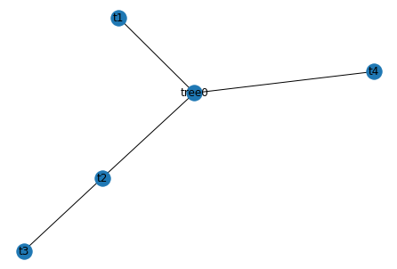

[TOC]


# 1. 多叉树的设计、建立、层次优先遍历和深度优先遍历
https://wenku.baidu.com/view/52e8b849bd64783e09122baf.html cpp一样
https://www.cnblogs.com/unixfy/p/3486179.html
一样更好排版


java多叉树建立遍历
https://my.oschina.net/wangbaofeng/blog/686114


# 2. JavaScript 递归创建多叉树
https://www.jianshu.com/p/bf9af491acc9


# 3. 多叉树 == 图

Python的treelib构建多叉树——快速命名节点id
blog.csdn.net/u012111465/article/details/82908552

Python的treelib构建多叉树——根据id快速建树
blog.csdn.net/u012111465/article/details/82908601 

中文文档
https://www.shuzhiduo.com/A/mo5k0vbMdw/


Python的treelib构建多叉树具体的参考 Useful APIs https://treelib.readthedocs.io/en/latest/pyapi.html


```
from treelib import Node, Tree

tree = Tree()

tree.show()

# # 取得根节点到每一个叶节点的标识路径，返回值为标识list列表的list列表（二重列表），根节点不省略

tree.paths_to_leaves()

# # 建议使用remove_node来删除节点，因为remove_subtree将消耗内存以存储新树（返回值）

# # 移除以nid标识的节点，同时移除其所有的子节点 ,返回值为移除的节点个

tree.remove_node( identifier)

# # 移除以nid标识为根节点的一棵子树 ,返回值为移除该子树的树，nid不存在则返回一个空树

remove_subtree(self, nid)

# # 返回所有叶节点对象list列表，若给定root则返回以root为根节点的树的所有叶节点对象list列表

leaves(self, root=None)

# # 返回以nid为标识(identifier)子节点，nid不存在则返回list为空

children(self, nid)

# # 返回以nid为标识(identifier)父节点，nid不存在则返回list为空

parent(self, nid) 


tree.create_node('ROOT','root')  # root node

tree.create_node(temps[yy][xx],temps_id[yy][xx],parent="root")
 
```


# 4. 多叉树图python


https://blog.csdn.net/AlanConstantineLau/article/details/81176348
https://github.com/AlanConstantine/MachineLearningNote/tree/master/MultiwayTree


```python
    from MultiwayTree import *
```


```python
#测试
Test = MultiTree('tree0')
help(Test)
```

    Help on MultiTree in module MultiwayTree object:
    
    class MultiTree(builtins.object)
     |  MultiTree(tree_root_name='root')
     |  
     |  树的操作：
     |  增、删、改、查
     |  
     |  Methods defined here:
     |  
     |  __init__(self, tree_root_name='root')
     |      Initialize self.  See help(type(self)) for accurate signature.
     |  
     |  add(self, node, parent=None)
     |      增加节点
     |  
     |  add_recursion(self, parent, node, tree)
     |      增加节点时使用的递归函数
     |  
     |  delete(self, node)
     |      删除节点
     |  
     |  if_node_exist_recursion(self, tree, node, search, if_del)
     |      tree:需要判断是否存在node节点的树
     |      node:需要判断的节点
     |      search:当检索到该节点时是否返回该节点的父节点和所有子节点
     |      if_del:当检索到该节点时是否删除该节点
     |  
     |  modify(self, node, new_parent=None)
     |      修改节点的父节点
     |  
     |  print_T_value(self)
     |      打印树上的根节点名称和对应值
     |  
     |  print_childnode_name_value(self, child)
     |      递归打印子树节点的名称和对应值
     |  
     |  search(self, node)
     |      检索节点
     |      打印出其父节点的name以及其下一层所有子节点的name
     |  
     |  show_tree(self)
     |      利用networkx转换成图结构，方便结合matplotlib将树画出来
     |  
     |  to_graph_recursion(self, tree, G)
     |      将节点加入到图中
     |  
     |  ----------------------------------------------------------------------
     |  Data descriptors defined here:
     |  
     |  __dict__
     |      dictionary for instance variables (if defined)
     |  
     |  __weakref__
     |      list of weak references to the object (if defined)


​    


```python
t1 = TreeNode('t1')
Test.add(t1)
t2 = TreeNode('t2')
Test.add(t2)
t3 = TreeNode('t3')
t4 = TreeNode('t4')
Test.add(t3,t2)
Test.add(t4)
t3.nodevalue = 2
Test.show_tree()

#dir(t2.children)
for i in Test.tree.children:
    print(i.nodevalue)
    print(i.name)

#max(float("-inf"),5)
print(t3.children == [])
 

```





    -1
    t1
    -1
    t2
    -1
    t4
    True


上面是测试代码

下面是直接得到


```python
 class Answer(object):
    '''
    树的节点
    '''

    def __init__(self):
        self.beta_pruning_list = []
        self.alpha_pruning_list = []
    
    def print_answer(self):
        for node in self.beta_pruning_list:
            print("beta_pruning节点",node.name,"值:",node.nodevalue)
        for node in self.alpha_pruning_list:
            print("alpha_pruning节点",node.name,"值:",node.nodevalue)

answer0 = Answer()

def AlphaBetaPruning(nodestate,alpha,beta,ifMaxplayer):
    """
    alpha Beta Pruning Algorithm
    """
    print("这次递归访问结点",nodestate.name)
    if nodestate.children == []:
        return nodestate.nodevalue
    if ifMaxplayer:
        nodestate.nodevalue = float("-inf")
        for child in nodestate.children:
            nodestate.nodevalue = max(nodestate.nodevalue,AlphaBetaPruning(child,alpha,beta,False))
            alpha = max(alpha,nodestate.nodevalue)
            if beta <= alpha:
                answer0.beta_pruning_list.append(child)
                break #beta pruning
        return nodestate.nodevalue #what if  return alpha?
    else:
        nodestate.nodevalue = float("inf")
        for child in nodestate.children:
            nodestate.nodevalue = min(nodestate.nodevalue,AlphaBetaPruning(child,alpha,beta,True))
            beta = min(beta,nodestate.nodevalue)
            if beta <= alpha:
                answer0.alpha_pruning_list.append(child)
                break #alpha pruning
        return nodestate.nodevalue #what if  return alpha?
```


```python
AlphaBetaPruning(Test.tree,float("-inf"),float("inf"),True)
```

    这次递归访问结点 tree0
    这次递归访问结点 t1
    这次递归访问结点 t2
    这次递归访问结点 t3
    这次递归访问结点 t4


    2


```python
answer0.print_answer()#打印出来的的pruning是指剪枝前访问的那个节点，显示节点的下一个分支剪枝
```


```python
Test.print_T_value()
```

    节点 tree0 值: 2
    节点 t1 值: -1
    节点 t2 值: 2
    节点 t3 值: 2
    节点 t4 值: -1


