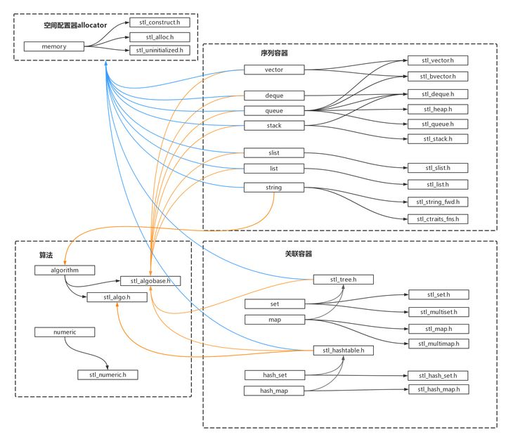

怎么查看C++库函数的源码？ - PegasusWang的回答 - 知乎
https://www.zhihu.com/question/23705240/answer/25400531 
系不系芥个：C:\Program Files (x86)\Microsoft Visual Studio\2019\Community\VC\Tools\MSVC\14.27.29110\include，我在这里找到不包含扩展名的iostream,stack,queue,map,string,set,vector,.......

最简单的方法：调试，设个断点，按F11跟进去。

《STL源码剖析》提炼总结：概览 - 默然的文章 - 知乎
https://zhuanlan.zhihu.com/p/31505598

STL"源码"剖析-重点知识总结
https://www.cnblogs.com/luoxn28/p/5671988.html 读书笔记

# STL总结

[STL中map、set的数据结构及底层实现](https://blog.csdn.net/pirlck/article/details/51326547)

 本文分析了STL的map和set

vector（向量）——STL中标准而安全的数组。只能在vector 的“前面”增加数据。

deque（双端队列double-ended queue）——在功能上和vector相似，但是可以在前后两端向其中添加数据。 

list（列表）——游标一次只可以移动一步。如果你对链表已经很熟悉，那么STL中的list则是一个双向链表（每个节点有指向前驱和指向后继的两个指针）。

set（集合）——包含了经过排序了的数据，这些数据的值(value)必须是唯一的。

map （映射）——经过排序了的二元组的集合，map中的每个元素都是由两个值组成，其中的key（键值，一个map中的键值必须是唯一的）是在排序或搜索时使用，它的值可以在容器中重新获取；而另一个值是该元素关联的数值。比如，除了可以ar[43] = "overripe"这样找到一个数据，map还可以通过ar["banana"] = "overripe"这样的方法找到一个数据。如果你想获得其中的元素信息，通过输入元素的全名就可以轻松实现。

multiset（多重集）——和集合（set）相似，然而其中的值不要求必须是唯一的（即可以有重复）。

multimap（多重映射）——和映射（map）相似，然而其中的键值不要求必须是唯一的（即可以有重复）。

STL map和set的使用虽不复杂，但也有一些不易理解的地方，如：
# 为何map和set的插入删除效率比用其他序列容器高？
# 为何每次insert之后，以前保存的iterator不会失效？
# 为何map和set不能像vector一样有个reserve函数来预分配数据？
# 当数据元素增多时（10000到20000个比较），map和set的插入和搜索速度变化如何？

C++ STL 之所以得到广泛的赞誉，也被很多人使用，不只是提供了像vector, string, list等方便的容器，更重要的是STL封装了许多复杂的数据结构算法和大量常用数据结构操作。vector封装数组，list封装了链表，map和 set封装了二叉树等，在封装这些数据结构的时候，STL按照程序员的使用习惯，以成员函数方式提供的常用操作，如：插入、排序、删除、查找等。让用户在 STL使用过程中，并不会感到陌生。

C++ STL中标准关联容器set, multiset, map,multimap内部采用的就是一种非常高效的平衡检索二叉树：红黑树，也成为RB树(Red-Black Tree)。RB树的统计性能要好于一般的平衡二叉树(有些书籍根据作者姓名，Adelson-Velskii和Landis，将其称为AVL-树)，所以被STL选择作为了关联容器的内部结构。本文并不会介绍详细AVL树和RB树的实现以及他们的优劣，关于RB树的详细实现参看红黑树: 理论与实现(理论篇)。本文针对开始提出的几个问题的回答，来向大家简单介绍map和set的底层数据结构。

为何map和set的插入删除效率比用其他序列容器高？

大部分人说，很简单，因为对于关联容器来说，不需要做内存拷贝和内存移动。说对了，确实如此。map和set容器内所有元素都是以节点的方式来存储，其节点结构和链表差不多，指向父节点和子节点。结构图可能如下：

         A
        / \
       B    C
      / \  / \
      D  E F  G

因此插入的时候只需要稍做变换，把节点的指针指向新的节点就可以了。删除的时候类似，稍做变换后把指向删除节点的指针指向其他节点就OK了。这里的一切操作就是指针换来换去，和内存移动没有关系。
为何每次insert之后，以前保存的iterator不会失效？

看见了上面答案的解释，你应该已经可以很容易解释这个问题。iterator这里就相当于指向节点的指针，内存没有变，指向内存的指针怎么会失效呢(当然被删除的那个元素本身已经失效了)。相对于vector来说，每一次删除和插入，指针都有可能失效，调用push_back在尾部插入也是如此。因为为了保证内部数据的连续存放，iterator指向的那块内存在删除和插入过程中可能已经被其他内存覆盖或者内存已经被释放了。即使时push_back的时候，容器内部空间可能不够，需要一块新的更大的内存，只有把以前的内存释放，申请新的更大的内存，复制已有的数据元素到新的内存，最后把需要插入的元素放到最后，那么以前的内存指针自然就不可用了。特别时在和find等算法在一起使用的时候，牢记这个原则：不要使用过期的iterator。

为何map和set不能像vector一样有个reserve函数来预分配数据？

我以前也这么问，究其原理来说时，引起它的原因在于在map和set内部存储的已经不是元素本身了，而是包含元素的节点。也就是说map内部使用的Alloc并不是map<Key, Data,Compare, Alloc>声明的时候从参数中传入的Alloc。例如：
map<int, int, less<int>, Alloc<int> > intmap;  没必要，树的结构有resize操作吗？

这时候在intmap中使用的allocator并不是Alloc<int>, 而是通过了转换的Alloc，具体转换的方法时在内部通过Alloc<int>::rebind重新定义了新的节点分配器，详细的实现参看彻底学习STL中的Allocator。其实你就记住一点，在map和set内面的分配器已经发生了变化，reserve方法你就不要奢望了。

当数据元素增多时（10000和20000个比较），map和set的插入和搜索速度变化如何？
   如果你知道log2的关系你应该就彻底了解这个答案。
内存分配算法：
查阅相关资料后，知道STL的优势并不在于算法，而在于内存碎片。如果你需要经常自己去new一些节点，当节点特别多，而且进行频繁的删除和插入的时候，内存碎片就会存在，而STL采用自己的Allocator分配内存，以内存池的方式来管理这些内存，会大大减少内存碎片，从而会提升系统的整体性能。当时间运行很长时间后（例如后台服务程序），map的优势就会体现出来。从另外一个方面讲，使用map会大大降低你的编码难度，同时增加程序的可读性。学习STL map, STL set之数据结构基础看来是很有必要的。

