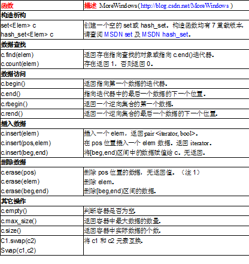

# set与hash_set

[set与hash_set](https://blog.csdn.net/qq_37032670/article/details/77155628)

STL中set与hash_set，hash表基础 https://www.cnblogs.com/CheeseZH/p/5176970.html

1.set中的元素会自动排序，因此插入数据时，如果给定的位置不正确（不符合排序的顺序），会重新找个正确的位置并返回该位置

2.set的迭代器之间不能执行加减运算，比如set.end()-set.begin()会报编译错误，想知道指向某一元素的迭代器距离set容器首元素有多远可以用std::distance(it_first,it_last)函数，它确定两个迭代器之间间隔多少个元素。

3.insert和erase函数中的位置参数都是用迭代器指向的

