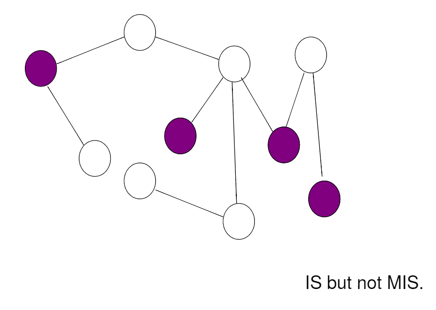
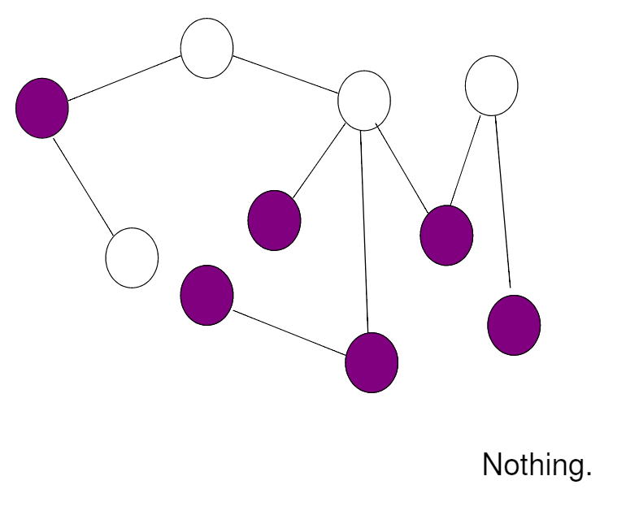
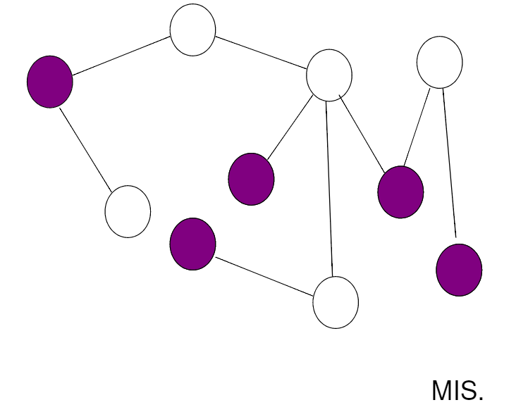

无向图是对称的有向图，特殊的有向图 https://www.baeldung.com/cs/graphs-directed-vs-undirected-graph 熵角度看两种图不一样

https://home.cs.colorado.edu/~srirams/courses/csci2824-spr14/graphs-29.html PPT中说“**An undirected graph is a special kind of directed graph** that occurs when the edge relation is symmetric.  ”

https://cs.stackexchange.com/questions/10274/how-to-find-the-maximum-independent-set-of-a-directed-graph

您正在尝试查找由给定的整数子集和可整除关系定义的位姿的宽度。的宽度是反链的最大数目，这是相同的最大设定在偏序无可比拟元件。

这恰好对应于“可比性图表”中的最大独立集，其中每个整数是一个顶点，并且存在一个边ü 至 v 当且仅当 ü 分界 v。

通常，找到最大独立集是一个难题，但是可比性图是存在高效算法的特例。

迪尔沃思定理将任何姿态的宽度表征为姿态的链状划分（在有向可比性图中从源到宿的路径）。迪尔沃思定理等同于二分匹配上的柯尼格定理，正如您所建议的那样，该定理导致了一种算法。为了使用Konig定理并通过二分匹配找到最大独立集而构造的二分图在上面的Wikipedia链接 https://en.wikipedia.org/wiki/K%C5%91nig%27s_theorem_(graph_theory) 中进行了简单描述。为了完整起见，我们将其包括在此处（以注释形式）：

> In any bipartite graph, the number of edges in a maximum matching equals the number of vertices in a minimum vertex cover.

“定义二部图 G = （U，V，E） 在哪里 ü= V= S [整数集]，其中（u，v）是 G 什么时候 û < v ∈小号 [整数 ü 除整数 v]。根据柯尼格定理，存在一个匹配中号 在 G，以及一组顶点 C 在 G，这样图形中的每个边都包含至少一个顶点 C 这样 中号 和 C 具有相同的基数 米。

“让 一种 是S中与任何顶点都不对应的元素集 C; 然后一种 至少有 n − m 元素（如果更多则可能更多 C在分割的两边都包含与同一元素对应的顶点）。让P 是由 X 和 ÿ 只要有优势，就在同一链中 （x ，y） 在M中; 吨ħ È ÑP^ h一小号n-m $个链。因此，我们构建了一个反链和一个划分成具有相同基数的链的分区。”

一组不同的顶点标签（整数） 一种 是您问题的答案。

Ikiz和Garg的论文《 Dilworth链分区的在线算法》的第3节介绍了两种不同的离线算法来计算链分区，从而计算出您要寻找的独立集合。一种算法是基于Bipartite匹配方法的。

# 1. 有向图的最大独立子集
https://en.wikipedia.org/wiki/Independent_set_(graph_theory)

https://stackoverflow.com/questions/26455583/how-to-find-maximum-independent-set-of-a-directed-acyclic-graph NP问题 How to find maximum independent set of a directed acyclic graph?

chrome-extension://oemmndcbldboiebfnladdacbdfmadadm/http://www.iitg.ac.in/gkd/aie/slide/MIS-PSM.pdf

讲的很明白，这个是说 找出图中任意两点之间不直接相连的点集

Independent Set是独立集，可以继续添加点满足还是独立集

一个点都加不进去的是MIS

MIS中最多点的是独立集

**MaxIS is NP-hard!So let's concentrate on MIS**

