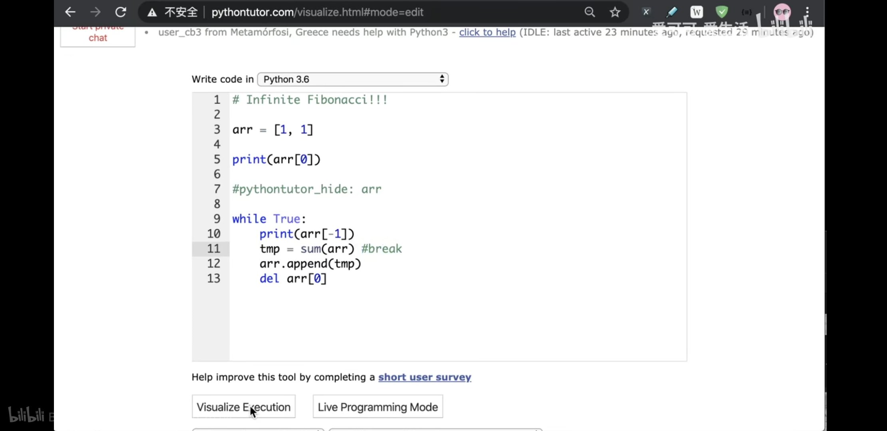

可视化动画工具，真是一个非常棒的帮手。这类工具/网站，

-   **旧金山大学数据结构和算法的可视化学习工具**

> http://hao.jobbole.com/visualizing-algorithms-and-data-structure/
-   **VisuAlgo：通过动画学习算法和数据结构**

> http://hao.jobbole.com/visualgo/

-   **Algomation：查看、创建和分享算法的学习平台**

> http://hao.jobbole.com/algomation/

  

一个同类型的新网站 Algorithm Visualizer，做得很好。  

  

网址是：http://algorithm-visualizer.org


# pythontutor可视化python原理


Python Tutor 是由 Philip Guo 开发的一个免费教育工具，可帮助学生攻克编程学习中的基础障碍，理解每一行源代码在程序执行时在计算机中的过程。  
[http://www.pythontutor.com/](http://www.pythontutor.com/)

  


左侧是源码，右侧执行过程的图示。点击源码下方的“Forward”和“Back”可进行相应操作。


GitHub 开源：  
[https://github.com/pgbovine/OnlinePythonTutor/](https://github.com/pgbovine/OnlinePythonTutor/)


```python
# -*- coding: UTF-8 -*-
t = (1,2,[30,40])
t[2] += [50,60]
```


本地化PythonTutor，目的是为了更快更方便的使用。

PythonTutor的网站：[http://www.pythontutor.com/](http://www.pythontutor.com/) 

项目的两个下载地址：

github地址（完整版）：[https://github.com/pgbovine/OnlinePythonTutor](https://github.com/pgbovine/OnlinePythonTutor)

北邮陈光提供（精简版）：[https://fly51fly.lanzous.com/ibrhwuh](https://fly51fly.lanzous.com/ibrhwuh)

下载解压后，在cmd中输入：

```bash
pip install bottle
cd OnlinePythonTutor/v5-unity/
python bottle_server.py
```

然后在浏览器中输入：[http://localhost:8003/visualize.html](http://localhost:8003/visualize.html)或者[http://localhost:8003/live.html](http://localhost:8003/live.html)即可使用


https://b23.tv/xJYKh5  这里就是教程





```

#pythontutor_hide:arr

tmp = sum(arr) #break

```


pythontutor.bat打开python bottle_server.py


```
%windir%\System32\WindowsPowerShell\v1.0\powershell.exe -ExecutionPolicy ByPass -NoExit -Command "& 'C:\ProgramData\Miniconda3\shell\condabin\conda-hook.ps1' ; conda activate 'C:\ProgramData\Miniconda3' ;python bottle_server.py"
```


live.bat


```
start "C:\Program Files (x86)\Google\Chrome\Application\chrome.exe" http://localhost:8003/live.html
```


visualize.bat

```
start "C:\Program Files (x86)\Google\Chrome\Application\chrome.exe" http://localhost:8003/visualize.html
```


