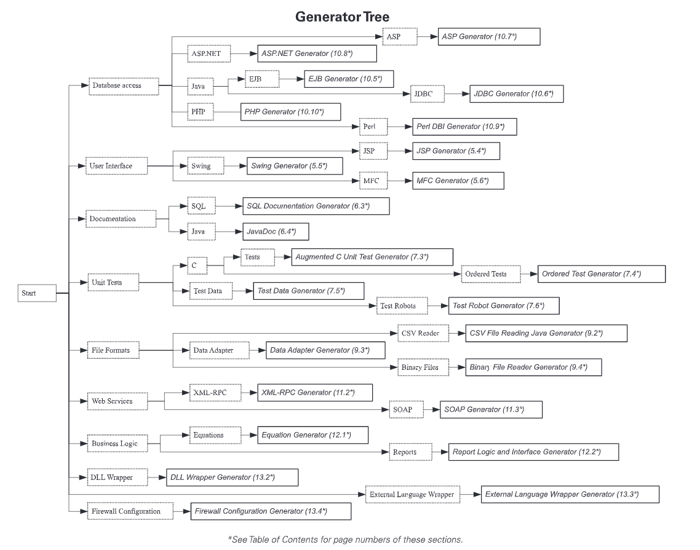

https://tomassetti.me/code-generation/ a introduce of code generate


# DSL
```

第六部分　**代 码 生 成**
第52章基于转换器的代码生成426
52.1工作原理426
52.2使用场景427
52.3安全面板控制器（Java生成的C）427
第53章模板化的生成器431
53.1工作原理431
53.2使用场景432
53.3生成带有嵌套条件的安全控制面板状态机（Velocity和Java生成的C）432
第54章嵌入助手438
54.1工作原理438
54.2使用场景439
54.3安全控制面板的状态（Java和ANTLR）439
54.4助手类应该生成HTML吗（Java和Velocity）442
第55章基于模型的代码生成444
55.1工作原理444
55.2使用场景445
55.3安全控制面板的状态机（C）445
55.4动态载入状态机（C）451
第56章无视模型的代码生成454
56.1工作原理454
56.2使用场景455
56.3使用嵌套条件的安全面板状态机（C）455
第57章代沟457
57.1工作原理457
57.2使用场景458
57.3根据数据结构生成类（Java和一些Ruby）459

```

# Code Generation in Action 



https://www.manning.com/books/code-generation-in-action 源码下载

manning.com/books/code-generation-in-action BOOK


代码生成的主要几种实现方式（来自Jack Herrington《Code Generation in action》）


1、**模板技术**：代码生成通常意味着创建具有复杂结构文本类型的文件。为了维护生成器的简单性和完整性，你可以使用文本模板工具，这样你可以把逻辑的定义和逻辑的代码格式相分离，这是最理想的情况。

模板一直以来都是CodeGeneration的主要实现手段。C++使用模板来实现泛型机制。而众多的建模工具和IDE工具都使用模板来重用代码。在Apache组织的旗下，有一个名为Velocity的项目，它的目的就是提供一种易用的模板技术。

Velocity使用了一种脚本语言，叫做Velocity Template Language (VTL)。目前，Velocity主要用于生成Web站点的动态内容。此外，还有更出色的FreeMaker，它比Velocity更全面，可以说Velocity是轻量级的模板技术，而Freemaker是一个强大重量的模板引擎，相比velocity而言，其强大的过程调用、递归和闭包回调功能让freemaker可以完成几乎所有我们所想的功能。此外还有很多的模板技术，这里就不一一介绍了。

2、**面向属性编程**

英文缩写虽然同样都是AOP，但面向属性编程（Attribute-Oriented Programming ）和面向切面编程（Aspect-Oriented Programming ）可不是一回事。**面向属性编程是通过在代码中添加元数据（属性）的方式来自动产生代码，添加功能**。而这方面最优秀的软件莫过于xDoclet。 ([XDoclet](https://blog.csdn.net/jianxin1009/article/details/9785655)是一个通用的代码生成实用程序，是一个扩展的Javadoc Doclet引擎。它允许您 使用像JavaDoc标记之类的东西来向诸如类、方法和字段之类的语言特征添加元数据。随后，它利用这些额外的元数据来生成诸如部署描述符和源代码之类的相关文件。)

XDoclet 是一个通用的代码生成实用程序,是一个扩展的Javadoc Doclet引擎(现已与Javadoc Doclet独立),XDoclet是EJBDoclet的后继者，而EJBDoclet是由Rickard Oberg发起的。它允许您使用象 JavaDoc 标记之类的东西来向诸如类、方法和字段之类的语言特征添加元数据。随后，它利用这些额外的元数据来生成诸如部署描述符和源代码之类的相关文件。可以让你创建自己的javadoc @tags进而利用XDoclet中的Templet enging基于这些@tags生成源代码或其他文件。

3、MDA（**Model Driven Architecture**模型驱动架构）

MDA能够将**特定的模型转换为特定平台的代码**。AndraMDA就是其中的代表者。在具体实现上，AndraMDA主要采用了模板技术，同时，它也利用了xDoclet技术。所以，AndraMDA是在前两项技术的基础上实现CodeGeneration的。 http://andromda.sourceforge.net/

-----------------------------


行动中的代码生成

涵盖了为当今复杂的应用程序框架构建高质量的机器生成代码的技术和实现。本书包括逐步指导，以构建数十种不同类型的代码生成器。这些生成器生成一致且可维护的高质量输出。代码生成将代码的设计抽象化，以便可以从单个应用程序功能模型创建多个输出，这意味着开发团队可以专注于更高级别的设计工作和战略问题，同时仍能满足维护生产应用程序的目标。该书涵盖的技术范围很广，从处理常见编码问题的简单代码处理器到维护整个应用程序层的更复杂的复杂生成器。


```
第一部分代码生成基础1。总览
1.1。一代案例研究1.1.1。步骤1：生成数据库访问层
1.1.2。步骤2：生成用户界面1.1.3。步骤3：建立客户介面1.1.4。步骤4：构建单元测试1.1.5。步骤5：整合技术变更1.1.6。步骤6：整合设计变更1.1.7。步骤7：建立RPC层
1.1.8。步骤8：建立文件
1.1.9。案例研究结论
1.2。生成代码对工程师的好处
1.3。生成代码对管理人员的好处
1.4。代码生成过程1.4.1。评估需求
1.4.2。铺设基础设施
1.4.3。记录下来
1.4.4。部署它1.4.5。维护它
1.5。购买/建造决定
1.6。最佳代码生成
1.7。十大代码生成规则
1.8。您今天使用的发电机
1.9。概要
2。代码生成基础
2.1。各种形式的活动代码生成
2.1.1。代码纠缠
2.1.2。内联代码扩展器
2.1.3。混合代码生成
2.1.4。局部类生成2.1.5。层或层生成
2.1.6。全域语言
2.2。代码生成工作流程
2.2.1。编辑生成的代码
2.3。代码生成问题
2.3.1。我团队中没有人会接受发电机
2.3.2。工程师将忽略“请勿编辑”注释2.3.3。如果生成器无法构建，则该功能将需要数周的构建时间
2.4。代码生成技巧
2.4.1。使用文字模板
2.4.2。编写正则表达式
2.4.3。解析XML
2.4.4。文件和目录处理
2.4.5。命令行处理
2.5。为代码生成器选择语言
2.5.1。比较代码生成器语言2.5.2。使用Ruby编写代码生成器
2.6。概要
3。代码生成工具
3.1。用Ruby构建生成器
3.2。用Rexml解析XML
3.2.1。使用Rexml


3.3。ERb：模板的绝佳工具
3.3.1。安装和使用ERb
3.3.2。ERb模板
3.3.3。使用ERb构建ASP，JSP等
3.4。构建语言解析器工具箱
3.4.1。在分词器内部
3.4.2。在LanguageScanners内部
3.4.3。语言解析工具
3.5。概要
。构建简单的发电机
4.1。代号发生器类型
4.1.1。用途和示例代码
4.1.2。开发发电机
4.2。内联代码扩展生成器模型
4.2.1。用途和例子4.2.2。开发发电机
4.3。混合代码生成器模型
4.3.1。用途和例子4.3.2。开发发电机4.4。偏类生成器模式4.4.1。用途和例子4.4.2。开发发电机
4.5。层生成器模型
4.5.1。用途和例子4.5.2。开发发电机4.6。为各种语言生成
4.6.1。C

4.6.2。C++
4.6.3。C#4.6.4。爪哇4.6.5。佩尔
4.6.6。的SQL
4.7。概要
第二部分代码生成解决方案5，生成用户界面
5.1。大图
5.1.1。为什么要生成用户界面？
5.1.2。与现有工具和其他生成器集成
5.2。设计一个好的界面
5.3。工作流程比较5.4。案例研究：生成JSP
5.4.1。为什么要生成JSP？
5.4.2。发电机的作用
5.4.3。高层架构
5.4.4。表定义文件
5.4.5。表单定义文件
5.4.6。处理流程
5.4.7。设计发电机5.5。技术：生成Swing对话框
5.5.1。发电机要求
5.5.2。建筑推荐5.5.3。处理流程

5.7。设计技巧
5.8。生成用户界面的工具
5.9。概要6。产生文件
6.1。结构化评论的重要性
6.2。大图
6.3。案例研究：增强型SQL代码
6.3.1。发电机的作用
6.3.2。布置发电机架构
6.3.3。处理流程
6.3.4。为SQL生成器生成代码
6.3.5。执行系统测试6.4。了解JavaDoc和Doclet API
6.5。寻找适合您的工具
6.6。概要
7。生成单元测试
7.1。大图
7.2。准备共同的关注
7.2.1。单元测试将无法维护7.2.2。进行单元测试太难了7.2.3。单元测试将限制我们的灵活性
7.2.4。界面尚未准备好
7.2.5。单元测试不值得花时间7.2.6。将单元测试添加到旧系统很痛苦
7.2.7。单元测试只能证明存在错误


7.3。案例研究：增强的C代码
7.3.1。发电机的作用
7.3.2。布置发电机架构
7.3.3。处理流程
7.3.4。构建单元测试生成器的代码
7.3.5。查找测试用例的工具7.4。技术：订购的测试生成器
7.4.1。发电机的作用
7.4.2。布置发电机架构
7.4.3。处理流程
7.5。技术：测试数据生成器
7.5.1。发电机的作用
7.5.2。布置发电机架构
7.5.3。处理流程
7.5.4。一起使用测试数据生成器和顺序测试生成器
7.6。技术：测试机器人生成器
7.6.1。发电机的作用
7.6.2。布置发电机架构
7.6.3。处理流程
7.6.4。机器人发电机7.7。寻找适合您的工具
7.8。设计技巧
7.9。概要
8。用生成器嵌入SQL8.1。PerlSQL8.2。准备共同的关注
8.2.1.我们正在创造一种新的语言
8.2.2。调试会很痛苦
8.2.3。使用Perl，您可以使用该语言进行操作
8.3。工作流程比较
8.4。案例研究：PerlSQL
8.4.1。发电机的作用
8.4.2。布置发电机架构
8.4.3。处理流程
8.4.4。为PerISQL生成器生成代码
8.4.5。执行系统测试
8.5。查找SQL工具
8.6。概要9。处理数据
9.1。代码生成与库
9.2。案例研究：一个简单的CSV读取示例
9.2.1。发电机的作用
9.2.2。布置发电机架构
9.2.3。处理流程
9.2.4。构建CSV阅读器生成器的代码
9.2.5。执行系统测试9.3。技术：数据适配器9.3.1。发电机的作用
9.3.2。布置发电机架构
9.3.3。处理流程
9.4。技术：二进制文件读取器/写入器
9.4.1。发电机的作用
9.4.2。布置发电机架构


8.4.3。处理流程
8.4.4。为PerISQL生成器生成代码
8.4.5。执行系统测试
8.5。查找SQL工具
8.6。概要9。处理数据
9.1。代码生成与库
9.2。案例研究：一个简单的CSV读取示例
9.2.1。发电机的作用
9.2.2。布置发电机架构
9.2.3。处理流程
9.2.4。构建CSV阅读器生成器的代码
9.2.5。执行系统测试9.3。技术：数据适配器9.3.1。发电机的作用
9.3.2。布置发电机架构
9.3.3。处理流程
9.4。技术：二进制文件读取器/写入器
9.4.1。发电机的作用
9.4.2。布置发电机架构
9.4.3。实施建议9.4.4。处理流程
9.5。寻找适合您的工具
9.6。概要

10。创建数据库访问生成器
10.1。数据库访问生成器的好处10.2。大图
10.2.1。术语
10.2.2。与现有工具集成
10.2.3。与其他发电机一起工作10.3。准备共同的关注
10.3.1。代码将失去控制
10.3.2。我将是唯一知道发生了什么事的人10.3.3。我们的应用程序语义还没有很好的定义10.3.4。这将带走编码的所有乐趣10.3.5。数据库设计太复杂而无法生成10.3.6。生成的SQL SELECT语句将是垃圾10.3.7。前期开发成本过高
10.3.8。我没有所有的必备技能10.3.9。这里的信息集中在Web应用程序上。客户端/服务器呢？
10.3.10。我的应用程序不使用数据库10.4。工作流程比较
10.5。案例研究：EJB生成
10.5.1。EJB数据库访问层的体系结构10.5.2。EJB选项
10.5.3。模式
10.5.4。发电机的作用
10.5.5。布置发电机架构
10.5.6。处理流程10.5.7。模式定义
10.5.8。扩展定义文件

10.5.8。扩展定义文件10.5.9。样本数据定义10.5.10。实作
10.5.11。执行系统测试10.5.12。J2EE开发人员资源10.5.13。J2EE的生成器10.6。技术：生成JDBC
10.6.1。发电机的作用10.6.2。布置发电机架构10.6.3。处理流程
10.6.4。JDBC开发人员资源10.7。技术：为ASP生成数据库访问层10.7.1。发电机的作用10.7.2。布置发电机架构10.7.3。处理流程
10.7.4。ASP开发人员资源10.8。技术：为ASP.NET生成数据库访问层10.8.1。发电机的作用10.8.2。推荐架构
10.8.3。布置发电机架构10.8.4。处理流程
10.8.5。ASPNET开发人员资源10.8.6。NET的生成器10.9。技术：为Perl DBl生成数据库访问类10.9.1。发电机的作用10.9.2。布置发电机架构10.9.3。处理流程
10.9.4。Perl/DBI开发人员资源


10.10。技术：为PHP生成数据库访问类10.10.1。发电机的作用10.10.2。布置发电机架构10.10.3。处理流程10.10.4。PHP生成器10.10.5。PHP开发人员资源10.11。现成的：AndroMDA
10.11.1。发电机的作用10.11.2。布置发电机架构10.11.3。开发人员资源10.12。现成的：XDoclet
10.12.1。发电机的作用10.12.2。布置发电机架构10.13。设计技巧
10.14。寻找适合您的工具10.15。概要
11。生成WEB服务层
11.1。大图
11.1.1。提供安全性和认证11.1.2。为什么不使用图书馆？
11.2。案例研究：为Java生成XML-RPC
11.2.1。XML-RPC消息流11.2.2。发电机的作用11.2.3。布置发电机架构11.2.4。处理流程
11.2.5。构建XML-RPC生成器的代码11.2.6。执行系统测试

11.2.6。执行系统测试11.2.7。XML-RPC资源11.3。技术：生成SOAP
11.3.1。发电机的作用11.3.2。布置发电机架构11.3.3。处理流程11.3.4。SOAP资源11.4。设计技巧
11.5。寻找适合您的工具11.6。概要
12生成业务逻辑
12.1。案例研究：生成Java业务方程式12.1.1。发电机的作用12.1.2。布置发电机架构12.1.3。处理流程12.1.4。构建方程生成器的代码12.1.5。执行系统测试12.2。案例研究：报告逻辑和接口生成器12.2.1。发电机的作用12.2.2。布置发电机架构12.2.3。处理流程12.2.4。报告逻辑和接口生成器替代12.2.5。报告逻辑生成工具12.3。概要
13更多发电机想法
13.1。技术：维护头文件13.1.1。发电机的作用

13.1.1。发电机的作用
13.1.2。布置发电机架构
13.1.3。处理流程
13.2。技术：创建DLL包装器
13.2.1。发电机的作用
13.2.2。布置发电机架构
13.2.3。处理流程
13.3。技术：为外部语言创建包装器
13.3.1。发电机的作用
13.3.2。布置发电机架构
13.3.3。处理流程
13.4。技术：创建防火墙配置
13.4.1。发电机的作用
13.4.2。布置发电机架构
13.4.3。处理流程
13.5。技术：创建查找功能
13.5.1。发电机的作用

13.5.2。布置发电机架构
13.5.3。处理流程
13.6。技术：创建宏查找表
13.6.1。向生成器提供代码
13.6.2。发电机的作用
13.6.3。布置发电机架构
13.6.4。处理流程

13.7。


概要
附录A:RUBY的简要介绍


附录A:RUBY的简要介绍
附录B：简单的系统测试框架
附录C:EJBGEN代码和模板
附录D：将代码生成集成到您的IDE中
附录E：简单模板
附录F：正则表达式的模式
指数


```


