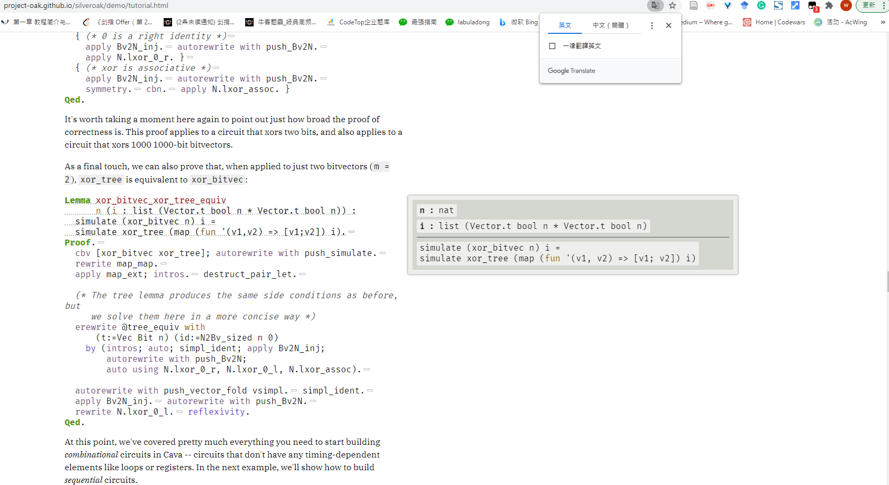

# 1. Coq能从source2parse相应形式化语言

今天群友聊到：

>感觉确实不太好定义。除了
“能被parse<->源码字符串属于相应的形式语言”
这个条件之外，还需要说明
“生成的parse tree对应一个正确的语法derivation过程”。
我看到 silveroak 的 tutorial 页面才知道 Coq 生成的网页是能做到这个程度的交互式的，能展示出每一步的结果
https://project-oak.github.io/silveroak/demo/tutorial.html

