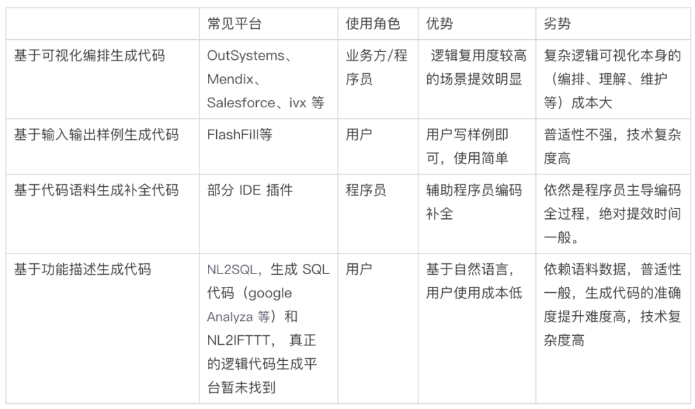

[TOC]

# 真正的从“形式化”逻辑公式到“program”

- 逻辑公式演算，谓词等天然形成的Golog类似逻辑式命令式程序运行在prolog上,ROS总用
- 逻辑公式演算还天然形成自然生成OCAML等“函数式编程语言”，具体已经实现的有：Coq 的Extraction 
- DSL，编译原理前端的“语法分析词法分析等形成中间表达”，通过AST等效转换为c-like 程序

# DSL特定领域代码片段 自动生成

developer.aliyun.com/article/770311

## 1.1. 基于可视化编排生成代码
可视化编程也发展了几十年，其指的是借助于一些组件化的集成代码可视化平台，一些不具备专业代码技能和开发经验的“小白”人群也能自主组织或参与应用开发，从而把代码开发由一项程序员专属职能扩充到更广泛的人群。它主要是让程序设计人员利用软件本身所提供的各种控件，像搭积木式地构造应用程序的各种界面，可视化编排更适合界面视图代码的生成；目前国外主打可视化编程、低代码编程的平台至少有十几家，其中最具代表性的可以说是 OutSystems、Mendix、Salesforce 等几家

## 1.2. 基于输入输出样例生成代码
基于输入输出的样例，自动推导出生成的逻辑程序，也叫 PBE(Programming by Examples)，其是 2016 年微软在论文中提到的一种程序综合（program synthesis）的技术方案。现实中比较成功的应用案例是，Excel 中有个功能相信大家应该熟悉，那就是自动填表（FlashFill），其可以根据几个样例快速的生成表格项公式，比如下图中，根据 第一列的 2 和 4，就可以填充偶数；第二列根据 50 和 40 自动推导出等差数列公式的结果。

## 1.3. 基于代码语料生成补全代码
随着 github 的开源代码的积累和深度学习的兴起，基于源代码理解（程序理解）应用比较多，如代码补全推荐、还有根据代码猜测代码片段的意思。

### 1.3.1. 代码补全
常用的集成开发环境中往往整合了代码补全工具, 一般限于关键字或基于语法的提示，比如在 tsx 文件中 this. 会提示出当前可用的类属性、方法；现有的智能代码补全工具通常基于模型性能考虑一般简单基于静态词频统计。
### 1.3.2. 代码意图生成
代码意图生成指根据代码内容可以推测出代码的功能作用，业界较知名的开源的模型和服务有 code2vec 和 code2seq，其中 code2vec 是做 code summarization（代码功能概要）；code2seq 做 code captioning (代码功能说明)。

## 1.4. 基于功能描述生成代码
大家通常利用自然语言来描述程序功能, 从自然语言描述到程序的自动生成是极具挑战性的问题。自然语言文本和程序的多样性、文本的二义性以及代码的复杂结构, 使得建立文本和代码的联系成为一个难题。目前业内有些探索，包括 NL2SQL、NL2TFTTT、基于功能描述生成代码。

### 1.4.1. NL2Code
相比于根据自然语言的功能描述生成 TFTTT 代码 和 SQL，根据自然语言的需求描述直接生成 python、java、javascript 这类的编程语言逻辑代码的难度要大的多。至今（2020.8）暂时没有找到相关的在线可用服务，目前找到卡内基梅隆大学有相关研究产出 TranX，其可以做到单一功能描述 生成 表达式级的代码，类似根据单行代码注释生成相应代码，见其网站 demo 如下。

# 代码自动生成器

[几个代码自动生成器](https://blog.csdn.net/qq_769932247/article/details/84060836):
2.1懒猴子CG
懒猴子CG支持在线搭建dubbo、springboot、springcloud等框架，支持在线生成swagger实体类等，支持自定义模版，支持多种语言的代码生成。这款生成器是国人研发的，站长迭代速度快，社区活跃，文档齐全。是一款及其灵活的生成器！推荐使用！

官方网址：http://cg.lazy-monkey.com/

QQ技术交流群：877957236

版权形式：免费

 

2.2IT猿网
在线代码生成器，好处就是方便。重点是连验证码都能在线调试好生成java代码直接使用。

官方网址：https://tool.ityuan.com/captcha

版权形式：免费

 

2.3listcode
       一个超级强大的代码生成器网站，这个代码生成器非常完善， java，php，python，nodejs都支持，前后端分离，翻页，联合查询都做了，当之无愧的代码生成器中的战斗机。

官网地址：https://www.listcode.cn/

版权：付费

2.4magicalcoder
      机械的增删改查基础代码和界面功能，自由拖拽定制，面向零基础，拖拽式编程，赋能企业，前后端代码一键生成，能够有效的提升效率。先不讲东西好不好，但他们的理念很贴心-->把简单的重复劳动交给我们，把高大上的智力输出交给您，最终提高个人和团队的整体开发效率;我们希望您省下来的时间能多陪陪家人

官网：http://bbs.magicalcoder.com/

版权：免费

[各种好用的代码生成器(C#)](https://www.cnblogs.com/skyme/archive/2011/12/22/2297592.html)

1.1 CodeSmith
一款人气很旺国外的基于模板的dotnet代码生成器

官方网站：http：//www.codesmithtools.com

官方论坛：http：//forum.codesmithtools.com/default.aspx

版权形式：30天试用

开源：否

需要先注册确认后才能下载

1.2 MyGenerator
MyGenerator是又一个国外很不错的代码生成工具，有人觉得比CodeSmith简单、好用。所有api可以在帮助菜单中找到。

官方网站：http：//www.mygenerationsoftware.com/portal/default.aspx

官方论坛：

版权形式：免费

开源：否

1.3 NHibernate.
NHibernate是Hibernate公司在Java自动生成领域取得巨大成功后推出的一款ORM工具.

官方网站：http：//www.hibernate.org/

官方论坛：

版权形式：免费

开源：否

1.4 湛蓝.Net代码生成器
一款基于软件自动生成理念，能直接生成应用的dotnet代码生成器

官方网站：http：//www.dotnetcoding.net

官方论坛：http：//dotnetcoding.cnblogs.com/

版权形式：免费

开源：否

1.5 动软.NET代码自动生成器
一款人气很旺的免费C#代码生成器

官方网站：http：//www.maticsoft.com

官方论坛：

版权形式：免费

开源：否

1.6 CodePlus
专为sql server c#语言设计的代码生成器,功能还是很强大

官方网站：http：//www.CodePlus.com

官方论坛：

版权形式：需要少量的注册费用

开源：否

下载地址很神秘

1.7 CodeMaker
asp,jsp,php代码生成工具，自动生成维护数据库信息的动态网页的代码生成器。它可以帮助ASP、JSP、PHP开发人员快速的开发简单的数据库维护程序。无需任何编码，只需将数据库结构导入到CodeMaker中并做简单的设置，CodeMaker即可生成完整的数据库操作页面。用CodeMaker可以简单快速的创建网站后台维护程序。提高开发效率数十倍以上。

官方网站：http：//www.mhua.com

官方论坛：

版权形式：免费

开源：否

1.8 非非.Net代码生成器
可以使用本工具生成VB.Net和C#语言的代码，以及三层架构与ORM架构代码，并且使用的ORM持久化组件是开源的，您可以在本软件的安装目录下找到它

官方网站：

官方论坛：

版权形式：免费

开源：否

1.9 BMW业务模型及代码生成器
一款人气很旺的免费C#代码生成器

官方网站：

官方论坛：

版权形式：免费

开源：否

1.10 飞鹰CoolCoder
专门为采用nhibernate做关系对象影射架构的系统提供代码的工具，简单易用，虽然不提供源码，我们可以用反编译工具对其反编译看源码。这是个很不错的学习机会。

官方网站：

官方论坛：

版权形式：免费

开源：否

1.11 AutoCoder自动代码生成器
AutoCoder自动代码生成器是一个根据模板自动生成代码的代码生成工具，根据模板的不同，可以生成任何语言（如：ASP、C#、C++BUILDER、DELPHI、JAVA、JSP、PHP、VB、VC.NET……），不同层次结构（B/S、C/S、n-tiger……），基于不同数据库（ORACLE、MSSQL、MYSQL、DB2、ACCESS、ODBC、OLE……）的代码和开发文档。开发人员无需任何编码，只需将数据库结构导入到AutoCoder中,并做简单的设置即可生成所需的代码，可以大幅度地提高开发效率！！！系统同时也提供了一个模板制作工具ModeMaker，用户可以方便的制作或修改模板，使得生成的代码更适合您使用！系统附带了十几个模板，基本上可以满足用户多方位的需求

官方网站：

官方论坛：

版权形式：免费

开源：否

1.12 wawa Code Pro代码生成器
一款开源的用VBScript写的代码生成器

官方网站：

官方论坛：

版权形式：免费

开源：是

1.13 MyGeneration
MyGeneration 是一款不错的ORM和代码生成工具，它基于模板（Template）工作，安装好MyGeneration 后自带了很多模板，并且提供在线模板库提供模板升级和允许用户自定义模板。MyGeneration 的模板可以用C#, VB.NET, JScript, and VBScript编写。使用MyGeneration 可以为Gentle.NET, Opf3, NHibernate等生成ORM架构或ORM文件，为多种数据库生成存储过程，为.Net项目生成C#、VB.NET 程序代码，PHP、HTML等页面代码。

官方网站：http：//www.mygenerationsoftware.com/portal/default.aspx

官方论坛：http：//www.mygenerationsoftware.com/phpbb3/index.php

版权形式：免费

开源：是

1.14 iBATIS的代码生成工具 Ibator
Ibator 是一个 iBATIS 的代码生成工具，它自动扫描数据库中的所有表，并生成Bean类和对应的配置文件。同时还帮你生成CRUD操作方法。提供一个独立运行的界面以及 Eclipse 的插件。

官方网站：http://ibatis.apache.org/ibator.html

官方论坛：

版权形式：免费

开源：是

1.15 代码自动生成工具 Acceleo
Acceleo是MDA（Model Driven Architecture：模型驱动体系结构）的一个代码自动生成工具，Acceleo能把模型转换为Java，C#，PHP等代码。Acceleo基于Eclipse平台以及EMF（Eclipse模型框架），开放源代码，可以免费使用。

官方网站：http://www.acceleo.org/pages/home/en

官方论坛：

版权形式：免费

开源：是

1.16 最快速的java代码生成器 rapid-generator
rapid-generator是一个生成器引擎,让你可以专注与代码生成器模板的编写, 可以生成如ibatis,ibatis3,hibernate,spring_mvc,struts2等等代码.

该项目是 Rapid Framework 框架的一部分。

官方网站：http://code.google.com/p/rapid-generator/

官方论坛：

版权形式：免费

开源：是

1.17 开源代码生成插件 J2EE Spider
J2EE Spider是一个开源代码生成插件。它能够以界面引导方式产生代码，定制代码生成模板。J2EE Spider当前能够生成基于Struts/JSF，Spring，Hibernate等框架的源代码。

J2EE Spider的主要特性如下：

•支持以界面引导方式产生代码

•支持与Eclipse集成

•支持增量构建

•支持正向逆向工程

•产生代码的国际化

•支持利用模版生成代码

•支持利用多个框架

J2EE Spider除了提供可定制的页面模版外，还可以在需要时候把新的技术集成进来。不过，其只对以下几种提供“立等可用的服务”：

•Web 框架：Struts、JSF和Mentawa（一个来自巴西的应用框架）

•依赖注入容器：Spring

•O/R 映射: Hibernate

•页面模版：SiteMesh 和Facelets

官方网站：http://www.spideronrails.org/

官方论坛：

版权形式：免费

开源：是

1.18 slave4j
slave4j是一个eclipse的插件，也是一个springmvc，spring，hibernate的整合框架

slave4j插件能帮你做什么？

    搭建spring，springmvc，hibernate开发环境

    代码生成：生成curd代码，包括jsp

slave4j框架能帮你做什么？

    封装了hibernate常用操作

    提供了常用的工具类（1.0.0版本提供的比较少，在以后的版本中继续添加）

官方网站：http://code.google.com/p/slave4j/

官方论坛：

版权形式：免费

开源：是

1.19 JunJava
JunJava 一个java程序代码自动生产的工具。

针对JavaEE或者是JAVASE，AutoJava能快速的生成可以由目前最流行的结构框架搭建的项目，如Hibernater，Spring，Struts等自动组合配置。

通过连接数据库，选择任意数据表生成实体模型，支持简单SQL语句查询，直接浏览数据表结构和数据。

支持多项目管理，文件编辑，一键式生成代码。快速构建基础框架代码，并支持MVC 3层构架。

生成的项目可以直接导入Eclipse，并且可以直接运行部署Tomcat服务器中，大大减少程序员的工作量。

官方网站：

官方论坛：

版权形式：免费

开源：是

1.20 XDoclet
XDoclet 是一个通用的代码生成实用程序,是一个扩展的Javadoc Doclet引擎(现已与Javadoc Doclet独立),XDoclet是EJBDoclet的后继者，而EJBDoclet是由Rickard Oberg发起的。它允许您使用象 JavaDoc 标记之类的东西来向诸如类、方法和字段之类的语言特征添加元数据。随后，它利用这些额外的元数据来生成诸如部署描述符和源代码之类的相关文件。可以让你创 建自己的javadoc @tags进而利用XDoclet中的Templet enging基于这些@tags生成源代码或其他文件（例如xml的deployment descriptors）。

XDoclet 继承了 JavaDoc 引擎的思想，允许根据定制 JavaDoc 标记生成代码和其他文件。当然，XDoclet 也可以访问整个解析树。这样，它就可以访问类、类的包结构和类的方法。

XDoclet 提供了自己的模板引擎。该模板引擎在概念上类似于 JavaServer Pages（JSP）技术。它实质上包含两类标记：块标记（block tag）和内容标记（content tag）。块标记控制如 Java 编程语言中的 if 和 for 语句之类的流。内容标记打印当前解析树上下文的片段，如类名称、方法名称和参数，等等。

官方网站：http://xdoclet.sourceforge.net/xdoclet/index.html

官方论坛：

版权形式：免费

开源：是

