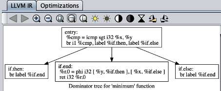
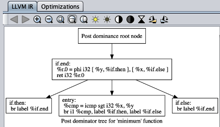

# LLVM GUI

https://github.com/LouisJenkinsCS/LLVM-Simple-GUI

使用此工具，您可以在代码编辑器中运行简单的C程序，选择优化顺序，甚至查看控制流图，支配树或后支配树。这是我的LLVM-JVM项目中使用的GUI所采用的教学工具。已对此进行了修改以运行C代码，而不是要求LLVM-JVM将Java编译为字节码，然后编译为LLVM IR。

