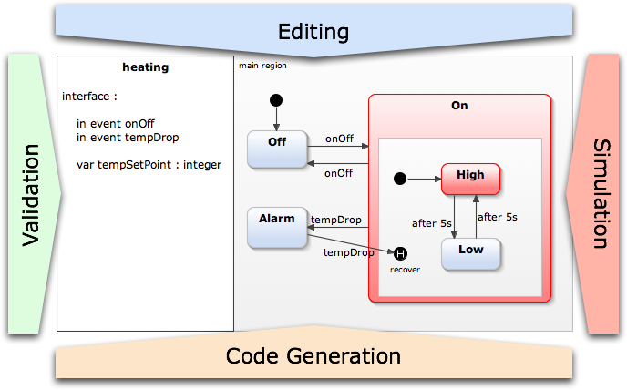

# YAKINDU SCT状态图转换为编程语言源代码

摩尔和米勒机 
在经典自动机理论中，存在两种不同类型的有限状态机：

Moore ，在机器的输出只依赖于它的当前状态。
Mealy machines，其中，所述电机的输出依赖于它当前的状态和它的输入。
可以将这些类型的机器彼此转换，但是，状态，转换和输出功能需要更改才能实现。

由于Harel状态图是Mealy和Moore机器的超集，因此可以在YAKINDU Statechart Tools中对所有这些类型进行建模。

https://updates.yakindu.com/statecharts/labs/

itemis.com/en/yakindu/state-machine/documentation/user-guide/overview_what_are_yakindu_statechart_tools?hsLang=de

AKINDU Statechart Tools的标准版提供以下用于处理状态机的功能：

状态图图表编辑器， 以图形方式创建和编辑状态图，状态机的图形表示
Statechart模拟器， 用于模拟状态图的行为
Java，C，C ++和Python的代码生成器， 可将状态图转换为编程语言源代码
定制生成器项目，可轻松使用Xtend或Java创建模型到文本的转换，以创建自己选择的任何代码
集成验证器，用于检查状态图模型的句法或语义问题
测试框架 使用单元测试来测试您的状态机

最初，YAKINDU Statechart工具是为嵌入式系统行业设计的：汽车，系统控制，自动售货机等。但是，YAKINDU Statechart工具将有限状态机（FSM）和Harel状态图的优势带给需要设计，仿真的每个人并发展行为。人们可以使用YAKINDU Statechart工具生成Java，C，C ++或Python代码

