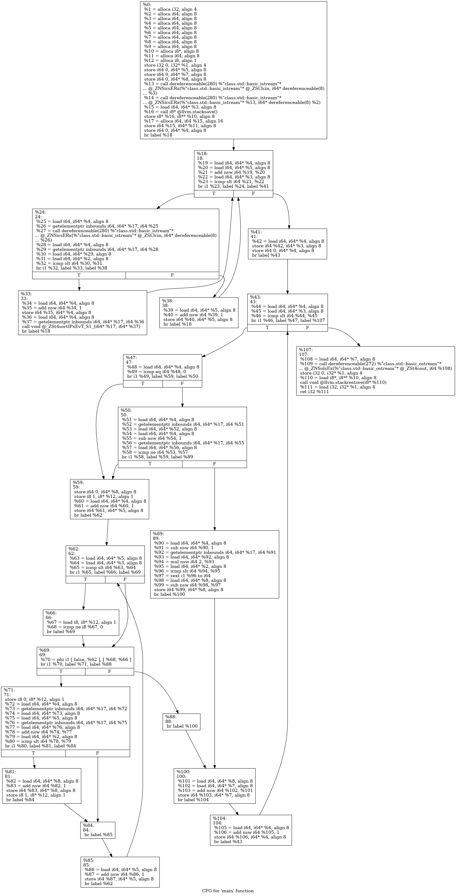

# 1. 打印Solution代码片段


This source code snippet is going to print the CFG for a given function (in this case, the main function) to the terminal.


```cpp
#include "clang/ASTMatchers/ASTMatchFinder.h"
#include "clang/ASTMatchers/ASTMatchers.h"
#include "clang/Analysis/CFG.h"
#include "clang/Basic/LangOptions.h"
#include "clang/Frontend/FrontendActions.h"
#include "clang/Tooling/CommonOptionsParser.h"
#include "clang/Tooling/Tooling.h"
#include "llvm/Support/CommandLine.h"

using namespace clang;
using namespace clang::ast_matchers;
using namespace clang::tooling;

using namespace llvm;

DeclarationMatcher FunctionMatcher =
    functionDecl(isMain()).bind("mainFunction");

class CFGPrinter : public MatchFinder::MatchCallback {
public:
  virtual void run(const MatchFinder::MatchResult &Result) {
    if (const FunctionDecl *funcDecl =
            Result.Nodes.getNodeAs<clang::FunctionDecl>("mainFunction")) {
      ASTContext *context = Result.Context;
      Stmt *funcBody = funcDecl->getBody();
      static std::unique_ptr<CFG> sourceCFG = CFG::buildCFG(
          funcDecl, funcBody, context, clang::CFG::BuildOptions());
      auto langOpt = context->getLangOpts();
      sourceCFG->dump(langOpt, true);
    }
  }
};

// Apply a custom category to all command-line options so that they are the
// only ones displayed.
static llvm::cl::OptionCategory MyToolCategory("my-tool options");

// CommonOptionsParser declares HelpMessage with a description of the common
// command-line options related to the compilation database and input files.
// It's nice to have this help message in all tools.
static cl::extrahelp CommonHelp(CommonOptionsParser::HelpMessage);

// A help message for this specific tool can be added afterwards.
static cl::extrahelp MoreHelp("\nMore help text...\n");

int main(int argc, const char **argv) {
  CommonOptionsParser OptionsParser(argc, argv, MyToolCategory);
  ClangTool Tool(OptionsParser.getCompilations(),
                 OptionsParser.getSourcePathList());

  CFGPrinter Printer;
  MatchFinder Finder;
  Finder.addMatcher(FunctionMatcher, &Printer);

  return Tool.run(newFrontendActionFactory(&Finder).get());
}

```


# 2. 1

```cpp
clang -cc1 -analyze -analyze-checker=debug.ViewCFG src_code.cpp
```


# 3. 2


https://gist.github.com/sidvenu/344ea573c180438aabec8c338abe1af7 prog.cpp


```
clang++ -emit-llvm -S prog.cpp -o prog.ll
```

```c++
#include<algorithm>
#include <iostream>
using namespace std;
int main(){
        long long int K,N,i,j=0,k,total=0,tempTotal=0,temp;
        cin>>N>>K;
        long long arr[N];
        for(i=0;(i+j)<N;){
                cin>>arr[i];
                if(arr[i]<K){
                        i++;
                        sort(arr,arr+i);
                        continue;
                }
                j++;
        }
        N=i;

        for(i=0;i<N;i++){
                if(i==0||(arr[i]!=arr[i-1])){
                        tempTotal=0;
                        char flag=1;
                        for(j=i+1;j<N&&flag;j++){
                                flag=0;
                                if(arr[i]+arr[j]<K){
                                        tempTotal++;
                                        flag=1;
                                }
                        }
                }
                else tempTotal-=(2*arr[i-1])<K;
                total+=tempTotal;
        }

        cout<<total;
        return 0;
}
```


如果使用llvm这样做：https://llvm.org/docs/CommandGuide/opt.html document

You can use [`clang`](https://clang.llvm.org/) or [`llvm`](https://llvm.org/).

First compile your program to llvm ir

```cpp
clang++ -emit-llvm -S prog.cpp -o prog.ll
```

Then use [`opt`](https://llvm.org/docs/CommandGuide/opt.html) to generate the control flow graph.

```cpp
opt --dot-cfg prog.ll
```

This outputs a dot file which can be viewed with [graphviz](https://github.com/rakhimov/cppdep/wiki/How-to-view-or-work-with-Graphviz-Dot-files). On a mac you can do `brew install graphviz` and run the following to generate a png.

```cpp
dot -Tpng cfg.main.dot -o main.png
```

You should have one dot file for every function in your program so it may be easier to write a script to automatically convert them all to pngs


 


