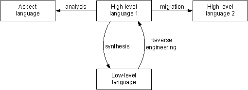

# 1. ProgramSynthesis代码综合

Christian Szegedy - Formal Reasoning, Program Synthesis
https://www.youtube.com/watch?v=ehNGGYFO6ms

# 2. Program synthesis

https://en.wikipedia.org/wiki/Program_synthesis

程序综合
ProgramSynthesis是一类转换，可降低程序的抽象级别。在ProgramRefinement中，实现是从高级规范派生的，以便该实现满足该规范。编译是一种综合形式，其中将高级语言的程序转换为机器代码。这种翻译通常在几个阶段中完成，在这些阶段中，首先将高级语言转换为中间表示形式。然后，指令选择将中间表示转换为机器指令。合成的其他示例parser and pretty-printer generation from context-free grammars.。

自动程序设计（Automatic Programming）

    自动程序设计主要有下面两个问题：

    （一）程序验证（Program Verification）

      程序验证是利用一个以验证过的程序系统来自动证明某一给定程序P的正确性。
设程序P的输入是x，它必须满足输入条件φ(x)；程序的输出是Z=P(x)，它必须满足输出条件
Φ（x,z),则这是程序的正确性有三种类型：

       1、部分正确性

       2、终止性

       3、完全正确性     

    （二）程序综合（Program synthesis）

     程序综合根据所给问题的具体描述由计算机自动生成满足要求的程序P。根据这个思想，所生成的程序P应对输入条件φ(x)和输出条件Φ(x,z)是完全正确的。目前程序综合的基本途径主要是程序变换，即通过对给定的输入、输出条件进行逐步变换，已构成所要求的程序。

http://www.jos.org.cn/html/2018/8/5529.htm 智能化的程序搜索与构造方法综述

程序综合与编译

https://chhzh123.github.io/blogs/2020-02-01-compilation-and-synthesis/

>Program Synthes is correspond to a class of techniques that are able to generate a program from a collection of artifacts that establish semantic and syntactic requirements for the generated code.

编译器仅仅做了一个翻译的功能，即高级语言只是描述了要做什么(what)任务（传统的C/C++/Java等编程语言大多是命令式编程）；而综合器做的事情则更多，它还需要去探索怎么(how)去执行这个任务，涉及到程序的改写。

区别两者一个很重要的特征在于有无**搜索(search)**的过程。编译器通常是将一个预定义的调度(schedule)进行转换，而综合器则是根据程序的描述找到一个最优的调度来满足需求。不过事实上，很多现代的编译器都已经具备有自动优化(autotuning)的功能，比如TVM，因此编译与综合的界限其实在逐渐模糊。

程序综合也很像机器学习。仔细思考一下现在的机器学习，其实也是一个程序到程序的映射，或者说我们一开始写的就是元程序(metaprogram)。大多机器学习算法都包括训练(training)和推断(inference)两个过程，训练实际上就是读入源程序然后进行优化/综合的过程，把其中未确定的参数给确定下来，进而得到最终的程序/模型；而推断则是利用训练好的确定的程序运行得到结果。

用更加通俗易懂的话来说，我现在要盖房子，综合器只告诉你一个设计图纸/目标，至于怎么盖你自己想；而编译器会十分细致入微，告诉你第一步先造地基，第二步往上盖，第三步怎样怎样。

现在的程序综合研究主要关注以下几个方面：

从高层描述中自动生成算法
将综合技术应用在广泛的问题上面，比如Excel的自动填充[FlashFill]、代码自动打分等
逆向工程，低层实现转为高层等价表示，如将Java转为SQL
而高层次综合(HLS)同样是给出是什么(what)，然后综合器告知应该怎么做。HLS和传统编译的区别可见该文。

像TVM、Halide、GraphIt、Taichi这些新生代的DSL，他们正是将综合的概念融入编译，分离出算法和调度(schedule)。 算法对应的即传统的编译，而调度正是所谓的spec，是可以探索的，是可以交由综合器自由发挥的。

这也解释了为什么现在编译和综合的概念越来越模糊，因为编译更多融入了综合的概念，而综合也在往编译方面发展。 我们现在已经是软件2.0时代，而有种说法是我们已经进入到编译3.0时代2，如今的编译器加入了搜索的元素（启发式/机器学习都可以），使得编译出来的程序性能更高，也更大程度解放程序员疯狂调参的过程。

总的来说，“条条大路通罗马”，综合器告诉你最好的一条，编译器只让你走其中一条。

编译1.0实现**汇编到高级编程语言**的抽象，这是我们现在本科编译原理教的东西，语法分析、词法分析、代码生成等等都是上个世纪编译器刚出来时的产物。

编译2.0分离出编译器的前中后三个部分，诞生出了LLVM，**前端**接各种语言，有成熟的parser；**中端**做平台无关优化；**后端**做平台特定优化和codegen。衍生出的高级编译原理、静态程序分析等都是这个世纪初的成果

