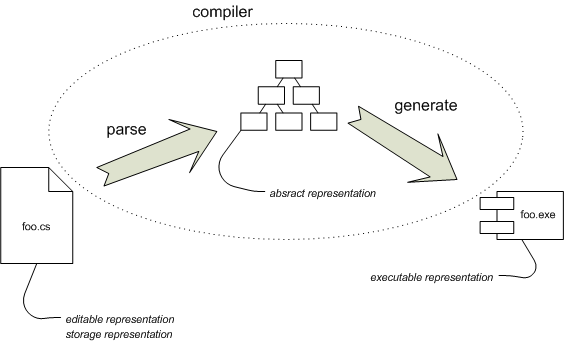

[TOC]

# LanguageWorkbench

https://martinfowler.com/articles/languageWorkbench.html

## 内容
面向语言编程的简单示例
面向语言编程的传统
Unix小语言
Lisp
活动数据模型
自适应对象模型
XML配置文件
GUI构建器
面向语言编程的利与弊
外部DSL
内部DSL
涉及非程序员
总结面向语言编程中的权衡
当今的语言工作台
故意软件
元编程系统
软件工厂
模型驱动架构（MDA）
语言工作台的要素
定义新的DSL
定义语言工作台
语言工作台如何改变面向语言编程的权衡。
改变我们的DSL概念
结论

# 当今的语言工作台
我将首先简要介绍一些适合此类语言工作台的工具。请记住，所有这些都处于开发的早期阶段。我们仍然可以看到可以用于大规模软件开发的语言工作台，这还需要几年的时间。

## 意图软件
这些工具的教父是故意编程。意图编程最初是由Microsoft Research的Charles Simonyi开发的。几年前，西蒙尼（Simonyi）离开了微软，创立了自己的公司来独立开发**Intental Software**。与这类初创公司一样，他对开发并不十分开放。结果，缺少有关“意图软件”中的内容以及如何使用它的信息。

我有机会花一点时间在Intental Software上，而我在ThoughtWorks的几个同事在过去一年左右的时间里与Intentional密切合作。结果，我有机会窥见了“故意”幕后活动-尽管我对在那看到的内容只能说些什么受到限制。幸运的是，他们打算在明年左右开始公开他们的工作。

（作为术语注释，有意者使用“有意编程”一词来指称他们在Microsoft所做的较旧的工作，而“有意软件”指的是此后他们一直在做的事情。）

## 元编程系统
一个新的举措是由JetBrains开发的**MPS**元编程系统。JetBrains具有出色的IDE工具，因此在软件开发人员中享有很高的声誉。

JetBrains在IDE方面的经验以多种方式与语言工作台相关。首先，他们在IntelliJ方面的成功使他们在工具界享有很高的声誉-无论是技术能力还是实用性。其次，语言工作台的许多功能与使后IntelliJ IDE如此强大的功能紧密地联系在一起。

JetBrains已经花费了两年的时间来构建用于开发称为Fabrique的Web应用程序的复杂环境。建立Fabrique的经验使他们相信，他们需要一个平台来在将来更有效地构建这类工具-这种愿望促使他们开发MPS。

MPS受到有关故意软件的公开发布的强烈影响。它的开发时间比Intental的工作要少得多，但是JetBrains认为开发周期非常开放。只要有可用的功能，他们就会根据“抢先体验计划”提供MPS。目前，他们希望在2005年上半年做到这一点。

最近，我很幸运与MPS的负责人Sergey Dmitriev紧密合作。MPS活动来自JetBrains的马萨诸塞州办事处，这对我有帮助，这使我很容易访问它们。由于地理位置的相似性和开放性，我使用了MPS来帮助描述一些详细的示例（尽管在我对本文进行进一步介绍之前，它们没有多大意义。请不要担心，我会在有时间的时候再给您链接。）

## 软件工厂
**Software Factories**是由Microsoft的Jack Greenfield和Keith Short领导的一项计划。我不会在这里介绍软件工厂的几个要素（除了说不要让这个可怕的名字让您失望。）与本文相关的要素是DSL的努力-面向语言的编程起着主要作用在软件工厂中的角色。

软件工厂团队具有模型驱动开发的背景。他们包括活跃于CASE工具开发的人员，以及英国OO社区的许多领先人物。因此，他们的DSL倾向于采用更多图形化的方法也就不足为奇了。但是，与大多数CASE工具人员不同，他们对语义和对代码生成的控制非常感兴趣。

我在这里的大部分讨论都涉及到应用程序的传统编程。尤其是软件工厂团队，对于将DSL用于通常无法实现自动化的其他软件开发领域（例如部署，测试和文档编制）也非常感兴趣。他们还在探索模拟器，以解决您不想在开发中直接执行DSL的情况-例如部署DSL。

Microsoft的DSL团队已经将下载 作为Visual Studio 2005 Team System的一部分已有几个月了。

## 模型驱动架构（MDA

**模型驱动架构（MDA）**
如果您一直在跟踪OMG的MDA，您会注意到我一直在谈论语言工作台和MDA愿景之间有很多相似之处。这是一个有争议的问题，但是现在我要说的是，MDA的某些愿景是语言工作台的形式，但并非全部。我还要说的是，我认为在MDA之上构建语言工作台存在严重缺陷。我写了一篇相关的文章来更详细地讨论这一点，但是直到您完成这篇文章之后，它才有意义。

第一步，从文件foo.cs中获取文本，并将其解析为抽象语法树（AST）。第二步走这棵树，生成CLR字节码，并将其放入程序集（exe文件）中。

编译器会在这些表示形式之间进行转换。源文件是可编辑的表示形式-这是我们要更改程序时要操纵的表示形式。它也是存储的表示形式-保存在源代码控制中并在我们想再次使用该程序时使用。当我们运行编译器时，第一阶段将可编辑表示形式映射到抽象表示形式（抽象语法树），然后代码生成器将其转换为可执行表示形式（CLR字节码）。

