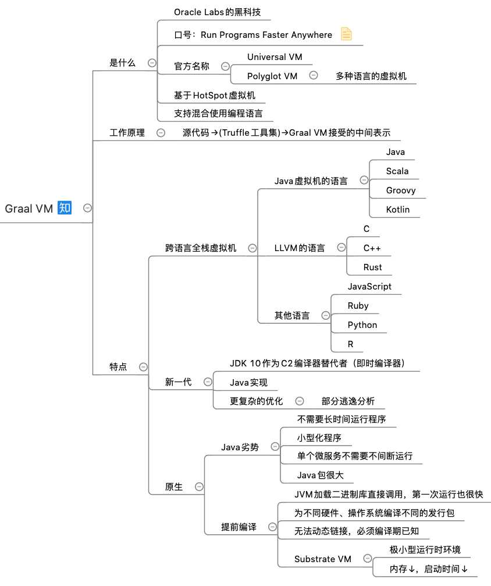

 

解决了哪些**痛点**

GraalVM的混合式多语言编程可以解决开发者的以下常见问题

那个库我这个语言没有，我TM得自己撸一个

那个语言最适合解决我这个问题，但是我这个环境下跑不起来

这个问题已经被我的语言解决了，但是我的语言跑起来太慢了

通过使用Polyglot API，GraalVM要给开发者带来真正的语言级自由。

大部分脚本语言或者有动态特效的语言都需要一个语言虚拟机运行，比如CPython，Lua，Erlang，Java，Ruby，R，JS，PHP，Perl，APL等等，但是这些语言的虚拟机水平，对，就是具体的实现，差距很大，比如CPython的VM就不忍直视，JVM的HotSpotVM，C#的CLR和JS的v8却是state of the art级别，那么能不能付出较小努力，用一个state of the art的虚拟机，来运行这些语言，让它们享受该虚拟机的一些工匠特性，比如gc，锁，jit等？如何评价 GraalVM 这个项目？ - kelthuzadx的回答 - 知乎
https://www.zhihu.com/question/274042223/answer/1270829173

https://www.graalvm.org/docs/introduction/ Docs

JRuby的实验性解释器 Truffle · jruby/jruby Wiki · GitHub,涉及到了这两个技术,据 http://www.chrisseaton.com/rubytruffle/modularity15/rubyextensions.pdf 的结果, 可以兼容CRuby的C Extension, 而不损失太多性能, 这是如何做到的
如何理解Truffle framework与Graal compiler? - RednaxelaFX的回答 - 知乎
https://www.zhihu.com/question/28927570/answer/42601245

------------------------------------

有没有可能将Java源代码编译成LLVM能接受的中间形式，以执行Java程序？ - 武辛辛的回答 - 知乎
https://www.zhihu.com/question/33905984/answer/950645291
当然可以。早就已经有商业产品做到了 - RemObjects Elements Compiler (http://www.elementscompiler.com) 就可以将Java 源代码编译成LLVM IR 最后生成CPU native 的本地可执行文件。 它也可以将Java 源代码编译成.NET IL， 最后在.NET 上执行应用程序。

一种不外乎是从Java的AST直接Code Gen到LLVM IR，另外一种则是从Java产生的现有IR转向LLVM IR。我之前做过从LLVM IR转向一种栈式的IR，而另外一个团队做的是从这种栈式的IR转向LLVM IR，我们都做成了，所以从技术的层面，这是没有任何问题的。

如何看待微软LLILC，一个新的基于LLVM的CoreCLR JIT/CoreRT AOT编译器？ - RednaxelaFX的回答 - 知乎
https://www.zhihu.com/question/29544174/answer/44851492

如何将Java bytecode编译成LLVM IR，即有没有可用的LLVM的Java前端？ - RednaxelaFX的回答 - 知乎
https://www.zhihu.com/question/32200598/answer/55121085

# 1. GraalVM

https://en.wikipedia.org/wiki/GraalVM

最新版本是GraalVM 20.3.0，于2020年11月上市。

与基本JDK相比，GraalVM的主要区别在于：

GraalVM编译器，Java的JIT编译器
GraalVM本机映像，允许提前编译Java应用程序
松露语言实现框架和GraalVM SDK，以实现其他编程语言运行时
LLVM运行时和JavaScript运行时

GraalVM系列（一）：JVM的未来——GraalVM集成入门 - 蒋震宇的文章 - 知乎
https://zhuanlan.zhihu.com/p/148519037

GraalVM源码阅读（0） - 严懿宸的文章 - 知乎
https://zhuanlan.zhihu.com/p/261721910

Graal VM提供了**Truffle工具集**来快速构建面向一种新语言的解释器，并用它构建了一个称为Sulong的**高性能LLVM字节码解释器**。

在GraalVM之上，我们可以编写Java、Python、Ruby、R、Scala、Kotlin，甚至是C、C++语言。

GraalVM：微服务时代的Java - icyfenix的文章 - 知乎
https://zhuanlan.zhihu.com/p/137836206

通过 GraalVM 将 Java 程序编译成本地机器码！ - yano的文章 - 知乎
https://zhuanlan.zhihu.com/p/326426124

Polyglot工作原理

GraalVM提供了一种在不同语言之间可以无缝传值的方法，而不需要像其它虚拟机一样进行序列化和反序列化。这样就保证了跨语言也能继续保持高性能。

GraalVM开发了「跨语言互操作协议」，它是一种特殊的接口协议，每种运行在GraalVM之上的语言都要实现这种协议，这样就能保证跨语言的互操作性。

语言和语言之间无须了解对方就可以高效传值。该协议还在不断改进中，未来会支持更多特性。

GraalVM最佳实践，使用Java开发CLI、Desktop(JavaFX)、Web(StringBoot)项目，并使用native-image技术把Java代码静态编译为独立可执行文件（本机映像）。开源地址：https://gitee.com/westinyang/java-graalvm-start

