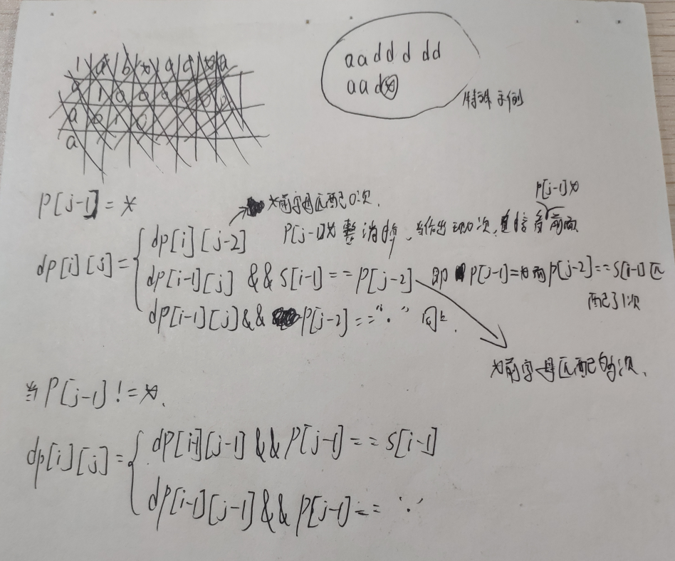

 
 
 
 
 
 
 **编译原理课上经典的正则表达式转epsilon-NFA，再化简epsilon-NFA转换成DFA，然后O(N)时间过一遍DFA的问题**
 
 
 
 
 
 
 从DFA到正则表达式的已知算法


https://qastack.cn/cstheory/9221/known-algorithms-to-go-from-a-dfa-to-a-regular-expression


----------------------------------------------------------------------------------


正则表达式2有穷自动机


https://github.com/qntm/greenery


一步到位直接按正则表达式的实现来:生成有限状态机 直接从源码生成自动机对应的mermaid图像代码：
https://leetcode-cn.com/problems/regular-expression-matching/solution/yi-bu-dao-wei-zhi-jie-an-zheng-ze-biao-da-shi-de-s/
生成的有限状态机图, 使用 mermaid 去查看。如下用例生成的状态机 c*..b*a*a.*a..*c 与 mis*is*
**非常牛逼**


正则表达式非常牛逼的讲义 http://www.cs.cmu.edu/~ab/CMU/Week%2010-%20Strings%20Search/print04.pdf ，AC自动机https://leetcode-cn.com/problems/wildcard-matching/solution/tong-pei-fu-pi-pei-by-leetcode-solution/


普林斯顿 算法4的源码 有FSM https://github.com/kevin-wayne/algs4/blob/master/src/main/java/edu/princeton/cs/algs4/NFA.java


# 1. 正则文法 正则表达式匹配算法

递归分情况讨论

链接：https://leetcode-cn.com/problems/zheng-ze-biao-da-shi-pi-pei-lcof/solution/zheng-ze-biao-da-shi-pi-pei-di-gui-qiu-jie-by-jarv/


```c++


class Solution {
public:
    bool isMatch(string s, string p) {
        if(p.empty()) return s.empty();// 特判，同时也是递归出口，如果p是空串，返回s是否为空串。如果p不为空，保证一定存在p[1]（可能是字符串结尾\0）

        if(p[1] == '*'){// 假如p[1] == * 的话，可以尝试两种情况：
                    // 情况一是递归比较s和p.substr(2)；
            return isMatch(s, p.substr(2)) 
                    || (!s.empty()
                        && (s[0] == p[0] || p[0] == '.') // 情况二是当s[0]可以匹配p[0]时, 尝试递归比较s.substr(1)和p，
                        ) // 这里没有必要比较s.substr(1) 和 p.substr(2)，因为这种情况已经包含在递归比较s.substr(1)和p当中了
                    && isMatch(s.substr(1), p);
        }
        else{// 假如p[1] != *,
            return !s.empty() 
                && (s[0] == p[0] || p[0] == '.') //如果p[0]不匹配s[0]，返回false，否则递归判断s.substr(1)和p.substr(1)
                && (isMatch(s.substr(1), p.substr(1)));
        }
    }
};

```



从暴力、记忆搜索到DP

动态规划字符匹配
https://leetcode-cn.com/problems/zheng-ze-biao-da-shi-pi-pei-lcof/solution/yi-bu-yi-bu-you-hua-cong-bao-li-di-gui-d-xd3q/

左神的课 ,从暴力、记忆搜索到DP


暴力

```java
public static boolean isRegMatchStr(String s, String p) {
    if (p == null || s == null) return false;
    if (p.length() == 0 && s.length() != 0) return false;
    return process(s.toCharArray(), p.toCharArray(), 0, 0);
}

private static boolean process(char[] sChars, char[] pChars, int sTemp, int pTemp) {
        if(sTemp==sChars.length) return pTemp==pChars.length||noSeeIsCanSkip(pTemp,pChars);
        if(pTemp==pChars.length) return false;
    if (pTemp + 1 < pChars.length && pChars[pTemp + 1] == '*') {
        //直接跑到*位置
        return process(sChars, pChars, sTemp, pTemp + 1);
    } else {
        if (pChars[pTemp] == '.') {
            return process(sChars, pChars, sTemp + 1, pTemp + 1);
        }
        if (pChars[pTemp] == '*') {
            if (pTemp - 1 >= 0) {//上一个位置合法
                //利用，可以利用才行
                char frontStar = pChars[pTemp - 1];
                if (frontStar == '.' || sChars[sTemp] == frontStar) {
                    return process(sChars, pChars, sTemp + 1, pTemp)//为了利用多次
                            ||process(sChars, pChars, sTemp, pTemp+1)
                            ||process(sChars, pChars, sTemp+1, pTemp+1);//利用一次
                }
                //无法利用，直接跳过
                return process(sChars,pChars,sTemp,pTemp+1);
            }
        }
        //字母
        return sChars[sTemp]==pChars[pTemp]&&process(sChars,pChars,sTemp+1,pTemp+1);
    }
}

private static boolean noSeeIsCanSkip(int pTemp, char[] pChars) {
    int temp = pChars.length-1;
    boolean isStar = true;
    while (temp>=pTemp){
        if(isStar&&pChars[temp]!='*') return false;
        else isStar = false;
        temp--;
        if(((pChars.length-1)-temp)%2==0) isStar = true;
    }
    return true;
}

作者：vigilant-hermannoht
链接：https://leetcode-cn.com/problems/zheng-ze-biao-da-shi-pi-pei-lcof/solution/yi-bu-yi-bu-you-hua-cong-bao-li-di-gui-d-xd3q/
```

```c++

```

第一步优化，改记忆化搜索，有了暴力递归，还好改动态规划

```java
//dp01_傻缓存
public static boolean dp01(String s, String p){
    if (p == null || s == null) return false;
    if (p.length() == 0 && s.length() != 0) return false;
    HashMap<String,Boolean> dp = new HashMap<>();
    return process1(s.toCharArray(), p.toCharArray(), 0, 0,dp);
}

private static boolean process1(char[] sChars, char[] pChars, int sTemp, int pTemp, HashMap<String, Boolean> dp) {
    //dp表-->key:sTemp_pTemp value:结果
    String dpKey = sTemp+"_"+pTemp;
    if(dp.containsKey(dpKey)) return dp.get(dpKey);//取缓存
    if(sTemp==sChars.length) {
        dp.put(dpKey,pTemp==pChars.length||noSeeIsCanSkip(pTemp,pChars));
        return dp.get(dpKey);
    }
    if(pTemp==pChars.length) {
        dp.put(dpKey,false);
        return dp.get(dpKey);
    }
    if (pTemp + 1 < pChars.length && pChars[pTemp + 1] == '*') {
        dp.put(dpKey,process1(sChars, pChars, sTemp, pTemp + 1,dp));
        return dp.get(dpKey);
    } else {
        if (pChars[pTemp] == '.') {
            dp.put(dpKey,process1(sChars, pChars, sTemp + 1, pTemp + 1,dp));
            return dp.get(dpKey);
        }
        if (pChars[pTemp] == '*') {
            if (pTemp - 1 >= 0) {
                char frontStar = pChars[pTemp - 1];
                if (frontStar == '.' || sChars[sTemp] == frontStar) {
                    dp.put(dpKey,process1(sChars, pChars, sTemp + 1, pTemp,dp)
                            ||process1(sChars, pChars, sTemp, pTemp+1,dp)
                            ||process1(sChars, pChars, sTemp+1, pTemp+1,dp));
                    return dp.get(dpKey);
                }
                dp.put(dpKey,process1(sChars,pChars,sTemp,pTemp+1,dp));
                return dp.get(dpKey);
            }
        }
        dp.put(dpKey,sChars[sTemp]==pChars[pTemp]&&process1(sChars,pChars,sTemp+1,pTemp+1,dp));
        return dp.get(dpKey);
    }
}
private static boolean noSeeIsCanSkip(int pTemp, char[] pChars) {
        int temp = pChars.length-1;
        boolean isStar = true;
        while (temp>=pTemp){
            if(isStar&&pChars[temp]!='*') return false;
            else isStar = false;
            temp--;
            if(((pChars.length-1)-temp)%2==0) isStar = true;
        }
        return true;
    }

作者：vigilant-hermannoht
链接：https://leetcode-cn.com/problems/zheng-ze-biao-da-shi-pi-pei-lcof/solution/yi-bu-yi-bu-you-hua-cong-bao-li-di-gui-d-xd3q/
```


```c++

```

DP

```java
public static boolean dp02(String s,String p){
    if (p == null || s == null) return false;
    if (p.length() == 0 && s.length() != 0) return false;
    char[] pChars = p.toCharArray();
    char[] sChars = s.toCharArray();

    boolean[][] dp = new boolean[s.length()+1][p.length()+1];
    //base case
    for(int pTemp = 0;pTemp <= pChars.length;pTemp++){
        dp[sChars.length][pTemp] = pTemp==pChars.length||noSeeIsCanSkip(pTemp,pChars);
    }
    //从右到左,从下到上,填表
    for(int pTemp=pChars.length-1;pTemp>=0;pTemp--){
        for(int sTemp = sChars.length-1;sTemp>=0;sTemp--){
            if (pTemp + 1 < pChars.length && pChars[pTemp + 1] == '*') {
                dp[sTemp][pTemp] = dp[sTemp][pTemp + 1];
            } else {
                if (pChars[pTemp] == '.') {
                    dp[sTemp][pTemp] = dp[sTemp + 1][pTemp + 1];
                }else if (pChars[pTemp] == '*'&&pTemp - 1 >= 0) {
                        char frontStar = pChars[pTemp - 1];
                        if (frontStar == '.' || sChars[sTemp] == frontStar) {
                            dp[sTemp][pTemp] = dp[sTemp + 1][pTemp]||dp[sTemp][pTemp+1]||dp[sTemp+1][pTemp+1];
                        }else{
                            dp[sTemp][pTemp] = dp[sTemp][pTemp+1];
                        }
                }else
                    dp[sTemp][pTemp] = sChars[sTemp]==pChars[pTemp]&&dp[sTemp+1][pTemp+1];
            }
        }
    }
    return dp[0][0];
}
private static boolean noSeeIsCanSkip(int pTemp, char[] pChars) {
        int temp = pChars.length-1;
        boolean isStar = true;
        while (temp>=pTemp){
            if(isStar&&pChars[temp]!='*') return false;
            else isStar = false;
            temp--;
            if(((pChars.length-1)-temp)%2==0) isStar = true;
        }
        return true;
    }

作者：vigilant-hermannoht
链接：https://leetcode-cn.com/problems/zheng-ze-biao-da-shi-pi-pei-lcof/solution/yi-bu-yi-bu-you-hua-cong-bao-li-di-gui-d-xd3q/
```


```c++

```

作者：legendarygz
链接：https://leetcode-cn.com/problems/zheng-ze-biao-da-shi-pi-pei-lcof/solution/jian-duan-dai-ma-yi-li-jie-dpshu-zu-dai-p6cfn/
首先声明一下，p中的【.】直接看作一个字符就好了只不过他可以替换任意字符，所以讨论重点不在这个【.】而在*，图中圈起来的示例指的是和前字符组合匹配成功多次，此处要将和前字符看做整体，图中给出的是将前字符复制了多份的情况，那还有一种情况就是复制0次，也就是以及前的字符直接删除，也就是当他不存在，然后初始化空字符串匹配时情况和首行初始化，也就是dp【0】【0】=true和第一个for循环所做的事情。


```java
class Solution {
    public boolean isMatch(String s, String p) {
        int m=s.length();
        int n=p.length();
        boolean[][] dp=new boolean[m+1][n+1];
        dp[0][0]=true;

        for(int j=2;j<=n;j++){
            dp[0][j]=dp[0][j-2]&&p.charAt(j-1)=='*';
        }

        for(int i=1;i<=m;i++){
            for(int j=1;j<=n;j++){
                if(p.charAt(j-1)=='*'){
                    if(dp[i][j-2])dp[i][j]=true;
                    else if(dp[i-1][j]&&(s.charAt(i-1)==p.charAt(j-2)||p.charAt(j-2)=='.'))dp[i][j]=true;
                }else{
                    if(dp[i-1][j-1]&&(p.charAt(j-1)==s.charAt(i-1)||p.charAt(j-1)=='.'))dp[i][j]=true;
                }
            }
        }

        return dp[m][n];
    }
}


```

https://leetcode-cn.com/problems/zheng-ze-biao-da-shi-pi-pei-lcof/solution/nfa-by-psyduck-w-rv7a/ 自动机解题思路 QNP动作正则表达式自动机 徒手dfa

```java
class State{
    private int state;
    public List<Character> conditions;
    public List<State> states;
    public boolean termination = false;
    
    public State(int state){
        this.state = state;
        this.conditions = new ArrayList<>();
        this.states = new ArrayList<>();
    }
}

public static void add(char conditon ,State state,State current) {
    	current.states.add(state);
    	current.conditions.add(conditon);
    }

public static State nfa(String p) {
    	int k = -1;
    	List<State> states = new ArrayList<>();
        State current = new State(k);
        states.add(current);
        State head = current;
        for(int i = 0 ; i < p.length() ; i++) {
        	if(p.charAt(i) == '*') {
        		add(p.charAt(i-1),current,current);
        	}else {
        		k++;
        		State state = new State(k);
        		states.add(state);
        		add(p.charAt(i),state,current);
        		if(i > 1) {
                    //上面强调*后面的新状态
        			char pre = p.charAt(i-1);
            		State prestate = null;
            		int m = 1;
            		while(pre == '*') {
            			prestate = states.get(states.size() - 2 - m);
            			add(p.charAt(i),state,prestate);
            			if(i - 1 - 2*m > 0)
            				pre = p.charAt(i - 1 - 2*m);
            			else
            				break;
            			m++;
            		}
        		}
        		current = state;
        	}
        }
        current.termination = true;
        //上面强调的结束状态
        char pre = p.charAt(p.length() -1);
		State prestate = null;
		int m = 1;
		while(pre == '*') {
			prestate = states.get(states.size() - m - 1);
			prestate.termination = true;
			if(p.length() - 1 - 2*m > 0)
				pre = p.charAt(p.length() - 1 - 2*m);
			else
				break;
			m++;
		}
        return head;
    }


public static boolean dfs(State k,String s) {
    	if(k.termination && s.isEmpty())
    		return true;
    	else if(!s.isEmpty()) {
    		for(int i = 0 ; i < k.conditions.size();i++) {
            	if(k.conditions.get(i) == s.charAt(0) || k.conditions.get(i)== '.') {
            		boolean result = dfs(k.states.get(i),s.substring(1));
            		if(result)
            			return result;
            	}
            }
    		return false;
    	}else {
    		return false;
    	}
    }
 public static boolean isMatch(String s, String p) {
    	State k = nfa(p);
        if(k ==null && s.isEmpty())
            return true;
        else if(k ==null)
            return false;
        else
    	    return dfs(k,s);
    }


作者：psyduck-w
链接：https://leetcode-cn.com/problems/zheng-ze-biao-da-shi-pi-pei-lcof/solution/nfa-by-psyduck-w-rv7a/
```

```c++

```

https://leetcode-cn.com/problems/regular-expression-matching/solution/shi-yong-nfaqiu-jie-zheng-ze-by-wang-chao-yi/
有限状态机

```python
# -*- coding: utf-8 -*-

# @File    : main.py
# @Date    : 2020-10-27
# @Author  : 王超逸
# @Brief   : 


# 空转移
epsilon = "__epsilon__"


class Node:
    def __init__(self):
        self.fan_out = {}
        # 是否是一个终点
        self.is_end = False

    def link_to(self, char: str, node: 'Node'):
        """
        连接到另一个节点
        :param char:
        :param node:
        :return:
        """
        t = self.fan_out.get(char, [])
        t.append(node)
        self.fan_out[char] = t

    def get_transfer(self, char: str):
        """
        取得符合条件的转移
        :param char:
        :return:
        """
        return set(self.fan_out.get(char, [])) | set(self.fan_out.get('.', []))

    def get_epsilon(self):
        return set(self.fan_out.get(epsilon, []))


class Solution:
    def isMatch(self, s: str, p: str) -> bool:
        start = self.build_NFA(p)
        return self.search(s, start, 0)

    def search(self, s: str, it: Node, index: int):
        """
        递归搜索状态.
        我掐指一算，用递归写可以节约好几行代码，还能节约一个队列。
        因为长度小于30，所以我们不用考虑效率
        :param s: 要匹配的字符串
        :param it: 指向当前状态
        :param index: 指向当前字符
        :return:
        """
        if index == len(s) and it.is_end:
            return True
        # 即使到了字符串末尾，依然应该先做空转移
        for node in it.get_epsilon():
            if self.search(s, node, index):
                return True
        # 到了末尾，做了空转移，不是接受状态
        if index == len(s):
            return False
        # 对于正常转移和epsilon转移，唯一不同之处在于要不要消耗一个字符
        for node in it.get_transfer(s[index]):
            if self.search(s, node, index + 1):
                return True

        return False

    @staticmethod
    def build_NFA(p: str) -> Node:
        """
        根据模式创建一个自动机
        :param p: 模式
        :return: 自动机开始节点
        """
        start = Node()
        it = start
        i = 0
        while i < len(p):
            new_node = Node()
            if i < len(p) - 1 and p[i + 1] == "*":
                # 如果是克林闭包
                it.link_to(p[i], it)
                it.link_to(epsilon, new_node)
                # 额外+1，跳过后面的星号
                i += 1

            else:
                # 星号被跳过了，而且不可能有连续星号
                assert p[i] != "*"
                # 如果不是闭包
                it.link_to(p[i], new_node)
            it = new_node
            i += 1
        it.is_end = True
        return start


作者：wang-chao-yi
链接：https://leetcode-cn.com/problems/regular-expression-matching/solution/shi-yong-nfaqiu-jie-zheng-ze-by-wang-chao-yi/

```
有限状态机《算法第四版》
https://leetcode-cn.com/problems/regular-expression-matching/solution/can-kao-suan-fa-di-si-ban-zhong-shi-yong-ffii/

```java
import java.util.*;
class NFA {
    private static class Stack<Item> implements Iterable<Item> {
        private Node<Item> first;     // top of stack
        private int n;                // size of the stack

        // helper linked list class
        private static class Node<Item> {
            private Item item;
            private Node<Item> next;
        }

        /**
         * Initializes an empty stack.
         */
        public Stack() {
            first = null;
            n = 0;
        }

        /**
         * Returns true if this stack is empty.
         *
         * @return true if this stack is empty; false otherwise
         */
        public boolean isEmpty() {
            return first == null;
        }

        /**
         * Returns the number of items in this stack.
         *
         * @return the number of items in this stack
         */
        public int size() {
            return n;
        }

        /**
         * Adds the item to this stack.
         *
         * @param  item the item to add
         */
        public void push(Item item) {
            Node<Item> oldfirst = first;
            first = new Node<Item>();
            first.item = item;
            first.next = oldfirst;
            n++;
        }

        /**
         * Removes and returns the item most recently added to this stack.
         *
         * @return the item most recently added
         * @throws NoSuchElementException if this stack is empty
         */
        public Item pop() {
            if (isEmpty()) throw new NoSuchElementException("Stack underflow");
            Item item = first.item;        // save item to return
            first = first.next;            // delete first node
            n--;
            return item;                   // return the saved item
        }


        /**
         * Returns (but does not remove) the item most recently added to this stack.
         *
         * @return the item most recently added to this stack
         * @throws NoSuchElementException if this stack is empty
         */
        public Item peek() {
            if (isEmpty()) throw new NoSuchElementException("Stack underflow");
            return first.item;
        }

        /**
         * Returns a string representation of this stack.
         *
         * @return the sequence of items in this stack in LIFO order, separated by spaces
         */
        public String toString() {
            StringBuilder s = new StringBuilder();
            for (Item item : this) {
                s.append(item);
                s.append(' ');
            }
            return s.toString();
        }


        /**
         * Returns an iterator to this stack that iterates through the items in LIFO order.
         *
         * @return an iterator to this stack that iterates through the items in LIFO order
         */
        public Iterator<Item> iterator() {
            return new ListIterator<Item>(first);
        }

        // an iterator, doesn't implement remove() since it's optional
        private class ListIterator<Item> implements Iterator<Item> {
            private Stack.Node<Item> current;

            public ListIterator(Stack.Node<Item> first) {
                current = first;
            }

            public boolean hasNext() {
                return current != null;
            }

            public void remove() {
                throw new UnsupportedOperationException();
            }

            public Item next() {
                if (!hasNext()) throw new NoSuchElementException();
                Item item = current.item;
                current = current.next;
                return item;
            }
        }
    }


    private static class Bag<Item> implements Iterable<Item> {
        private Node<Item> first;    // beginning of bag
        private int n;               // number of elements in bag

        // helper linked list class
        private static class Node<Item> {
            private Item item;
            private Node<Item> next;
        }

        /**
         * Initializes an empty bag.
         */
        public Bag() {
            first = null;
            n = 0;
        }

        /**
         * Returns true if this bag is empty.
         *
         * @return {@code true} if this bag is empty;
         * {@code false} otherwise
         */
        public boolean isEmpty() {
            return first == null;
        }

        /**
         * Returns the number of items in this bag.
         *
         * @return the number of items in this bag
         */
        public int size() {
            return n;
        }

        /**
         * Adds the item to this bag.
         *
         * @param item the item to add to this bag
         */
        public void add(Item item) {
            Node<Item> oldfirst = first;
            first = new Node<Item>();
            first.item = item;
            first.next = oldfirst;
            n++;
        }


        /**
         * Returns an iterator that iterates over the items in this bag in arbitrary order.
         *
         * @return an iterator that iterates over the items in this bag in arbitrary order
         */
        public Iterator<Item> iterator()  {
            return new ListIterator<Item>(first);
        }

        // an iterator, doesn't implement remove() since it's optional
        private class ListIterator<Item> implements Iterator<Item> {
            private Node<Item> current;

            public ListIterator(Node<Item> first) {
                current = first;
            }

            public boolean hasNext() {
                return current != null;
            }

            public void remove() {
                throw new UnsupportedOperationException();
            }

            public Item next() {
                if (!hasNext()) throw new NoSuchElementException();
                Item item = current.item;
                current = current.next;
                return item;
            }
        }
    }

    private static class Digraph {

        private final int V;           // number of vertices in this digraph
        private int E;                 // number of edges in this digraph
        private Bag<Integer>[] adj;    // adj[v] = adjacency list for vertex v
        private int[] indegree;        // indegree[v] = indegree of vertex v

        /**
         * Initializes an empty digraph with <em>V</em> vertices.
         *
         * @param V the number of vertices
         * @throws IllegalArgumentException if {@code V < 0}
         */
        public Digraph(int V) {
            if (V < 0) throw new IllegalArgumentException("Number of vertices in a Digraph must be nonnegative");
            this.V = V;
            this.E = 0;
            indegree = new int[V];
            adj = (Bag<Integer>[]) new Bag[V];
            for (int v = 0; v < V; v++) {
                adj[v] = new Bag<Integer>();
            }
        }

        /**
         * Returns the number of vertices in this digraph.
         *
         * @return the number of vertices in this digraph
         */
        public int V() {
            return V;
        }

        /**
         * Returns the number of edges in this digraph.
         *
         * @return the number of edges in this digraph
         */
        public int E() {
            return E;
        }


        // throw an IllegalArgumentException unless {@code 0 <= v < V}
        private void validateVertex(int v) {
            if (v < 0 || v >= V)
                throw new IllegalArgumentException("vertex " + v + " is not between 0 and " + (V - 1));
        }

        /**
         * Adds the directed edge v→w to this digraph.
         *
         * @param v the tail vertex
         * @param w the head vertex
         * @throws IllegalArgumentException unless both {@code 0 <= v < V} and {@code 0 <= w < V}
         */
        public void addEdge(int v, int w) {
            validateVertex(v);
            validateVertex(w);
            adj[v].add(w);
            indegree[w]++;
            E++;
        }

        /**
         * Returns the vertices adjacent from vertex {@code v} in this digraph.
         *
         * @param v the vertex
         * @return the vertices adjacent from vertex {@code v} in this digraph, as an iterable
         * @throws IllegalArgumentException unless {@code 0 <= v < V}
         */
        public Iterable<Integer> adj(int v) {
            validateVertex(v);
            return adj[v];
        }

        /**
         * Returns the number of directed edges incident from vertex {@code v}.
         * This is known as the <em>outdegree</em> of vertex {@code v}.
         *
         * @param v the vertex
         * @return the outdegree of vertex {@code v}
         * @throws IllegalArgumentException unless {@code 0 <= v < V}
         */
        public int outdegree(int v) {
            validateVertex(v);
            return adj[v].size();
        }

        /**
         * Returns the number of directed edges incident to vertex {@code v}.
         * This is known as the <em>indegree</em> of vertex {@code v}.
         *
         * @param v the vertex
         * @return the indegree of vertex {@code v}
         * @throws IllegalArgumentException unless {@code 0 <= v < V}
         */
        public int indegree(int v) {
            validateVertex(v);
            return indegree[v];
        }

        /**
         * Returns the reverse of the digraph.
         *
         * @return the reverse of the digraph
         */
        public Digraph reverse() {
            Digraph reverse = new Digraph(V);
            for (int v = 0; v < V; v++) {
                for (int w : adj(v)) {
                    reverse.addEdge(w, v);
                }
            }
            return reverse;
        }


    }

    private static class DirectedDFS {
        private boolean[] marked;  // marked[v] = true iff v is reachable from source(s)
        private int count;         // number of vertices reachable from source(s)

        /**
         * Computes the vertices in digraph {@code G} that are
         * reachable from the source vertex {@code s}.
         * @param G the digraph
         * @param s the source vertex
         * @throws IllegalArgumentException unless {@code 0 <= s < V}
         */
        public DirectedDFS(Digraph G, int s) {
            marked = new boolean[G.V()];
            validateVertex(s);
            dfs(G, s);
        }

        /**
         * Computes the vertices in digraph {@code G} that are
         * connected to any of the source vertices {@code sources}.
         * @param G the graph
         * @param sources the source vertices
         * @throws IllegalArgumentException unless {@code 0 <= s < V}
         *         for each vertex {@code s} in {@code sources}
         */
        public DirectedDFS(Digraph G, Iterable<Integer> sources) {
            marked = new boolean[G.V()];
            validateVertices(sources);
            for (int v : sources) {
                if (!marked[v]) dfs(G, v);
            }
        }

        private void dfs(Digraph G, int v) {
            count++;
            marked[v] = true;
            for (int w : G.adj(v)) {
                if (!marked[w]) dfs(G, w);
            }
        }

        /**
         * Is there a directed path from the source vertex (or any
         * of the source vertices) and vertex {@code v}?
         * @param  v the vertex
         * @return {@code true} if there is a directed path, {@code false} otherwise
         * @throws IllegalArgumentException unless {@code 0 <= v < V}
         */
        public boolean marked(int v) {
            validateVertex(v);
            return marked[v];
        }

        /**
         * Returns the number of vertices reachable from the source vertex
         * (or source vertices).
         * @return the number of vertices reachable from the source vertex
         *   (or source vertices)
         */
        public int count() {
            return count;
        }

        // throw an IllegalArgumentException unless {@code 0 <= v < V}
        private void validateVertex(int v) {
            int V = marked.length;
            if (v < 0 || v >= V)
                throw new IllegalArgumentException("vertex " + v + " is not between 0 and " + (V-1));
        }

        // throw an IllegalArgumentException unless {@code 0 <= v < V}
        private void validateVertices(Iterable<Integer> vertices) {
            if (vertices == null) {
                throw new IllegalArgumentException("argument is null");
            }
            int V = marked.length;
            for (int v : vertices) {
                if (v < 0 || v >= V) {
                    throw new IllegalArgumentException("vertex " + v + " is not between 0 and " + (V-1));
                }
            }
        }
    }

    private Digraph graph;     // digraph of epsilon transitions
    private String regexp;     // regular expression
    private final int m;       // number of characters in regular expression

    /**
     * Initializes the NFA from the specified regular expression.
     *
     * @param  regexp the regular expression
     */
    private NFA(String regexp) {
        this.regexp = regexp;
        m = regexp.length();
        Stack<Integer> ops = new Stack<Integer>();
        graph = new Digraph(m+1);
        for (int i = 0; i < m; i++) {
            int lp = i;
            if (regexp.charAt(i) == '(' || regexp.charAt(i) == '|')
                ops.push(i);
            else if (regexp.charAt(i) == ')') {
                int or = ops.pop();

                // 2-way or operator
                if (regexp.charAt(or) == '|') {
                    lp = ops.pop();
                    graph.addEdge(lp, or+1);
                    graph.addEdge(or, i);
                }
                else if (regexp.charAt(or) == '(')
                    lp = or;
                else assert false;
            }

            // closure operator (uses 1-character lookahead)
            if (i < m-1 && regexp.charAt(i+1) == '*') {
                graph.addEdge(lp, i+1);
                graph.addEdge(i+1, lp);
            }
            if (regexp.charAt(i) == '(' || regexp.charAt(i) == '*' || regexp.charAt(i) == ')')
                graph.addEdge(i, i+1);
        }
        if (ops.size() != 0)
            throw new IllegalArgumentException("Invalid regular expression");
    }

    /**
     * Returns true if the text is matched by the regular expression.
     *
     * @param  txt the text
     * @return {@code true} if the text is matched by the regular expression,
     *         {@code false} otherwise
     */
    private boolean recognizes(String txt) {
        DirectedDFS dfs = new DirectedDFS(graph, 0);
        Bag<Integer> pc = new Bag<>();
        for (int v = 0; v < graph.V(); v++)
            if (dfs.marked(v)) pc.add(v);

        // Compute possible NFA states for txt[i+1]
        for (int i = 0; i < txt.length(); i++) {
            if (txt.charAt(i) == '*' || txt.charAt(i) == '|' || txt.charAt(i) == '(' || txt.charAt(i) == ')')
                throw new IllegalArgumentException("text contains the metacharacter '" + txt.charAt(i) + "'");

            Bag<Integer> match = new Bag<Integer>();
            for (int v : pc) {
                if (v == m) continue;
                if ((regexp.charAt(v) == txt.charAt(i)) || regexp.charAt(v) == '.')
                    match.add(v+1);
            }
            dfs = new DirectedDFS(graph, match);
            pc = new Bag<Integer>();
            for (int v = 0; v < graph.V(); v++)
                if (dfs.marked(v)) pc.add(v);

            // optimization if no states reachable
            if (pc.size() == 0) return false;
        }

        // check for accept state
        for (int v : pc)
            if (v == m) return true;
        return false;
    }

    public static boolean isMatch(String s, String p) {
        String regexp = "(" + p + ")";
        String txt = s;
        NFA nfa = new NFA(regexp);
        return nfa.recognizes(txt);
    }
}

class Solution {
    public boolean isMatch(String s, String p) {
        return NFA.isMatch(s, p);
    }
}

作者：silgm
链接：https://leetcode-cn.com/problems/regular-expression-matching/solution/can-kao-suan-fa-di-si-ban-zhong-shi-yong-ffii/
```

```c++

```


有限状态机c# 《剑指offer》

```c#
/*******************************************************************
Copyright(c) 2016, Harry He
All rights reserved.

Distributed under the BSD license.
(See accompanying file LICENSE.txt at
https://github.com/zhedahht/CodingInterviewChinese2/blob/master/LICENSE.txt)
*******************************************************************/

//==================================================================
// 《剑指Offer——名企面试官精讲典型编程题》代码
// 作者：何海涛
//==================================================================

// 面试题19：正则表达式匹配
// 题目：请实现一个函数用来匹配包含'.'和'*'的正则表达式。模式中的字符'.'
// 表示任意一个字符，而'*'表示它前面的字符可以出现任意次（含0次）。在本题
// 中，匹配是指字符串的所有字符匹配整个模式。例如，字符串"aaa"与模式"a.a"
// 和"ab*ac*a"匹配，但与"aa.a"及"ab*a"均不匹配。

#include <cstdio>

bool matchCore(const char* str, const char* pattern);

bool match(const char* str, const char* pattern)
{
    if(str == nullptr || pattern == nullptr)
        return false;

    return matchCore(str, pattern);
}

bool matchCore(const char* str, const char* pattern)
{
    if(*str == '\0' && *pattern == '\0')
        return true;

    if(*str != '\0' && *pattern == '\0')
        return false;

    if(*(pattern + 1) == '*')
    {
        if(*pattern == *str || (*pattern == '.' && *str != '\0'))
            // 进入有限状态机的下一个状态
            return matchCore(str + 1, pattern + 2)
            // 继续留在有限状态机的当前状态 
            || matchCore(str + 1, pattern)
            // 略过一个'*' 
            || matchCore(str, pattern + 2);
        else
            // 略过一个'*'
            return matchCore(str, pattern + 2);
    }

    if(*str == *pattern || (*pattern == '.' && *str != '\0'))
        return matchCore(str + 1, pattern + 1);

    return false;
}

// ====================测试代码====================
void Test(const char* testName, const char* string, const char* pattern, bool expected)
{
    if(testName != nullptr)
        printf("%s begins: ", testName);

    if(match(string, pattern) == expected)
        printf("Passed.\n");
    else
        printf("FAILED.\n");
}

int main(int argc, char* argv[])
{
    Test("Test01", "", "", true);
    Test("Test02", "", ".*", true);
    Test("Test03", "", ".", false);
    Test("Test04", "", "c*", true);
    Test("Test05", "a", ".*", true);
    Test("Test06", "a", "a.", false);
    Test("Test07", "a", "", false);
    Test("Test08", "a", ".", true);
    Test("Test09", "a", "ab*", true);
    Test("Test10", "a", "ab*a", false);
    Test("Test11", "aa", "aa", true);
    Test("Test12", "aa", "a*", true);
    Test("Test13", "aa", ".*", true);
    Test("Test14", "aa", ".", false);
    Test("Test15", "ab", ".*", true);
    Test("Test16", "ab", ".*", true);
    Test("Test17", "aaa", "aa*", true);
    Test("Test18", "aaa", "aa.a", false);
    Test("Test19", "aaa", "a.a", true);
    Test("Test20", "aaa", ".a", false);
    Test("Test21", "aaa", "a*a", true);
    Test("Test22", "aaa", "ab*a", false);
    Test("Test23", "aaa", "ab*ac*a", true);
    Test("Test24", "aaa", "ab*a*c*a", true);
    Test("Test25", "aaa", ".*", true);
    Test("Test26", "aab", "c*a*b", true);
    Test("Test27", "aaca", "ab*a*c*a", true);
    Test("Test28", "aaba", "ab*a*c*a", false);
    Test("Test29", "bbbba", ".*a*a", true);
    Test("Test30", "bcbbabab", ".*a*a", false);

    return 0;
}


```


