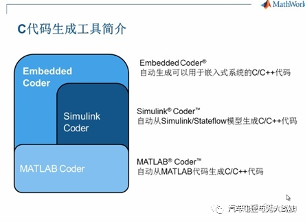

# simulink自动生成c代码

https://www.youtube.com/watch?v=nh5fVNG2xjk 视频教程讲解

基于模型开发的自动代码生成

谈谈基于MBD软件开发的自动代码生成 - WindSnow91的文章 - 知乎
https://zhuanlan.zhihu.com/p/161727415

1.simulink coder与embeded coder代码生成的区别 - lensyu的文章 - 知乎
https://zhuanlan.zhihu.com/p/158618870

mathworks公司的c代码生成工具，可以看到我们有三个c代码生成工具，

embeded coder,自动生成嵌入式系统C/C++代码

Simulink coder,自动从Simulink/Stateflow生成C/C++

matlab coder，自动从MATLAB生成代码

视频教程：

youtube.com/watch?v=vxzR3W2BcRk&feature=emb_rel_end

