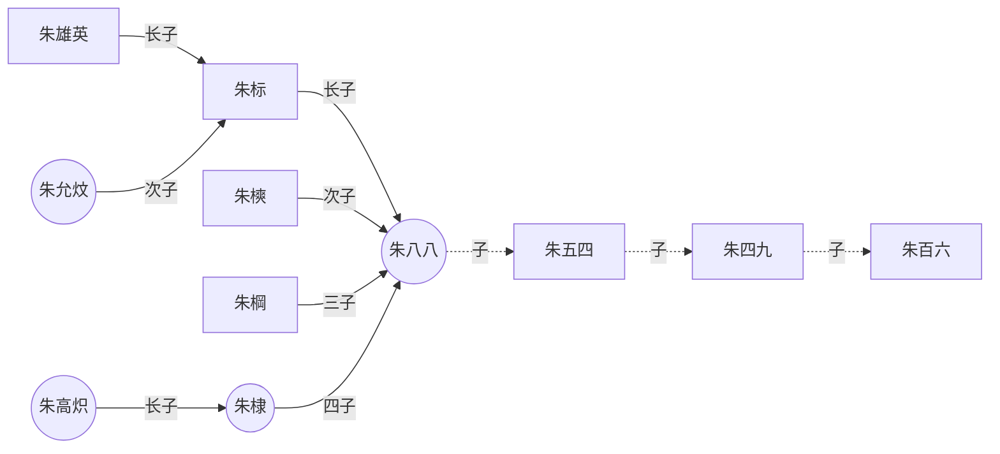

# 编程语言发展历史渊源
函数式编程的早期历史 - 品雪的文章 - 知乎
https://zhuanlan.zhihu.com/p/24648375

函数式编程语言简史
[Some History of Functional Programming Languages](https://zhuanlan.zhihu.com/p/68623348)

# 应用
学习哪些 Functional programming language 能够拓宽眼界，学到和其他编程范式明显不一样的东西？ - itlr的回答 - 知乎
https://www.zhihu.com/question/20482879/answer/113967611

