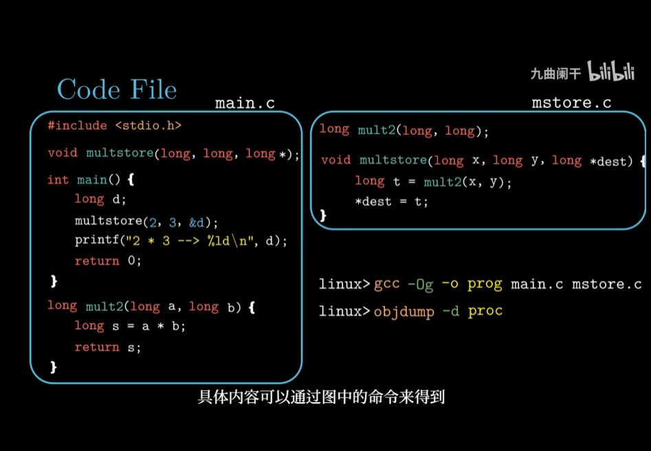

https://github.com/topics/csapp

https://github.com/yangminz/bcst_csapp B站那个Up主

如何阅读《深入理解计算机系统》这本书？ - 行走的西红柿的回答 - 知乎
https://www.zhihu.com/question/20402534/answer/124950081

https://github.com/WindowsXp-Beta/CSAPP-lab

http://csapp.cs.cmu.edu/3e/students.html

https://www.nowcoder.com/schoolbooks/detail/61 
牛客网看书做题

# 1. CSAPP-深入理解计算机系统

牛逼up主讲解

https://space.bilibili.com/354767108?spm_id_from=333.788.b_765f7570696e666f.2

