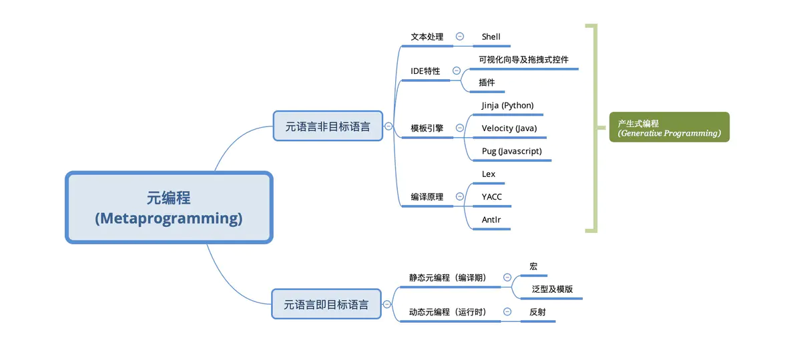

https://github.com/topics/meta-programming?o=desc&s=updated

- data -> 普通编程代码 -> data
- 代码(目标语言)-> (元语言)元编程-> 代码

编写元程序的语言称之为元语言，被操纵的语言称之为目标语言[2]。根据元语言和目标语言是否相同，我们可以将元编程分为两类：

当元语言即目标语言本身时，元编程是目标语言所支持的高级特性，是在编译期或运行期生成或改变代码的一种编程形式，是狭义上的元编程；当元语言并非目标语言时，元编程侧重代码内容的生成，并不关注目标语言代码的编译和执行，也可以称之为产生式编程（Generative Programming）或者代码生成技术（Code Generation）。我们按照从易到难的顺序来依次介绍这些技术。

作者：浪卢 https://www.jianshu.com/p/d3b637ece518 一文读懂元编程

# meta programming v.s high order programming

无论编程语言的性质如何，元程序都是其数据表示另一个（对象）程序的程序。

元编程的重要性可以从它的大量应用来衡量。这些包括编译器、解释器、程序分析器和程序转换器。此外，如果目标程序是形式化某些知识的逻辑或功能程序，则元程序可以被视为推理该知识的元推理器。

在本章中，元程序被假定为一个逻辑程序。目标程序不必是逻辑程序，尽管本章中的大部分工作都假设了这一点。我们确定了三个主要议题供考虑。这些是元编程的理论基础，替代元编程技术对不同应用的适用性，以及提高元程序效率的方法。与一般的逻辑程序一样，元程序具有声明性和过程性语义。

元编程的理论研究表明，语义的两个方面都严重依赖于对象程序在元程序中表示为数据的方式。本文的第二个主题是设计和选择适当的方法来指定重要的元编程问题，包括动态元编程和涉及自我应用的问题。第三个主题涉及元程序的有效实施。元编程系统需要具有最小化解释目标程序开销的设施的表示。此外，通过转换元程序，将其专门用于它正在推理的特定目标程序，可以获得效率。

本章集中讨论元编程的这些方面，并不打算对该领域进行调查。可以在 [Barklund, 1995] 中找到更完整的逻辑编程元编程综述。

元编程中的许多问题都源于已经研究了几十年的逻辑问题。本章强调元编程解决方案。尽管我们试图指出与元逻辑中更广泛主题的一些联系，但它并不打算对潜在的逻辑问题进行全面处理。本章中的元程序是基于一阶逻辑的逻辑程序。专门针对它正在推理的特定目标程序。本章集中讨论元编程的这些方面，并不打算对该领域进行调查。可以在**Barklund, 1995**中找到更完整的逻辑编程元编程综述。

元编程中的许多问题都源于已经研究了几十年的逻辑问题。本章强调元编程解决方案。尽管我们试图指出与元逻辑中更广泛主题的一些联系，但它并不打算对潜在的逻辑问题进行全面处理。

本章中的元程序是基于一阶逻辑的逻辑程序。尽管我们试图指出与元逻辑中更广泛主题的一些联系。本章中的元程序是基于一阶逻辑的逻辑程序。尽管我们试图指出与元逻辑中更广泛主题的一些联系。本章中的元程序是基于一阶逻辑的逻辑程序。

https://oxford.universitypressscholarship.com/view/10.1093/oso/9780198537922.001.0001/isbn-9780198537922-book-part-10  人工智能与逻辑编程中的逻辑手册：第 5 卷：逻辑编程

现代编程语言（如 Lisp、Scheme 和 ML）允许将过程封装在数据中，以便随后可以检索并用于指导计算。提供这种能力的语言通常是基于函数式编程范式的，其中可以封装的过程对应于函数。因此，被封装的对象是高阶类型的，操作它们的函数也是如此。因此，据说这些语言允许进行高阶编程。这种编程形式在这些语言的用户中很流行，并且其理论得到了很好的发展。这种封装风格在函数式编程中的成功让人很自然地会问，在逻辑编程设置中是否可以支持类似的想法。请注意，过程是由逻辑编程中的谓词实现的，这种设置中的高阶编程将对应于将谓词表达式封装在术语中并用于稍后检索和调用此类存储的谓词的机制。至少一些支持这种能力的设备在实践中被认为是有用的。因此，已经尝试将这些特性集成到 Prolog 中（例如，参见 [Warren，1982]），并且许多现有的 Prolog 实现提供了高阶编程的某些方面。然而，这些尝试在两个方面都不能令人满意。

首先，他们依赖于使用与逻辑编程的声明性基础不同的特殊机制。

第二，他们在很大程度上引入了函数式编程中理解的高阶编程的概念，并且没有研究逻辑编程固有的概念。在本章中，我们通过利用高阶逻辑作为计算基础来发展高阶逻辑编程的思想。当然，在这种研究中可能使用的高阶逻辑有很多选择。如果只希望模拟函数式编程语言中的高阶特性，则可以采用“极简主义”方法，即考虑扩展一阶 Horn 子句的逻辑——Prolog 的逻辑基础——尽可能小的方式来实现附加功能。
