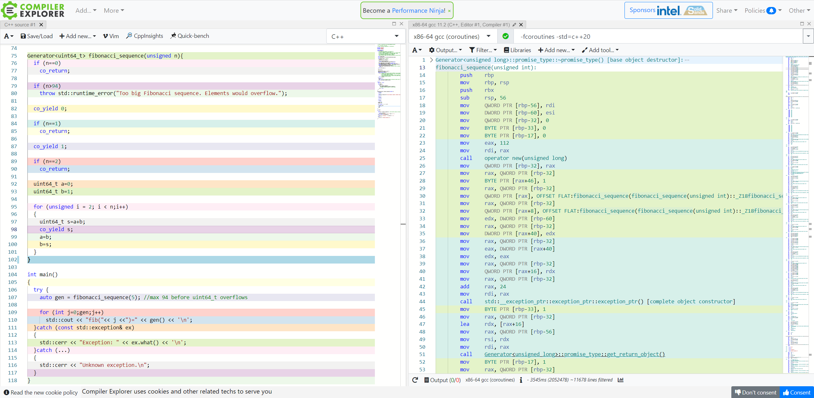
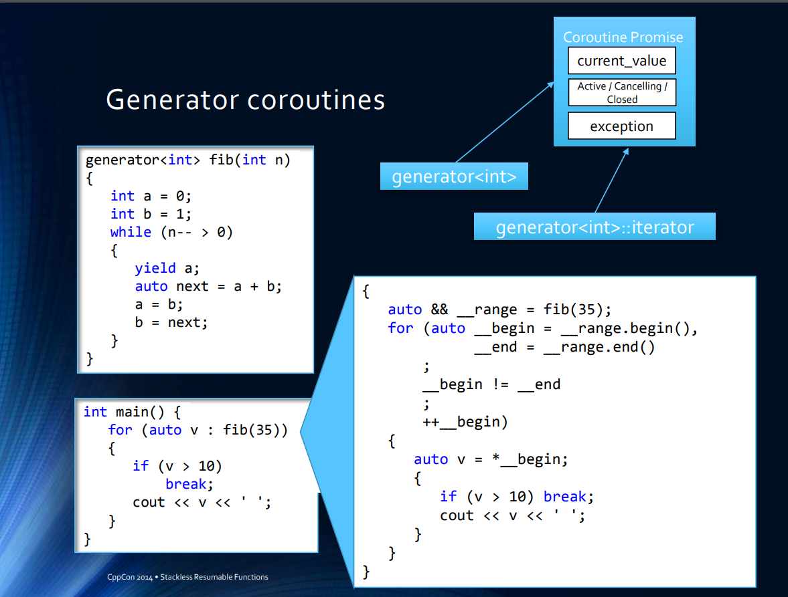

[TOC]

# 并发解决方案总览


async/await异步模型是否优于stackful coroutine模型？ - 圆珠笔的回答 - 知乎
https://www.zhihu.com/question/65647171/answer/233495694


async/await和有栈协程的区别就在于，在这里分别选用了这2种方法：


前者（async/await）在函数返回前把那些变量临时保存在堆的某个地方，然后把存放地址传回去，当你想返回现场的时候，把这些变量恢复，并跳转回离开时候那个语句；持有指针语义的c/c++语言则略麻烦：因为可能这些局部变量中有谁持有另一个局部变量的地址，这样“值语义”的恢复就会把他们变成野指针，所以需要在进入函数时所有的局部变量和函数参数都在堆上分配，这样就不会有谁持有离开时栈上下文的指针了，换句话说，对c/c++来说，这是一种无栈协程(有些自己写的无栈协程库提供你在堆上面分配局部变量的接口，或者强迫你在进入这个函数前把要用到的所有局部变量在堆上面分配好内存)，其它语言只要没有值语义或变量天生不放栈上就没这个概念。如果使用闭包语法返回现场，可以只需要恢复闭包中捕获的变量；对于c++，在离开现场时不能提前析构掉那些没有被捕获的变量（否则析构顺序未必是构造顺序的反序，其实这个c++规则真是没必要）。所以从C++的观点来说，这是一种彻头彻尾的“假”函数返回(有垃圾回收器的语言倒是有可能走到async之后的语句后，回收前面已经不用的临时变量)。


后者（有栈协程）在离开前只需要把函数调用中可能被破坏的callee-saved 寄存器给保存在当前栈就完事了（别的协程和当前协程栈是完全隔离的，不会破坏自己堆栈），跳转回来的时候把在栈中保存的寄存器都恢复了并跳转回离开时候那个语句就行了。


综上：前者（尤其是c、c++）需要编译器的特殊支持，对使用了async/await语义的函数中的局部变量的分配，恢复进行些特殊的处理；后者则只需要写写汇编就搞定了（一般需要给 进入协程入口函数，协程间切换，协程函数入口函数返回后回收协程资源并切换去另一个协程 这3个地方写点汇编，也有的协程库把这3种情况都统一起来处理）。


谁优谁劣呢？


语法友好度：衡量这个玩意儿的标准，莫过于“逻辑聚合性”：逻辑相关的代码能否写在相近的代码处。例如 redis/nginx中处处可见这种上下文被分割的代码，因为任何一个“暂时不能完成“的场景都会把场景前后代码逻辑写在完全不同的两个函数里。。对于async/await 或无栈协程语义，c/c++在没有闭包之前的，还需要达夫设备跳转回离开现场的那行代码，有了闭包之后，上下文之间就只被return ( [xxx](){ 分开了，代码可以认为基本没有被分割( C# 新版js, VC和clang实验性的resumable function连这点分开都没有了)；不过依然远远比不上有栈协程，因为他语法完全是常规的函数调用/函数返回，使用hook之类的手法甚至可以把已有的阻塞代码自动yield加无阻塞化（参见libco, libgo）。可以认为在这一项：前者在得到现代化编译器辅助后，和后者相近但依然有差距且容易对一些常识产生挑战；后者语法非常适合传统编程逻辑。


时间/空间效率：async/await 语义执行的是传统的函数调用函数返回流程，没有对栈指针进行手工修改操作，cpu对return stack buffer的跳转预测优化继续有效；有栈协程需要在创建时根据协程代码执行的最坏情况提前分配好协程函数的栈，这往往都分配的过大而缺乏空间效率，而且在协程间切换的时候手工切换栈，从而破坏了return stack buffer跳转预测，协程切换后函数的每一次返回都意味着一次跳转预测失效，所以流程越复杂有栈协程的切换开销越大（非对称调度的有栈协程会降低一些这方面的开销，boost新版有栈协程彻底抛弃了对称协程）。对于async/await 语义实践的无栈协程，如果允许提前析构不被捕获的C++变量，或者你返回前手工销毁或者你用的是带垃圾回收器的语言，空间效率会更佳。 可以认为在这一项：前者远胜后者，而且后者会随着你业务复杂度加深以及cpu流水线的变长（还好奔4过后的架构不怎么涨了）而不断变差。笔者写的yuanzhubi/call_in_stack yuanzhubi/local_hook， 以及一个没有开源的jump assembler（把有栈协程切换后的代码输出的汇编语句中的ret指令全部换成pop+jmp指令再编译，避开return stack buffer 预测失败）都是来优化有栈协程在时间/空间的表现的 。


调度：其实2者都是允许用户自己去管理调度事宜的，不过前者必须返回由调度函数选择下一个无栈协程的切入，后者允许”深度优先调度“：即当某个协程发现有“暂时不能完成“的场景时自己可以根据当前场景选择一个逻辑相关的协程进行切入，提升内存访问局部性，不过这对使用者的要求和业务侵入度非常高。。整体而言的话，可以认为在这一项：前者和后者大致持平，前者是集中式管理而后者是分布式管理，后者可以挖掘的潜力更高但对使用者要求很高且未必能适应业务的变更。


结论：性能上，前者有一定时间优势但不是精雕细琢的多用途公共开源组件完全可以忽略，而空间上前者超越后者很多；易用度上，前者正在快速演进 慢慢的追上后者（c#这样的async/await鼻祖已经完全不存在这个问题）；和已有组件的可结合度上，后者始终保持优势（不管已有组件是源码还是二进制）。孰优孰劣，如何侧重，如何选择（如果你们有选择的机会的话），，也许 纯属你头儿的口味问题吧 哈哈哈。

看到很多同学提状态机，，其实这种理解没有什么问题，而是人和编译器的观点有所不同：人会抽象出很多状态，在痛苦这些状态如何在各种上下文跳转中传递和保存（状态机）; 编译器则在痛苦怪异的上下文跳转中，局部变量的保存和恢复(无栈协程)。 前者会自行决定某些局部变量是“真的局部”变量，后续无需恢复了；后者会把他们全盘考虑下来，把所有的量都要在各个状态间传递和保存（当然有的语言可以智能些，按需传递）。从本质来说，如果是由编译器来玩状态机实现的async/await和无栈协程的，概念上没有什么区别。 人才说状态，机器只说变量，内存这些。


stackless coroutine的 栈 的调用栈复用,栈内信息保存在堆上(用于恢复)

stackfull coroutine的有独立私有的栈


stackless coroutine 最大的优势就是性能好,缺点就是易用性

stackfull coroutine的最大优势就是易用性,缺点就是空间浪费,性能差


stackless coroutine 增加语义化支持(通过强大的编译器做了很多事), 在易用性方面已经不弱于stackfull coroutine了

而stackfull coroutine 增通过预分配一定大小的栈,检查是否超出(go似乎是通过编译器在函数调用前插入检查代码)来扩容,采取一定的收缩策略(go似乎是垃圾回收时候进行收缩的) https://stackoverflow.com/questions/28977302/how-do-stackless-coroutines-differ-from-stackful-coroutines


-------------------------------------------------------


《程序设计语言实践之路》中大概提到，对于 stackful coroutine，如果能在任意词法嵌套中声明协程，就会导致非全局作用域下可能存在多个协程的问题，它们需要共享非全局的对象，这会增加函数栈的复杂性（破坏栈的顺序性），当然可以利用一种被称作 cactus stack 方案来解决。（如果有人能对该方案具体解释那就更好啦~）

那么无栈协程有解决方案吗，另外，Process-Based Simulation with Stackless Coroutines 这篇论文中提到无栈协程的缺点之一：only the top-level routine may be suspended since no callstack exists to capture the state of the callers

协程似乎缺乏清晰而明确的定义，这导致基于对于其不同的理解和预期要求，各种语言的具体实现也是不尽相同。

为什么无栈协程不能被非协程函数嵌套调用？ - 灵剑的回答 - 知乎
https://www.zhihu.com/question/458843623/answer/1880157112


我也没有完全研究过这个问题，大概说一下我知道的：

首先需要明确这里“栈”的含义，特指的是调用栈，也就是这种语言在调用普通函数时依赖的栈结构。函数调用必然经过传参、保存返回地址并跳转到待执行的函数、执行函数、保存返回结果并跳转回到调用点这一系列过程，因为必须要保存返回地址，所以调用栈的存在是不可或缺的。在C这样的编译到native代码的语言中，这里的栈就是指调用约定里面规定的那个栈，比如说x86上面通常是esp指向的一个地址，但在其他语言当中也可能有些不同，比如说解释执行的语言里可能有语言栈和解释器栈，这时候指的是哪个可能会不太清晰，可能同时指两个，也可能特指其中某一个，不过大体上来说就理解这个是一般函数调用时使用的栈就行了。

所谓协程指的是某个函数执行到一半的时候，可以通过某些机制保存当前现场然后暂停执行，之后可以通过外部代码重新恢复执行。在这个暂停的过程中需要保存的现场就包括调用栈，细分一下大致有两部分：

栈上保存的返回地址（或者说调用链相关的信息）
栈上保存的当前函数使用的临时变量
第二点是因为像C这样的语言会将当前函数中临时使用的对象分配在栈上从而提高内存使用效率。如果函数暂停之后，栈空间被用来做其他事情，就可能会破坏当前保存的内容。

于是，关于栈上数据保存的思路就有两种方法：

干脆保存整个栈，每个协程用自己独立的栈，暂停的时候就切换到别的栈上面去，恢复的时候再切换回来。这种方法对现有的调用栈使用来说是最透明的，而且机制基本上跟线程切换一样，所以可以实现协程中调用普通方法，普通方法中随时可以暂停。缺点则是每个协程都需要分配独立的栈空间，比较耗费内存。
干脆什么都不保存在栈上，通过编译器将临时变量之类的保存改为存在某个堆空间里的对象中。同时，也就丧失了保存返回地址的能力，因而是没法在普通函数调用中暂停的。
前一种方法应该相对好理解一些，后一种方法则看上去不太讲道理，如果协程方法直接不能相互调用那不是没有用了吗？所以其实并不是不能相互调用，而是编译器要求协程方法调用协程方法采用特别的调用方式，例如一般会使用await关键字。在await另一个协程方法的过程中，一般来说编译器会为新的方法创建一个保存状态的对象，然后在新对象中保存当前协程的引用，当新协程执行结束之后重新resume当前协程，从而实现调用的过程。可以发现这种链式结构其实类似于一个链表实现的栈，所以严格来说无栈协程并不是没有栈结构，而是栈结构独立于一般函数的调用栈。既然一般函数的调用链保存方式和无栈协程的保存方式不同，自然就不能形成混合的调用链了。


为什么无栈协程不能被非协程函数嵌套调用？ - Ethan Lv的回答 - 知乎
https://www.zhihu.com/question/458843623/answer/1880446906


## 协程语法

async/await不是协程，这是FP的懒求值，意思是变量在需要时再求值，在FP语言中被称作lazy（被C#窃取到OO世界的，async关键字的唯一用途是提醒编译器函数体内有await）真正的狭义协程是yield，意思是把执行权教给另一个函数goroutine等绿色线程也属于广义协程

https://www.zhihu.com/question/50185085/answer/1814903832


## 函数调用过程中栈到底是怎么压入和弹出的？ 

醉卧沙场的回答 ---当作业跟着写一遍源码
https://www.zhihu.com/question/22444939/answer/2356518658


栈编程和函数控制流: 从 continuation 与 CPS 讲到 call/cc 与协程

https://www.cnblogs.com/rzbdz/p/15192140.html

# 代码展示


-----------------------------------------


> 学长这个有没有两个模型对应的代码比较，我怎么有一点看不太明白这个回答的意思呢

> 学长说： http://warmcat.org/chai/blog/?p=5558  这里对比了stackless / stackful coroutine，简单来说stackless是通过状态机/闭包来实现协程之间的切换，而stackful是通过修改/保存cpu寄存器的值来实现协程切换，具体的代码你可以看下kotlin和go的协程原理分析，它们分别是stackless和stackful coroutine的代表 async / await 只是Promise的语法糖，本质上还是通过状态/闭包来实现协程切换。
javascript 的 promise是基于yield的协程
Lua的coroutines是基于stackful coroutine 在 Wren 和 Lua 中，协程必须存储整个激活记录堆栈，因为它们可以随时暂停。




> 其实python/js/c 写 递归，循环，yield不同版本的**fibonacci算法,hanoi，子集算法，甚至是T9输入法LeetCode 17. Letter Combinations of a Phone Number**，应该就能对他们的用法更深一步了解，甚至觉得写得更直观更少代码 。我看到有的人又说这样写会更麻烦 [Coroutine的co_yield用法-我不认同这里写的](https://zhuanlan.zhihu.com/p/101147924)但是我感觉不是很认同这个说法。

js 就是 yield实现Promise语法糖


> 然后用c++写一遍 “递归，循环，yield的fibonacci三种写法”，感觉clion步进看汇编会有帮助.能理解具体是怎么实现的

> 终于理解为什么FP是计算机起源，这波属实是lisp,kotlion,js比cpp20早实现了20+年。《计算的本质》里面作者用Ruby面向对象来实现静态词法作用域的闭包，然后就能实现lambda演算的机制（可调用对象first class function的处理），从而实现Ruby上的从零开始的FP。然后Lua源码闭包变量Upvalue,就是状态机保存的变量，区别似乎是“stackful”是参数调用的递归导致压栈甚至stack overflow。进而静态词法作用域的闭包形成可调用对象（first class function）实现函数式。yield把状态封装在“可调用对象/高阶函数first class”的内部变量(这个函数对象理解为状态机的话)，保存在堆，只是指针指向对象内部的Upvalue变动导致每次调用得到新结果。我终于理解为什么他们说这个会跟FP的CPS变换相关了，难怪他们说这个stackless的实现的语义更加舒服更完备，因为它返回之后下次进入可以继续上次执行结果，更直接，而不像回调地狱动不动递归等到最后才能返回。


---------------------------

Scheme是第一个提供Continuation支持的产品级编程语言，Scheme提供了使用call/cc(call-with-current-continuation) 的控制流运算符,call/cc的参数是只能接受一个参数的函数。在Scheme中，Continuation被表达为一个函数， 假设 call/cc 捕捉了当前的 continuation，并绑定到 lambda 的参数 cc，那么在 lambda 函数体内，一旦 cc 被直接或间接的作为过程调用，那么 call/cc 会立即返回，并且提供给 cc 的参数即为 call/cc 的返回值。https://sighingnow.github.io/%E7%BC%96%E7%A8%8B%E8%AF%AD%E8%A8%80/continuation_and_call_cc.html


Call-with-current-continuation for C programmers 一文介绍了C语言中的 setjump/longjump 机制与 continuation 的异同，并从更加 low-level 的方式阐述了大多数主流 Scheme 解释器的 call/cc 的实现细节。Continuation 操作程序控制流的原理与命令式语言中的goto有着本质的不同。 Parent pointer tree (也作Spaghetti stack) 就是编译器 中实现call/cc，进行垃圾回收的一种方法。在并发领域，Coroutine就是基于Continuation实现的。Continuation可认为 是对PCB的抽象，其实它就是函数当前的执行栈，并且是实实在在可以被保存的东西，因此，很容易通过CPS来实现协程、 non-local-return 等。


## scheme 实现延续


http://community.schemewiki.org/?call-with-current-continuation


## c实现延续

http://community.schemewiki.org/?call-with-current-continuation-for-C-programmers


--------------------------------------------------

## Cpp 用 stackless &  stackful 对相同问题求解代码对比compiler Explorer跑一边代码来理解


```cpp
// https://en.cppreference.com/w/cpp/language/coroutines

// g++ -fcoroutines -std=c++20
// clang++ -std=c++20 -stdlib=libc++ -fcoroutines-ts

#include <coroutine>
#include <exception>
#include <iostream>
 
template<typename T>
struct Generator {
   // The class name 'Generator' is our choice and 
   // it is not required for coroutine magic. 
   // Compiler recognizes coroutine by the presence of 'co_yield' keyword.
   // You can use name 'MyGenerator' (or any other name) instead
   // as long as you include nested struct promise_type 
   // with 'MyGenerator get_return_object()' method .
   //(Note:You need to adjust class constructor/destructor names too when choosing to rename class)
 
  struct promise_type;
  using handle_type = std::coroutine_handle<promise_type>;
 
  struct promise_type {// required 
    T value_;
    std::exception_ptr exception_;
 
    Generator get_return_object() {
      return Generator(handle_type::from_promise(*this));
    }
    std::suspend_always initial_suspend() { return {}; }
    std::suspend_always final_suspend() noexcept { return {}; }
    void unhandled_exception() { exception_ = std::current_exception(); }//saving exception
    template<std::convertible_to<T> From> // C++20 concept
    std::suspend_always yield_value(From &&from) {
      value_ = std::forward<From>(from);//caching the result in promise
      return {};
    }
    void return_void() {}
  };
 
  handle_type h_;
 
  Generator(handle_type h) : h_(h) {}
  ~Generator() { h_.destroy(); }
  explicit operator bool() {
    fill();// The only way to reliably find out whether or not we finished coroutine, 
           // whether or not there is going to be a next value generated (co_yield) in coroutine
           // via C++ getter (operator () below) 
           // is to execute/resume coroutine until the next co_yield point (or let it fall off end).
           // Then we store/cache result in promise to allow getter (operator() below to grab it 
           // without executing coroutine)
    return !h_.done();
  }
  T operator()() {
    fill();
    full_ = false;//we are going to move out previously cached result to make promise empty again
    return std::move(h_.promise().value_);
  }
 
private:
  bool full_ = false;
 
  void fill() {
    if (!full_) {
      h_();
      if (h_.promise().exception_)
        std::rethrow_exception(h_.promise().exception_);
        //propagate coroutine exception in called context
 
      full_ = true;
    }
  }
};
 
Generator<uint64_t> fibonacci_sequence(unsigned n){ 
  if (n==0)
    co_return;
 
  if (n>94)
    throw std::runtime_error("Too big Fibonacci sequence. Elements would overflow.");
 
  co_yield 0;
 
  if (n==1)
    co_return;
 
  co_yield 1;

  if (n==2)
    co_return;
 
  uint64_t a=0;
  uint64_t b=1;
 
  for (unsigned i = 2; i < n;i++)
  {
    uint64_t s=a+b;
    co_yield s;
    a=b;
    b=s;
  }
}
 
int main()
{
  try {
    auto gen = fibonacci_sequence(5); //max 94 before uint64_t overflows
 
    for (int j=0;gen;j++)
      std::cout << "fib("<< j <<")=" << gen() << '\n';
  }catch (const std::exception& ex)
  {
    std::cerr << "Exception: " << ex.what() << '\n';
  }catch (...)
  {
    std::cerr << "Unknown exception.\n";
  }
}


```


C++20 Coroutines 协程 https://blog.csdn.net/longji/article/details/103667491 co_yield co_await co_return  https://owent.net/2019/1904.html  The Coroutine in C++ 20 协程初探 - CrackingOysters的文章 - 知乎
https://zhuanlan.zhihu.com/p/237952115


https://chlorie.github.io/ChloroBlog/posts/2020-08-10/0-generator.html


面向修复编译器报错编程——基于 C++20 协程写一个生成器


要怎么操作才能用上 C++20 的协程呢？目前来讲三大主流 C++ 编译器（gcc 10+, clang 8+, MSVC 19.25+）都已经全部或部分支持 C++20 协程。MSVC 应该会在 19.28 版本正式支持 C++20 协程，目前来讲要在 VS 里面使用协程的话需要手动添加 /await 编译选项，使用的头文件是 <experimental/coroutine>，所有的类都在 std::experimental 命名空间中（在 19.28 以后可能可以直接使用 C++ 最新标准的选项 /std:c++latest 启用协程，头文件即是正式的 <coroutine>）。


下一个问题就是这个 generator 在哪里可以获取到了。不过非常遗憾，C++20 的标准库中并没有此类的辅助类，所有跟协程相关的实用函数和类（包括 generator 和 task 之类）都需要自己实现（或使用第三方库，目前比较好的有 Lewiss Baker 的 cppcoro，不过这个库在 MSVC 好像暂时并不能正常使用）。比较幸运的是 MSVC 给我们提供了 generator 的实现，可以包含 <experimental/generator> 来使用。另外，启用 /await 选项以后同样也会包含 std::future 的协程支持。

自己实现支持协程的类其实是很麻烦的，就连最简单最朴素的 generator 的实现都牵扯到很多协程底层的概念。不过仔细想想 C++ 这个语言一直都是这样，用户使用起来比较方便的东西实现起来经常都很费事（试试自己实现一个符合标准的 std::optional 吧，你会体会到我说的是什么意思的）……


如何编写 C++ 20 协程(Coroutines) - 多颗糖的文章 - 知乎
https://zhuanlan.zhihu.com/p/355100152


可以用 co_yield 实现 Python 中的生成器，参考：https://lewissbaker.github.io/2018/09/05/understanding-the-promise-type


## Lua
[Lua 为什么在游戏编程领域被广泛运用？ - 杨博说:](https://www.zhihu.com/question/21717567/answer/19099371)

很多时候，程序员需要多个执行流。为此，Lua提供了通用的方案，叫coroutine。


除了coroutine以外，别的语言或平台提供的“多执行流”的通用方案包括：进程、线程、[Fibers (Windows)](https://docs.microsoft.com/zh-cn/windows/win32/procthread/fibers?redirectedfrom=MSDN)、[setcontext](https://en.wikipedia.org/wiki/Setcontext)、[Continuation](https://en.wikipedia.org/wiki/Continuation)、[Monad (functional programming)](https://en.wikipedia.org/wiki/Monad_(functional_programming))。 [前端中的 Monad](https://zhuanlan.zhihu.com/p/47130217),如Promise 

这些技术底层实现分为**三类**：

1. 由平台调度的线程，包括操作系统调度的线程或进程，或者Erlang虚拟机调度的进程。
2. 由平台提供栈，但是由用户手动切换，包括Lua的coroutine、Windows的Fiber、POSIX的setcontext。
3. 由编译器提供自动CPS转换，或者把CPS代码写得像有副作用代码的语法糖。比如在下的Atry/haxe-continuation · GitHub、Haskell的Monad。

这三种方式，都是通用的多执行流。无论基于哪种通用多执行流，要实现一个generator都是区区小事。


## js协程语义到promise单子

yield

promise --> async await


协程，promise 之间有点关系，promise 比协程好实现，通常不需要改 编译器和运行时

协程语法分为 async, await 流派和 yield流派

协程实现，分为转化状态机，捕获变量流派和完整堆栈复制流派

协程又可以根据支不支持递归，分类

普通语言，一般只实现协程，没有支持多线程task调度，这个task调度其实是另外一个问题

按照csharp的发展路线，其实先做task 调度系统，task 用future的方式，来做顺序控制

-------------------------


深入理解协程（三）：async/await实现异步协程 - 「已注销」的文章 - 知乎
https://zhuanlan.zhihu.com/p/103315778


## Python

https://space.bilibili.com/54296062 **python从生成器到协程到asynic/await 到无栈协程到couroutine的核心原理，系列视频**。https://www.bilibili.com/video/BV1u5411R7C3

python对比求子集算法-循环、递归、回溯、位运算 - 翩翩少年的文章 - 知乎
https://zhuanlan.zhihu.com/p/347663905


---------------------

https://leetcode-cn.com/problems/letter-combinations-of-a-phone-number/solution/  17. 电话号码的字母组合
yield 的写法
https://leetcode.com/problems/letter-combinations-of-a-phone-number/discuss/1393955/Python's-%22yield-from%22-syntax-makes-for-a-very-elegant-looking-solution

```python
mapping = {
    '2': 'abc',
    '3': 'def',
    '4': 'ghi',
    '5': 'jkl',
    '6': 'mno',
    '7': 'pqrs',
    '8': 'tuv', 
    '9':'wxyz',
}

def combinations(prefix, digits):
    if not digits:
        yield prefix
        return
        
    for letter in mapping[digits[0]]:
        yield from combinations(prefix + letter, digits[1:])
    

class Solution:
    def letterCombinations(self, digits: str) -> List[str]:
        if not digits:
            return []  # if we don't special case, we will return [''] for digits == ''
        
        return list(combinations('', digits))

```


由于GIL的存在，导致Python多线程性能甚至比单线程更糟。

GIL: 全局解释器锁（英语：Global Interpreter Lock，缩写GIL），是计算机程序设计语言解释器用于同步线程的一种机制，它使得任何时刻仅有一个线程在执行。[1]即便在多核心处理器上，使用 GIL 的解释器也只允许同一时间执行一个线程。

于是出现了协程（Coroutine）这么个东西。

协程: 协程，又称微线程，纤程，英文名Coroutine。协程的作用，是在执行函数A时，可以随时中断，去执行函数B，然后中断继续执行函数A（可以自由切换）。但这一过程并不是函数调用（没有调用语句），这一整个过程看似像多线程，然而协程只有一个线程执行.

协程由于由程序主动控制切换，没有线程切换的开销，所以执行效率极高。对于IO密集型任务非常适用，如果是cpu密集型，推荐多进程+协程的方式。

在Python3.4之前，官方没有对协程的支持，存在一些三方库的实现，比如gevent和Tornado。3.4之后就内置了asyncio标准库，官方真正实现了协程这一特性。

而Python对协程的支持，是通过Generator实现的，协程是遵循某些规则的生成器。因此，我们在了解协程之前，我们先要学习生成器。
yield和yield from这两个表达式，这两个表达式和协程的实现息息相关。

python没有提供“多执行流”的通用方案，而是为generator这种特定用途提供了特定的yield语法。Python的yield语法用做generator以外用途时，不方便。


跳转离开，在任何语言里都有2种最基本的方法：1）从当前函数返回； 2）调用一个新的函数。 前者会把上下文中的局部变量和函数参数全部摧毁，除非他返回前把这些变量找个别的地方保存起来；后者则能保护住整个上下文的内存（除了函数返回之后会摧毁一些我们高级语言所看不见的寄存器），而且跳转回来也是常规方法：函数返回。


---------------------------------------------


## Kotlin

Kotlin 通过 Coroutine 达到深度递归不爆栈，别的语言能有类似的写法吗？ - Martin Chloride的回答 - 知乎
https://www.zhihu.com/question/390889830/answer/1183963131


Stackless coroutine 本质上是相同的，只不过 Kotlin 使用了比较传统的 coroutine 原语（suspend/resume），和 async/await 是等价的。（如果 C# 要实现传统 coroutine 的 suspend/resume 等价操作的话需要结合 async enumerable 使用）

至于为什么不爆栈，因为 stackless coroutine 本来就没有栈，原本栈的功能是存放在堆上的（注意原文的 val stack = ArrayList<Frame>()）。这也是 stackless coroutine 最大的性能瓶颈所在，相当于每一次开新的 coroutine（await）都会有一次堆分配并给 GC 造成压力。

Stackless coroutine 并不是为了避免栈溢出而出现的。如果单单是为了避免栈溢出而这样写递归会造成极大的性能浪费。所有递归都有等价的非递归写法，将递归函数翻译成非递归形式才是正确的解决栈溢出的手段。


-------------------------------


## C#


C#的async和await底层是怎么做到的? - lhelpme的回答 - 知乎
https://www.zhihu.com/question/395806055/answer/1237197661


## haskell

https://wiki.haskell.org/Continuation

https://stackoverflow.com/questions/9050725/call-cc-implementation


https://wiki.haskell.org/Continuation#Citing_haskellized_Scheme_examples_from_Wikipedia

hanoi 递归版本


```haskell
module Hanoi where

type TowerIndex = Int
type Move = (TowerIndex,TowerIndex)
type DiskSize = Int
type Tower = [DiskSize]
type State = [Tower]

towerIndexes :: [TowerIndex]
towerIndexes = [0,1,2]

hanoi :: Int -> TowerIndex -> TowerIndex -> [Move]
hanoi 0 _ _ = []
hanoi n from to = hanoi (n-1) from spare ++ [(from, to)] ++ hanoi (n-1) spare to
  where spare = head $ filter (\t -> t /= from && t /= to) towerIndexes

---------------------------
---------- TESTS ----------

startState :: State
startState = [[1,2,3,4,5], [], []]

legalTower :: Tower -> Bool
legalTower [] = True
legalTower [d] = True
legalTower (d1:d2:ds) = d1 < d2 && legalTower (d2:ds)

legalState :: State -> Bool
legalState ts = all legalTower ts

move :: Move -> State -> State
move (i1,i2) s = map changeTower $ zip towerIndexes s where
  d = head $ s !! i1
  changeTower (i,t) 
    | i == i1   = tail t 
    | i == i2   = d:t 
    | otherwise = t

runMoves :: [Move] -> State -> [State]
runMoves moves s = foldl (\ss m -> move m (head ss) : ss) [s] moves

legalMoves :: [Move] -> State -> Bool
legalMoves moves s = all legalState $ runMoves moves s

moves :: [Move]
moves = hanoi 5 0 2

main = do
  print $ (head $ runMoves moves startState) == [[], [], [1,2,3,4,5]]
  print $ legalMoves moves startState
```


C- PS 用cotinuation实现hanoi


https://stackoverflow.com/questions/31358856/continuation-monad-for-a-yield-await-function-in-haskell

- Haskell的Cont Monad
https://jsdw.me/posts/haskell-cont-monad/


http://zhangley.com/article/haskell-cont/


https://www.haskellforall.com/2012/12/the-continuation-monad.html 我希望这篇文章能激发人们使用 continuation monad 来构建和模块化代码完成边界。continuation monad 自然地出现在程序员之间的边界，并将回调地狱清晰地抽象为具有单个入口点的简单统一接口。


# 进阶

如何在C++17中实现stackless coroutine以及相关的任务调度器 - 方方的文章 - 知乎
https://zhuanlan.zhihu.com/p/411834453


