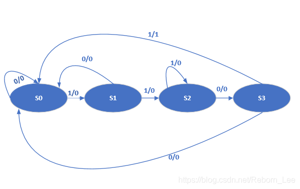
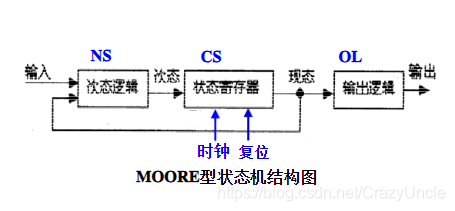
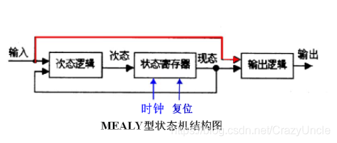

https://zh.wikipedia.org/wiki/%E7%B1%B3%E5%88%A9%E5%9E%8B%E6%9C%89%E9%99%90%E7%8A%B6%E6%80%81%E6%9C%BA


# 1. Moore状态机和Mealy状态机

普通的FSM只有输入和状态转移，没有输出。

Moore机和Mealy机在FSM的基础上增加了输出。

二者的区别在于：Moore机的输出只与状态有关；Mealy机的输出则与状态和输入有关。


具体而言：Moore机的输出函数定义为$\lambda : Q状态 \rightarrow \delta 输出集合$ ；Mealy机的输出函数则定义为：$\lambda : Q状态\times \Sigma输入集合 \rightarrow \delta 输出集合$  。


Moore状态机和Mealy状态机区别 - 特雷西福的文章 - 知乎
https://zhuanlan.zhihu.com/p/131603324

moore y=f(s)

mealy y=f(s,x)

y输出
x输入
s状态
f一个函数

1. Moore型的输出只与当前状态有关，而Mealy型的输出还与输入相关。

2. 在实现相同功能的情况下,Mealy型状态机所需要的状态数比Moore型少，Moore需要待状态稳定才输出。

3.输出时序上，Moore状态机同步输出，Mealy状态机异步输出；

4.输出变化上，Mealy状态机比Moore状态机领先一个时钟周期；


两种状态机主要区别在于状态转换和信号输出是否与输入信号有关

Moore状态机的下一个状态仅与当前状态有关，Mealy状态机的下一状态仅与当前状态有关，还和输入信号有关；

Moore型状态机的输出信号是直接由状态寄存器译码得到，而Mealy型状态机则是以现时的输入信号结合即将变成次态的现态，编码成输出信号。

请问UML状态机是MEALY机还是MOORE机啊？


https://blog.csdn.net/Reborn_Lee/article/details/88918615


**Moore状态机**：输出仅仅与当前状态有关；

如下实例，如三段式写法来写的一个序列检测的状态机（【 FPGA 】序列检测器的Moore状态机实现），状态机最后的输出：

``` 
    
    always @*
    begin
        if(current_state == s4) dout = 1;
        else dout = 0;
    end
    
    
```
由此可见，Moore状态机仅仅和当前状态有关。
也可以看状态转移图判断：


**Mealy状态机**：输出不仅取决于当前状态，还和输入有关；

同样，如下序列检测的例子：【 FPGA 】序列检测器的Mealy状态机实现

同样是三段式描述，最后的输出为：


```
 
	
	always @ *
	begin
		if(reset) dout = 1'b0;
		else if( (current_state == s3)&&(din == 1'b1) ) dout = 1'b1;
		else dout = 1'b0;
	
	end
	
```


同样，也可以通过状态转移图判断：


可见，输出不仅和当前状态和输入都有关系。


最后，Moore状态机和Mealy状态机可以相互转换。上述两个状态转移图实际上实现的是同一个功能，就是检测序列1101.


按照输出变量依从关系的不同，时序逻辑电路又可分为**米利型和摩尔型**。输出与输入变量直接相关的时序逻辑电路称为米里型电路，输出与输入变量无直接关系的时序逻辑电路称为摩尔型电路。








波形上的区别：

    我想他们在波形上表现的区别更值得注意。
    以一个序列检测器为例，检测到输入信号11时输出z为1，其他时候为0。用摩尔型FSM实现需要用到三个状态（A，B，C）。而用米利型FSM实现则需要两个状态（A，B）。摩尔型FSM输出函数的输入只由状态变量决定，要想输出z=1，必须C状态形成，即寄存器中的两个1都打进去后才可以。输出z=1会在下一个有效沿到来的时候被赋值。而米利型FSM输出函数是由输入和状态变量共同决定的。状态在B的时候如果输入为1，则直接以组合电路输出z=1，不需要等到下个有效沿到来。从而也就不需要第三个状态C。

比较：

1.摩尔机器使用更安全：

    输出在时钟边沿变化（总是在一个周期后）。
    在Mealy机器中，输入更改可能会在逻辑完成后立即导致输出更改, 当两台机器互连时出现大问题 - 如果不小心，可能会发生异步反馈。

2.Mealy机器对输入的反应更快：

    在相同的周期内反应 - 不需要等待时钟。
    在Moore机器中，可能需要更多逻辑来将状态解码为输出 - 在时钟边沿之后更多的门延迟。
    并非所有时序电路都可以使用Mealy模型实现。 一些时序电路只能作为摩尔机器实现。


